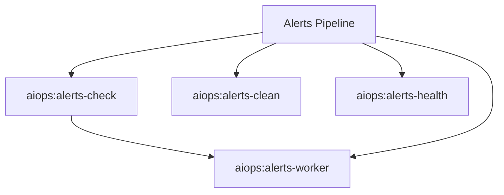

# Alerts Spark Commands

## Overview

This README documents Spark commands under `app/Commands/AIOps/Alerts` and their operational dependencies.

## Operational Purpose

Provide operators and developers with command intent, dependencies, workflows, and recovery guidance.

## Command Inventory

- `aiops:alerts-check` (Operational)
- `aiops:alerts-clean` (Operational)
- `aiops:alerts-health` (Diagnostic)
- `aiops:alerts-worker` (Automation)

Indirect/supporting commands:
- `ops:doctor:full`
- `logs:summarize`

## Command Reference

### aiops:alerts-check

**Purpose**  
Fetch emails and queue them for processing

**Usage**  
`php spark aiops:alerts-check`

**Options**  
None documented.

**Services Used**  
`App\Services\EmailScraperService`, `App\Services\EmailQueueService`

**Models Used**  
None detected.

**Tables Used**  
None detected.

**External APIs**  
None detected.

**Related Commands**  
`aiops:alerts-worker`

**Expected Output**  
Command executes with status output and logs/errors based on runtime state.

**Example Execution**  
`php spark aiops:alerts-check`

### aiops:alerts-clean

**Purpose**  
Delete completed aiops alert queue rows older than 30 days

**Usage**  
`php spark aiops:alerts-clean`

**Options**  
None documented.

**Services Used**  
None detected.

**Models Used**  
None detected.

**Tables Used**  
`aiops_email_queue`

**External APIs**  
None detected.

**Related Commands**  
`ops:doctor:full`, `logs:summarize`

**Expected Output**  
Command executes with status output and logs/errors based on runtime state.

**Example Execution**  
`php spark aiops:alerts-clean`

### aiops:alerts-health

**Purpose**  
Run health checks on aiops alert queue and notify if failures are high

**Usage**  
`php spark aiops:alerts-health`

**Options**  
None documented.

**Services Used**  
`App\Services\SlackWebhookService`

**Models Used**  
None detected.

**Tables Used**  
`aiops_email_queue`

**External APIs**  
None detected.

**Related Commands**  
`ops:doctor:full`, `logs:summarize`

**Expected Output**  
Command executes with status output and logs/errors based on runtime state.

**Example Execution**  
`php spark aiops:alerts-health`

### aiops:alerts-worker

**Purpose**  
Process queued alert emails

**Usage**  
`php spark aiops:alerts-worker`

**Options**  
None documented.

**Services Used**  
`App\Services\SlackWebhookService`

**Models Used**  
None detected.

**Tables Used**  
`aiops_email_queue`

**External APIs**  
None detected.

**Related Commands**  
`ops:doctor:full`, `logs:summarize`

**Expected Output**  
Command executes with status output and logs/errors based on runtime state.

**Example Execution**  
`php spark aiops:alerts-worker`

## Dependencies

| Relationship | Target | Type |
|---|---|---|
| `aiops:alerts-check` | `App\Services\EmailScraperService` | Command → Service |
| `aiops:alerts-check` | `App\Services\EmailQueueService` | Command → Service |
| `aiops:alerts-check` | `aiops:alerts-worker` | Command → Command |
| `aiops:alerts-clean` | `aiops_email_queue` | Command → Table |
| `aiops:alerts-health` | `App\Services\SlackWebhookService` | Command → Service |
| `aiops:alerts-health` | `aiops_email_queue` | Command → Table |
| `aiops:alerts-worker` | `App\Services\SlackWebhookService` | Command → Service |
| `aiops:alerts-worker` | `aiops_email_queue` | Command → Table |

## Command Dependency Graph

## Execution Workflows

- `php spark aiops:alerts-check`
- `php spark aiops:alerts-clean`
- `php spark aiops:alerts-health`
- `php spark aiops:alerts-worker`
- `php spark ops:doctor:full`
- `php spark logs:summarize`

## Operational Playbooks

**Investigate Application Failure**

- `php spark logs:doctor`
- `php spark ops:php:fpm:health`
- `php spark ops:server:nginx:status`
- `php spark spark:diagnose-503`

**Diagnose Database Issue**

- `php spark db:inventory`
- `php spark db:drift`
- `php spark aiops:sql:check`

## Troubleshooting

- Common failure: command not found in registry.
- Diagnostics: `php spark ops:commands:audit`, `php spark ops:commands:missing`.
- Recovery: repair namespace/PSR-4 and rerun command audit tools.

## Related Commands

- `aiops:alerts-worker`
- `logs:summarize`
- `ops:doctor:full`

## Console Registry Verification

- Console registry is auto-discovered in CI4; explicit `$commands` entries in `app/Config/Console.php` should be added for any commands that fail `ops:commands:missing`.
