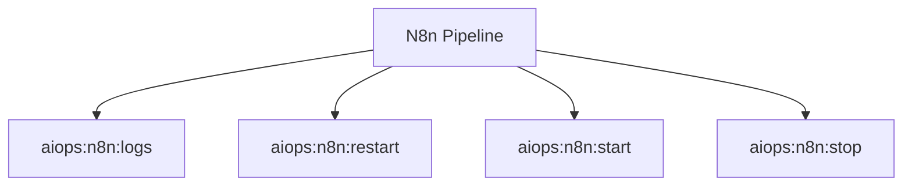

# N8n Spark Commands

## Overview

This README documents Spark commands under `app/Commands/AIOps/N8n` and their operational dependencies.

## Operational Purpose

Provide operators and developers with command intent, dependencies, workflows, and recovery guidance.

## Command Inventory

- `aiops:n8n:logs` (Operational)
- `aiops:n8n:restart` (Operational)
- `aiops:n8n:start` (Operational)
- `aiops:n8n:stop` (Operational)

Indirect/supporting commands:
- `ops:doctor:full`
- `logs:summarize`

## Command Reference

### aiops:n8n:logs

**Purpose**  
Tail n8n logs

**Usage**  
`php spark aiops:n8n:logs`

**Options**  
`--lines`, `Lines`, `--json`, `JSON`

**Services Used**  
None detected.

**Models Used**  
None detected.

**Tables Used**  
None detected.

**External APIs**  
None detected.

**Related Commands**  
`ops:doctor:full`, `logs:summarize`

**Expected Output**  
Command executes with status output and logs/errors based on runtime state.

**Example Execution**  
`php spark aiops:n8n:logs`

### aiops:n8n:restart

**Purpose**  
Restart n8n

**Usage**  
`php spark aiops:n8n:restart`

**Options**  
`--json`, `JSON`, `--dry-run`, `Dry`

**Services Used**  
None detected.

**Models Used**  
None detected.

**Tables Used**  
None detected.

**External APIs**  
None detected.

**Related Commands**  
`ops:doctor:full`, `logs:summarize`

**Expected Output**  
Command executes with status output and logs/errors based on runtime state.

**Example Execution**  
`php spark aiops:n8n:restart`

### aiops:n8n:start

**Purpose**  
Start n8n

**Usage**  
`php spark aiops:n8n:start`

**Options**  
`--json`, `JSON`, `--dry-run`, `Dry`

**Services Used**  
None detected.

**Models Used**  
None detected.

**Tables Used**  
None detected.

**External APIs**  
None detected.

**Related Commands**  
`ops:doctor:full`, `logs:summarize`

**Expected Output**  
Command executes with status output and logs/errors based on runtime state.

**Example Execution**  
`php spark aiops:n8n:start`

### aiops:n8n:stop

**Purpose**  
Stop n8n

**Usage**  
`php spark aiops:n8n:stop`

**Options**  
`--json`, `JSON`, `--dry-run`, `Dry`

**Services Used**  
None detected.

**Models Used**  
None detected.

**Tables Used**  
None detected.

**External APIs**  
None detected.

**Related Commands**  
`ops:doctor:full`, `logs:summarize`

**Expected Output**  
Command executes with status output and logs/errors based on runtime state.

**Example Execution**  
`php spark aiops:n8n:stop`

## Dependencies

| Relationship | Target | Type |
|---|---|---|

## Command Dependency Graph

## Execution Workflows

- `php spark aiops:n8n:logs`
- `php spark aiops:n8n:restart`
- `php spark aiops:n8n:start`
- `php spark aiops:n8n:stop`
- `php spark ops:doctor:full`
- `php spark logs:summarize`

## Operational Playbooks

**Investigate Application Failure**

- `php spark logs:doctor`
- `php spark ops:php:fpm:health`
- `php spark ops:server:nginx:status`
- `php spark spark:diagnose-503`

**Diagnose Database Issue**

- `php spark db:inventory`
- `php spark db:drift`
- `php spark aiops:sql:check`

## Troubleshooting

- Common failure: command not found in registry.
- Diagnostics: `php spark ops:commands:audit`, `php spark ops:commands:missing`.
- Recovery: repair namespace/PSR-4 and rerun command audit tools.

## Related Commands

- `logs:summarize`
- `ops:doctor:full`

## Console Registry Verification

- Console registry is auto-discovered in CI4; explicit `$commands` entries in `app/Config/Console.php` should be added for any commands that fail `ops:commands:missing`.
