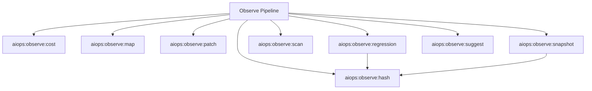

# Observe Spark Commands

## Overview

This README documents Spark commands under `app/Commands/AIOps/Observe` and their operational dependencies.

## Operational Purpose

Provide operators and developers with command intent, dependencies, workflows, and recovery guidance.

## Command Inventory

- `aiops:observe:cost` (Operational)
- `aiops:observe:hash` (Operational)
- `aiops:observe:map` (Operational)
- `aiops:observe:patch` (Operational)
- `aiops:observe:regression` (Operational)
- `aiops:observe:scan` (Operational)
- `aiops:observe:snapshot` (Operational)
- `aiops:observe:suggest` (Operational)

Indirect/supporting commands:
- `ops:doctor:full`
- `logs:summarize`

## Command Reference

### aiops:observe:cost

**Purpose**  
Correlate observability signals with AI cost logs

**Usage**  
`php spark aiops:observe:cost`

**Options**  
None documented.

**Services Used**  
None detected.

**Models Used**  
None detected.

**Tables Used**  
None detected.

**External APIs**  
None detected.

**Related Commands**  
`ops:doctor:full`, `logs:summarize`

**Expected Output**  
Command executes with status output and logs/errors based on runtime state.

**Example Execution**  
`php spark aiops:observe:cost`

### aiops:observe:hash

**Purpose**  
Fingerprint recurring errors into stable hashes

**Usage**  
`php spark aiops:observe:hash`

**Options**  
None documented.

**Services Used**  
None detected.

**Models Used**  
None detected.

**Tables Used**  
`stable`

**External APIs**  
None detected.

**Related Commands**  
`ops:doctor:full`, `logs:summarize`

**Expected Output**  
Command executes with status output and logs/errors based on runtime state.

**Example Execution**  
`php spark aiops:observe:hash`

### aiops:observe:map

**Purpose**  
Map errors to routes and controllers

**Usage**  
`php spark aiops:observe:map`

**Options**  
None documented.

**Services Used**  
None detected.

**Models Used**  
None detected.

**Tables Used**  
None detected.

**External APIs**  
None detected.

**Related Commands**  
`ops:doctor:full`, `logs:summarize`

**Expected Output**  
Command executes with status output and logs/errors based on runtime state.

**Example Execution**  
`php spark aiops:observe:map`

### aiops:observe:patch

**Purpose**  
Create patch file from suggestions

**Usage**  
`php spark aiops:observe:patch`

**Options**  
None documented.

**Services Used**  
None detected.

**Models Used**  
None detected.

**Tables Used**  
`suggestions`

**External APIs**  
None detected.

**Related Commands**  
`ops:doctor:full`, `logs:summarize`

**Expected Output**  
Command executes with status output and logs/errors based on runtime state.

**Example Execution**  
`php spark aiops:observe:patch`

### aiops:observe:regression

**Purpose**  
Detect fingerprint regressions vs previous snapshot

**Usage**  
`php spark aiops:observe:regression`

**Options**  
None documented.

**Services Used**  
None detected.

**Models Used**  
None detected.

**Tables Used**  
None detected.

**External APIs**  
None detected.

**Related Commands**  
`aiops:observe:hash`

**Expected Output**  
Command executes with status output and logs/errors based on runtime state.

**Example Execution**  
`php spark aiops:observe:regression`

### aiops:observe:scan

**Purpose**  
Scan logs and persist recurring errors

**Usage**  
`php spark aiops:observe:scan`

**Options**  
None documented.

**Services Used**  
None detected.

**Models Used**  
None detected.

**Tables Used**  
None detected.

**External APIs**  
None detected.

**Related Commands**  
`ops:doctor:full`, `logs:summarize`

**Expected Output**  
Command executes with status output and logs/errors based on runtime state.

**Example Execution**  
`php spark aiops:observe:scan`

### aiops:observe:snapshot

**Purpose**  
Snapshot fingerprint map for regression detection

**Usage**  
`php spark aiops:observe:snapshot`

**Options**  
None documented.

**Services Used**  
None detected.

**Models Used**  
None detected.

**Tables Used**  
None detected.

**External APIs**  
None detected.

**Related Commands**  
`aiops:observe:hash`

**Expected Output**  
Command executes with status output and logs/errors based on runtime state.

**Example Execution**  
`php spark aiops:observe:snapshot`

### aiops:observe:suggest

**Purpose**  
Generate fix suggestions for recurring errors

**Usage**  
`php spark aiops:observe:suggest`

**Options**  
None documented.

**Services Used**  
None detected.

**Models Used**  
None detected.

**Tables Used**  
None detected.

**External APIs**  
None detected.

**Related Commands**  
`ops:doctor:full`, `logs:summarize`

**Expected Output**  
Command executes with status output and logs/errors based on runtime state.

**Example Execution**  
`php spark aiops:observe:suggest`

## Dependencies

| Relationship | Target | Type |
|---|---|---|
| `aiops:observe:hash` | `stable` | Command → Table |
| `aiops:observe:patch` | `suggestions` | Command → Table |
| `aiops:observe:regression` | `aiops:observe:hash` | Command → Command |
| `aiops:observe:snapshot` | `aiops:observe:hash` | Command → Command |

## Command Dependency Graph

## Execution Workflows

- `php spark aiops:observe:cost`
- `php spark aiops:observe:hash`
- `php spark aiops:observe:map`
- `php spark aiops:observe:patch`
- `php spark aiops:observe:regression`
- `php spark aiops:observe:scan`
- `php spark ops:doctor:full`
- `php spark logs:summarize`

## Operational Playbooks

**Investigate Application Failure**

- `php spark logs:doctor`
- `php spark ops:php:fpm:health`
- `php spark ops:server:nginx:status`
- `php spark spark:diagnose-503`

**Diagnose Database Issue**

- `php spark db:inventory`
- `php spark db:drift`
- `php spark aiops:sql:check`

## Troubleshooting

- Common failure: command not found in registry.
- Diagnostics: `php spark ops:commands:audit`, `php spark ops:commands:missing`.
- Recovery: repair namespace/PSR-4 and rerun command audit tools.

## Related Commands

- `aiops:observe:hash`
- `logs:summarize`
- `ops:doctor:full`

## Console Registry Verification

- Console registry is auto-discovered in CI4; explicit `$commands` entries in `app/Config/Console.php` should be added for any commands that fail `ops:commands:missing`.
