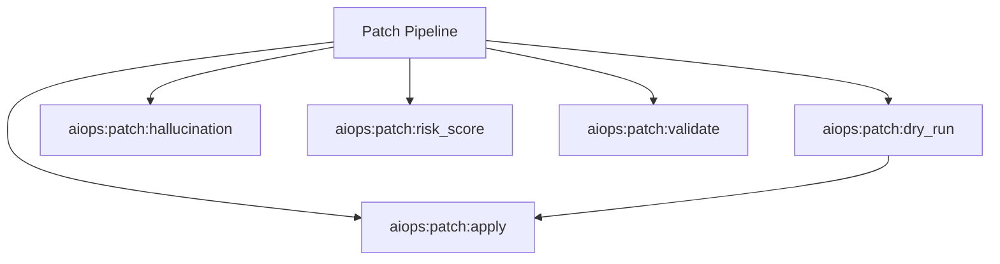

# Patch Spark Commands

## Overview

This README documents Spark commands under `app/Commands/AIOps/Patch` and their operational dependencies.

## Operational Purpose

Provide operators and developers with command intent, dependencies, workflows, and recovery guidance.

## Command Inventory

- `aiops:patch:apply` (Operational)
- `aiops:patch:dry_run` (Automation)
- `aiops:patch:hallucination` (Operational)
- `aiops:patch:risk_score` (Operational)
- `aiops:patch:validate` (Operational)

Indirect/supporting commands:
- `ops:doctor:full`
- `logs:summarize`

## Command Reference

### aiops:patch:apply

**Purpose**  
Safely apply AI-generated patch under guardrails

**Usage**  
`php spark aiops:patch:apply`

**Options**  
None documented.

**Services Used**  
None detected.

**Models Used**  
None detected.

**Tables Used**  
None detected.

**External APIs**  
None detected.

**Related Commands**  
`ops:doctor:full`, `logs:summarize`

**Expected Output**  
Command executes with status output and logs/errors based on runtime state.

**Example Execution**  
`php spark aiops:patch:apply`

### aiops:patch:dry_run

**Purpose**  
Apply patch in temporary branch

**Usage**  
`php spark aiops:patch:dry_run`

**Options**  
None documented.

**Services Used**  
None detected.

**Models Used**  
None detected.

**Tables Used**  
None detected.

**External APIs**  
None detected.

**Related Commands**  
`aiops:patch:apply`

**Expected Output**  
Command executes with status output and logs/errors based on runtime state.

**Example Execution**  
`php spark aiops:patch:dry_run`

### aiops:patch:hallucination

**Purpose**  
Detect hallucinated symbols in aiops_generated_patch.diff before apply

**Usage**  
`php spark aiops:patch:hallucination`

**Options**  
None documented.

**Services Used**  
None detected.

**Models Used**  
None detected.

**Tables Used**  
None detected.

**External APIs**  
None detected.

**Related Commands**  
`ops:doctor:full`, `logs:summarize`

**Expected Output**  
Command executes with status output and logs/errors based on runtime state.

**Example Execution**  
`php spark aiops:patch:hallucination`

### aiops:patch:risk_score

**Purpose**  
Calculate patch risk score

**Usage**  
`php spark aiops:patch:risk_score`

**Options**  
None documented.

**Services Used**  
None detected.

**Models Used**  
None detected.

**Tables Used**  
None detected.

**External APIs**  
None detected.

**Related Commands**  
`ops:doctor:full`, `logs:summarize`

**Expected Output**  
Command executes with status output and logs/errors based on runtime state.

**Example Execution**  
`php spark aiops:patch:risk_score`

### aiops:patch:validate

**Purpose**  
Validate PHP syntax after patch apply

**Usage**  
`php spark aiops:patch:validate`

**Options**  
None documented.

**Services Used**  
None detected.

**Models Used**  
None detected.

**Tables Used**  
None detected.

**External APIs**  
None detected.

**Related Commands**  
`ops:doctor:full`, `logs:summarize`

**Expected Output**  
Command executes with status output and logs/errors based on runtime state.

**Example Execution**  
`php spark aiops:patch:validate`

## Dependencies

| Relationship | Target | Type |
|---|---|---|
| `aiops:patch:dry_run` | `aiops:patch:apply` | Command → Command |

## Command Dependency Graph

## Execution Workflows

- `php spark aiops:patch:apply`
- `php spark aiops:patch:dry_run`
- `php spark aiops:patch:hallucination`
- `php spark aiops:patch:risk_score`
- `php spark aiops:patch:validate`
- `php spark ops:doctor:full`
- `php spark logs:summarize`

## Operational Playbooks

**Investigate Application Failure**

- `php spark logs:doctor`
- `php spark ops:php:fpm:health`
- `php spark ops:server:nginx:status`
- `php spark spark:diagnose-503`

**Diagnose Database Issue**

- `php spark db:inventory`
- `php spark db:drift`
- `php spark aiops:sql:check`

## Troubleshooting

- Common failure: command not found in registry.
- Diagnostics: `php spark ops:commands:audit`, `php spark ops:commands:missing`.
- Recovery: repair namespace/PSR-4 and rerun command audit tools.

## Related Commands

- `aiops:patch:apply`
- `logs:summarize`
- `ops:doctor:full`

## Console Registry Verification

- Console registry is auto-discovered in CI4; explicit `$commands` entries in `app/Config/Console.php` should be added for any commands that fail `ops:commands:missing`.
