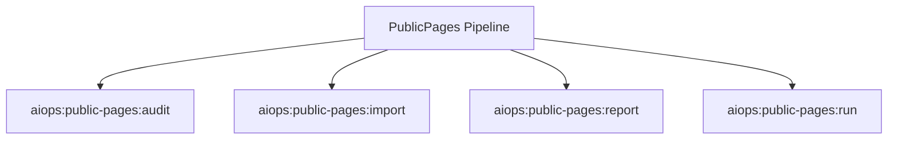

# PublicPages Spark Commands

## Overview

This README documents Spark commands under `app/Commands/AIOps/PublicPages` and their operational dependencies.

## Operational Purpose

Provide operators and developers with command intent, dependencies, workflows, and recovery guidance.

## Command Inventory

- `aiops:public-pages:audit` (Diagnostic)
- `aiops:public-pages:import` (Operational)
- `aiops:public-pages:report` (Operational)
- `aiops:public-pages:run` (Automation)

Indirect/supporting commands:
- `ops:doctor:full`
- `logs:summarize`

## Command Reference

### aiops:public-pages:audit

**Purpose**  
Audit public pages schema coverage, freshness, and governance conditions.

**Usage**  
`php spark aiops:public-pages:audit`

**Options**  
None documented.

**Services Used**  
None detected.

**Models Used**  
None detected.

**Tables Used**  
`bf_public_pages_published`, `bf_public_pages_catalog`, `bf_public_pages_drafts`

**External APIs**  
None detected.

**Related Commands**  
`ops:doctor:full`, `logs:summarize`

**Expected Output**  
Command executes with status output and logs/errors based on runtime state.

**Example Execution**  
`php spark aiops:public-pages:audit`

### aiops:public-pages:import

**Purpose**  
Import docs/_aiops/inputs/public_pages.csv into bf_public_pages_catalog.

**Usage**  
`php spark aiops:public-pages:import`

**Options**  
None documented.

**Services Used**  
None detected.

**Models Used**  
None detected.

**Tables Used**  
`bf_public_pages_catalog`

**External APIs**  
None detected.

**Related Commands**  
`ops:doctor:full`, `logs:summarize`

**Expected Output**  
Command executes with status output and logs/errors based on runtime state.

**Example Execution**  
`php spark aiops:public-pages:import`

### aiops:public-pages:report

**Purpose**  
Generate report artifacts for a public pages run.

**Usage**  
`php spark aiops:public-pages:report`

**Options**  
None documented.

**Services Used**  
None detected.

**Models Used**  
None detected.

**Tables Used**  
`bf_public_pages_runs`, `bf_public_pages_drafts`, `bf_public_pages_catalog`, `bf_public_pages_sources`

**External APIs**  
None detected.

**Related Commands**  
`ops:doctor:full`, `logs:summarize`

**Expected Output**  
Command executes with status output and logs/errors based on runtime state.

**Example Execution**  
`php spark aiops:public-pages:report`

### aiops:public-pages:run

**Purpose**  
Run public pages source collection and draft generation.

**Usage**  
`php spark aiops:public-pages:run`

**Options**  
`--due`, `Process pages due in next 24h (default).`, `--page_id`, `Process a specific page_id.`

**Services Used**  
`App\Services\AIOps\PublicPagesPipelineService`

**Models Used**  
None detected.

**Tables Used**  
`bf_public_pages_runs`, `bf_public_pages_catalog`, `bf_public_pages_sources`, `bf_public_pages_drafts`, `bf_public_pages_published`

**External APIs**  
None detected.

**Related Commands**  
`ops:doctor:full`, `logs:summarize`

**Expected Output**  
Command executes with status output and logs/errors based on runtime state.

**Example Execution**  
`php spark aiops:public-pages:run`

## Dependencies

| Relationship | Target | Type |
|---|---|---|
| `aiops:public-pages:audit` | `bf_public_pages_published` | Command → Table |
| `aiops:public-pages:audit` | `bf_public_pages_catalog` | Command → Table |
| `aiops:public-pages:audit` | `bf_public_pages_drafts` | Command → Table |
| `aiops:public-pages:import` | `bf_public_pages_catalog` | Command → Table |
| `aiops:public-pages:report` | `bf_public_pages_runs` | Command → Table |
| `aiops:public-pages:report` | `bf_public_pages_drafts` | Command → Table |
| `aiops:public-pages:report` | `bf_public_pages_catalog` | Command → Table |
| `aiops:public-pages:report` | `bf_public_pages_sources` | Command → Table |
| `aiops:public-pages:run` | `App\Services\AIOps\PublicPagesPipelineService` | Command → Service |
| `aiops:public-pages:run` | `bf_public_pages_runs` | Command → Table |
| `aiops:public-pages:run` | `bf_public_pages_catalog` | Command → Table |
| `aiops:public-pages:run` | `bf_public_pages_sources` | Command → Table |
| `aiops:public-pages:run` | `bf_public_pages_drafts` | Command → Table |
| `aiops:public-pages:run` | `bf_public_pages_published` | Command → Table |

## Command Dependency Graph

## Execution Workflows

- `php spark aiops:public-pages:audit`
- `php spark aiops:public-pages:import`
- `php spark aiops:public-pages:report`
- `php spark aiops:public-pages:run`
- `php spark ops:doctor:full`
- `php spark logs:summarize`

## Operational Playbooks

**Investigate Application Failure**

- `php spark logs:doctor`
- `php spark ops:php:fpm:health`
- `php spark ops:server:nginx:status`
- `php spark spark:diagnose-503`

**Diagnose Database Issue**

- `php spark db:inventory`
- `php spark db:drift`
- `php spark aiops:sql:check`

## Troubleshooting

- Common failure: command not found in registry.
- Diagnostics: `php spark ops:commands:audit`, `php spark ops:commands:missing`.
- Recovery: repair namespace/PSR-4 and rerun command audit tools.

## Related Commands

- `logs:summarize`
- `ops:doctor:full`

## Console Registry Verification

- Console registry is auto-discovered in CI4; explicit `$commands` entries in `app/Config/Console.php` should be added for any commands that fail `ops:commands:missing`.
