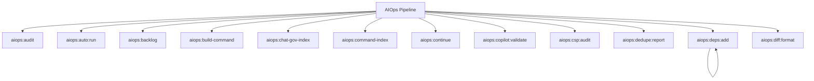

# AIOps Spark Commands

## Overview

This README documents Spark commands under `app/Commands/AIOps` and their operational dependencies.

## Operational Purpose

Provide operators and developers with command intent, dependencies, workflows, and recovery guidance.

## Command Inventory

- `aiops:audit` (Diagnostic)
- `aiops:auto:run` (Automation)
- `aiops:backlog` (Operational)
- `aiops:build-command` (Operational)
- `aiops:chat-gov-index` (Operational)
- `aiops:command-index` (Operational)
- `aiops:continue` (Operational)
- `aiops:copilot:validate` (Operational)
- `aiops:csp:audit` (Diagnostic)
- `aiops:dedupe:report` (Operational)
- `aiops:deps:add` (Operational)
- `aiops:diff:format` (Operational)
- `aiops:doctor` (Diagnostic)
- `aiops:email-scan` (Operational)
- `aiops:form:test` (Operational)
- `aiops:gate:cost` (Operational)
- `aiops:governance:analyze` (Operational)
- `aiops:graph:run` (Automation)
- `aiops:health:full` (Diagnostic)
- `aiops:ingest` (Operational)
- `aiops:init` (Operational)
- `aiops:manual:index` (Operational)
- `aiops:manual:run` (Automation)
- `aiops:observe` (Operational)
- `aiops:pr:auto` (Automation)
- `aiops:pr:create` (Operational)
- `aiops:priority:build` (Operational)
- `aiops:repair` (Maintenance)
- `aiops:repair:run` (Automation)
- `aiops:repair:run_safe` (Automation)
- `aiops:rollback` (Operational)
- `aiops:run` (Automation)
- `aiops:scan:cells` (Operational)
- `aiops:seed` (Operational)
- `aiops:self-heal` (Operational)
- `aiops:sql:check` (Operational)
- `aiops:status` (Operational)
- `aiops:sync-perf` (Maintenance)
- `aiops:unlock` (Operational)
- `aiops:watch` (Operational)
- `aiops:worker` (Automation)
- `aiops:worker:logs` (Automation)

Indirect/supporting commands:
- `ops:doctor:full`
- `logs:summarize`

## Command Reference

### aiops:audit

**Purpose**  
Audit aiops runtime, orchestration routes, and n8n/docs readiness

**Usage**  
`php spark aiops:audit`

**Options**  
`--json`, `Output JSON payload.`

**Services Used**  
None detected.

**Models Used**  
None detected.

**Tables Used**  
None detected.

**External APIs**  
None detected.

**Related Commands**  
`ops:doctor:full`, `logs:summarize`

**Expected Output**  
Command executes with status output and logs/errors based on runtime state.

**Example Execution**  
`php spark aiops:audit`

### aiops:auto:run

**Purpose**  
Run AIOPS using manual priorities first, falling back to log-driven auto priorities.

**Usage**  
`php spark aiops:auto:run`

**Options**  
`--dry-run`, `Evaluate only. No PR creation when enabled.`, `--limit-tasks`, `Max tasks per execution.`, `--limit-errors`, `Max signatures per task/PR batch.`, `--auto-threshold`, `Severity threshold for auto mode (CRITICAL|ERROR).`, `--write-auto-tasks`, `Persist generated auto priority files when in auto mode.`, `--create-pr`, `Create PR branches + GitHub PRs for matching signatures.`, `--notify`, `Send Discord notifications (if configured).`, `--job-file`, `Optional patch job file under docs/_aiops/patch_jobs/.`, `--force`, `Regenerate patch output even when docs/_aiops/patches/{job_id}.diff exists`

**Services Used**  
`App\Services\AIOps\AutoRunCoordinator`, `App\Services\AIOps\ManualRunNotifier`, `App\Services\AIOps\OllamaPatchRunner`

**Models Used**  
None detected.

**Tables Used**  
None detected.

**External APIs**  
`GitHub`, `Discord`

**Related Commands**  
`ops:doctor:full`, `logs:summarize`

**Expected Output**  
Command executes with status output and logs/errors based on runtime state.

**Example Execution**  
`php spark aiops:auto:run`

### aiops:backlog

**Purpose**  
Reconcile outstanding AIOPS patch workflow jobs.

**Usage**  
`php spark aiops:backlog`

**Options**  
`--run`, `Execute reconciliation actions for outstanding jobs.`, `--force`, `Force rerun for failed/partial jobs.`

**Services Used**  
`App\Services\AIOps\BacklogMetaService`, `App\Services\AIOps\OllamaPatchRunner`

**Models Used**  
None detected.

**Tables Used**  
None detected.

**External APIs**  
None detected.

**Related Commands**  
`ops:doctor:full`, `logs:summarize`

**Expected Output**  
Command executes with status output and logs/errors based on runtime state.

**Example Execution**  
`php spark aiops:backlog`

### aiops:build-command

**Purpose**  
Generate a Spark command from text logic using AIOps

**Usage**  
`php spark aiops:build-command`

**Options**  
None documented.

**Services Used**  
`App\Services\AIOpsService`, `App\Services\CommandBuilderService`

**Models Used**  
None detected.

**Tables Used**  
`text`

**External APIs**  
None detected.

**Related Commands**  
`ops:doctor:full`, `logs:summarize`

**Expected Output**  
Command executes with status output and logs/errors based on runtime state.

**Example Execution**  
`php spark aiops:build-command`

### aiops:chat-gov-index

**Purpose**  
Index ChatGPT governance steps from archived chats and sync CSV/DB outputs.

**Usage**  
`php spark aiops:chat-gov-index`

**Options**  
`--write-files`, `Write CSV/JSON outputs (default: config).`, `--db-sync`, `Sync results into MySQL tables (default: config).`, `--metrics`, `Write JSON metrics output (default: config).`, `--path`, `Override base path (default: docs/chatgpt/chats).`, `--limit`, `Limit number of files scanned.`

**Services Used**  
`App\Services\ChatGovernanceIndexer`

**Models Used**  
None detected.

**Tables Used**  
`archived`, `MySQL`

**External APIs**  
None detected.

**Related Commands**  
`ops:doctor:full`, `logs:summarize`

**Expected Output**  
Command executes with status output and logs/errors based on runtime state.

**Example Execution**  
`php spark aiops:chat-gov-index`

### aiops:command-index

**Purpose**  
Scan and classify Spark commands for AIOps governance.

**Usage**  
`php spark aiops:command-index`

**Options**  
`--json`, `Emit JSON output to stdout`, `--notify`, `Send summary notification via Discord or email`, `--db`, `Store index snapshot in aiops_command_index table`

**Services Used**  
`App\Services\AIOps\CommandHookService`, `App\Services\Spark\CommandInventoryService`

**Models Used**  
None detected.

**Tables Used**  
None detected.

**External APIs**  
`Discord`

**Related Commands**  
`ops:doctor:full`, `logs:summarize`

**Expected Output**  
Command executes with status output and logs/errors based on runtime state.

**Example Execution**  
`php spark aiops:command-index`

### aiops:continue

**Purpose**  
Operational audit (server + runtime focus)

**Usage**  
`php spark aiops:continue`

**Options**  
None documented.

**Services Used**  
None detected.

**Models Used**  
None detected.

**Tables Used**  
None detected.

**External APIs**  
None detected.

**Related Commands**  
`ops:doctor:full`, `logs:summarize`

**Expected Output**  
Command executes with status output and logs/errors based on runtime state.

**Example Execution**  
`php spark aiops:continue`

### aiops:copilot:validate

**Purpose**  
Validate copilot instructions and Spark command safety rules.

**Usage**  
`php spark aiops:copilot:validate`

**Options**  
`--json`, `Emit JSON output to stdout`, `--notify`, `Send summary notification via Discord or email`, `--db`, `Store JSON snapshot in aiops_command_snapshots table`, `--ci`, `Force CI-safe mode (no external network or DB persistence)`

**Services Used**  
`App\Services\AIOps\CommandHookService`, `App\Services\Spark\CommandInventoryService`

**Models Used**  
None detected.

**Tables Used**  
None detected.

**External APIs**  
`Discord`

**Related Commands**  
`ops:doctor:full`, `logs:summarize`

**Expected Output**  
Command executes with status output and logs/errors based on runtime state.

**Example Execution**  
`php spark aiops:copilot:validate`

### aiops:csp:audit

**Purpose**  
Scans the repository for CSP violations and writes a dated audit report.

**Usage**  
`php spark aiops:csp:audit`

**Options**  
`--dry-run`, `Scan and print summary without writing markdown report.`

**Services Used**  
None detected.

**Models Used**  
None detected.

**Tables Used**  
None detected.

**External APIs**  
None detected.

**Related Commands**  
`ops:doctor:full`, `logs:summarize`

**Expected Output**  
Command executes with status output and logs/errors based on runtime state.

**Example Execution**  
`php spark aiops:csp:audit`

### aiops:dedupe:report

**Purpose**  
Generate duplicate and near-duplicate instruction report.

**Usage**  
`php spark aiops:dedupe:report`

**Options**  
None documented.

**Services Used**  
`App\Services\AIOps\InstructionService`

**Models Used**  
`App\Models\AIOpsInstructionModel`

**Tables Used**  
None detected.

**External APIs**  
None detected.

**Related Commands**  
`ops:doctor:full`, `logs:summarize`

**Expected Output**  
Command executes with status output and logs/errors based on runtime state.

**Example Execution**  
`php spark aiops:dedupe:report`

### aiops:deps:add

**Purpose**  
Add dependency link: instruction depends on another instruction

**Usage**  
`php spark aiops:deps:add`

**Options**  
None documented.

**Services Used**  
None detected.

**Models Used**  
`App\Models\AIOpsDependencyModel`

**Tables Used**  
None detected.

**External APIs**  
None detected.

**Related Commands**  
`aiops:deps:add`

**Expected Output**  
Command executes with status output and logs/errors based on runtime state.

**Example Execution**  
`php spark aiops:deps:add`

### aiops:diff:format

**Purpose**  
Generate a real unified diff from current working tree

**Usage**  
`php spark aiops:diff:format`

**Options**  
None documented.

**Services Used**  
None detected.

**Models Used**  
None detected.

**Tables Used**  
`current`

**External APIs**  
None detected.

**Related Commands**  
`ops:doctor:full`, `logs:summarize`

**Expected Output**  
Command executes with status output and logs/errors based on runtime state.

**Example Execution**  
`php spark aiops:diff:format`

### aiops:doctor

**Purpose**  
Validate AIOps service wiring, namespace casing, and Spark helper migration state.

**Usage**  
`php spark aiops:doctor`

**Options**  
None documented.

**Services Used**  
None detected.

**Models Used**  
None detected.

**Tables Used**  
None detected.

**External APIs**  
None detected.

**Related Commands**  
`ops:doctor:full`, `logs:summarize`

**Expected Output**  
Command executes with status output and logs/errors based on runtime state.

**Example Execution**  
`php spark aiops:doctor`

### aiops:email-scan

**Purpose**  
Scan alerts mailbox for new emails and record AIOps counts.

**Usage**  
`php spark aiops:email-scan`

**Options**  
`--mailbox`, `IMAP mailbox folder (default: INBOX).`, `--from`, `Filter by sender email address (default: tradealerts@mymiwallet.com).`, `--since`, `IMAP SINCE date in YYYY-MM-DD format (overrides lookback-days).`, `--lookback-days`, `Number of days to look back when --since is not provided (default: 2).`, `--limit`, `Maximum number of emails to scan per run.`, `--dry-run`, `Preview counts without writing to the database.`

**Services Used**  
`App\Services\AIOps\EmailScannerService`

**Models Used**  
`App\Models\AiOpsRunModel`

**Tables Used**  
None detected.

**External APIs**  
None detected.

**Related Commands**  
`ops:doctor:full`, `logs:summarize`

**Expected Output**  
Command executes with status output and logs/errors based on runtime state.

**Example Execution**  
`php spark aiops:email-scan`

### aiops:form:test

**Purpose**  
Scan a form (url/file/text), map route->controller, generate payload, submit, capture logs, and queue a patch job if errors found.

**Usage**  
`php spark aiops:form:test`

**Options**  
`--url`, `A URL or path to scan (e.g. "/Budget/Account-Manager").`, `--file`, `An absolute file path on server to scan.`, `--text`, `Raw HTML snippet containing a <form> to scan.`, `--no-ingest`, `Do not call aiops:ingest after creating a patch job.`

**Services Used**  
`App\Services\AIOps\FormIntelligenceService`, `App\Services\AIOps\FormPatchPlanner`, `App\Services\AIOps\FormTestExecutor`

**Models Used**  
None detected.

**Tables Used**  
None detected.

**External APIs**  
None detected.

**Related Commands**  
`aiops:form:test`

**Expected Output**  
Command executes with status output and logs/errors based on runtime state.

**Example Execution**  
`php spark aiops:form:test`

### aiops:gate:cost

**Purpose**  
Enforce daily AI cost cap; auto-disable AiOps LLM when threshold exceeded

**Usage**  
`php spark aiops:gate:cost`

**Options**  
None documented.

**Services Used**  
None detected.

**Models Used**  
None detected.

**Tables Used**  
None detected.

**External APIs**  
None detected.

**Related Commands**  
`ops:doctor:full`, `logs:summarize`

**Expected Output**  
Command executes with status output and logs/errors based on runtime state.

**Example Execution**  
`php spark aiops:gate:cost`

### aiops:governance:analyze

**Purpose**  
Analyze token usage + model anomalies

**Usage**  
`php spark aiops:governance:analyze`

**Options**  
None documented.

**Services Used**  
None detected.

**Models Used**  
None detected.

**Tables Used**  
None detected.

**External APIs**  
None detected.

**Related Commands**  
`ops:doctor:full`, `logs:summarize`

**Expected Output**  
Command executes with status output and logs/errors based on runtime state.

**Example Execution**  
`php spark aiops:governance:analyze`

### aiops:graph:run

**Purpose**  
Execute queued instructions respecting dependency graph (runs worker iteratively).

**Usage**  
`php spark aiops:graph:run`

**Options**  
None documented.

**Services Used**  
`App\Services\AIOps\DependencyResolver`

**Models Used**  
None detected.

**Tables Used**  
None detected.

**External APIs**  
None detected.

**Related Commands**  
`aiops:worker`

**Expected Output**  
Command executes with status output and logs/errors based on runtime state.

**Example Execution**  
`php spark aiops:graph:run`

### aiops:health:full

**Purpose**  
Run full system health checks and generate a consolidated report

**Usage**  
`php spark aiops:health:full`

**Options**  
None documented.

**Services Used**  
None detected.

**Models Used**  
None detected.

**Tables Used**  
None detected.

**External APIs**  
None detected.

**Related Commands**  
`ops:doctor:full`, `logs:summarize`

**Expected Output**  
Command executes with status output and logs/errors based on runtime state.

**Example Execution**  
`php spark aiops:health:full`

### aiops:ingest

**Purpose**  
Ingest AI instruction text and enqueue for AIOps worker (analysis + patch + PR prep)

**Usage**  
`php spark aiops:ingest`

**Options**  
None documented.

**Services Used**  
`App\Services\AIOps\InstructionService`

**Models Used**  
None detected.

**Tables Used**  
`bf_frontend_incidents`, `parse`

**External APIs**  
None detected.

**Related Commands**  
`aiops:ingest`, `aiops:worker`, `aiops:routes:scan`, `aiops:repair:plan`, `aiops:priority:build`

**Expected Output**  
Command executes with status output and logs/errors based on runtime state.

**Example Execution**  
`php spark aiops:ingest`

### aiops:init

**Purpose**  
Initialize and validate the AIOps PR factory (one-time or rare use).

**Usage**  
`php spark aiops:init`

**Options**  
`--approve`, `Required to export PR bundle to outbox.`, `--dry-run`, `Validate only, do not write files.`

**Services Used**  
None detected.

**Models Used**  
None detected.

**Tables Used**  
None detected.

**External APIs**  
None detected.

**Related Commands**  
`ops:doctor:full`, `logs:summarize`

**Expected Output**  
Command executes with status output and logs/errors based on runtime state.

**Example Execution**  
`php spark aiops:init`

### aiops:manual:index

**Purpose**  
Index AI manual documentation under docs/_aiops/manual

**Usage**  
`php spark aiops:manual:index`

**Options**  
None documented.

**Services Used**  
None detected.

**Models Used**  
None detected.

**Tables Used**  
None detected.

**External APIs**  
None detected.

**Related Commands**  
`ops:doctor:full`, `logs:summarize`

**Expected Output**  
Command executes with status output and logs/errors based on runtime state.

**Example Execution**  
`php spark aiops:manual:index`

### aiops:manual:run

**Purpose**  
Run manual-priority AIOPS correlation, state refresh, and PR creation.

**Usage**  
`php spark aiops:manual:run`

**Options**  
`--dry-run`, `Evaluate only. No PR creation or writes when enabled.`, `--limit-tasks`, `Max tasks per execution.`, `--limit-errors`, `Max signatures per PR batch.`, `--only`, `Single priority file name to evaluate.`, `--write-state`, `Persist state files.`, `--create-pr`, `Create PR branches + GitHub PRs for matching signatures.`, `--notify`, `Send Discord notifications (if configured).`

**Services Used**  
`App\Services\AIOps\ManualPriorityRunner`, `App\Services\AIOps\ManualRunNotifier`

**Models Used**  
None detected.

**Tables Used**  
None detected.

**External APIs**  
`GitHub`, `Discord`

**Related Commands**  
`ops:doctor:full`, `logs:summarize`

**Expected Output**  
Command executes with status output and logs/errors based on runtime state.

**Example Execution**  
`php spark aiops:manual:run`

### aiops:observe

**Purpose**  
Parse logs and detect recurring error signatures

**Usage**  
`php spark aiops:observe`

**Options**  
None documented.

**Services Used**  
None detected.

**Models Used**  
None detected.

**Tables Used**  
None detected.

**External APIs**  
None detected.

**Related Commands**  
`ops:doctor:full`, `logs:summarize`

**Expected Output**  
Command executes with status output and logs/errors based on runtime state.

**Example Execution**  
`php spark aiops:observe`

### aiops:pr:auto

**Purpose**  
Full safe pipeline: observe → validate → regression → PR

**Usage**  
`php spark aiops:pr:auto`

**Options**  
None documented.

**Services Used**  
None detected.

**Models Used**  
None detected.

**Tables Used**  
None detected.

**External APIs**  
None detected.

**Related Commands**  
`ops:doctor:full`, `logs:summarize`

**Expected Output**  
Command executes with status output and logs/errors based on runtime state.

**Example Execution**  
`php spark aiops:pr:auto`

### aiops:pr:create

**Purpose**  
Create a branch, push, and open a PR (requires token + enabled flags)

**Usage**  
`php spark aiops:pr:create`

**Options**  
None documented.

**Services Used**  
None detected.

**Models Used**  
None detected.

**Tables Used**  
None detected.

**External APIs**  
`GitHub`

**Related Commands**  
`ops:doctor:full`, `logs:summarize`

**Expected Output**  
Command executes with status output and logs/errors based on runtime state.

**Example Execution**  
`php spark aiops:pr:create`

### aiops:priority:build

**Purpose**  
Scan /docs, detect gaps, verify repo, stage codegen artifacts for PR batching, and write /docs/priority outputs.

**Usage**  
`php spark aiops:priority:build`

**Options**  
None documented.

**Services Used**  
`App\Services\AIOps\DocsScannerService`, `App\Services\AIOps\RepoVerifierService`, `App\Services\AIOps\OllamaCodeGenService`, `App\Services\AIOps\PriorityWriterService`

**Models Used**  
None detected.

**Tables Used**  
`a`, `docs`

**External APIs**  
None detected.

**Related Commands**  
`ops:doctor:full`, `logs:summarize`

**Expected Output**  
Command executes with status output and logs/errors based on runtime state.

**Example Execution**  
`php spark aiops:priority:build`

### aiops:repair

**Purpose**  
Apply safe aiops repairs

**Usage**  
`php spark aiops:repair`

**Options**  
`--json`, `JSON`, `--dry-run`, `Dry`

**Services Used**  
None detected.

**Models Used**  
None detected.

**Tables Used**  
None detected.

**External APIs**  
None detected.

**Related Commands**  
`ops:doctor:full`, `logs:summarize`

**Expected Output**  
Command executes with status output and logs/errors based on runtime state.

**Example Execution**  
`php spark aiops:repair`

### aiops:repair:run

**Purpose**  
Full autonomous repair pipeline

**Usage**  
`php spark aiops:repair:run`

**Options**  
None documented.

**Services Used**  
None detected.

**Models Used**  
None detected.

**Tables Used**  
None detected.

**External APIs**  
None detected.

**Related Commands**  
`aiops:observe:scan`, `aiops:observe:hash`, `aiops:observe:cost`, `aiops:observe:suggest`, `aiops:diff:format`, `aiops:patch:apply`

**Expected Output**  
Command executes with status output and logs/errors based on runtime state.

**Example Execution**  
`php spark aiops:repair:run`

### aiops:repair:run_safe

**Purpose**  
Run repair pipeline with rollback safety + gating before PR

**Usage**  
`php spark aiops:repair:run_safe`

**Options**  
None documented.

**Services Used**  
None detected.

**Models Used**  
None detected.

**Tables Used**  
`branch`, `the`

**External APIs**  
None detected.

**Related Commands**  
`aiops:gate:cost`, `aiops:observe:scan`, `aiops:observe:hash`, `aiops:observe:cost`, `aiops:observe:regression`, `aiops:patch:risk_score`, `aiops:patch:validate`, `aiops:patch:dry_run`, `aiops:governance:analyze`, `aiops:observe:suggest`, `aiops:diff:format`, `aiops:patch:hallucination`, `aiops:patch:apply`, `app:test`, `codex:gate`, `codex:gate:severity`, `app:gate:coverage`

**Expected Output**  
Command executes with status output and logs/errors based on runtime state.

**Example Execution**  
`php spark aiops:repair:run_safe`

### aiops:rollback

**Purpose**  
Rollback working tree to clean state (hard reset)

**Usage**  
`php spark aiops:rollback`

**Options**  
None documented.

**Services Used**  
None detected.

**Models Used**  
None detected.

**Tables Used**  
None detected.

**External APIs**  
None detected.

**Related Commands**  
`ops:doctor:full`, `logs:summarize`

**Expected Output**  
Command executes with status output and logs/errors based on runtime state.

**Example Execution**  
`php spark aiops:rollback`

### aiops:run

**Purpose**  
Manually run the AI-Ops worker and generate docs/_aiops reports

**Usage**  
`php spark aiops:run`

**Options**  
`--mode`, `Run mode (manual|nightly). Default: manual`, `--dry-run`, `Validate paths and configuration without executing the worker`, `--job-file`, `Optional patch job file under docs/_aiops/patch_jobs/`, `--force`, `Regenerate patch output even when docs/_aiops/patches/{job_id}.diff exists`

**Services Used**  
`App\Services\AIOps\OllamaPatchRunner`

**Models Used**  
None detected.

**Tables Used**  
None detected.

**External APIs**  
None detected.

**Related Commands**  
`ops:doctor:full`, `logs:summarize`

**Expected Output**  
Command executes with status output and logs/errors based on runtime state.

**Example Execution**  
`php spark aiops:run`

### aiops:scan:cells

**Purpose**  
Stateful scanner for repeated UI blocks and Cell candidates.

**Usage**  
`php spark aiops:scan:cells`

**Options**  
`--dry-run`, `1|0 default 1`, `--sleep`, `seconds between cycles (default 900)`, `--batch`, `queue items per cycle (default 5)`, `--max-prs`, `max PR actions per cycle (default 1)`, `--write-pr`, `1|0 enable phase 2 patching/PR fallback write`, `--once`, `1|0 run single cycle then exit`, `--reset`, `1|0 reset scanner queue and state before running`

**Services Used**  
`App\Services\AIOps\CellDiscoveryScanner`

**Models Used**  
`App\Models\AiOpsScanStateModel`

**Tables Used**  
None detected.

**External APIs**  
None detected.

**Related Commands**  
`aiops:scan:cells`

**Expected Output**  
Command executes with status output and logs/errors based on runtime state.

**Example Execution**  
`php spark aiops:scan:cells`

### aiops:seed

**Purpose**  
Seed default AI Ops caps and pricing configuration.

**Usage**  
`php spark aiops:seed`

**Options**  
`--dry-run`, `Preview actions without writing to the database`

**Services Used**  
None detected.

**Models Used**  
None detected.

**Tables Used**  
`bf_ai_ops_caps`

**External APIs**  
None detected.

**Related Commands**  
`aiops:seed`

**Expected Output**  
Command executes with status output and logs/errors based on runtime state.

**Example Execution**  
`php spark aiops:seed`

### aiops:self-heal

**Purpose**  
Run one-pass self-heal

**Usage**  
`php spark aiops:self-heal`

**Options**  
`--attempts`, `max 3`, `--json`, `JSON`

**Services Used**  
None detected.

**Models Used**  
None detected.

**Tables Used**  
None detected.

**External APIs**  
None detected.

**Related Commands**  
`ops:doctor:full`, `logs:summarize`

**Expected Output**  
Command executes with status output and logs/errors based on runtime state.

**Example Execution**  
`php spark aiops:self-heal`

### aiops:sql:check

**Purpose**  
Validate model/table/query SQL compatibility against live schema.

**Usage**  
`php spark aiops:sql:check`

**Options**  
`--model`, `Model class name, e.g. BudgetModel`, `--table`, `Table name to inspect`, `--query`, `SQL query to validate via EXPLAIN`

**Services Used**  
`App\Services\AIOps\SchemaInspectorService`

**Models Used**  
None detected.

**Tables Used**  
`bf_aiops_query_audit`, `bf_users`

**External APIs**  
None detected.

**Related Commands**  
`ops:doctor:full`, `logs:summarize`

**Expected Output**  
Command executes with status output and logs/errors based on runtime state.

**Example Execution**  
`php spark aiops:sql:check`

### aiops:status

**Purpose**  
AIOps runtime status

**Usage**  
`php spark aiops:status`

**Options**  
`--json`, `JSON output`

**Services Used**  
`App\Services\AIOps\AiOpsServiceManager`

**Models Used**  
None detected.

**Tables Used**  
None detected.

**External APIs**  
None detected.

**Related Commands**  
`ops:doctor:full`, `logs:summarize`

**Expected Output**  
Command executes with status output and logs/errors based on runtime state.

**Example Execution**  
`php spark aiops:status`

### aiops:sync-perf

**Purpose**  
Scan Routes.php and sync perf_urls.txt automatically

**Usage**  
`php spark aiops:sync-perf`

**Options**  
None documented.

**Services Used**  
None detected.

**Models Used**  
None detected.

**Tables Used**  
None detected.

**External APIs**  
None detected.

**Related Commands**  
`ops:doctor:full`, `logs:summarize`

**Expected Output**  
Command executes with status output and logs/errors based on runtime state.

**Example Execution**  
`php spark aiops:sync-perf`

### aiops:unlock

**Purpose**  
Manually unlock an AIOPS patch job and reset retries.

**Usage**  
`php spark aiops:unlock`

**Options**  
None documented.

**Services Used**  
`App\Services\AIOps\BacklogMetaService`

**Models Used**  
None detected.

**Tables Used**  
None detected.

**External APIs**  
None detected.

**Related Commands**  
`aiops:unlock`

**Expected Output**  
Command executes with status output and logs/errors based on runtime state.

**Example Execution**  
`php spark aiops:unlock`

### aiops:watch

**Purpose**  
Continuous aiops audit watcher

**Usage**  
`php spark aiops:watch`

**Options**  
`--interval`, `Seconds`, `--max-cycles`, `0 infinite`, `--heal`, `Run self-heal`

**Services Used**  
None detected.

**Models Used**  
None detected.

**Tables Used**  
None detected.

**External APIs**  
None detected.

**Related Commands**  
`ops:doctor:full`, `logs:summarize`

**Expected Output**  
Command executes with status output and logs/errors based on runtime state.

**Example Execution**  
`php spark aiops:watch`

### aiops:worker

**Purpose**  
Process queued AIOps instructions (governance + targeting + diff + optional PR).

**Usage**  
`php spark aiops:worker`

**Options**  
None documented.

**Services Used**  
`App\Services\AIOps\BranchLockService`, `App\Services\AIOps\DependencyResolver`, `App\Services\AIOps\DiffBuilder`, `App\Services\AIOps\GitHubPRService`, `App\Services\AIOps\GovernanceScorer`, `App\Services\AIOps\InstructionService`, `App\Services\AIOps\TargetingIntelligence`

**Models Used**  
None detected.

**Tables Used**  
None detected.

**External APIs**  
`Ollama`, `GitHub`

**Related Commands**  
`aiops:worker`, `aiops:pr:send`, `logs:summarize`, `aiops:worker:logs`

**Expected Output**  
Command executes with status output and logs/errors based on runtime state.

**Example Execution**  
`php spark aiops:worker`

### aiops:worker:logs

**Purpose**  
Summarize logs, ingest actionable issues, and run aiops worker once.

**Usage**  
`php spark aiops:worker:logs`

**Options**  
None documented.

**Services Used**  
`App\Services\AIOps\InstructionService`, `App\Services\Spark\LogSummarizeService`

**Models Used**  
`App\Models\AIOpsInstructionModel`

**Tables Used**  
None detected.

**External APIs**  
None detected.

**Related Commands**  
`ops:doctor:full`, `logs:summarize`

**Expected Output**  
Command executes with status output and logs/errors based on runtime state.

**Example Execution**  
`php spark aiops:worker:logs`

## Dependencies

| Relationship | Target | Type |
|---|---|---|
| `aiops:auto:run` | `App\Services\AIOps\AutoRunCoordinator` | Command → Service |
| `aiops:auto:run` | `App\Services\AIOps\ManualRunNotifier` | Command → Service |
| `aiops:auto:run` | `App\Services\AIOps\OllamaPatchRunner` | Command → Service |
| `aiops:auto:run` | `GitHub` | Command → API |
| `aiops:auto:run` | `Discord` | Command → API |
| `aiops:backlog` | `App\Services\AIOps\BacklogMetaService` | Command → Service |
| `aiops:backlog` | `App\Services\AIOps\OllamaPatchRunner` | Command → Service |
| `aiops:build-command` | `App\Services\AIOpsService` | Command → Service |
| `aiops:build-command` | `App\Services\CommandBuilderService` | Command → Service |
| `aiops:build-command` | `text` | Command → Table |
| `aiops:chat-gov-index` | `App\Services\ChatGovernanceIndexer` | Command → Service |
| `aiops:chat-gov-index` | `archived` | Command → Table |
| `aiops:chat-gov-index` | `MySQL` | Command → Table |
| `aiops:command-index` | `App\Services\AIOps\CommandHookService` | Command → Service |
| `aiops:command-index` | `App\Services\Spark\CommandInventoryService` | Command → Service |
| `aiops:command-index` | `Discord` | Command → API |
| `aiops:copilot:validate` | `App\Services\AIOps\CommandHookService` | Command → Service |
| `aiops:copilot:validate` | `App\Services\Spark\CommandInventoryService` | Command → Service |
| `aiops:copilot:validate` | `Discord` | Command → API |
| `aiops:dedupe:report` | `App\Services\AIOps\InstructionService` | Command → Service |
| `aiops:dedupe:report` | `App\Models\AIOpsInstructionModel` | Command → Model |
| `aiops:deps:add` | `App\Models\AIOpsDependencyModel` | Command → Model |
| `aiops:deps:add` | `aiops:deps:add` | Command → Command |
| `aiops:diff:format` | `current` | Command → Table |
| `aiops:email-scan` | `App\Services\AIOps\EmailScannerService` | Command → Service |
| `aiops:email-scan` | `App\Models\AiOpsRunModel` | Command → Model |
| `aiops:form:test` | `App\Services\AIOps\FormIntelligenceService` | Command → Service |
| `aiops:form:test` | `App\Services\AIOps\FormPatchPlanner` | Command → Service |
| `aiops:form:test` | `App\Services\AIOps\FormTestExecutor` | Command → Service |
| `aiops:form:test` | `aiops:form:test` | Command → Command |
| `aiops:graph:run` | `App\Services\AIOps\DependencyResolver` | Command → Service |
| `aiops:graph:run` | `aiops:worker` | Command → Command |
| `aiops:ingest` | `App\Services\AIOps\InstructionService` | Command → Service |
| `aiops:ingest` | `bf_frontend_incidents` | Command → Table |
| `aiops:ingest` | `parse` | Command → Table |
| `aiops:ingest` | `aiops:ingest` | Command → Command |
| `aiops:ingest` | `aiops:worker` | Command → Command |
| `aiops:ingest` | `aiops:routes:scan` | Command → Command |
| `aiops:ingest` | `aiops:repair:plan` | Command → Command |
| `aiops:ingest` | `aiops:priority:build` | Command → Command |
| `aiops:manual:run` | `App\Services\AIOps\ManualPriorityRunner` | Command → Service |
| `aiops:manual:run` | `App\Services\AIOps\ManualRunNotifier` | Command → Service |
| `aiops:manual:run` | `GitHub` | Command → API |
| `aiops:manual:run` | `Discord` | Command → API |
| `aiops:pr:create` | `GitHub` | Command → API |
| `aiops:priority:build` | `App\Services\AIOps\DocsScannerService` | Command → Service |
| `aiops:priority:build` | `App\Services\AIOps\RepoVerifierService` | Command → Service |
| `aiops:priority:build` | `App\Services\AIOps\OllamaCodeGenService` | Command → Service |
| `aiops:priority:build` | `App\Services\AIOps\PriorityWriterService` | Command → Service |
| `aiops:priority:build` | `a` | Command → Table |
| `aiops:priority:build` | `docs` | Command → Table |
| `aiops:repair:run` | `aiops:observe:scan` | Command → Command |
| `aiops:repair:run` | `aiops:observe:hash` | Command → Command |
| `aiops:repair:run` | `aiops:observe:cost` | Command → Command |
| `aiops:repair:run` | `aiops:observe:suggest` | Command → Command |
| `aiops:repair:run` | `aiops:diff:format` | Command → Command |
| `aiops:repair:run_safe` | `branch` | Command → Table |
| `aiops:repair:run_safe` | `the` | Command → Table |
| `aiops:repair:run_safe` | `aiops:gate:cost` | Command → Command |
| `aiops:repair:run_safe` | `aiops:observe:scan` | Command → Command |
| `aiops:repair:run_safe` | `aiops:observe:hash` | Command → Command |
| `aiops:repair:run_safe` | `aiops:observe:cost` | Command → Command |
| `aiops:repair:run_safe` | `aiops:observe:regression` | Command → Command |
| `aiops:run` | `App\Services\AIOps\OllamaPatchRunner` | Command → Service |
| `aiops:scan:cells` | `App\Services\AIOps\CellDiscoveryScanner` | Command → Service |
| `aiops:scan:cells` | `App\Models\AiOpsScanStateModel` | Command → Model |
| `aiops:scan:cells` | `aiops:scan:cells` | Command → Command |
| `aiops:seed` | `bf_ai_ops_caps` | Command → Table |
| `aiops:seed` | `aiops:seed` | Command → Command |
| `aiops:sql:check` | `App\Services\AIOps\SchemaInspectorService` | Command → Service |
| `aiops:sql:check` | `bf_aiops_query_audit` | Command → Table |
| `aiops:sql:check` | `bf_users` | Command → Table |
| `aiops:status` | `App\Services\AIOps\AiOpsServiceManager` | Command → Service |
| `aiops:unlock` | `App\Services\AIOps\BacklogMetaService` | Command → Service |
| `aiops:unlock` | `aiops:unlock` | Command → Command |
| `aiops:worker` | `App\Services\AIOps\BranchLockService` | Command → Service |
| `aiops:worker` | `App\Services\AIOps\DependencyResolver` | Command → Service |
| `aiops:worker` | `App\Services\AIOps\DiffBuilder` | Command → Service |
| `aiops:worker` | `App\Services\AIOps\GitHubPRService` | Command → Service |
| `aiops:worker` | `App\Services\AIOps\GovernanceScorer` | Command → Service |
| `aiops:worker` | `aiops:worker` | Command → Command |
| `aiops:worker` | `aiops:pr:send` | Command → Command |
| `aiops:worker` | `logs:summarize` | Command → Command |
| `aiops:worker` | `aiops:worker:logs` | Command → Command |
| `aiops:worker` | `Ollama` | Command → API |
| `aiops:worker` | `GitHub` | Command → API |
| `aiops:worker:logs` | `App\Services\AIOps\InstructionService` | Command → Service |
| `aiops:worker:logs` | `App\Services\Spark\LogSummarizeService` | Command → Service |
| `aiops:worker:logs` | `App\Models\AIOpsInstructionModel` | Command → Model |

## Command Dependency Graph

## Execution Workflows

- `php spark aiops:audit`
- `php spark aiops:auto:run`
- `php spark aiops:backlog`
- `php spark aiops:build-command`
- `php spark aiops:chat-gov-index`
- `php spark aiops:command-index`
- `php spark ops:doctor:full`
- `php spark logs:summarize`

## Operational Playbooks

**Investigate Application Failure**

- `php spark logs:doctor`
- `php spark ops:php:fpm:health`
- `php spark ops:server:nginx:status`
- `php spark spark:diagnose-503`

**Diagnose Database Issue**

- `php spark db:inventory`
- `php spark db:drift`
- `php spark aiops:sql:check`

## Troubleshooting

- Common failure: command not found in registry.
- Diagnostics: `php spark ops:commands:audit`, `php spark ops:commands:missing`.
- Recovery: repair namespace/PSR-4 and rerun command audit tools.

## Related Commands

- `aiops:deps:add`
- `aiops:diff:format`
- `aiops:form:test`
- `aiops:gate:cost`
- `aiops:governance:analyze`
- `aiops:ingest`
- `aiops:observe:cost`
- `aiops:observe:hash`
- `aiops:observe:regression`
- `aiops:observe:scan`
- `aiops:observe:suggest`
- `aiops:patch:apply`
- `aiops:patch:dry_run`
- `aiops:patch:hallucination`
- `aiops:patch:risk_score`
- `aiops:patch:validate`
- `aiops:pr:send`
- `aiops:priority:build`
- `aiops:repair:plan`
- `aiops:routes:scan`

## Console Registry Verification

- Console registry is auto-discovered in CI4; explicit `$commands` entries in `app/Config/Console.php` should be added for any commands that fail `ops:commands:missing`.
