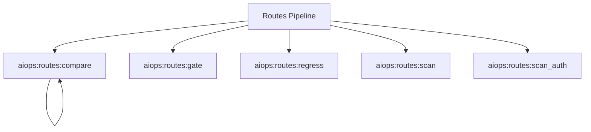

# Routes Spark Commands

## Overview

This README documents Spark commands under `app/Commands/AIOps/Routes` and their operational dependencies.

## Operational Purpose

Provide operators and developers with command intent, dependencies, workflows, and recovery guidance.

## Command Inventory

- `aiops:routes:compare` (Operational)
- `aiops:routes:gate` (Operational)
- `aiops:routes:regress` (Operational)
- `aiops:routes:scan` (Operational)
- `aiops:routes:scan_auth` (Operational)

Indirect/supporting commands:
- `ops:doctor:full`
- `logs:summarize`

## Command Reference

### aiops:routes:compare

**Purpose**  
Compare staging vs production routes scan

**Usage**  
`php spark aiops:routes:compare`

**Options**  
None documented.

**Services Used**  
None detected.

**Models Used**  
None detected.

**Tables Used**  
None detected.

**External APIs**  
`https://mymiwallet.com`, `https://dev.mymiwallet.com`

**Related Commands**  
`aiops:routes:compare`

**Expected Output**  
Command executes with status output and logs/errors based on runtime state.

**Example Execution**  
`php spark aiops:routes:compare`

### aiops:routes:gate

**Purpose**  
Gate based on routes_scan.json thresholds

**Usage**  
`php spark aiops:routes:gate`

**Options**  
None documented.

**Services Used**  
None detected.

**Models Used**  
None detected.

**Tables Used**  
None detected.

**External APIs**  
None detected.

**Related Commands**  
`ops:doctor:full`, `logs:summarize`

**Expected Output**  
Command executes with status output and logs/errors based on runtime state.

**Example Execution**  
`php spark aiops:routes:gate`

### aiops:routes:regress

**Purpose**  
Detect route scan regressions vs previous snapshot

**Usage**  
`php spark aiops:routes:regress`

**Options**  
None documented.

**Services Used**  
None detected.

**Models Used**  
None detected.

**Tables Used**  
None detected.

**External APIs**  
None detected.

**Related Commands**  
`ops:doctor:full`, `logs:summarize`

**Expected Output**  
Command executes with status output and logs/errors based on runtime state.

**Example Execution**  
`php spark aiops:routes:regress`

### aiops:routes:scan

**Purpose**  
Scan Routes.php (GET routes), parallel curl, write JSON+CSV+snapshot

**Usage**  
`php spark aiops:routes:scan`

**Options**  
None documented.

**Services Used**  
None detected.

**Models Used**  
None detected.

**Tables Used**  
None detected.

**External APIs**  
None detected.

**Related Commands**  
`ops:doctor:full`, `logs:summarize`

**Expected Output**  
Command executes with status output and logs/errors based on runtime state.

**Example Execution**  
`php spark aiops:routes:scan`

### aiops:routes:scan_auth

**Purpose**  
Authenticated scan using AIOPS_AUTH_COOKIE

**Usage**  
`php spark aiops:routes:scan_auth`

**Options**  
None documented.

**Services Used**  
None detected.

**Models Used**  
None detected.

**Tables Used**  
None detected.

**External APIs**  
None detected.

**Related Commands**  
`ops:doctor:full`, `logs:summarize`

**Expected Output**  
Command executes with status output and logs/errors based on runtime state.

**Example Execution**  
`php spark aiops:routes:scan_auth`

## Dependencies

| Relationship | Target | Type |
|---|---|---|
| `aiops:routes:compare` | `aiops:routes:compare` | Command → Command |
| `aiops:routes:compare` | `https://mymiwallet.com` | Command → API |
| `aiops:routes:compare` | `https://dev.mymiwallet.com` | Command → API |

## Command Dependency Graph

## Execution Workflows

- `php spark aiops:routes:compare`
- `php spark aiops:routes:gate`
- `php spark aiops:routes:regress`
- `php spark aiops:routes:scan`
- `php spark aiops:routes:scan_auth`
- `php spark ops:doctor:full`
- `php spark logs:summarize`

## Operational Playbooks

**Investigate Application Failure**

- `php spark logs:doctor`
- `php spark ops:php:fpm:health`
- `php spark ops:server:nginx:status`
- `php spark spark:diagnose-503`

**Diagnose Database Issue**

- `php spark db:inventory`
- `php spark db:drift`
- `php spark aiops:sql:check`

## Troubleshooting

- Common failure: command not found in registry.
- Diagnostics: `php spark ops:commands:audit`, `php spark ops:commands:missing`.
- Recovery: repair namespace/PSR-4 and rerun command audit tools.

## Related Commands

- `aiops:routes:compare`
- `logs:summarize`
- `ops:doctor:full`

## Console Registry Verification

- Console registry is auto-discovered in CI4; explicit `$commands` entries in `app/Config/Console.php` should be added for any commands that fail `ops:commands:missing`.
