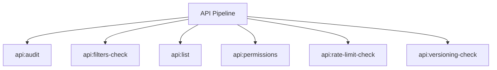

# API Spark Commands

## Overview

This README documents Spark commands under `app/Commands/API` and their operational dependencies.

## Operational Purpose

Provide operators and developers with command intent, dependencies, workflows, and recovery guidance.

## Command Inventory

- `api:audit` (Diagnostic)
- `api:filters-check` (Operational)
- `api:list` (Operational)
- `api:permissions` (Operational)
- `api:rate-limit-check` (Operational)
- `api:versioning-check` (Operational)

## Command Reference

### api:audit

**Purpose**  
Institutional API governance audit: routes, permissions, filters, rate limits, and versioning.

**Usage**  
`php spark api:audit`

**Options**  
None documented.

**Services Used**  
`App\Services\ApiGovernanceService`

**Models Used**  
None detected.

**Tables Used**  
`bf_api_audit_runs`, `bf_api_audit_findings`, `bf_api_endpoints`, `bf_api_endpoint_rules`

**External APIs**  
None detected.

**Related Commands**  
None detected.

**Expected Output**  
Command executes with status output and logs/errors based on runtime state.

**Example Execution**  
`php spark api:audit`

### api:filters-check

**Purpose**  
Fail on CRITICAL uncovered endpoints by filter governance.

**Usage**  
`php spark api:filters-check`

**Options**  
None documented.

**Services Used**  
`App\Services\ApiGovernanceService`

**Models Used**  
None detected.

**Tables Used**  
None detected.

**External APIs**  
None detected.

**Related Commands**  
None detected.

**Expected Output**  
Command executes with status output and logs/errors based on runtime state.

**Example Execution**  
`php spark api:filters-check`

### api:list

**Purpose**  
List endpoints with filters, auth indicator, and version.

**Usage**  
`php spark api:list`

**Options**  
None documented.

**Services Used**  
`App\Services\ApiGovernanceService`

**Models Used**  
None detected.

**Tables Used**  
None detected.

**External APIs**  
None detected.

**Related Commands**  
None detected.

**Expected Output**  
Command executes with status output and logs/errors based on runtime state.

**Example Execution**  
`php spark api:list`

### api:permissions

**Purpose**  
Generate endpoint permission matrix in markdown and JSON.

**Usage**  
`php spark api:permissions`

**Options**  
None documented.

**Services Used**  
`App\Services\ApiGovernanceService`

**Models Used**  
None detected.

**Tables Used**  
None detected.

**External APIs**  
None detected.

**Related Commands**  
None detected.

**Expected Output**  
Command executes with status output and logs/errors based on runtime state.

**Example Execution**  
`php spark api:permissions`

### api:rate-limit-check

**Purpose**  
Fail when external/API-like endpoints have no rate-limit enforcement metadata.

**Usage**  
`php spark api:rate-limit-check`

**Options**  
None documented.

**Services Used**  
`App\Services\ApiGovernanceService`

**Models Used**  
None detected.

**Tables Used**  
None detected.

**External APIs**  
None detected.

**Related Commands**  
None detected.

**Expected Output**  
Command executes with status output and logs/errors based on runtime state.

**Example Execution**  
`php spark api:rate-limit-check`

### api:versioning-check

**Purpose**  
Detect API endpoints missing /API/vN namespace and emit remediation.

**Usage**  
`php spark api:versioning-check`

**Options**  
None documented.

**Services Used**  
`App\Services\ApiGovernanceService`

**Models Used**  
None detected.

**Tables Used**  
None detected.

**External APIs**  
None detected.

**Related Commands**  
None detected.

**Expected Output**  
Command executes with status output and logs/errors based on runtime state.

**Example Execution**  
`php spark api:versioning-check`

## Dependencies

| Relationship | Target | Type |
|---|---|---|
| `api:audit` | `App\Services\ApiGovernanceService` | Command → Service |
| `api:audit` | `bf_api_audit_runs` | Command → Table |
| `api:audit` | `bf_api_audit_findings` | Command → Table |
| `api:audit` | `bf_api_endpoints` | Command → Table |
| `api:audit` | `bf_api_endpoint_rules` | Command → Table |
| `api:filters-check` | `App\Services\ApiGovernanceService` | Command → Service |
| `api:list` | `App\Services\ApiGovernanceService` | Command → Service |
| `api:permissions` | `App\Services\ApiGovernanceService` | Command → Service |
| `api:rate-limit-check` | `App\Services\ApiGovernanceService` | Command → Service |
| `api:versioning-check` | `App\Services\ApiGovernanceService` | Command → Service |

## Command Dependency Graph

## Execution Workflows

- `php spark api:audit`
- `php spark api:filters-check`
- `php spark api:list`
- `php spark api:permissions`
- `php spark api:rate-limit-check`
- `php spark api:versioning-check`

## Operational Playbooks

**Investigate Application Failure**

- `php spark logs:doctor`
- `php spark ops:php:fpm:health`
- `php spark ops:server:nginx:status`
- `php spark spark:diagnose-503`

**Diagnose Database Issue**

- `php spark db:inventory`
- `php spark db:drift`
- `php spark aiops:sql:check`

## Troubleshooting

- Common failure: command not found in registry.
- Diagnostics: `php spark ops:commands:audit`, `php spark ops:commands:missing`.
- Recovery: repair namespace/PSR-4 and rerun command audit tools.

## Related Commands

## Console Registry Verification

- Console registry is auto-discovered in CI4; explicit `$commands` entries in `app/Config/Console.php` should be added for any commands that fail `ops:commands:missing`.
