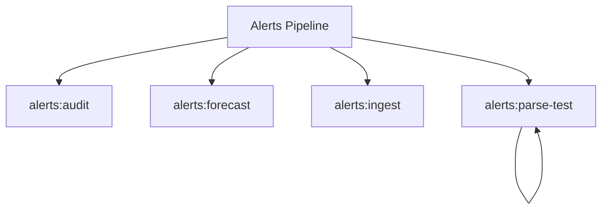

# Alerts Spark Commands

## Overview

This README documents Spark commands under `app/Commands/Alerts` and their operational dependencies.

## Operational Purpose

Provide operators and developers with command intent, dependencies, workflows, and recovery guidance.

## Command Inventory

- `alerts:audit` (Diagnostic)
- `alerts:forecast` (Operational)
- `alerts:ingest` (Operational)
- `alerts:parse-test` (Operational)

## Command Reference

### alerts:audit

**Purpose**  
Audit recent scraped alert emails against generated trade alerts.

**Usage**  
`php spark alerts:audit`

**Options**  
`--dry-run`, `Preview actions without writing audit artifacts`

**Services Used**  
None detected.

**Models Used**  
`App\Models\AlertsModel`

**Tables Used**  
`bf_investment_scraper`, `bf_investment_trade_alerts`, `bf_error_logs`

**External APIs**  
None detected.

**Related Commands**  
None detected.

**Expected Output**  
Command executes with status output and logs/errors based on runtime state.

**Example Execution**  
`php spark alerts:audit`

### alerts:forecast

**Purpose**  
Refresh forecasts for open alerts.

**Usage**  
`php spark alerts:forecast`

**Options**  
`--dry-run`, `Preview actions without running refresh jobs`, `--approve`, `Acknowledge and run forecast refresh jobs`

**Services Used**  
None detected.

**Models Used**  
None detected.

**Tables Used**  
None detected.

**External APIs**  
None detected.

**Related Commands**  
None detected.

**Expected Output**  
Command executes with status output and logs/errors based on runtime state.

**Example Execution**  
`php spark alerts:forecast`

### alerts:ingest

**Purpose**  
Ingest ThinkorSwim alert emails and upsert trade alerts.

**Usage**  
`php spark alerts:ingest`

**Options**  
`--since`, `How far back to scan (default: 15m). Supports 15m|1h|today.`, `--limit`, `Max emails to scan (default: 200).`, `--dry-run`, `Preview ingestion without DB writes.`, `--verbose`, `Verbose logging to CLI.`

**Services Used**  
None detected.

**Models Used**  
`App\Models\AiOpsIngestRunModel`, `App\Models\AlertsModel`

**Tables Used**  
None detected.

**External APIs**  
None detected.

**Related Commands**  
None detected.

**Expected Output**  
Command executes with status output and logs/errors based on runtime state.

**Example Execution**  
`php spark alerts:ingest`

### alerts:parse-test

**Purpose**  
Parse a broker email sample and output normalized execution data.

**Usage**  
`php spark alerts:parse-test`

**Options**  
`--dry-run`, `Preview actions without running parser`

**Services Used**  
None detected.

**Models Used**  
None detected.

**Tables Used**  
None detected.

**External APIs**  
None detected.

**Related Commands**  
`alerts:parse-test`

**Expected Output**  
Command executes with status output and logs/errors based on runtime state.

**Example Execution**  
`php spark alerts:parse-test`

## Dependencies

| Relationship | Target | Type |
|---|---|---|
| `alerts:audit` | `App\Models\AlertsModel` | Command → Model |
| `alerts:audit` | `bf_investment_scraper` | Command → Table |
| `alerts:audit` | `bf_investment_trade_alerts` | Command → Table |
| `alerts:audit` | `bf_error_logs` | Command → Table |
| `alerts:ingest` | `App\Models\AiOpsIngestRunModel` | Command → Model |
| `alerts:ingest` | `App\Models\AlertsModel` | Command → Model |
| `alerts:parse-test` | `alerts:parse-test` | Command → Command |

## Command Dependency Graph

## Execution Workflows

- `php spark alerts:audit`
- `php spark alerts:forecast`
- `php spark alerts:ingest`
- `php spark alerts:parse-test`

## Operational Playbooks

**Investigate Application Failure**

- `php spark logs:doctor`
- `php spark ops:php:fpm:health`
- `php spark ops:server:nginx:status`
- `php spark spark:diagnose-503`

**Diagnose Database Issue**

- `php spark db:inventory`
- `php spark db:drift`
- `php spark aiops:sql:check`

## Troubleshooting

- Common failure: command not found in registry.
- Diagnostics: `php spark ops:commands:audit`, `php spark ops:commands:missing`.
- Recovery: repair namespace/PSR-4 and rerun command audit tools.

## Related Commands

- `alerts:parse-test`

## Console Registry Verification

- Console registry is auto-discovered in CI4; explicit `$commands` entries in `app/Config/Console.php` should be added for any commands that fail `ops:commands:missing`.
