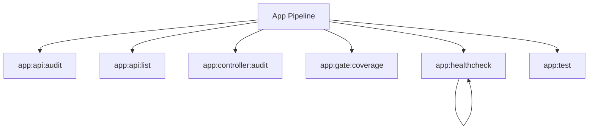

# App Spark Commands

## Overview

This README documents Spark commands under `app/Commands/App` and their operational dependencies.

## Operational Purpose

Provide operators and developers with command intent, dependencies, workflows, and recovery guidance.

## Command Inventory

- `app:api:audit` (Diagnostic)
- `app:api:list` (Operational)
- `app:controller:audit` (Diagnostic)
- `app:gate:coverage` (Operational)
- `app:healthcheck` (Diagnostic)
- `app:test` (Operational)

## Command Reference

### app:api:audit

**Purpose**  
Advanced API audit: groups, filters, duplicates, OpenAPI, Postman, probe mode.

**Usage**  
`php spark app:api:audit`

**Options**  
None documented.

**Services Used**  
None detected.

**Models Used**  
None detected.

**Tables Used**  
None detected.

**External APIs**  
`https://schema.getpostman.com/json/collection/v2.1.0/collection.json`

**Related Commands**  
None detected.

**Expected Output**  
Command executes with status output and logs/errors based on runtime state.

**Example Execution**  
`php spark app:api:audit`

### app:api:list

**Purpose**  
List complete APIs from latest audit report.

**Usage**  
`php spark app:api:list`

**Options**  
None documented.

**Services Used**  
None detected.

**Models Used**  
None detected.

**Tables Used**  
`latest`

**External APIs**  
None detected.

**Related Commands**  
None detected.

**Expected Output**  
Command executes with status output and logs/errors based on runtime state.

**Example Execution**  
`php spark app:api:list`

### app:controller:audit

**Purpose**  
Audit controllers for unsafe initController patterns, score severity, suggest patches, optional safe auto-fix, and regression diff.

**Usage**  
`php spark app:controller:audit`

**Options**  
None documented.

**Services Used**  
None detected.

**Models Used**  
None detected.

**Tables Used**  
`method`

**External APIs**  
None detected.

**Related Commands**  
None detected.

**Expected Output**  
Command executes with status output and logs/errors based on runtime state.

**Example Execution**  
`php spark app:controller:audit`

### app:gate:coverage

**Purpose**  
Gate on PHPUnit coverage if available (coverage-text).

**Usage**  
`php spark app:gate:coverage`

**Options**  
None documented.

**Services Used**  
None detected.

**Models Used**  
None detected.

**Tables Used**  
None detected.

**External APIs**  
None detected.

**Related Commands**  
None detected.

**Expected Output**  
Command executes with status output and logs/errors based on runtime state.

**Example Execution**  
`php spark app:gate:coverage`

### app:healthcheck

**Purpose**  
Compatibility healthcheck command aligned to AI-Ops spark checks.

**Usage**  
`php spark app:healthcheck`

**Options**  
`--dry-run`, `Preview actions without writing data`

**Services Used**  
`App\Services\Spark\LogHealthcheckService`

**Models Used**  
None detected.

**Tables Used**  
None detected.

**External APIs**  
None detected.

**Related Commands**  
`app:healthcheck`

**Expected Output**  
Command executes with status output and logs/errors based on runtime state.

**Example Execution**  
`php spark app:healthcheck`

### app:test

**Purpose**  
Run PHPUnit test suite

**Usage**  
`php spark app:test`

**Options**  
None documented.

**Services Used**  
None detected.

**Models Used**  
None detected.

**Tables Used**  
None detected.

**External APIs**  
None detected.

**Related Commands**  
None detected.

**Expected Output**  
Command executes with status output and logs/errors based on runtime state.

**Example Execution**  
`php spark app:test`

## Dependencies

| Relationship | Target | Type |
|---|---|---|
| `app:api:audit` | `https://schema.getpostman.com/json/collection/v2.1.0/collection.json` | Command → API |
| `app:api:list` | `latest` | Command → Table |
| `app:controller:audit` | `method` | Command → Table |
| `app:healthcheck` | `App\Services\Spark\LogHealthcheckService` | Command → Service |
| `app:healthcheck` | `app:healthcheck` | Command → Command |

## Command Dependency Graph

## Execution Workflows

- `php spark app:api:audit`
- `php spark app:api:list`
- `php spark app:controller:audit`
- `php spark app:gate:coverage`
- `php spark app:healthcheck`
- `php spark app:test`

## Operational Playbooks

**Investigate Application Failure**

- `php spark logs:doctor`
- `php spark ops:php:fpm:health`
- `php spark ops:server:nginx:status`
- `php spark spark:diagnose-503`

**Diagnose Database Issue**

- `php spark db:inventory`
- `php spark db:drift`
- `php spark aiops:sql:check`

## Troubleshooting

- Common failure: command not found in registry.
- Diagnostics: `php spark ops:commands:audit`, `php spark ops:commands:missing`.
- Recovery: repair namespace/PSR-4 and rerun command audit tools.

## Related Commands

- `app:healthcheck`

## Console Registry Verification

- Console registry is auto-discovered in CI4; explicit `$commands` entries in `app/Config/Console.php` should be added for any commands that fail `ops:commands:missing`.
