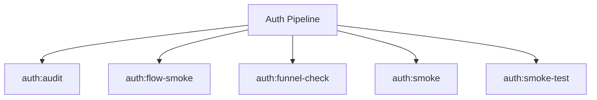

# Auth Spark Commands

## Overview

This README documents Spark commands under `app/Commands/Auth` and their operational dependencies.

## Operational Purpose

Provide operators and developers with command intent, dependencies, workflows, and recovery guidance.

## Command Inventory

- `auth:audit` (Diagnostic)
- `auth:baseline:capture` (Operational)
- `auth:baseline:diff` (Operational)
- `auth:baseline:restore` (Operational)
- `auth:flow-smoke` (Operational)
- `auth:funnel-check` (Operational)
- `auth:smoke` (Operational)
- `auth:smoke-test` (Operational)
- `auth:surface:scan` (Operational)

## Command Reference

### auth:audit

**Purpose**  
Audit Myth:Auth authentication and account lifecycle flows end-to-end, including registration, login, and reset flows.

**Usage**  
`php spark auth:audit`

**Options**  
`--dry-run`, `Preview actions without writing data`

**Services Used**  
`App\Services\Spark\AuthAuditRunner`

**Models Used**  
None detected.

**Tables Used**  
None detected.

**External APIs**  
None detected.

**Related Commands**  
None detected.

**Expected Output**  
Command executes with status output and logs/errors based on runtime state.

**Example Execution**  
`php spark auth:audit`

### auth:flow-smoke

**Purpose**  
Smoke test for auth redirect safety and login route no-cache headers.

**Usage**  
`php spark auth:flow-smoke`

**Options**  
None documented.

**Services Used**  
None detected.

**Models Used**  
None detected.

**Tables Used**  
None detected.

**External APIs**  
`https://evil.example`

**Related Commands**  
None detected.

**Expected Output**  
Command executes with status output and logs/errors based on runtime state.

**Example Execution**  
`php spark auth:flow-smoke`

### auth:funnel-check

**Purpose**  
Check auth funnel sanity using recent user events and emit alerts on drop-offs.

**Usage**  
`php spark auth:funnel-check`

**Options**  
`--dry-run`, `Preview actions without writing data`

**Services Used**  
`App\Services\Spark\AuthFunnelCheckService`

**Models Used**  
None detected.

**Tables Used**  
None detected.

**External APIs**  
None detected.

**Related Commands**  
None detected.

**Expected Output**  
Command executes with status output and logs/errors based on runtime state.

**Example Execution**  
`php spark auth:funnel-check`

### auth:smoke

**Purpose**  
Run a safe authentication smoke test and record health results for ops visibility.

**Usage**  
`php spark auth:smoke`

**Options**  
`--dry-run`, `Preview actions without writing data`

**Services Used**  
`App\Services\AuthSmokeService`

**Models Used**  
None detected.

**Tables Used**  
None detected.

**External APIs**  
None detected.

**Related Commands**  
None detected.

**Expected Output**  
Command executes with status output and logs/errors based on runtime state.

**Example Execution**  
`php spark auth:smoke`

### auth:smoke-test

**Purpose**  
Deterministic Myth/Auth smoke test for login/session/reset flow.

**Usage**  
`php spark auth:smoke-test`

**Options**  
`--json`, `Output machine-readable JSON only`

**Services Used**  
`App\Services\AuthSmokeService`

**Models Used**  
None detected.

**Tables Used**  
None detected.

**External APIs**  
None detected.

**Related Commands**  
None detected.

**Expected Output**  
Command executes with status output and logs/errors based on runtime state.

**Example Execution**  
`php spark auth:smoke-test`

## Dependencies

| Relationship | Target | Type |
|---|---|---|
| `auth:audit` | `App\Services\Spark\AuthAuditRunner` | Command → Service |
| `auth:flow-smoke` | `https://evil.example` | Command → API |
| `auth:funnel-check` | `App\Services\Spark\AuthFunnelCheckService` | Command → Service |
| `auth:smoke` | `App\Services\AuthSmokeService` | Command → Service |
| `auth:smoke-test` | `App\Services\AuthSmokeService` | Command → Service |

## Command Dependency Graph

## Execution Workflows

- `php spark auth:audit`
- `php spark auth:flow-smoke`
- `php spark auth:funnel-check`
- `php spark auth:smoke`
- `php spark auth:smoke-test`

## Operational Playbooks

**Investigate Application Failure**

- `php spark logs:doctor`
- `php spark ops:php:fpm:health`
- `php spark ops:server:nginx:status`
- `php spark spark:diagnose-503`

**Diagnose Database Issue**

- `php spark db:inventory`
- `php spark db:drift`
- `php spark aiops:sql:check`

## Troubleshooting

- Common failure: command not found in registry.
- Diagnostics: `php spark ops:commands:audit`, `php spark ops:commands:missing`.
- Recovery: repair namespace/PSR-4 and rerun command audit tools.

## Related Commands

## Console Registry Verification

- Console registry is auto-discovered in CI4; explicit `$commands` entries in `app/Config/Console.php` should be added for any commands that fail `ops:commands:missing`.
