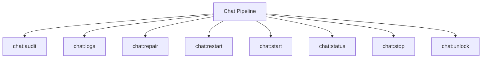

# Chat Spark Commands

## Overview

This README documents Spark commands under `app/Commands/Chat` and their operational dependencies.

## Operational Purpose

Provide operators and developers with command intent, dependencies, workflows, and recovery guidance.

## Command Inventory

- `chat:audit` (Diagnostic)
- `chat:logs` (Operational)
- `chat:repair` (Maintenance)
- `chat:restart` (Operational)
- `chat:start` (Operational)
- `chat:status` (Operational)
- `chat:stop` (Operational)
- `chat:unlock` (Operational)

## Command Reference

### chat:audit

**Purpose**  
Chat audit

**Usage**  
`php spark chat:audit`

**Options**  
`--json`, `JSON`

**Services Used**  
None detected.

**Models Used**  
None detected.

**Tables Used**  
None detected.

**External APIs**  
None detected.

**Related Commands**  
None detected.

**Expected Output**  
Command executes with status output and logs/errors based on runtime state.

**Example Execution**  
`php spark chat:audit`

### chat:logs

**Purpose**  
Tail persisted chat logs from writable/logs/chat.

**Usage**  
`php spark chat:logs`

**Options**  
`--lines`, `Number of lines to output (default: 200).`, `--json`, `Return JSON payload with per-file log sources.`, `--since`, `Filter by relative window (e.g. 5m, 2h, 1d).`

**Services Used**  
None detected.

**Models Used**  
None detected.

**Tables Used**  
`writable`

**External APIs**  
None detected.

**Related Commands**  
None detected.

**Expected Output**  
Command executes with status output and logs/errors based on runtime state.

**Example Execution**  
`php spark chat:logs`

### chat:repair

**Purpose**  
Chat repairs

**Usage**  
`php spark chat:repair`

**Options**  
`--json`, `JSON`, `--dry-run`, `Dry`

**Services Used**  
None detected.

**Models Used**  
None detected.

**Tables Used**  
None detected.

**External APIs**  
None detected.

**Related Commands**  
None detected.

**Expected Output**  
Command executes with status output and logs/errors based on runtime state.

**Example Execution**  
`php spark chat:repair`

### chat:restart

**Purpose**  
Restart chat

**Usage**  
`php spark chat:restart`

**Options**  
`--json`, `JSON`, `--dry-run`, `Dry`

**Services Used**  
None detected.

**Models Used**  
None detected.

**Tables Used**  
None detected.

**External APIs**  
None detected.

**Related Commands**  
None detected.

**Expected Output**  
Command executes with status output and logs/errors based on runtime state.

**Example Execution**  
`php spark chat:restart`

### chat:start

**Purpose**  
Start chat

**Usage**  
`php spark chat:start`

**Options**  
`--json`, `JSON`, `--dry-run`, `Dry`

**Services Used**  
None detected.

**Models Used**  
None detected.

**Tables Used**  
None detected.

**External APIs**  
None detected.

**Related Commands**  
None detected.

**Expected Output**  
Command executes with status output and logs/errors based on runtime state.

**Example Execution**  
`php spark chat:start`

### chat:status

**Purpose**  
Chat status with PID and listening-port verification.

**Usage**  
`php spark chat:status`

**Options**  
`--json`, `JSON`

**Services Used**  
None detected.

**Models Used**  
None detected.

**Tables Used**  
None detected.

**External APIs**  
None detected.

**Related Commands**  
None detected.

**Expected Output**  
Command executes with status output and logs/errors based on runtime state.

**Example Execution**  
`php spark chat:status`

### chat:stop

**Purpose**  
Stop chat

**Usage**  
`php spark chat:stop`

**Options**  
`--json`, `JSON`, `--dry-run`, `Dry`

**Services Used**  
None detected.

**Models Used**  
None detected.

**Tables Used**  
None detected.

**External APIs**  
None detected.

**Related Commands**  
None detected.

**Expected Output**  
Command executes with status output and logs/errors based on runtime state.

**Example Execution**  
`php spark chat:stop`

### chat:unlock

**Purpose**  
Safely clear stale chat runtime lock and pid files.

**Usage**  
`php spark chat:unlock`

**Options**  
`--force`, `Also kill a running process if PID exists (dangerous).`, `--json`, `Output JSON payload.`

**Services Used**  
None detected.

**Models Used**  
None detected.

**Tables Used**  
None detected.

**External APIs**  
None detected.

**Related Commands**  
None detected.

**Expected Output**  
Command executes with status output and logs/errors based on runtime state.

**Example Execution**  
`php spark chat:unlock`

## Dependencies

| Relationship | Target | Type |
|---|---|---|
| `chat:logs` | `writable` | Command → Table |

## Command Dependency Graph

## Execution Workflows

- `php spark chat:audit`
- `php spark chat:logs`
- `php spark chat:repair`
- `php spark chat:restart`
- `php spark chat:start`
- `php spark chat:status`

## Operational Playbooks

**Investigate Application Failure**

- `php spark logs:doctor`
- `php spark ops:php:fpm:health`
- `php spark ops:server:nginx:status`
- `php spark spark:diagnose-503`

**Diagnose Database Issue**

- `php spark db:inventory`
- `php spark db:drift`
- `php spark aiops:sql:check`

## Troubleshooting

- Common failure: command not found in registry.
- Diagnostics: `php spark ops:commands:audit`, `php spark ops:commands:missing`.
- Recovery: repair namespace/PSR-4 and rerun command audit tools.

## Related Commands

## Console Registry Verification

- Console registry is auto-discovered in CI4; explicit `$commands` entries in `app/Config/Console.php` should be added for any commands that fail `ops:commands:missing`.
