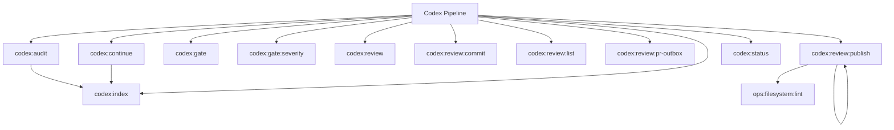

# Codex Spark Commands

## Overview

This README documents Spark commands under `app/Commands/Codex` and their operational dependencies.

## Operational Purpose

Provide operators and developers with command intent, dependencies, workflows, and recovery guidance.

## Command Inventory

- `codex:audit` (Diagnostic)
- `codex:continue` (Operational)
- `codex:gate` (Operational)
- `codex:gate:severity` (Operational)
- `codex:index` (Operational)
- `codex:review` (Operational)
- `codex:review:commit` (Operational)
- `codex:review:list` (Operational)
- `codex:review:pr-outbox` (Operational)
- `codex:review:publish` (Operational)
- `codex:status` (Operational)

## Command Reference

### codex:audit

**Purpose**  
Full repository audit via OpenAI

**Usage**  
`php spark codex:audit`

**Options**  
None documented.

**Services Used**  
None detected.

**Models Used**  
None detected.

**Tables Used**  
None detected.

**External APIs**  
`https://api.openai.com/v1/chat/completions`

**Related Commands**  
`codex:index`

**Expected Output**  
Command executes with status output and logs/errors based on runtime state.

**Example Execution**  
`php spark codex:audit`

### codex:continue

**Purpose**  
Continue audit in batches (default 5 files) with OpenAI + severity tracking

**Usage**  
`php spark codex:continue`

**Options**  
None documented.

**Services Used**  
None detected.

**Models Used**  
None detected.

**Tables Used**  
`counters`

**External APIs**  
None detected.

**Related Commands**  
`codex:index`

**Expected Output**  
Command executes with status output and logs/errors based on runtime state.

**Example Execution**  
`php spark codex:continue`

### codex:gate

**Purpose**  
Fail build if high severity issues exist

**Usage**  
`php spark codex:gate`

**Options**  
None documented.

**Services Used**  
None detected.

**Models Used**  
None detected.

**Tables Used**  
None detected.

**External APIs**  
None detected.

**Related Commands**  
None detected.

**Expected Output**  
Command executes with status output and logs/errors based on runtime state.

**Example Execution**  
`php spark codex:gate`

### codex:gate:severity

**Purpose**  
Fail if severity counters exceed thresholds

**Usage**  
`php spark codex:gate:severity`

**Options**  
None documented.

**Services Used**  
None detected.

**Models Used**  
None detected.

**Tables Used**  
None detected.

**External APIs**  
None detected.

**Related Commands**  
None detected.

**Expected Output**  
Command executes with status output and logs/errors based on runtime state.

**Example Execution**  
`php spark codex:gate:severity`

### codex:index

**Purpose**  
Index repository and initialize audit state

**Usage**  
`php spark codex:index`

**Options**  
None documented.

**Services Used**  
None detected.

**Models Used**  
None detected.

**Tables Used**  
None detected.

**External APIs**  
None detected.

**Related Commands**  
None detected.

**Expected Output**  
Command executes with status output and logs/errors based on runtime state.

**Example Execution**  
`php spark codex:index`

### codex:review

**Purpose**  
Generate Codex review artifacts (summary + prompt payload)

**Usage**  
`php spark codex:review`

**Options**  
`--dry-run`, `Preview actions without writing output files`

**Services Used**  
None detected.

**Models Used**  
None detected.

**Tables Used**  
None detected.

**External APIs**  
None detected.

**Related Commands**  
None detected.

**Expected Output**  
Command executes with status output and logs/errors based on runtime state.

**Example Execution**  
`php spark codex:review`

### codex:review:commit

**Purpose**  
Commit Codex review artifacts intentionally (latest or by date).

**Usage**  
`php spark codex:review:commit`

**Options**  
`--latest`, `Commit the latest review artifacts`, `--date=YYYY-MM-DD`, `Commit review artifacts for a specific date`, `--dry-run`, `Preview git commands without committing`, `--approve`, `Approve destructive changes (required for real commit)`

**Services Used**  
None detected.

**Models Used**  
None detected.

**Tables Used**  
None detected.

**External APIs**  
None detected.

**Related Commands**  
None detected.

**Expected Output**  
Command executes with status output and logs/errors based on runtime state.

**Example Execution**  
`php spark codex:review:commit`

### codex:review:list

**Purpose**  
List available Codex review artifacts stored under docs.

**Usage**  
`php spark codex:review:list`

**Options**  
`--limit=5`, `Limit the number of review files shown`, `--latest`, `Show only the latest review file`

**Services Used**  
None detected.

**Models Used**  
None detected.

**Tables Used**  
None detected.

**External APIs**  
None detected.

**Related Commands**  
None detected.

**Expected Output**  
Command executes with status output and logs/errors based on runtime state.

**Example Execution**  
`php spark codex:review:list`

### codex:review:pr-outbox

**Purpose**  
Review the latest PR outbox bundle and publish CODEX_REVIEW.md.

**Usage**  
`php spark codex:review:pr-outbox`

**Options**  
`--dry-run`, `Preview review output without writing.`

**Services Used**  
None detected.

**Models Used**  
None detected.

**Tables Used**  
None detected.

**External APIs**  
None detected.

**Related Commands**  
None detected.

**Expected Output**  
Command executes with status output and logs/errors based on runtime state.

**Example Execution**  
`php spark codex:review:pr-outbox`

### codex:review:publish

**Purpose**  
Aggregate governance lint results and publish review artifacts.

**Usage**  
`php spark codex:review:publish`

**Options**  
`--dry-run`, `Preview payloads without writing artifacts`

**Services Used**  
None detected.

**Models Used**  
None detected.

**Tables Used**  
None detected.

**External APIs**  
`GitHub`

**Related Commands**  
`ops:filesystem:lint`, `codex:review:publish`

**Expected Output**  
Command executes with status output and logs/errors based on runtime state.

**Example Execution**  
`php spark codex:review:publish`

### codex:status

**Purpose**  
Show audit status

**Usage**  
`php spark codex:status`

**Options**  
None documented.

**Services Used**  
None detected.

**Models Used**  
None detected.

**Tables Used**  
None detected.

**External APIs**  
None detected.

**Related Commands**  
None detected.

**Expected Output**  
Command executes with status output and logs/errors based on runtime state.

**Example Execution**  
`php spark codex:status`

## Dependencies

| Relationship | Target | Type |
|---|---|---|
| `codex:audit` | `codex:index` | Command → Command |
| `codex:audit` | `https://api.openai.com/v1/chat/completions` | Command → API |
| `codex:continue` | `counters` | Command → Table |
| `codex:continue` | `codex:index` | Command → Command |
| `codex:review:publish` | `ops:filesystem:lint` | Command → Command |
| `codex:review:publish` | `codex:review:publish` | Command → Command |
| `codex:review:publish` | `GitHub` | Command → API |

## Command Dependency Graph

## Execution Workflows

- `php spark codex:audit`
- `php spark codex:continue`
- `php spark codex:gate`
- `php spark codex:gate:severity`
- `php spark codex:index`
- `php spark codex:review`

## Operational Playbooks

**Investigate Application Failure**

- `php spark logs:doctor`
- `php spark ops:php:fpm:health`
- `php spark ops:server:nginx:status`
- `php spark spark:diagnose-503`

**Diagnose Database Issue**

- `php spark db:inventory`
- `php spark db:drift`
- `php spark aiops:sql:check`

## Troubleshooting

- Common failure: command not found in registry.
- Diagnostics: `php spark ops:commands:audit`, `php spark ops:commands:missing`.
- Recovery: repair namespace/PSR-4 and rerun command audit tools.

## Related Commands

- `codex:index`
- `codex:review:publish`
- `ops:filesystem:lint`

## Console Registry Verification

- Console registry is auto-discovered in CI4; explicit `$commands` entries in `app/Config/Console.php` should be added for any commands that fail `ops:commands:missing`.
