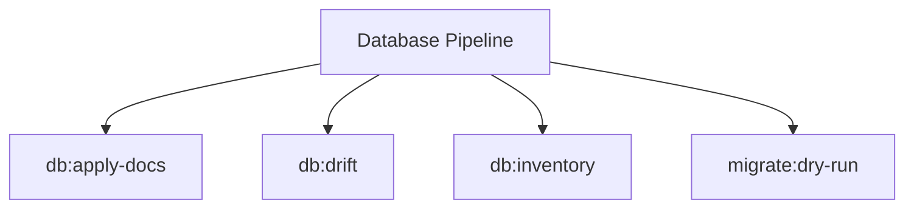

# Database Spark Commands

## Overview

This README documents Spark commands under `app/Commands/Database` and their operational dependencies.

## Operational Purpose

Provide operators and developers with command intent, dependencies, workflows, and recovery guidance.

## Command Inventory

- `db:apply-docs` (Maintenance)
- `db:drift` (Operational)
- `db:inventory` (Operational)
- `migrate:dry-run` (Automation)

Indirect/supporting commands:
- `aiops:sql:check`
- `logs:doctor`

## Command Reference

### db:apply-docs

**Purpose**  
Compile SQL from docs/mysql and apply statements with audit logging.

**Usage**  
`php spark db:apply-docs`

**Options**  
`--dry-run`, `Compile SQL without executing statements.`

**Services Used**  
`App\Services\Spark\DbApplyDocsService`

**Models Used**  
None detected.

**Tables Used**  
`docs`

**External APIs**  
None detected.

**Related Commands**  
`aiops:sql:check`, `logs:doctor`

**Expected Output**  
Command executes with status output and logs/errors based on runtime state.

**Example Execution**  
`php spark db:apply-docs`

### db:drift

**Purpose**  
Compare live schema to expected inventory.

**Usage**  
`php spark db:drift`

**Options**  
`--emit`, `Output mode: docs (default: docs).`, `--out`, `Override artifact directory (must be inside docs/aiops/artifacts).`, `--dry-run`, `Generate a report without mutating state.`, `--approve`, `Acknowledge execution (required for mutating commands).`

**Services Used**  
None detected.

**Models Used**  
None detected.

**Tables Used**  
None detected.

**External APIs**  
None detected.

**Related Commands**  
`aiops:sql:check`, `logs:doctor`

**Expected Output**  
Command executes with status output and logs/errors based on runtime state.

**Example Execution**  
`php spark db:drift`

### db:inventory

**Purpose**  
Scan code and migrations to inventory MyMI Wallet tables and generate integrity docs/SQL adjustments.

**Usage**  
`php spark db:inventory`

**Options**  
`--dry-run`, `Preview actions without writing data`

**Services Used**  
`App\Services\Spark\DbInventoryService`

**Models Used**  
None detected.

**Tables Used**  
None detected.

**External APIs**  
None detected.

**Related Commands**  
`aiops:sql:check`, `logs:doctor`

**Expected Output**  
Command executes with status output and logs/errors based on runtime state.

**Example Execution**  
`php spark db:inventory`

### migrate:dry-run

**Purpose**  
List pending migrations without executing them.

**Usage**  
`php spark migrate:dry-run`

**Options**  
None documented.

**Services Used**  
None detected.

**Models Used**  
None detected.

**Tables Used**  
None detected.

**External APIs**  
None detected.

**Related Commands**  
`aiops:sql:check`, `logs:doctor`

**Expected Output**  
Command executes with status output and logs/errors based on runtime state.

**Example Execution**  
`php spark migrate:dry-run`

## Dependencies

| Relationship | Target | Type |
|---|---|---|
| `db:apply-docs` | `App\Services\Spark\DbApplyDocsService` | Command → Service |
| `db:apply-docs` | `docs` | Command → Table |
| `db:inventory` | `App\Services\Spark\DbInventoryService` | Command → Service |

## Command Dependency Graph

## Execution Workflows

- `php spark db:apply-docs`
- `php spark db:drift`
- `php spark db:inventory`
- `php spark migrate:dry-run`
- `php spark aiops:sql:check`
- `php spark logs:doctor`

## Operational Playbooks

**Investigate Application Failure**

- `php spark logs:doctor`
- `php spark ops:php:fpm:health`
- `php spark ops:server:nginx:status`
- `php spark spark:diagnose-503`

**Diagnose Database Issue**

- `php spark db:inventory`
- `php spark db:drift`
- `php spark aiops:sql:check`

## Troubleshooting

- Common failure: command not found in registry.
- Diagnostics: `php spark ops:commands:audit`, `php spark ops:commands:missing`.
- Recovery: repair namespace/PSR-4 and rerun command audit tools.

## Related Commands

- `aiops:sql:check`
- `logs:doctor`

## Console Registry Verification

- Console registry is auto-discovered in CI4; explicit `$commands` entries in `app/Config/Console.php` should be added for any commands that fail `ops:commands:missing`.
