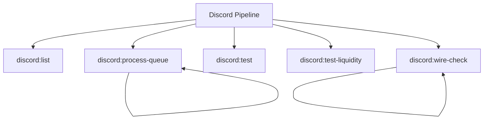

# Discord Spark Commands

## Overview

This README documents Spark commands under `app/Commands/Discord` and their operational dependencies.

## Operational Purpose

Provide operators and developers with command intent, dependencies, workflows, and recovery guidance.

## Command Inventory

- `discord:list` (Operational)
- `discord:process-queue` (Operational)
- `discord:test` (Operational)
- `discord:test-liquidity` (Operational)
- `discord:wire-check` (Operational)

## Command Reference

### discord:list

**Purpose**  
List configured Discord channels/webhooks/IDs from config and database.

**Usage**  
`php spark discord:list`

**Options**  
`--dry-run`, `Preview actions without querying the database`

**Services Used**  
None detected.

**Models Used**  
None detected.

**Tables Used**  
`bf_discord_channels`, `config`, `DB`

**External APIs**  
`Discord`

**Related Commands**  
None detected.

**Expected Output**  
Command executes with status output and logs/errors based on runtime state.

**Example Execution**  
`php spark discord:list`

### discord:process-queue

**Purpose**  
Process queued Discord messages respecting quiet hours and pacing.

**Usage**  
`php spark discord:process-queue`

**Options**  
`--dry-run`, `Preview actions without processing the queue`, `--approve`, `Acknowledge and send queued messages`

**Services Used**  
None detected.

**Models Used**  
None detected.

**Tables Used**  
None detected.

**External APIs**  
`Discord`

**Related Commands**  
`discord:process-queue`

**Expected Output**  
Command executes with status output and logs/errors based on runtime state.

**Example Execution**  
`php spark discord:process-queue`

### discord:test

**Purpose**  
Send a test payload through the Discord queue pipeline.

**Usage**  
`php spark discord:test`

**Options**  
`--dry-run`, `Preview actions without sending Discord alerts`

**Services Used**  
None detected.

**Models Used**  
None detected.

**Tables Used**  
None detected.

**External APIs**  
`Discord`

**Related Commands**  
None detected.

**Expected Output**  
Command executes with status output and logs/errors based on runtime state.

**Example Execution**  
`php spark discord:test`

### discord:test-liquidity

**Purpose**  
Send a test Liquidity Scan alert to alerts.liquidity channel

**Usage**  
`php spark discord:test-liquidity`

**Options**  
`--dry-run`, `Preview actions without sending Discord alerts`

**Services Used**  
None detected.

**Models Used**  
None detected.

**Tables Used**  
`CLI`

**External APIs**  
`Discord`

**Related Commands**  
None detected.

**Expected Output**  
Command executes with status output and logs/errors based on runtime state.

**Example Execution**  
`php spark discord:test-liquidity`

### discord:wire-check

**Purpose**  
Validate Discord env vars, tables, and queue health for MyMIDiscord.

**Usage**  
`php spark discord:wire-check`

**Options**  
`--dry-run`, `Preview actions without querying the database`

**Services Used**  
None detected.

**Models Used**  
None detected.

**Tables Used**  
`bf_discord_queue`

**External APIs**  
`Discord`

**Related Commands**  
`discord:wire-check`

**Expected Output**  
Command executes with status output and logs/errors based on runtime state.

**Example Execution**  
`php spark discord:wire-check`

## Dependencies

| Relationship | Target | Type |
|---|---|---|
| `discord:list` | `bf_discord_channels` | Command → Table |
| `discord:list` | `config` | Command → Table |
| `discord:list` | `DB` | Command → Table |
| `discord:list` | `Discord` | Command → API |
| `discord:process-queue` | `discord:process-queue` | Command → Command |
| `discord:process-queue` | `Discord` | Command → API |
| `discord:test` | `Discord` | Command → API |
| `discord:test-liquidity` | `CLI` | Command → Table |
| `discord:test-liquidity` | `Discord` | Command → API |
| `discord:wire-check` | `bf_discord_queue` | Command → Table |
| `discord:wire-check` | `discord:wire-check` | Command → Command |
| `discord:wire-check` | `Discord` | Command → API |

## Command Dependency Graph

## Execution Workflows

- `php spark discord:list`
- `php spark discord:process-queue`
- `php spark discord:test`
- `php spark discord:test-liquidity`
- `php spark discord:wire-check`

## Operational Playbooks

**Investigate Application Failure**

- `php spark logs:doctor`
- `php spark ops:php:fpm:health`
- `php spark ops:server:nginx:status`
- `php spark spark:diagnose-503`

**Diagnose Database Issue**

- `php spark db:inventory`
- `php spark db:drift`
- `php spark aiops:sql:check`

## Troubleshooting

- Common failure: command not found in registry.
- Diagnostics: `php spark ops:commands:audit`, `php spark ops:commands:missing`.
- Recovery: repair namespace/PSR-4 and rerun command audit tools.

## Related Commands

- `discord:process-queue`
- `discord:wire-check`

## Console Registry Verification

- Console registry is auto-discovered in CI4; explicit `$commands` entries in `app/Config/Console.php` should be added for any commands that fail `ops:commands:missing`.
