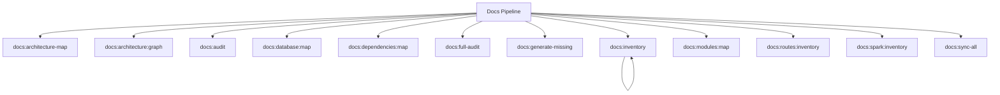

# Docs Spark Commands

## Overview

This README documents Spark commands under `app/Commands/Docs` and their operational dependencies.

## Operational Purpose

Provide operators and developers with command intent, dependencies, workflows, and recovery guidance.

## Command Inventory

- `docs:architecture-map` (Maintenance)
- `docs:architecture:graph` (Maintenance)
- `docs:audit` (Diagnostic)
- `docs:database:map` (Maintenance)
- `docs:dependencies:map` (Maintenance)
- `docs:full-audit` (Diagnostic)
- `docs:generate-missing` (Maintenance)
- `docs:inventory` (Maintenance)
- `docs:modules:map` (Maintenance)
- `docs:routes:inventory` (Maintenance)
- `docs:spark:inventory` (Maintenance)
- `docs:sync-all` (Maintenance)
- `docs:sync-code` (Maintenance)
- `docs:sync-system` (Maintenance)

## Command Reference

### docs:architecture-map

**Purpose**  
Generate architecture map of CI4 application

**Usage**  
`php spark docs:architecture-map`

**Options**  
None documented.

**Services Used**  
None detected.

**Models Used**  
None detected.

**Tables Used**  
None detected.

**External APIs**  
None detected.

**Related Commands**  
None detected.

**Expected Output**  
Command executes with status output and logs/errors based on runtime state.

**Example Execution**  
`php spark docs:architecture-map`

### docs:architecture:graph

**Purpose**  
Generate CI4 architecture graph

**Usage**  
`php spark docs:architecture:graph`

**Options**  
None documented.

**Services Used**  
None detected.

**Models Used**  
None detected.

**Tables Used**  
None detected.

**External APIs**  
None detected.

**Related Commands**  
None detected.

**Expected Output**  
Command executes with status output and logs/errors based on runtime state.

**Example Execution**  
`php spark docs:architecture:graph`

### docs:audit

**Purpose**  
Audit CI4 codebase vs /docs documentation

**Usage**  
`php spark docs:audit`

**Options**  
None documented.

**Services Used**  
None detected.

**Models Used**  
None detected.

**Tables Used**  
None detected.

**External APIs**  
None detected.

**Related Commands**  
None detected.

**Expected Output**  
Command executes with status output and logs/errors based on runtime state.

**Example Execution**  
`php spark docs:audit`

### docs:database:map

**Purpose**  
No description provided.

**Usage**  
`php spark docs:database:map`

**Options**  
None documented.

**Services Used**  
None detected.

**Models Used**  
None detected.

**Tables Used**  
None detected.

**External APIs**  
None detected.

**Related Commands**  
None detected.

**Expected Output**  
Command executes with status output and logs/errors based on runtime state.

**Example Execution**  
`php spark docs:database:map`

### docs:dependencies:map

**Purpose**  
No description provided.

**Usage**  
`php spark docs:dependencies:map`

**Options**  
None documented.

**Services Used**  
None detected.

**Models Used**  
None detected.

**Tables Used**  
None detected.

**External APIs**  
None detected.

**Related Commands**  
None detected.

**Expected Output**  
Command executes with status output and logs/errors based on runtime state.

**Example Execution**  
`php spark docs:dependencies:map`

### docs:full-audit

**Purpose**  
No description provided.

**Usage**  
`php spark docs:full-audit`

**Options**  
None documented.

**Services Used**  
None detected.

**Models Used**  
None detected.

**Tables Used**  
None detected.

**External APIs**  
None detected.

**Related Commands**  
None detected.

**Expected Output**  
Command executes with status output and logs/errors based on runtime state.

**Example Execution**  
`php spark docs:full-audit`

### docs:generate-missing

**Purpose**  
Generate documentation for undocumented controllers

**Usage**  
`php spark docs:generate-missing`

**Options**  
None documented.

**Services Used**  
None detected.

**Models Used**  
None detected.

**Tables Used**  
None detected.

**External APIs**  
None detected.

**Related Commands**  
None detected.

**Expected Output**  
Command executes with status output and logs/errors based on runtime state.

**Example Execution**  
`php spark docs:generate-missing`

### docs:inventory

**Purpose**  
Scan /docs directory and generate docs/_inventory.md

**Usage**  
`php spark docs:inventory`

**Options**  
None documented.

**Services Used**  
None detected.

**Models Used**  
None detected.

**Tables Used**  
None detected.

**External APIs**  
None detected.

**Related Commands**  
`docs:inventory`

**Expected Output**  
Command executes with status output and logs/errors based on runtime state.

**Example Execution**  
`php spark docs:inventory`

### docs:modules:map

**Purpose**  
No description provided.

**Usage**  
`php spark docs:modules:map`

**Options**  
None documented.

**Services Used**  
None detected.

**Models Used**  
None detected.

**Tables Used**  
None detected.

**External APIs**  
None detected.

**Related Commands**  
None detected.

**Expected Output**  
Command executes with status output and logs/errors based on runtime state.

**Example Execution**  
`php spark docs:modules:map`

### docs:routes:inventory

**Purpose**  
No description provided.

**Usage**  
`php spark docs:routes:inventory`

**Options**  
None documented.

**Services Used**  
None detected.

**Models Used**  
None detected.

**Tables Used**  
None detected.

**External APIs**  
None detected.

**Related Commands**  
None detected.

**Expected Output**  
Command executes with status output and logs/errors based on runtime state.

**Example Execution**  
`php spark docs:routes:inventory`

### docs:spark:inventory

**Purpose**  
No description provided.

**Usage**  
`php spark docs:spark:inventory`

**Options**  
None documented.

**Services Used**  
None detected.

**Models Used**  
None detected.

**Tables Used**  
None detected.

**External APIs**  
None detected.

**Related Commands**  
None detected.

**Expected Output**  
Command executes with status output and logs/errors based on runtime state.

**Example Execution**  
`php spark docs:spark:inventory`

### docs:sync-all

**Purpose**  
Run full documentation pipeline

**Usage**  
`php spark docs:sync-all`

**Options**  
None documented.

**Services Used**  
None detected.

**Models Used**  
None detected.

**Tables Used**  
None detected.

**External APIs**  
None detected.

**Related Commands**  
None detected.

**Expected Output**  
Command executes with status output and logs/errors based on runtime state.

**Example Execution**  
`php spark docs:sync-all`

### docs:sync-code

**Purpose**  
Analyze /docs and generate repository patches to align code with documentation.

**Usage**  
`php spark docs:sync-code`

**Options**  
None documented.

**Services Used**  
`App\Services\Docs\DocsSyncEngine`

**Models Used**  
None detected.

**Tables Used**  
None detected.

**External APIs**  
None detected.

**Related Commands**  
`docs:sync-code`

**Expected Output**  
Command executes with status output and logs/errors based on runtime state.

**Example Execution**  
`php spark docs:sync-code`

### docs:sync-system

**Purpose**  
No description provided.

**Usage**  
`php spark docs:sync-system`

**Options**  
None documented.

**Services Used**  
`App\Services\Docs\DocsSyncEngine`

**Models Used**  
None detected.

**Tables Used**  
None detected.

**External APIs**  
None detected.

**Related Commands**  
None detected.

**Expected Output**  
Command executes with status output and logs/errors based on runtime state.

**Example Execution**  
`php spark docs:sync-system`

## Dependencies

| Relationship | Target | Type |
|---|---|---|
| `docs:inventory` | `docs:inventory` | Command → Command |
| `docs:sync-code` | `App\Services\Docs\DocsSyncEngine` | Command → Service |
| `docs:sync-code` | `docs:sync-code` | Command → Command |
| `docs:sync-system` | `App\Services\Docs\DocsSyncEngine` | Command → Service |

## Command Dependency Graph

## Execution Workflows

- `php spark docs:architecture-map`
- `php spark docs:architecture:graph`
- `php spark docs:audit`
- `php spark docs:database:map`
- `php spark docs:dependencies:map`
- `php spark docs:full-audit`

## Operational Playbooks

**Investigate Application Failure**

- `php spark logs:doctor`
- `php spark ops:php:fpm:health`
- `php spark ops:server:nginx:status`
- `php spark spark:diagnose-503`

**Diagnose Database Issue**

- `php spark db:inventory`
- `php spark db:drift`
- `php spark aiops:sql:check`

## Troubleshooting

- Common failure: command not found in registry.
- Diagnostics: `php spark ops:commands:audit`, `php spark ops:commands:missing`.
- Recovery: repair namespace/PSR-4 and rerun command audit tools.

## Related Commands

- `docs:inventory`
- `docs:sync-code`

## Console Registry Verification

- Console registry is auto-discovered in CI4; explicit `$commands` entries in `app/Config/Console.php` should be added for any commands that fail `ops:commands:missing`.
