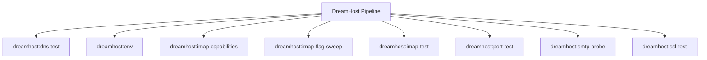

# DreamHost Spark Commands

## Overview

This README documents Spark commands under `app/Commands/DreamHost` and their operational dependencies.

## Operational Purpose

Provide operators and developers with command intent, dependencies, workflows, and recovery guidance.

## Command Inventory

- `dreamhost:dns-test` (Operational)
- `dreamhost:env` (Operational)
- `dreamhost:imap-capabilities` (Operational)
- `dreamhost:imap-flag-sweep` (Operational)
- `dreamhost:imap-test` (Operational)
- `dreamhost:port-test` (Operational)
- `dreamhost:smtp-probe` (Operational)
- `dreamhost:ssl-test` (Operational)

## Command Reference

### dreamhost:dns-test

**Purpose**  
Resolve DNS for a given host.

**Usage**  
`php spark dreamhost:dns-test`

**Options**  
None documented.

**Services Used**  
None detected.

**Models Used**  
None detected.

**Tables Used**  
None detected.

**External APIs**  
None detected.

**Related Commands**  
None detected.

**Expected Output**  
Command executes with status output and logs/errors based on runtime state.

**Example Execution**  
`php spark dreamhost:dns-test`

### dreamhost:env

**Purpose**  
Display relevant DreamHost environment variables.

**Usage**  
`php spark dreamhost:env`

**Options**  
None documented.

**Services Used**  
None detected.

**Models Used**  
None detected.

**Tables Used**  
None detected.

**External APIs**  
None detected.

**Related Commands**  
None detected.

**Expected Output**  
Command executes with status output and logs/errors based on runtime state.

**Example Execution**  
`php spark dreamhost:env`

### dreamhost:imap-capabilities

**Purpose**  
Probe IMAP greeting/capabilities/mailboxes and print detailed errors.

**Usage**  
`php spark dreamhost:imap-capabilities`

**Options**  
None documented.

**Services Used**  
None detected.

**Models Used**  
None detected.

**Tables Used**  
None detected.

**External APIs**  
None detected.

**Related Commands**  
None detected.

**Expected Output**  
Command executes with status output and logs/errors based on runtime state.

**Example Execution**  
`php spark dreamhost:imap-capabilities`

### dreamhost:imap-flag-sweep

**Purpose**  
Try multiple IMAP connection flag variants and report which one connects.

**Usage**  
`php spark dreamhost:imap-flag-sweep`

**Options**  
None documented.

**Services Used**  
None detected.

**Models Used**  
None detected.

**Tables Used**  
None detected.

**External APIs**  
None detected.

**Related Commands**  
None detected.

**Expected Output**  
Command executes with status output and logs/errors based on runtime state.

**Example Execution**  
`php spark dreamhost:imap-flag-sweep`

### dreamhost:imap-test

**Purpose**  
Test IMAP SSL connectivity to DreamHost mailbox.

**Usage**  
`php spark dreamhost:imap-test`

**Options**  
None documented.

**Services Used**  
None detected.

**Models Used**  
None detected.

**Tables Used**  
None detected.

**External APIs**  
None detected.

**Related Commands**  
None detected.

**Expected Output**  
Command executes with status output and logs/errors based on runtime state.

**Example Execution**  
`php spark dreamhost:imap-test`

### dreamhost:port-test

**Purpose**  
Test raw TCP connection to host:port.

**Usage**  
`php spark dreamhost:port-test`

**Options**  
None documented.

**Services Used**  
None detected.

**Models Used**  
None detected.

**Tables Used**  
None detected.

**External APIs**  
None detected.

**Related Commands**  
None detected.

**Expected Output**  
Command executes with status output and logs/errors based on runtime state.

**Example Execution**  
`php spark dreamhost:port-test`

### dreamhost:smtp-probe

**Purpose**  
Probe SMTP endpoints (465 SSL, 587 STARTTLS) and print handshake banner.

**Usage**  
`php spark dreamhost:smtp-probe`

**Options**  
None documented.

**Services Used**  
None detected.

**Models Used**  
None detected.

**Tables Used**  
None detected.

**External APIs**  
None detected.

**Related Commands**  
None detected.

**Expected Output**  
Command executes with status output and logs/errors based on runtime state.

**Example Execution**  
`php spark dreamhost:smtp-probe`

### dreamhost:ssl-test

**Purpose**  
Test raw SSL connection to a host/port.

**Usage**  
`php spark dreamhost:ssl-test`

**Options**  
None documented.

**Services Used**  
None detected.

**Models Used**  
None detected.

**Tables Used**  
None detected.

**External APIs**  
None detected.

**Related Commands**  
None detected.

**Expected Output**  
Command executes with status output and logs/errors based on runtime state.

**Example Execution**  
`php spark dreamhost:ssl-test`

## Dependencies

| Relationship | Target | Type |
|---|---|---|

## Command Dependency Graph

## Execution Workflows

- `php spark dreamhost:dns-test`
- `php spark dreamhost:env`
- `php spark dreamhost:imap-capabilities`
- `php spark dreamhost:imap-flag-sweep`
- `php spark dreamhost:imap-test`
- `php spark dreamhost:port-test`

## Operational Playbooks

**Investigate Application Failure**

- `php spark logs:doctor`
- `php spark ops:php:fpm:health`
- `php spark ops:server:nginx:status`
- `php spark spark:diagnose-503`

**Diagnose Database Issue**

- `php spark db:inventory`
- `php spark db:drift`
- `php spark aiops:sql:check`

## Troubleshooting

- Common failure: command not found in registry.
- Diagnostics: `php spark ops:commands:audit`, `php spark ops:commands:missing`.
- Recovery: repair namespace/PSR-4 and rerun command audit tools.

## Related Commands

## Console Registry Verification

- Console registry is auto-discovered in CI4; explicit `$commands` entries in `app/Config/Console.php` should be added for any commands that fail `ops:commands:missing`.
