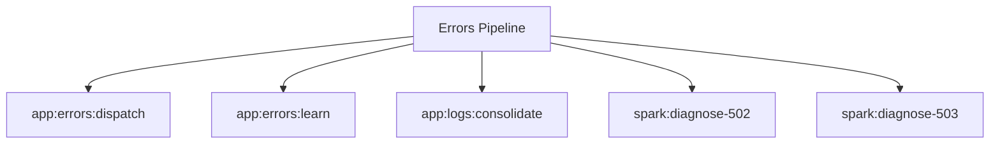

# Errors Spark Commands

## Overview

This README documents Spark commands under `app/Commands/Errors` and their operational dependencies.

## Operational Purpose

Provide operators and developers with command intent, dependencies, workflows, and recovery guidance.

## Command Inventory

- `app:errors:dispatch` (Operational)
- `app:errors:learn` (Operational)
- `app:logs:consolidate` (Operational)
- `spark:diagnose-502` (Diagnostic)
- `spark:diagnose-503` (Diagnostic)

## Command Reference

### app:errors:dispatch

**Purpose**  
Evaluate alert rules and send notifications.

**Usage**  
`php spark app:errors:dispatch`

**Options**  
None documented.

**Services Used**  
`App\Services\Observability\ErrorAlertService`

**Models Used**  
None detected.

**Tables Used**  
None detected.

**External APIs**  
None detected.

**Related Commands**  
None detected.

**Expected Output**  
Command executes with status output and logs/errors based on runtime state.

**Example Execution**  
`php spark app:errors:dispatch`

### app:errors:learn

**Purpose**  
AI-assisted learning of consolidated error patterns into bf_error_patterns.

**Usage**  
`php spark app:errors:learn`

**Options**  
None documented.

**Services Used**  
`App\Services\Observability\ErrorPatternLearnerService`

**Models Used**  
None detected.

**Tables Used**  
`bf_error_patterns`

**External APIs**  
None detected.

**Related Commands**  
None detected.

**Expected Output**  
Command executes with status output and logs/errors based on runtime state.

**Example Execution**  
`php spark app:errors:learn`

### app:logs:consolidate

**Purpose**  
Consolidate bf_error_logs into categorized grouped records.

**Usage**  
`php spark app:logs:consolidate`

**Options**  
None documented.

**Services Used**  
None detected.

**Models Used**  
None detected.

**Tables Used**  
`bf_error_processing_checkpoint`, `bf_error_logs`, `bf_error_consolidated_logs`, `categorized`, `ID`, `checkpoint`

**External APIs**  
None detected.

**Related Commands**  
None detected.

**Expected Output**  
Command executes with status output and logs/errors based on runtime state.

**Example Execution**  
`php spark app:logs:consolidate`

### spark:diagnose-502

**Purpose**  
Diagnose common 502 causes (php-fpm, nginx, socket).

**Usage**  
`php spark spark:diagnose-502`

**Options**  
None documented.

**Services Used**  
None detected.

**Models Used**  
None detected.

**Tables Used**  
None detected.

**External APIs**  
None detected.

**Related Commands**  
None detected.

**Expected Output**  
Command executes with status output and logs/errors based on runtime state.

**Example Execution**  
`php spark spark:diagnose-502`

### spark:diagnose-503

**Purpose**  
Diagnose common 503 causes (cache, maintenance, upstream).

**Usage**  
`php spark spark:diagnose-503`

**Options**  
None documented.

**Services Used**  
None detected.

**Models Used**  
None detected.

**Tables Used**  
None detected.

**External APIs**  
None detected.

**Related Commands**  
None detected.

**Expected Output**  
Command executes with status output and logs/errors based on runtime state.

**Example Execution**  
`php spark spark:diagnose-503`

## Dependencies

| Relationship | Target | Type |
|---|---|---|
| `app:errors:dispatch` | `App\Services\Observability\ErrorAlertService` | Command → Service |
| `app:errors:learn` | `App\Services\Observability\ErrorPatternLearnerService` | Command → Service |
| `app:errors:learn` | `bf_error_patterns` | Command → Table |
| `app:logs:consolidate` | `bf_error_processing_checkpoint` | Command → Table |
| `app:logs:consolidate` | `bf_error_logs` | Command → Table |
| `app:logs:consolidate` | `bf_error_consolidated_logs` | Command → Table |
| `app:logs:consolidate` | `categorized` | Command → Table |
| `app:logs:consolidate` | `ID` | Command → Table |

## Command Dependency Graph

## Execution Workflows

- `php spark app:errors:dispatch`
- `php spark app:errors:learn`
- `php spark app:logs:consolidate`
- `php spark spark:diagnose-502`
- `php spark spark:diagnose-503`

## Operational Playbooks

**Investigate Application Failure**

- `php spark logs:doctor`
- `php spark ops:php:fpm:health`
- `php spark ops:server:nginx:status`
- `php spark spark:diagnose-503`

**Diagnose Database Issue**

- `php spark db:inventory`
- `php spark db:drift`
- `php spark aiops:sql:check`

## Troubleshooting

- Common failure: command not found in registry.
- Diagnostics: `php spark ops:commands:audit`, `php spark ops:commands:missing`.
- Recovery: repair namespace/PSR-4 and rerun command audit tools.

## Related Commands

## Console Registry Verification

- Console registry is auto-discovered in CI4; explicit `$commands` entries in `app/Config/Console.php` should be added for any commands that fail `ops:commands:missing`.
