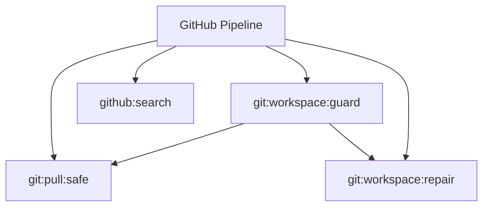

# GitHub Spark Commands

## Overview

This README documents Spark commands under `app/Commands/GitHub` and their operational dependencies.

## Operational Purpose

Provide operators and developers with command intent, dependencies, workflows, and recovery guidance.

## Command Inventory

- `git:pull:safe` (Operational)
- `git:workspace:guard` (Operational)
- `git:workspace:repair` (Maintenance)
- `github:search` (Operational)

## Command Reference

### git:pull:safe

**Purpose**  
Safely pull origin/main by stashing local changes and optionally resetting generated artifacts.

**Usage**  
`php spark git:pull:safe`

**Options**  
None documented.

**Services Used**  
None detected.

**Models Used**  
None detected.

**Tables Used**  
None detected.

**External APIs**  
`GitHub`

**Related Commands**  
None detected.

**Expected Output**  
Command executes with status output and logs/errors based on runtime state.

**Example Execution**  
`php spark git:pull:safe`

### git:workspace:guard

**Purpose**  
Detects workspace conditions that commonly block pulls/PRs.

**Usage**  
`php spark git:workspace:guard`

**Options**  
None documented.

**Services Used**  
None detected.

**Models Used**  
None detected.

**Tables Used**  
None detected.

**External APIs**  
`GitHub`

**Related Commands**  
`git:pull:safe`, `git:workspace:repair`

**Expected Output**  
Command executes with status output and logs/errors based on runtime state.

**Example Execution**  
`php spark git:workspace:guard`

### git:workspace:repair

**Purpose**  
Repairs git workspace when generated files block pull operations.

**Usage**  
`php spark git:workspace:repair`

**Options**  
None documented.

**Services Used**  
None detected.

**Models Used**  
None detected.

**Tables Used**  
None detected.

**External APIs**  
`GitHub`

**Related Commands**  
None detected.

**Expected Output**  
Command executes with status output and logs/errors based on runtime state.

**Example Execution**  
`php spark git:workspace:repair`

### github:search

**Purpose**  
Search the local git repository for a given string or pattern.

**Usage**  
`php spark github:search`

**Options**  
`--regex`, `Treat search text as regex`, `--ext`, `Comma-separated file extensions (e.g. php,env,md)`, `--path`, `Limit search to a subdirectory`

**Services Used**  
None detected.

**Models Used**  
None detected.

**Tables Used**  
None detected.

**External APIs**  
`GitHub`

**Related Commands**  
None detected.

**Expected Output**  
Command executes with status output and logs/errors based on runtime state.

**Example Execution**  
`php spark github:search`

## Dependencies

| Relationship | Target | Type |
|---|---|---|
| `git:pull:safe` | `GitHub` | Command → API |
| `git:workspace:guard` | `git:pull:safe` | Command → Command |
| `git:workspace:guard` | `git:workspace:repair` | Command → Command |
| `git:workspace:guard` | `GitHub` | Command → API |
| `git:workspace:repair` | `GitHub` | Command → API |
| `github:search` | `GitHub` | Command → API |

## Command Dependency Graph

## Execution Workflows

- `php spark git:pull:safe`
- `php spark git:workspace:guard`
- `php spark git:workspace:repair`
- `php spark github:search`

## Operational Playbooks

**Investigate Application Failure**

- `php spark logs:doctor`
- `php spark ops:php:fpm:health`
- `php spark ops:server:nginx:status`
- `php spark spark:diagnose-503`

**Diagnose Database Issue**

- `php spark db:inventory`
- `php spark db:drift`
- `php spark aiops:sql:check`

## Troubleshooting

- Common failure: command not found in registry.
- Diagnostics: `php spark ops:commands:audit`, `php spark ops:commands:missing`.
- Recovery: repair namespace/PSR-4 and rerun command audit tools.

## Related Commands

- `git:pull:safe`
- `git:workspace:repair`

## Console Registry Verification

- Console registry is auto-discovered in CI4; explicit `$commands` entries in `app/Config/Console.php` should be added for any commands that fail `ops:commands:missing`.
