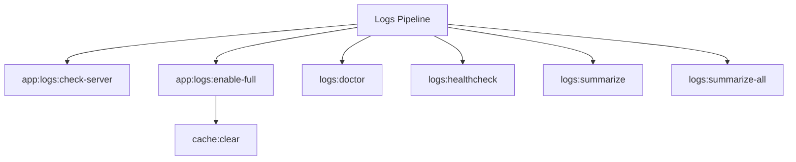

# Logs Spark Commands

## Overview

This README documents Spark commands under `app/Commands/Logs` and their operational dependencies.

## Operational Purpose

Provide operators and developers with command intent, dependencies, workflows, and recovery guidance.

## Command Inventory

- `app:logs:check-server` (Operational)
- `app:logs:enable-full` (Operational)
- `logs:doctor` (Diagnostic)
- `logs:healthcheck` (Diagnostic)
- `logs:summarize` (Operational)
- `logs:summarize-all` (Operational)

## Command Reference

### app:logs:check-server

**Purpose**  
Check external Apache/Nginx error.log

**Usage**  
`php spark app:logs:check-server`

**Options**  
None documented.

**Services Used**  
None detected.

**Models Used**  
None detected.

**Tables Used**  
None detected.

**External APIs**  
None detected.

**Related Commands**  
None detected.

**Expected Output**  
Command executes with status output and logs/errors based on runtime state.

**Example Execution**  
`php spark app:logs:check-server`

### app:logs:enable-full

**Purpose**  
Force CI4 to log all levels with DB + PHP fallback enabled.

**Usage**  
`php spark app:logs:enable-full`

**Options**  
None documented.

**Services Used**  
None detected.

**Models Used**  
None detected.

**Tables Used**  
None detected.

**External APIs**  
None detected.

**Related Commands**  
`cache:clear`

**Expected Output**  
Command executes with status output and logs/errors based on runtime state.

**Example Execution**  
`php spark app:logs:enable-full`

### logs:doctor

**Purpose**  
Validate CI4 logging and debug visibility plumbing.

**Usage**  
`php spark logs:doctor`

**Options**  
None documented.

**Services Used**  
None detected.

**Models Used**  
None detected.

**Tables Used**  
`bf_error_logs`

**External APIs**  
None detected.

**Related Commands**  
None detected.

**Expected Output**  
Command executes with status output and logs/errors based on runtime state.

**Example Execution**  
`php spark logs:doctor`

### logs:healthcheck

**Purpose**  
Emit test logs and verify file + DB log sinks are functioning.

**Usage**  
`php spark logs:healthcheck`

**Options**  
`--dry-run`, `Preview actions without writing data`

**Services Used**  
`App\Services\Spark\LogHealthcheckService`

**Models Used**  
None detected.

**Tables Used**  
None detected.

**External APIs**  
None detected.

**Related Commands**  
None detected.

**Expected Output**  
Command executes with status output and logs/errors based on runtime state.

**Example Execution**  
`php spark logs:healthcheck`

### logs:summarize

**Purpose**  
Summarize CI4 logs for a given date, including new entries since the last run.

**Usage**  
`php spark logs:summarize`

**Options**  
`--dry-run`, `Preview actions without writing data`, `--json`, `Output compact JSON payload for automation`, `--auto-aiops`, `After summarize, enqueue and run aiops:worker:logs pipeline`

**Services Used**  
`App\Services\Spark\LogSummarizeService`

**Models Used**  
None detected.

**Tables Used**  
`state`

**External APIs**  
None detected.

**Related Commands**  
None detected.

**Expected Output**  
Command executes with status output and logs/errors based on runtime state.

**Example Execution**  
`php spark logs:summarize`

### logs:summarize-all

**Purpose**  
Summarize logs for all known subsystems from writable/logs/** and emit docs/_aiops/logs markdown reports.

**Usage**  
`php spark logs:summarize-all`

**Options**  
`--json`, `Print JSON output in addition to files.`

**Services Used**  
None detected.

**Models Used**  
None detected.

**Tables Used**  
`writable`

**External APIs**  
None detected.

**Related Commands**  
None detected.

**Expected Output**  
Command executes with status output and logs/errors based on runtime state.

**Example Execution**  
`php spark logs:summarize-all`

## Dependencies

| Relationship | Target | Type |
|---|---|---|
| `app:logs:enable-full` | `cache:clear` | Command → Command |
| `logs:doctor` | `bf_error_logs` | Command → Table |
| `logs:healthcheck` | `App\Services\Spark\LogHealthcheckService` | Command → Service |
| `logs:summarize` | `App\Services\Spark\LogSummarizeService` | Command → Service |
| `logs:summarize` | `state` | Command → Table |
| `logs:summarize-all` | `writable` | Command → Table |

## Command Dependency Graph

## Execution Workflows

- `php spark app:logs:check-server`
- `php spark app:logs:enable-full`
- `php spark logs:doctor`
- `php spark logs:healthcheck`
- `php spark logs:summarize`
- `php spark logs:summarize-all`

## Operational Playbooks

**Investigate Application Failure**

- `php spark logs:doctor`
- `php spark ops:php:fpm:health`
- `php spark ops:server:nginx:status`
- `php spark spark:diagnose-503`

**Diagnose Database Issue**

- `php spark db:inventory`
- `php spark db:drift`
- `php spark aiops:sql:check`

## Troubleshooting

- Common failure: command not found in registry.
- Diagnostics: `php spark ops:commands:audit`, `php spark ops:commands:missing`.
- Recovery: repair namespace/PSR-4 and rerun command audit tools.

## Related Commands

- `cache:clear`

## Console Registry Verification

- Console registry is auto-discovered in CI4; explicit `$commands` entries in `app/Config/Console.php` should be added for any commands that fail `ops:commands:missing`.
