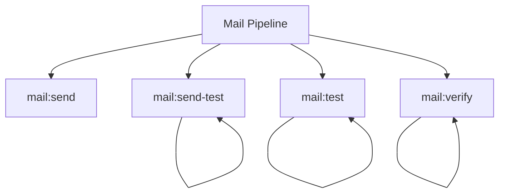

# Mail Spark Commands

## Overview

This README documents Spark commands under `app/Commands/Mail` and their operational dependencies.

## Operational Purpose

Provide operators and developers with command intent, dependencies, workflows, and recovery guidance.

## Command Inventory

- `mail:send` (Operational)
- `mail:send-test` (Operational)
- `mail:test` (Operational)
- `mail:verify` (Operational)

## Command Reference

### mail:send

**Purpose**  
Process and send queued mail jobs.

**Usage**  
`php spark mail:send`

**Options**  
`--dry-run`, `Preview actions without sending emails`, `--approve`, `Acknowledge and send queued emails`

**Services Used**  
`App\Services\MailService`

**Models Used**  
None detected.

**Tables Used**  
None detected.

**External APIs**  
None detected.

**Related Commands**  
None detected.

**Expected Output**  
Command executes with status output and logs/errors based on runtime state.

**Example Execution**  
`php spark mail:send`

### mail:send-test

**Purpose**  
Send a test email using branded templates.

**Usage**  
`php spark mail:send-test`

**Options**  
`--dry-run`, `Preview actions without sending email`

**Services Used**  
None detected.

**Models Used**  
None detected.

**Tables Used**  
None detected.

**External APIs**  
None detected.

**Related Commands**  
`mail:send-test`

**Expected Output**  
Command executes with status output and logs/errors based on runtime state.

**Example Execution**  
`php spark mail:send-test`

### mail:test

**Purpose**  
Send a DreamHost SMTP test email and output transport diagnostics.

**Usage**  
`php spark mail:test`

**Options**  
`--dry-run`, `Preview actions without sending email`

**Services Used**  
None detected.

**Models Used**  
None detected.

**Tables Used**  
None detected.

**External APIs**  
None detected.

**Related Commands**  
`mail:test`

**Expected Output**  
Command executes with status output and logs/errors based on runtime state.

**Example Execution**  
`php spark mail:test`

### mail:verify

**Purpose**  
Verify SMTP settings by sending a diagnostic email.

**Usage**  
`php spark mail:verify`

**Options**  
`--dry-run`, `Preview actions without sending email`

**Services Used**  
None detected.

**Models Used**  
None detected.

**Tables Used**  
None detected.

**External APIs**  
None detected.

**Related Commands**  
`mail:verify`

**Expected Output**  
Command executes with status output and logs/errors based on runtime state.

**Example Execution**  
`php spark mail:verify`

## Dependencies

| Relationship | Target | Type |
|---|---|---|
| `mail:send` | `App\Services\MailService` | Command → Service |
| `mail:send-test` | `mail:send-test` | Command → Command |
| `mail:test` | `mail:test` | Command → Command |
| `mail:verify` | `mail:verify` | Command → Command |

## Command Dependency Graph

## Execution Workflows

- `php spark mail:send`
- `php spark mail:send-test`
- `php spark mail:test`
- `php spark mail:verify`

## Operational Playbooks

**Investigate Application Failure**

- `php spark logs:doctor`
- `php spark ops:php:fpm:health`
- `php spark ops:server:nginx:status`
- `php spark spark:diagnose-503`

**Diagnose Database Issue**

- `php spark db:inventory`
- `php spark db:drift`
- `php spark aiops:sql:check`

## Troubleshooting

- Common failure: command not found in registry.
- Diagnostics: `php spark ops:commands:audit`, `php spark ops:commands:missing`.
- Recovery: repair namespace/PSR-4 and rerun command audit tools.

## Related Commands

- `mail:send-test`
- `mail:test`
- `mail:verify`

## Console Registry Verification

- Console registry is auto-discovered in CI4; explicit `$commands` entries in `app/Config/Console.php` should be added for any commands that fail `ops:commands:missing`.
