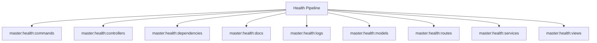

# Health Spark Commands

## Overview

This README documents Spark commands under `app/Commands/Master/Health` and their operational dependencies.

## Operational Purpose

Provide operators and developers with command intent, dependencies, workflows, and recovery guidance.

## Command Inventory

- `master:health:commands` (Diagnostic)
- `master:health:controllers` (Diagnostic)
- `master:health:dependencies` (Diagnostic)
- `master:health:docs` (Diagnostic)
- `master:health:logs` (Diagnostic)
- `master:health:models` (Diagnostic)
- `master:health:routes` (Diagnostic)
- `master:health:services` (Diagnostic)
- `master:health:views` (Diagnostic)

## Command Reference

### master:health:commands

**Purpose**  
Inspect Spark command inventory and metadata.

**Usage**  
`php spark master:health:commands`

**Options**  
None documented.

**Services Used**  
None detected.

**Models Used**  
None detected.

**Tables Used**  
None detected.

**External APIs**  
None detected.

**Related Commands**  
None detected.

**Expected Output**  
Command executes with status output and logs/errors based on runtime state.

**Example Execution**  
`php spark master:health:commands`

### master:health:controllers

**Purpose**  
Inspect controllers for basic CI4 health issues.

**Usage**  
`php spark master:health:controllers`

**Options**  
None documented.

**Services Used**  
None detected.

**Models Used**  
None detected.

**Tables Used**  
None detected.

**External APIs**  
None detected.

**Related Commands**  
None detected.

**Expected Output**  
Command executes with status output and logs/errors based on runtime state.

**Example Execution**  
`php spark master:health:controllers`

### master:health:dependencies

**Purpose**  
Inspect service(), model, and view dependency references across controllers.

**Usage**  
`php spark master:health:dependencies`

**Options**  
None documented.

**Services Used**  
None detected.

**Models Used**  
None detected.

**Tables Used**  
None detected.

**External APIs**  
None detected.

**Related Commands**  
None detected.

**Expected Output**  
Command executes with status output and logs/errors based on runtime state.

**Example Execution**  
`php spark master:health:dependencies`

### master:health:docs

**Purpose**  
Inspect docs directory health and summary coverage.

**Usage**  
`php spark master:health:docs`

**Options**  
None documented.

**Services Used**  
None detected.

**Models Used**  
None detected.

**Tables Used**  
None detected.

**External APIs**  
None detected.

**Related Commands**  
None detected.

**Expected Output**  
Command executes with status output and logs/errors based on runtime state.

**Example Execution**  
`php spark master:health:docs`

### master:health:logs

**Purpose**  
Inspect writable/logs for current log file health.

**Usage**  
`php spark master:health:logs`

**Options**  
None documented.

**Services Used**  
None detected.

**Models Used**  
None detected.

**Tables Used**  
None detected.

**External APIs**  
None detected.

**Related Commands**  
None detected.

**Expected Output**  
Command executes with status output and logs/errors based on runtime state.

**Example Execution**  
`php spark master:health:logs`

### master:health:models

**Purpose**  
Inspect models for table mapping and basic CI4 model metadata.

**Usage**  
`php spark master:health:models`

**Options**  
None documented.

**Services Used**  
None detected.

**Models Used**  
None detected.

**Tables Used**  
None detected.

**External APIs**  
None detected.

**Related Commands**  
None detected.

**Expected Output**  
Command executes with status output and logs/errors based on runtime state.

**Example Execution**  
`php spark master:health:models`

### master:health:routes

**Purpose**  
Inspect route configuration files and emit a health report.

**Usage**  
`php spark master:health:routes`

**Options**  
None documented.

**Services Used**  
None detected.

**Models Used**  
None detected.

**Tables Used**  
None detected.

**External APIs**  
None detected.

**Related Commands**  
None detected.

**Expected Output**  
Command executes with status output and logs/errors based on runtime state.

**Example Execution**  
`php spark master:health:routes`

### master:health:services

**Purpose**  
Inspect service classes and app/Config/Services.php references.

**Usage**  
`php spark master:health:services`

**Options**  
None documented.

**Services Used**  
None detected.

**Models Used**  
None detected.

**Tables Used**  
None detected.

**External APIs**  
None detected.

**Related Commands**  
None detected.

**Expected Output**  
Command executes with status output and logs/errors based on runtime state.

**Example Execution**  
`php spark master:health:services`

### master:health:views

**Purpose**  
Inspect views inventory and view directory health.

**Usage**  
`php spark master:health:views`

**Options**  
None documented.

**Services Used**  
None detected.

**Models Used**  
None detected.

**Tables Used**  
None detected.

**External APIs**  
None detected.

**Related Commands**  
None detected.

**Expected Output**  
Command executes with status output and logs/errors based on runtime state.

**Example Execution**  
`php spark master:health:views`

## Dependencies

| Relationship | Target | Type |
|---|---|---|

## Command Dependency Graph

## Execution Workflows

- `php spark master:health:commands`
- `php spark master:health:controllers`
- `php spark master:health:dependencies`
- `php spark master:health:docs`
- `php spark master:health:logs`
- `php spark master:health:models`

## Operational Playbooks

**Investigate Application Failure**

- `php spark logs:doctor`
- `php spark ops:php:fpm:health`
- `php spark ops:server:nginx:status`
- `php spark spark:diagnose-503`

**Diagnose Database Issue**

- `php spark db:inventory`
- `php spark db:drift`
- `php spark aiops:sql:check`

## Troubleshooting

- Common failure: command not found in registry.
- Diagnostics: `php spark ops:commands:audit`, `php spark ops:commands:missing`.
- Recovery: repair namespace/PSR-4 and rerun command audit tools.

## Related Commands

## Console Registry Verification

- Console registry is auto-discovered in CI4; explicit `$commands` entries in `app/Config/Console.php` should be added for any commands that fail `ops:commands:missing`.
