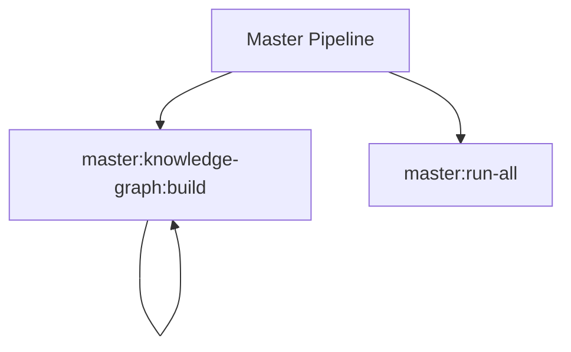

# Master Spark Commands

## Overview

This README documents Spark commands under `app/Commands/Master` and their operational dependencies.

## Operational Purpose

Provide operators and developers with command intent, dependencies, workflows, and recovery guidance.

## Command Inventory

- `master:knowledge-graph:build` (Operational)
- `master:run-all` (Automation)

## Command Reference

### master:knowledge-graph:build

**Purpose**  
Build a CI4 knowledge graph from controllers, routes, models, services, views, and commands.

**Usage**  
`php spark master:knowledge-graph:build`

**Options**  
None documented.

**Services Used**  
None detected.

**Models Used**  
None detected.

**Tables Used**  
`controllers`

**External APIs**  
None detected.

**Related Commands**  
`master:knowledge-graph:build`

**Expected Output**  
Command executes with status output and logs/errors based on runtime state.

**Example Execution**  
`php spark master:knowledge-graph:build`

### master:run-all

**Purpose**  
Run the master docs, graph, and health pipeline.

**Usage**  
`php spark master:run-all`

**Options**  
None documented.

**Services Used**  
None detected.

**Models Used**  
None detected.

**Tables Used**  
None detected.

**External APIs**  
None detected.

**Related Commands**  
None detected.

**Expected Output**  
Command executes with status output and logs/errors based on runtime state.

**Example Execution**  
`php spark master:run-all`

## Dependencies

| Relationship | Target | Type |
|---|---|---|
| `master:knowledge-graph:build` | `controllers` | Command → Table |
| `master:knowledge-graph:build` | `master:knowledge-graph:build` | Command → Command |

## Command Dependency Graph

## Execution Workflows

- `php spark master:knowledge-graph:build`
- `php spark master:run-all`

## Operational Playbooks

**Investigate Application Failure**

- `php spark logs:doctor`
- `php spark ops:php:fpm:health`
- `php spark ops:server:nginx:status`
- `php spark spark:diagnose-503`

**Diagnose Database Issue**

- `php spark db:inventory`
- `php spark db:drift`
- `php spark aiops:sql:check`

## Troubleshooting

- Common failure: command not found in registry.
- Diagnostics: `php spark ops:commands:audit`, `php spark ops:commands:missing`.
- Recovery: repair namespace/PSR-4 and rerun command audit tools.

## Related Commands

- `master:knowledge-graph:build`

## Console Registry Verification

- Console registry is auto-discovered in CI4; explicit `$commands` entries in `app/Config/Console.php` should be added for any commands that fail `ops:commands:missing`.
