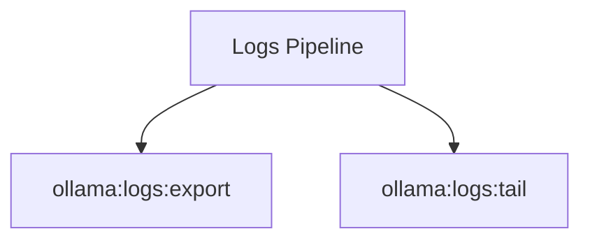

# Logs Spark Commands

## Overview

This README documents Spark commands under `app/Commands/Ollama/Logs` and their operational dependencies.

## Operational Purpose

Provide operators and developers with command intent, dependencies, workflows, and recovery guidance.

## Command Inventory

- `ollama:logs:export` (Operational)
- `ollama:logs:tail` (Operational)

Indirect/supporting commands:
- `aiops:status`
- `logs:doctor`

## Command Reference

### ollama:logs:export

**Purpose**  
Export Ollama run/error evidence to docs/_aiops/ollama/logs/*.md.

**Usage**  
`php spark ollama:logs:export`

**Options**  
`--limit`, `Rows to export`, `--path`, `Output directory`, `--json`, `JSON output`

**Services Used**  
None detected.

**Models Used**  
`App\Models\OllamaRunModel`

**Tables Used**  
None detected.

**External APIs**  
`Ollama`

**Related Commands**  
`aiops:status`, `logs:doctor`

**Expected Output**  
Command executes with status output and logs/errors based on runtime state.

**Example Execution**  
`php spark ollama:logs:export`

### ollama:logs:tail

**Purpose**  
Tail app-captured Ollama logs from file.

**Usage**  
`php spark ollama:logs:tail`

**Options**  
`--tail`, `Number of lines`, `--file`, `Override log file`, `--json`, `JSON output`

**Services Used**  
None detected.

**Models Used**  
None detected.

**Tables Used**  
`file`

**External APIs**  
`Ollama`

**Related Commands**  
`aiops:status`, `logs:doctor`

**Expected Output**  
Command executes with status output and logs/errors based on runtime state.

**Example Execution**  
`php spark ollama:logs:tail`

## Dependencies

| Relationship | Target | Type |
|---|---|---|
| `ollama:logs:export` | `App\Models\OllamaRunModel` | Command → Model |
| `ollama:logs:export` | `Ollama` | Command → API |
| `ollama:logs:tail` | `file` | Command → Table |
| `ollama:logs:tail` | `Ollama` | Command → API |

## Command Dependency Graph

## Execution Workflows

- `php spark ollama:logs:export`
- `php spark ollama:logs:tail`
- `php spark aiops:status`
- `php spark logs:doctor`

## Operational Playbooks

**Investigate Application Failure**

- `php spark logs:doctor`
- `php spark ops:php:fpm:health`
- `php spark ops:server:nginx:status`
- `php spark spark:diagnose-503`

**Diagnose Database Issue**

- `php spark db:inventory`
- `php spark db:drift`
- `php spark aiops:sql:check`

## Troubleshooting

- Common failure: command not found in registry.
- Diagnostics: `php spark ops:commands:audit`, `php spark ops:commands:missing`.
- Recovery: repair namespace/PSR-4 and rerun command audit tools.

## Related Commands

- `aiops:status`
- `logs:doctor`

## Console Registry Verification

- Console registry is auto-discovered in CI4; explicit `$commands` entries in `app/Config/Console.php` should be added for any commands that fail `ops:commands:missing`.
