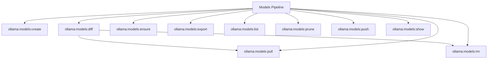

# Models Spark Commands

## Overview

This README documents Spark commands under `app/Commands/Ollama/Models` and their operational dependencies.

## Operational Purpose

Provide operators and developers with command intent, dependencies, workflows, and recovery guidance.

## Command Inventory

- `ollama:models:create` (Operational)
- `ollama:models:diff` (Operational)
- `ollama:models:ensure` (Operational)
- `ollama:models:export` (Operational)
- `ollama:models:list` (Operational)
- `ollama:models:prune` (Automation)
- `ollama:models:pull` (Operational)
- `ollama:models:push` (Operational)
- `ollama:models:rm` (Operational)
- `ollama:models:show` (Operational)

Indirect/supporting commands:
- `aiops:status`
- `logs:doctor`

## Command Reference

### ollama:models:create

**Purpose**  
Creates a model from Modelfile.

**Usage**  
`php spark ollama:models:create`

**Options**  
`--json`, `JSON output`, `--base-url`, `Override URL`, `--timeout`, `Timeout`, `--dry-run`, `Dry run where supported`

**Services Used**  
None detected.

**Models Used**  
None detected.

**Tables Used**  
`Modelfile`

**External APIs**  
`Ollama`

**Related Commands**  
`aiops:status`, `logs:doctor`

**Expected Output**  
Command executes with status output and logs/errors based on runtime state.

**Example Execution**  
`php spark ollama:models:create`

### ollama:models:diff

**Purpose**  
Compare installed model inventory versus required profile and emit remediation.

**Usage**  
`php spark ollama:models:diff`

**Options**  
`--profile`, `default|aiops|marketing|alerts`, `--base-url`, `Override URL`, `--timeout`, `Timeout seconds`, `--json`, `JSON output`

**Services Used**  
None detected.

**Models Used**  
None detected.

**Tables Used**  
None detected.

**External APIs**  
`Ollama`

**Related Commands**  
`ollama:models:pull`, `ollama:models:rm`

**Expected Output**  
Command executes with status output and logs/errors based on runtime state.

**Example Execution**  
`php spark ollama:models:diff`

### ollama:models:ensure

**Purpose**  
Ensures required models exist for a profile.

**Usage**  
`php spark ollama:models:ensure`

**Options**  
`--profile`, `default|aiops|marketing|alerts`, `--base-url`, `Override URL`, `--timeout`, `Timeout`, `--json`, `JSON output`

**Services Used**  
None detected.

**Models Used**  
None detected.

**Tables Used**  
None detected.

**External APIs**  
`Ollama`

**Related Commands**  
`aiops:status`, `logs:doctor`

**Expected Output**  
Command executes with status output and logs/errors based on runtime state.

**Example Execution**  
`php spark ollama:models:ensure`

### ollama:models:export

**Purpose**  
Exports model inventory for docs or DB.

**Usage**  
`php spark ollama:models:export`

**Options**  
`--json`, `JSON output`, `--base-url`, `Override URL`, `--timeout`, `Timeout`, `--dry-run`, `Dry run where supported`

**Services Used**  
None detected.

**Models Used**  
None detected.

**Tables Used**  
None detected.

**External APIs**  
`Ollama`

**Related Commands**  
`aiops:status`, `logs:doctor`

**Expected Output**  
Command executes with status output and logs/errors based on runtime state.

**Example Execution**  
`php spark ollama:models:export`

### ollama:models:list

**Purpose**  
Lists installed Ollama models.

**Usage**  
`php spark ollama:models:list`

**Options**  
`--base-url`, `Override URL`, `--timeout`, `Timeout`, `--json`, `JSON output`

**Services Used**  
None detected.

**Models Used**  
None detected.

**Tables Used**  
None detected.

**External APIs**  
`Ollama`

**Related Commands**  
`aiops:status`, `logs:doctor`

**Expected Output**  
Command executes with status output and logs/errors based on runtime state.

**Example Execution**  
`php spark ollama:models:list`

### ollama:models:prune

**Purpose**  
Prunes models based on simple keep allowlist policy.

**Usage**  
`php spark ollama:models:prune`

**Options**  
`--keep`, `Comma list of models to keep`, `--dry-run`, `Dry run`, `--base-url`, `Override URL`, `--timeout`, `Timeout`, `--json`, `JSON output`

**Services Used**  
None detected.

**Models Used**  
None detected.

**Tables Used**  
None detected.

**External APIs**  
`Ollama`

**Related Commands**  
`aiops:status`, `logs:doctor`

**Expected Output**  
Command executes with status output and logs/errors based on runtime state.

**Example Execution**  
`php spark ollama:models:prune`

### ollama:models:pull

**Purpose**  
Pulls a model with optional progress stream flag.

**Usage**  
`php spark ollama:models:pull`

**Options**  
`--progress`, `Enable streaming progress`, `--base-url`, `Override URL`, `--timeout`, `Timeout`, `--json`, `JSON output`, `--dry-run`, `Dry run`

**Services Used**  
None detected.

**Models Used**  
None detected.

**Tables Used**  
None detected.

**External APIs**  
`Ollama`

**Related Commands**  
`aiops:status`, `logs:doctor`

**Expected Output**  
Command executes with status output and logs/errors based on runtime state.

**Example Execution**  
`php spark ollama:models:pull`

### ollama:models:push

**Purpose**  
Pushes a model to registry.

**Usage**  
`php spark ollama:models:push`

**Options**  
`--json`, `JSON output`, `--base-url`, `Override URL`, `--timeout`, `Timeout`, `--dry-run`, `Dry run where supported`

**Services Used**  
None detected.

**Models Used**  
None detected.

**Tables Used**  
None detected.

**External APIs**  
`Ollama`

**Related Commands**  
`aiops:status`, `logs:doctor`

**Expected Output**  
Command executes with status output and logs/errors based on runtime state.

**Example Execution**  
`php spark ollama:models:push`

### ollama:models:rm

**Purpose**  
Removes a local model.

**Usage**  
`php spark ollama:models:rm`

**Options**  
`--force`, `Required to execute`, `--dry-run`, `Dry run`, `--base-url`, `Override URL`, `--timeout`, `Timeout`, `--json`, `JSON output`

**Services Used**  
None detected.

**Models Used**  
None detected.

**Tables Used**  
None detected.

**External APIs**  
`Ollama`

**Related Commands**  
`aiops:status`, `logs:doctor`

**Expected Output**  
Command executes with status output and logs/errors based on runtime state.

**Example Execution**  
`php spark ollama:models:rm`

### ollama:models:show

**Purpose**  
Shows metadata for one model.

**Usage**  
`php spark ollama:models:show`

**Options**  
`--base-url`, `Override URL`, `--timeout`, `Timeout`, `--json`, `JSON output`

**Services Used**  
None detected.

**Models Used**  
None detected.

**Tables Used**  
None detected.

**External APIs**  
`Ollama`

**Related Commands**  
`aiops:status`, `logs:doctor`

**Expected Output**  
Command executes with status output and logs/errors based on runtime state.

**Example Execution**  
`php spark ollama:models:show`

## Dependencies

| Relationship | Target | Type |
|---|---|---|
| `ollama:models:create` | `Modelfile` | Command → Table |
| `ollama:models:create` | `Ollama` | Command → API |
| `ollama:models:diff` | `ollama:models:pull` | Command → Command |
| `ollama:models:diff` | `ollama:models:rm` | Command → Command |
| `ollama:models:diff` | `Ollama` | Command → API |
| `ollama:models:ensure` | `Ollama` | Command → API |
| `ollama:models:export` | `Ollama` | Command → API |
| `ollama:models:list` | `Ollama` | Command → API |
| `ollama:models:prune` | `Ollama` | Command → API |
| `ollama:models:pull` | `Ollama` | Command → API |
| `ollama:models:push` | `Ollama` | Command → API |
| `ollama:models:rm` | `Ollama` | Command → API |
| `ollama:models:show` | `Ollama` | Command → API |

## Command Dependency Graph

## Execution Workflows

- `php spark ollama:models:create`
- `php spark ollama:models:diff`
- `php spark ollama:models:ensure`
- `php spark ollama:models:export`
- `php spark ollama:models:list`
- `php spark ollama:models:prune`
- `php spark aiops:status`
- `php spark logs:doctor`

## Operational Playbooks

**Investigate Application Failure**

- `php spark logs:doctor`
- `php spark ops:php:fpm:health`
- `php spark ops:server:nginx:status`
- `php spark spark:diagnose-503`

**Diagnose Database Issue**

- `php spark db:inventory`
- `php spark db:drift`
- `php spark aiops:sql:check`

## Troubleshooting

- Common failure: command not found in registry.
- Diagnostics: `php spark ops:commands:audit`, `php spark ops:commands:missing`.
- Recovery: repair namespace/PSR-4 and rerun command audit tools.

## Related Commands

- `aiops:status`
- `logs:doctor`
- `ollama:models:pull`
- `ollama:models:rm`

## Console Registry Verification

- Console registry is auto-discovered in CI4; explicit `$commands` entries in `app/Config/Console.php` should be added for any commands that fail `ops:commands:missing`.
