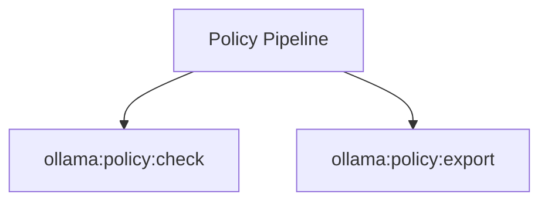

# Policy Spark Commands

## Overview

This README documents Spark commands under `app/Commands/Ollama/Policy` and their operational dependencies.

## Operational Purpose

Provide operators and developers with command intent, dependencies, workflows, and recovery guidance.

## Command Inventory

- `ollama:policy:check` (Operational)
- `ollama:policy:export` (Operational)

Indirect/supporting commands:
- `aiops:status`
- `logs:doctor`

## Command Reference

### ollama:policy:check

**Purpose**  
Validates current governance profile and limits.

**Usage**  
`php spark ollama:policy:check`

**Options**  
`--profile`, `Profile name`, `--json`, `JSON output`

**Services Used**  
None detected.

**Models Used**  
None detected.

**Tables Used**  
None detected.

**External APIs**  
`Ollama`

**Related Commands**  
`aiops:status`, `logs:doctor`

**Expected Output**  
Command executes with status output and logs/errors based on runtime state.

**Example Execution**  
`php spark ollama:policy:check`

### ollama:policy:export

**Purpose**  
Exports active policy to docs.

**Usage**  
`php spark ollama:policy:export`

**Options**  
`--json`, `JSON output`, `--base-url`, `Override URL`, `--timeout`, `Timeout`, `--dry-run`, `Dry run where supported`

**Services Used**  
None detected.

**Models Used**  
None detected.

**Tables Used**  
None detected.

**External APIs**  
`Ollama`

**Related Commands**  
`aiops:status`, `logs:doctor`

**Expected Output**  
Command executes with status output and logs/errors based on runtime state.

**Example Execution**  
`php spark ollama:policy:export`

## Dependencies

| Relationship | Target | Type |
|---|---|---|
| `ollama:policy:check` | `Ollama` | Command → API |
| `ollama:policy:export` | `Ollama` | Command → API |

## Command Dependency Graph

## Execution Workflows

- `php spark ollama:policy:check`
- `php spark ollama:policy:export`
- `php spark aiops:status`
- `php spark logs:doctor`

## Operational Playbooks

**Investigate Application Failure**

- `php spark logs:doctor`
- `php spark ops:php:fpm:health`
- `php spark ops:server:nginx:status`
- `php spark spark:diagnose-503`

**Diagnose Database Issue**

- `php spark db:inventory`
- `php spark db:drift`
- `php spark aiops:sql:check`

## Troubleshooting

- Common failure: command not found in registry.
- Diagnostics: `php spark ops:commands:audit`, `php spark ops:commands:missing`.
- Recovery: repair namespace/PSR-4 and rerun command audit tools.

## Related Commands

- `aiops:status`
- `logs:doctor`

## Console Registry Verification

- Console registry is auto-discovered in CI4; explicit `$commands` entries in `app/Config/Console.php` should be added for any commands that fail `ops:commands:missing`.
