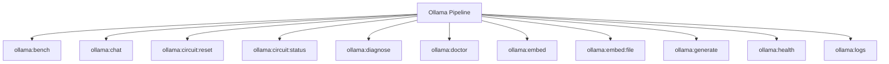

# Ollama Spark Commands

## Overview

This README documents Spark commands under `app/Commands/Ollama` and their operational dependencies.

## Operational Purpose

Provide operators and developers with command intent, dependencies, workflows, and recovery guidance.

## Command Inventory

- `BaseOllamaCommand` (Experimental)
- `ollama:bench` (Operational)
- `ollama:chat` (Operational)
- `ollama:circuit:reset` (Operational)
- `ollama:circuit:status` (Operational)
- `ollama:diagnose` (Diagnostic)
- `ollama:doctor` (Diagnostic)
- `ollama:embed` (Operational)
- `ollama:embed:file` (Operational)
- `ollama:generate` (Maintenance)
- `ollama:health` (Diagnostic)
- `ollama:logs` (Operational)
- `ollama:ping` (Operational)
- `ollama:rag:query` (Operational)
- `ollama:stream` (Operational)
- `ollama:version` (Operational)

Indirect/supporting commands:
- `aiops:status`
- `logs:doctor`

## Command Reference

### N/A

**Purpose**  
No description provided.

**Usage**  
`N/A`

**Options**  
None documented.

**Services Used**  
`App\Services\LLM\OllamaClient`

**Models Used**  
`App\Models\OllamaRunModel`

**Tables Used**  
None detected.

**External APIs**  
`Ollama`

**Related Commands**  
`aiops:status`, `logs:doctor`

**Expected Output**  
Command executes with status output and logs/errors based on runtime state.

**Example Execution**  
`N/A`

### ollama:bench

**Purpose**  
Benchmarks latency and throughput for prompt set.

**Usage**  
`php spark ollama:bench`

**Options**  
`--json`, `JSON output`, `--base-url`, `Override URL`, `--timeout`, `Timeout`, `--dry-run`, `Dry run where supported`

**Services Used**  
None detected.

**Models Used**  
None detected.

**Tables Used**  
None detected.

**External APIs**  
`Ollama`

**Related Commands**  
`aiops:status`, `logs:doctor`

**Expected Output**  
Command executes with status output and logs/errors based on runtime state.

**Example Execution**  
`php spark ollama:bench`

### ollama:chat

**Purpose**  
Chat completion with optional session persistence.

**Usage**  
`php spark ollama:chat`

**Options**  
`--model`, `Model`, `--session`, `Session ID`, `--system`, `System prompt`, `--user`, `User message`, `--save-session`, `Persist session`, `--load-session`, `Load existing session`, `--reset`, `Reset session`, `--base-url`, `URL`, `--timeout`, `Timeout`, `--json`, `JSON output`

**Services Used**  
None detected.

**Models Used**  
`App\Models\OllamaSessionModel`

**Tables Used**  
None detected.

**External APIs**  
`Ollama`

**Related Commands**  
`aiops:status`, `logs:doctor`

**Expected Output**  
Command executes with status output and logs/errors based on runtime state.

**Example Execution**  
`php spark ollama:chat`

### ollama:circuit:reset

**Purpose**  
Resets Ollama circuit breaker.

**Usage**  
`php spark ollama:circuit:reset`

**Options**  
None documented.

**Services Used**  
`App\Services\LLM\OllamaCircuitBreaker`

**Models Used**  
None detected.

**Tables Used**  
None detected.

**External APIs**  
`Ollama`

**Related Commands**  
`aiops:status`, `logs:doctor`

**Expected Output**  
Command executes with status output and logs/errors based on runtime state.

**Example Execution**  
`php spark ollama:circuit:reset`

### ollama:circuit:status

**Purpose**  
Shows Ollama circuit breaker state.

**Usage**  
`php spark ollama:circuit:status`

**Options**  
None documented.

**Services Used**  
`App\Services\LLM\OllamaCircuitBreaker`

**Models Used**  
None detected.

**Tables Used**  
None detected.

**External APIs**  
`Ollama`

**Related Commands**  
`aiops:status`, `logs:doctor`

**Expected Output**  
Command executes with status output and logs/errors based on runtime state.

**Example Execution**  
`php spark ollama:circuit:status`

### ollama:diagnose

**Purpose**  
Operator diagnostic report for Ollama connectivity and env.

**Usage**  
`php spark ollama:diagnose`

**Options**  
`--base-url`, `Override URL`, `--timeout`, `Timeout`, `--include-env`, `Include env snapshot`, `--json`, `JSON output`

**Services Used**  
None detected.

**Models Used**  
None detected.

**Tables Used**  
None detected.

**External APIs**  
`Ollama`

**Related Commands**  
`aiops:status`, `logs:doctor`

**Expected Output**  
Command executes with status output and logs/errors based on runtime state.

**Example Execution**  
`php spark ollama:diagnose`

### ollama:doctor

**Purpose**  
Deep diagnostics for Ollama connectivity and runtime hints.

**Usage**  
`php spark ollama:doctor`

**Options**  
`--base-url`, `Override URL`, `--timeout`, `Timeout seconds`, `--json`, `JSON output`, `--include-env`, `Include relevant env values`

**Services Used**  
None detected.

**Models Used**  
None detected.

**Tables Used**  
None detected.

**External APIs**  
`Ollama`

**Related Commands**  
`aiops:status`, `logs:doctor`

**Expected Output**  
Command executes with status output and logs/errors based on runtime state.

**Example Execution**  
`php spark ollama:doctor`

### ollama:embed

**Purpose**  
Generates embedding vector for input text.

**Usage**  
`php spark ollama:embed`

**Options**  
`--model`, `Model`, `--input`, `Text input`, `--base-url`, `URL`, `--timeout`, `Timeout`, `--json`, `JSON output`

**Services Used**  
None detected.

**Models Used**  
None detected.

**Tables Used**  
None detected.

**External APIs**  
`Ollama`

**Related Commands**  
`aiops:status`, `logs:doctor`

**Expected Output**  
Command executes with status output and logs/errors based on runtime state.

**Example Execution**  
`php spark ollama:embed`

### ollama:embed:file

**Purpose**  
Embeds file chunks into vector storage.

**Usage**  
`php spark ollama:embed:file`

**Options**  
`--json`, `JSON output`, `--base-url`, `Override URL`, `--timeout`, `Timeout`, `--dry-run`, `Dry run where supported`

**Services Used**  
None detected.

**Models Used**  
None detected.

**Tables Used**  
`vector`

**External APIs**  
`Ollama`

**Related Commands**  
`aiops:status`, `logs:doctor`

**Expected Output**  
Command executes with status output and logs/errors based on runtime state.

**Example Execution**  
`php spark ollama:embed:file`

### ollama:generate

**Purpose**  
Runs single prompt generate against Ollama.

**Usage**  
`php spark ollama:generate`

**Options**  
`--model`, `Model name`, `--prompt`, `Prompt text`, `--stream`, `Stream mode`, `--temperature`, `Temperature`, `--top-p`, `Top-p`, `--max-tokens`, `Max tokens`, `--base-url`, `Override URL`, `--timeout`, `Timeout`, `--json`, `JSON output`

**Services Used**  
`App\Services\LLM\OllamaCircuitBreaker`

**Models Used**  
None detected.

**Tables Used**  
None detected.

**External APIs**  
`Ollama`

**Related Commands**  
`aiops:status`, `logs:doctor`

**Expected Output**  
Command executes with status output and logs/errors based on runtime state.

**Example Execution**  
`php spark ollama:generate`

### ollama:health

**Purpose**  
Checks endpoint reachability and readiness.

**Usage**  
`php spark ollama:health`

**Options**  
`--base-url`, `Override base URL`, `--timeout`, `Timeout seconds`, `--json`, `JSON output`

**Services Used**  
None detected.

**Models Used**  
None detected.

**Tables Used**  
None detected.

**External APIs**  
`Ollama`

**Related Commands**  
`aiops:status`, `logs:doctor`

**Expected Output**  
Command executes with status output and logs/errors based on runtime state.

**Example Execution**  
`php spark ollama:health`

### ollama:logs

**Purpose**  
Backward-compatible alias of ollama:logs:tail.

**Usage**  
`php spark ollama:logs`

**Options**  
`--tail`, `Lines`, `--file`, `File`, `--json`, `JSON output`

**Services Used**  
None detected.

**Models Used**  
None detected.

**Tables Used**  
None detected.

**External APIs**  
`Ollama`

**Related Commands**  
`aiops:status`, `logs:doctor`

**Expected Output**  
Command executes with status output and logs/errors based on runtime state.

**Example Execution**  
`php spark ollama:logs`

### ollama:ping

**Purpose**  
Low-level ping with retries.

**Usage**  
`php spark ollama:ping`

**Options**  
`--retries`, `Retry count`, `--sleep-ms`, `Sleep between retries`, `--base-url`, `Override URL`, `--timeout`, `Timeout`, `--json`, `JSON output`

**Services Used**  
None detected.

**Models Used**  
None detected.

**Tables Used**  
None detected.

**External APIs**  
`Ollama`

**Related Commands**  
`aiops:status`, `logs:doctor`

**Expected Output**  
Command executes with status output and logs/errors based on runtime state.

**Example Execution**  
`php spark ollama:ping`

### ollama:rag:query

**Purpose**  
Retrieves top-k chunks and optional answer.

**Usage**  
`php spark ollama:rag:query`

**Options**  
`--json`, `JSON output`, `--base-url`, `Override URL`, `--timeout`, `Timeout`, `--dry-run`, `Dry run where supported`

**Services Used**  
None detected.

**Models Used**  
None detected.

**Tables Used**  
None detected.

**External APIs**  
`Ollama`

**Related Commands**  
`aiops:status`, `logs:doctor`

**Expected Output**  
Command executes with status output and logs/errors based on runtime state.

**Example Execution**  
`php spark ollama:rag:query`

### ollama:stream

**Purpose**  
Streams tokens to console and transcript output.

**Usage**  
`php spark ollama:stream`

**Options**  
`--json`, `JSON output`, `--base-url`, `Override URL`, `--timeout`, `Timeout`, `--dry-run`, `Dry run where supported`

**Services Used**  
None detected.

**Models Used**  
None detected.

**Tables Used**  
None detected.

**External APIs**  
`Ollama`

**Related Commands**  
`aiops:status`, `logs:doctor`

**Expected Output**  
Command executes with status output and logs/errors based on runtime state.

**Example Execution**  
`php spark ollama:stream`

### ollama:version

**Purpose**  
Reports Ollama version info from health endpoint.

**Usage**  
`php spark ollama:version`

**Options**  
`--base-url`, `Override base URL`, `--timeout`, `Timeout seconds`, `--json`, `JSON output`

**Services Used**  
None detected.

**Models Used**  
None detected.

**Tables Used**  
`health`

**External APIs**  
`Ollama`

**Related Commands**  
`aiops:status`, `logs:doctor`

**Expected Output**  
Command executes with status output and logs/errors based on runtime state.

**Example Execution**  
`php spark ollama:version`

## Dependencies

| Relationship | Target | Type |
|---|---|---|
| `ollama:bench` | `Ollama` | Command → API |
| `ollama:chat` | `App\Models\OllamaSessionModel` | Command → Model |
| `ollama:chat` | `Ollama` | Command → API |
| `ollama:circuit:reset` | `App\Services\LLM\OllamaCircuitBreaker` | Command → Service |
| `ollama:circuit:reset` | `Ollama` | Command → API |
| `ollama:circuit:status` | `App\Services\LLM\OllamaCircuitBreaker` | Command → Service |
| `ollama:circuit:status` | `Ollama` | Command → API |
| `ollama:diagnose` | `Ollama` | Command → API |
| `ollama:doctor` | `Ollama` | Command → API |
| `ollama:embed` | `Ollama` | Command → API |
| `ollama:embed:file` | `vector` | Command → Table |
| `ollama:embed:file` | `Ollama` | Command → API |
| `ollama:generate` | `App\Services\LLM\OllamaCircuitBreaker` | Command → Service |
| `ollama:generate` | `Ollama` | Command → API |
| `ollama:health` | `Ollama` | Command → API |
| `ollama:logs` | `Ollama` | Command → API |
| `ollama:ping` | `Ollama` | Command → API |
| `ollama:rag:query` | `Ollama` | Command → API |
| `ollama:stream` | `Ollama` | Command → API |
| `ollama:version` | `health` | Command → Table |
| `ollama:version` | `Ollama` | Command → API |

## Command Dependency Graph

## Execution Workflows

- `php spark ollama:bench`
- `php spark ollama:chat`
- `php spark ollama:circuit:reset`
- `php spark ollama:circuit:status`
- `php spark ollama:diagnose`
- `php spark aiops:status`
- `php spark logs:doctor`

## Operational Playbooks

**Investigate Application Failure**

- `php spark logs:doctor`
- `php spark ops:php:fpm:health`
- `php spark ops:server:nginx:status`
- `php spark spark:diagnose-503`

**Diagnose Database Issue**

- `php spark db:inventory`
- `php spark db:drift`
- `php spark aiops:sql:check`

## Troubleshooting

- Common failure: command not found in registry.
- Diagnostics: `php spark ops:commands:audit`, `php spark ops:commands:missing`.
- Recovery: repair namespace/PSR-4 and rerun command audit tools.

## Related Commands

- `aiops:status`
- `logs:doctor`

## Console Registry Verification

- Console registry is auto-discovered in CI4; explicit `$commands` entries in `app/Config/Console.php` should be added for any commands that fail `ops:commands:missing`.
