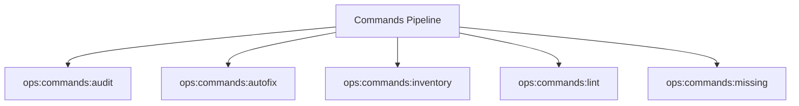

# Commands Spark Commands

## Overview

This README documents Spark commands under `app/Commands/Ops/Commands` and their operational dependencies.

## Operational Purpose

Provide operators and developers with command intent, dependencies, workflows, and recovery guidance.

## Command Inventory

- `ops:commands:audit` (Diagnostic)
- `ops:commands:autofix` (Automation)
- `ops:commands:inventory` (Operational)
- `ops:commands:lint` (Operational)
- `ops:commands:missing` (Operational)

## Command Reference

### ops:commands:audit

**Purpose**  
Audit Spark commands for illegal constructors.

**Usage**  
`php spark ops:commands:audit`

**Options**  
`--json`, `Emit JSON output and write docs/_ops/commands-audit/ops-commands-audit.json`

**Services Used**  
None detected.

**Models Used**  
None detected.

**Tables Used**  
None detected.

**External APIs**  
None detected.

**Related Commands**  
None detected.

**Expected Output**  
Command executes with status output and logs/errors based on runtime state.

**Example Execution**  
`php spark ops:commands:audit`

### ops:commands:autofix

**Purpose**  
Auto-fix Spark commands that define illegal constructors.

**Usage**  
`php spark ops:commands:autofix`

**Options**  
`--dry-run`, `Preview changes without modifying files (default)`, `--approve`, `Apply fixes and write updated files`

**Services Used**  
None detected.

**Models Used**  
None detected.

**Tables Used**  
None detected.

**External APIs**  
None detected.

**Related Commands**  
None detected.

**Expected Output**  
Command executes with status output and logs/errors based on runtime state.

**Example Execution**  
`php spark ops:commands:autofix`

### ops:commands:inventory

**Purpose**  
Generate Spark command inventory from Console.php and command files.

**Usage**  
`php spark ops:commands:inventory`

**Options**  
`--emit`, `Output mode: docs (default: docs).`, `--out`, `Override artifact directory (must be inside docs/aiops/artifacts).`, `--dry-run`, `Generate a report without mutating state.`, `--approve`, `Acknowledge execution (required for mutating commands).`

**Services Used**  
None detected.

**Models Used**  
None detected.

**Tables Used**  
`Console`

**External APIs**  
None detected.

**Related Commands**  
None detected.

**Expected Output**  
Command executes with status output and logs/errors based on runtime state.

**Example Execution**  
`php spark ops:commands:inventory`

### ops:commands:lint

**Purpose**  
Lint Spark commands for runtime safety contracts and documentation coverage.

**Usage**  
`php spark ops:commands:lint`

**Options**  
`--json`, `Emit JSON results to stdout`

**Services Used**  
None detected.

**Models Used**  
None detected.

**Tables Used**  
None detected.

**External APIs**  
None detected.

**Related Commands**  
None detected.

**Expected Output**  
Command executes with status output and logs/errors based on runtime state.

**Example Execution**  
`php spark ops:commands:lint`

### ops:commands:missing

**Purpose**  
Check commands missing from Console registry

**Usage**  
`php spark ops:commands:missing`

**Options**  
None documented.

**Services Used**  
None detected.

**Models Used**  
None detected.

**Tables Used**  
`Console`

**External APIs**  
None detected.

**Related Commands**  
None detected.

**Expected Output**  
Command executes with status output and logs/errors based on runtime state.

**Example Execution**  
`php spark ops:commands:missing`

## Dependencies

| Relationship | Target | Type |
|---|---|---|
| `ops:commands:inventory` | `Console` | Command → Table |
| `ops:commands:missing` | `Console` | Command → Table |

## Command Dependency Graph

## Execution Workflows

- `php spark ops:commands:audit`
- `php spark ops:commands:autofix`
- `php spark ops:commands:inventory`
- `php spark ops:commands:lint`
- `php spark ops:commands:missing`

## Operational Playbooks

**Investigate Application Failure**

- `php spark logs:doctor`
- `php spark ops:php:fpm:health`
- `php spark ops:server:nginx:status`
- `php spark spark:diagnose-503`

**Diagnose Database Issue**

- `php spark db:inventory`
- `php spark db:drift`
- `php spark aiops:sql:check`

## Troubleshooting

- Common failure: command not found in registry.
- Diagnostics: `php spark ops:commands:audit`, `php spark ops:commands:missing`.
- Recovery: repair namespace/PSR-4 and rerun command audit tools.

## Related Commands

## Console Registry Verification

- Console registry is auto-discovered in CI4; explicit `$commands` entries in `app/Config/Console.php` should be added for any commands that fail `ops:commands:missing`.
