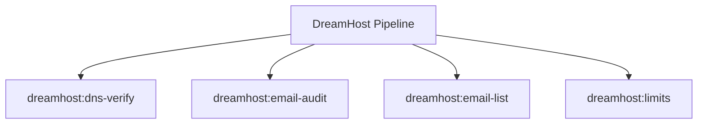

# DreamHost Spark Commands

## Overview

This README documents Spark commands under `app/Commands/Ops/DreamHost` and their operational dependencies.

## Operational Purpose

Provide operators and developers with command intent, dependencies, workflows, and recovery guidance.

## Command Inventory

- `dreamhost:dns-verify` (Operational)
- `dreamhost:email-audit` (Diagnostic)
- `dreamhost:email-list` (Operational)
- `dreamhost:limits` (Operational)

## Command Reference

### dreamhost:dns-verify

**Purpose**  
Ops helper command: dreamhost:dns-verify

**Usage**  
`php spark dreamhost:dns-verify`

**Options**  
None documented.

**Services Used**  
`App\Services\Ops\DreamHostService`

**Models Used**  
None detected.

**Tables Used**  
None detected.

**External APIs**  
None detected.

**Related Commands**  
None detected.

**Expected Output**  
Command executes with status output and logs/errors based on runtime state.

**Example Execution**  
`php spark dreamhost:dns-verify`

### dreamhost:email-audit

**Purpose**  
Ops helper command: dreamhost:email-audit

**Usage**  
`php spark dreamhost:email-audit`

**Options**  
None documented.

**Services Used**  
`App\Services\Ops\DreamHostService`

**Models Used**  
None detected.

**Tables Used**  
None detected.

**External APIs**  
None detected.

**Related Commands**  
None detected.

**Expected Output**  
Command executes with status output and logs/errors based on runtime state.

**Example Execution**  
`php spark dreamhost:email-audit`

### dreamhost:email-list

**Purpose**  
Ops helper command: dreamhost:email-list

**Usage**  
`php spark dreamhost:email-list`

**Options**  
None documented.

**Services Used**  
`App\Services\Ops\DreamHostService`

**Models Used**  
None detected.

**Tables Used**  
None detected.

**External APIs**  
None detected.

**Related Commands**  
None detected.

**Expected Output**  
Command executes with status output and logs/errors based on runtime state.

**Example Execution**  
`php spark dreamhost:email-list`

### dreamhost:limits

**Purpose**  
Ops helper command: dreamhost:limits

**Usage**  
`php spark dreamhost:limits`

**Options**  
None documented.

**Services Used**  
`App\Services\Ops\DreamHostService`

**Models Used**  
None detected.

**Tables Used**  
None detected.

**External APIs**  
None detected.

**Related Commands**  
None detected.

**Expected Output**  
Command executes with status output and logs/errors based on runtime state.

**Example Execution**  
`php spark dreamhost:limits`

## Dependencies

| Relationship | Target | Type |
|---|---|---|
| `dreamhost:dns-verify` | `App\Services\Ops\DreamHostService` | Command → Service |
| `dreamhost:email-audit` | `App\Services\Ops\DreamHostService` | Command → Service |
| `dreamhost:email-list` | `App\Services\Ops\DreamHostService` | Command → Service |
| `dreamhost:limits` | `App\Services\Ops\DreamHostService` | Command → Service |

## Command Dependency Graph

## Execution Workflows

- `php spark dreamhost:dns-verify`
- `php spark dreamhost:email-audit`
- `php spark dreamhost:email-list`
- `php spark dreamhost:limits`

## Operational Playbooks

**Investigate Application Failure**

- `php spark logs:doctor`
- `php spark ops:php:fpm:health`
- `php spark ops:server:nginx:status`
- `php spark spark:diagnose-503`

**Diagnose Database Issue**

- `php spark db:inventory`
- `php spark db:drift`
- `php spark aiops:sql:check`

## Troubleshooting

- Common failure: command not found in registry.
- Diagnostics: `php spark ops:commands:audit`, `php spark ops:commands:missing`.
- Recovery: repair namespace/PSR-4 and rerun command audit tools.

## Related Commands

## Console Registry Verification

- Console registry is auto-discovered in CI4; explicit `$commands` entries in `app/Config/Console.php` should be added for any commands that fail `ops:commands:missing`.
