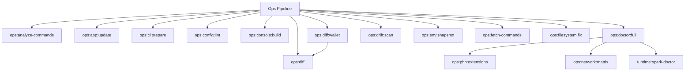

# Ops Spark Commands

## Overview

This README documents Spark commands under `app/Commands/Ops` and their operational dependencies.

## Operational Purpose

Provide operators and developers with command intent, dependencies, workflows, and recovery guidance.

## Command Inventory

- `ops:analyze-commands` (Operational)
- `ops:app:update` (Operational)
- `ops:ci:prepare` (Operational)
- `ops:config:lint` (Operational)
- `ops:console:build` (Operational)
- `ops:diff` (Operational)
- `ops:diff:wallet` (Operational)
- `ops:doctor:full` (Diagnostic)
- `ops:drift:scan` (Operational)
- `ops:env:snapshot` (Operational)
- `ops:fetch-commands` (Operational)
- `ops:filesystem:fix` (Maintenance)
- `ops:filesystem:lint` (Operational)
- `ops:integrity:wallet` (Operational)
- `ops:logger:test` (Operational)
- `ops:model-limit:audit` (Diagnostic)
- `ops:network:matrix` (Operational)
- `ops:next-steps` (Operational)
- `ops:next-steps:sync` (Maintenance)
- `ops:next-steps:sync-manual` (Maintenance)
- `ops:php:extensions` (Operational)
- `ops:propose-pr` (Operational)
- `ops:report` (Operational)
- `ops:self-heal` (Operational)
- `ops:sync` (Maintenance)
- `ops:vps:snapshot` (Operational)
- `ops:work` (Operational)

## Command Reference

### ops:analyze-commands

**Purpose**  
Analyze parsed ops inbox items and generate AI plans

**Usage**  
`php spark ops:analyze-commands`

**Options**  
`--dry-run`, `Preview actions without updating inbox items`, `--approve`, `Acknowledge and update inbox items`

**Services Used**  
`App\Services\OpsCommandService`

**Models Used**  
None detected.

**Tables Used**  
`inbox`

**External APIs**  
`https://api.openai.com/v1/chat/completions`

**Related Commands**  
None detected.

**Expected Output**  
Command executes with status output and logs/errors based on runtime state.

**Example Execution**  
`php spark ops:analyze-commands`

### ops:app:update

**Purpose**  
Safely update and validate the CI4 application.

**Usage**  
`php spark ops:app:update`

**Options**  
`--dry-run`, `Report only (no changes)`, `--strict`, `External failures become fatal`, `--migrate`, `Run pending migrations`, `--migrate-only`, `Run database checks and stop`, `--no-api`, `Skip API checks`, `--no-aiops`, `Skip AIOps snapshot`, `--json`, `Emit JSON output`, `--allow-ci`, `Allow running in CI environment`

**Services Used**  
`App\Services\Ops\ApiHealthService`, `App\Services\Ops\AppSelfTestService`, `App\Services\Ops\ConfigAuditService`, `App\Services\Ops\DatabaseHealthService`, `App\Services\Ops\FilesystemHealthService`, `App\Services\Ops\SnapshotWriter`, `App\Services\Ops\SparkGovernanceService`

**Models Used**  
None detected.

**Tables Used**  
`and`, `environment`, `summary`

**External APIs**  
`https://api.marketaux.com`, `https://www.alphavantage.co`, `https://api.coingecko.com`

**Related Commands**  
None detected.

**Expected Output**  
Command executes with status output and logs/errors based on runtime state.

**Example Execution**  
`php spark ops:app:update`

### ops:ci:prepare

**Purpose**  
Prepare deterministic writable/artifact directories for CI runs.

**Usage**  
`php spark ops:ci:prepare`

**Options**  
None documented.

**Services Used**  
None detected.

**Models Used**  
None detected.

**Tables Used**  
None detected.

**External APIs**  
None detected.

**Related Commands**  
None detected.

**Expected Output**  
Command executes with status output and logs/errors based on runtime state.

**Example Execution**  
`php spark ops:ci:prepare`

### ops:config:lint

**Purpose**  
Lint Config files for illegal patterns (env(), dynamic expressions, protocols).

**Usage**  
`php spark ops:config:lint`

**Options**  
None documented.

**Services Used**  
None detected.

**Models Used**  
None detected.

**Tables Used**  
None detected.

**External APIs**  
None detected.

**Related Commands**  
None detected.

**Expected Output**  
Command executes with status output and logs/errors based on runtime state.

**Example Execution**  
`php spark ops:config:lint`

### ops:console:build

**Purpose**  
Rebuild Console.php command registry

**Usage**  
`php spark ops:console:build`

**Options**  
None documented.

**Services Used**  
None detected.

**Models Used**  
None detected.

**Tables Used**  
None detected.

**External APIs**  
None detected.

**Related Commands**  
None detected.

**Expected Output**  
Command executes with status output and logs/errors based on runtime state.

**Example Execution**  
`php spark ops:console:build`

### ops:diff

**Purpose**  
Compare two files and persist AIOps diff artifact.

**Usage**  
`php spark ops:diff`

**Options**  
`--label`, `Optional label for diff folder`

**Services Used**  
None detected.

**Models Used**  
None detected.

**Tables Used**  
None detected.

**External APIs**  
None detected.

**Related Commands**  
None detected.

**Expected Output**  
Command executes with status output and logs/errors based on runtime state.

**Example Execution**  
`php spark ops:diff`

### ops:diff:wallet

**Purpose**  
Run wallet-specific diff governance check.

**Usage**  
`php spark ops:diff:wallet`

**Options**  
None documented.

**Services Used**  
None detected.

**Models Used**  
None detected.

**Tables Used**  
None detected.

**External APIs**  
None detected.

**Related Commands**  
`ops:diff`

**Expected Output**  
Command executes with status output and logs/errors based on runtime state.

**Example Execution**  
`php spark ops:diff:wallet`

### ops:doctor:full

**Purpose**  
Run high-signal diagnostics: env, php extensions, network matrix, IMAP capabilities (best-effort).

**Usage**  
`php spark ops:doctor:full`

**Options**  
None documented.

**Services Used**  
None detected.

**Models Used**  
None detected.

**Tables Used**  
None detected.

**External APIs**  
None detected.

**Related Commands**  
`ops:php:extensions`, `ops:network:matrix`, `runtime:spark-doctor`, `dreamhost:imap-capabilities`

**Expected Output**  
Command executes with status output and logs/errors based on runtime state.

**Example Execution**  
`php spark ops:doctor:full`

### ops:drift:scan

**Purpose**  
Scan critical services for production drift.

**Usage**  
`php spark ops:drift:scan`

**Options**  
None documented.

**Services Used**  
None detected.

**Models Used**  
None detected.

**Tables Used**  
None detected.

**External APIs**  
None detected.

**Related Commands**  
None detected.

**Expected Output**  
Command executes with status output and logs/errors based on runtime state.

**Example Execution**  
`php spark ops:drift:scan`

### ops:env:snapshot

**Purpose**  
Print key env vars with secret redaction (safe for logs/screenshots).

**Usage**  
`php spark ops:env:snapshot`

**Options**  
None documented.

**Services Used**  
None detected.

**Models Used**  
None detected.

**Tables Used**  
None detected.

**External APIs**  
None detected.

**Related Commands**  
None detected.

**Expected Output**  
Command executes with status output and logs/errors based on runtime state.

**Example Execution**  
`php spark ops:env:snapshot`

### ops:fetch-commands

**Purpose**  
Fetch unread ops commands from IMAP and store them in bf_ops_command_inbox

**Usage**  
`php spark ops:fetch-commands`

**Options**  
`--dry-run`, `Preview actions without storing inbox items`, `--approve`, `Acknowledge and store inbox items`

**Services Used**  
None detected.

**Models Used**  
`App\Models\OpsCommandInboxModel`

**Tables Used**  
`IMAP`

**External APIs**  
None detected.

**Related Commands**  
None detected.

**Expected Output**  
Command executes with status output and logs/errors based on runtime state.

**Example Execution**  
`php spark ops:fetch-commands`

### ops:filesystem:fix

**Purpose**  
Auto-fix filesystem governance violations

**Usage**  
`php spark ops:filesystem:fix`

**Options**  
None documented.

**Services Used**  
None detected.

**Models Used**  
None detected.

**Tables Used**  
None detected.

**External APIs**  
None detected.

**Related Commands**  
None detected.

**Expected Output**  
Command executes with status output and logs/errors based on runtime state.

**Example Execution**  
`php spark ops:filesystem:fix`

### ops:filesystem:lint

**Purpose**  
Lint and optionally auto-fix filesystem governance violations.

**Usage**  
`php spark ops:filesystem:lint`

**Options**  
`--fix`, `Automatically apply safe fixes`, `--report`, `Write fix plan to docs/_ops/filesystem-lint.md`, `--json`, `JSON output`

**Services Used**  
None detected.

**Models Used**  
None detected.

**Tables Used**  
None detected.

**External APIs**  
None detected.

**Related Commands**  
None detected.

**Expected Output**  
Command executes with status output and logs/errors based on runtime state.

**Example Execution**  
`php spark ops:filesystem:lint`

### ops:integrity:wallet

**Purpose**  
Validate wallet balances against completed ledger transactions.

**Usage**  
`php spark ops:integrity:wallet`

**Options**  
None documented.

**Services Used**  
None detected.

**Models Used**  
None detected.

**Tables Used**  
`bf_users_wallet`, `bf_users_wallet_transactions`

**External APIs**  
None detected.

**Related Commands**  
None detected.

**Expected Output**  
Command executes with status output and logs/errors based on runtime state.

**Example Execution**  
`php spark ops:integrity:wallet`

### ops:logger:test

**Purpose**  
Writes test entries to configured logger handlers.

**Usage**  
`php spark ops:logger:test`

**Options**  
None documented.

**Services Used**  
None detected.

**Models Used**  
None detected.

**Tables Used**  
None detected.

**External APIs**  
None detected.

**Related Commands**  
None detected.

**Expected Output**  
Command executes with status output and logs/errors based on runtime state.

**Example Execution**  
`php spark ops:logger:test`

### ops:model-limit:audit

**Purpose**  
Audit models/services/libraries for unbounded query patterns.

**Usage**  
`php spark ops:model-limit:audit`

**Options**  
None documented.

**Services Used**  
None detected.

**Models Used**  
None detected.

**Tables Used**  
None detected.

**External APIs**  
None detected.

**Related Commands**  
None detected.

**Expected Output**  
Command executes with status output and logs/errors based on runtime state.

**Example Execution**  
`php spark ops:model-limit:audit`

### ops:network:matrix

**Purpose**  
Test outbound connectivity matrix (TCP/SSL) with latency and banner.

**Usage**  
`php spark ops:network:matrix`

**Options**  
None documented.

**Services Used**  
None detected.

**Models Used**  
None detected.

**Tables Used**  
None detected.

**External APIs**  
None detected.

**Related Commands**  
None detected.

**Expected Output**  
Command executes with status output and logs/errors based on runtime state.

**Example Execution**  
`php spark ops:network:matrix`

### ops:next-steps

**Purpose**  
Generate next-steps issues from audit commands and write docs/snapshots.

**Usage**  
`php spark ops:next-steps`

**Options**  
`--emit`, `docs (default), db, or both`, `--date`, `Override the snapshot date (YYYY-MM-DD)`, `--dry-run`, `Run analyzers but skip writes`, `--approve`, `Acknowledge and write docs/snapshots/tasks`

**Services Used**  
None detected.

**Models Used**  
`App\Models\AiOpsTaskModel`

**Tables Used**  
`audit`

**External APIs**  
None detected.

**Related Commands**  
None detected.

**Expected Output**  
Command executes with status output and logs/errors based on runtime state.

**Example Execution**  
`php spark ops:next-steps`

### ops:next-steps:sync

**Purpose**  
Diff latest snapshots and queue net-new issues.

**Usage**  
`php spark ops:next-steps:sync`

**Options**  
`--emit`, `Output mode: docs (default: docs).`, `--out`, `Override artifact directory (must be inside docs/aiops/artifacts).`, `--dry-run`, `Generate a report without mutating state.`, `--approve`, `Acknowledge execution (required for mutating commands).`

**Services Used**  
None detected.

**Models Used**  
None detected.

**Tables Used**  
None detected.

**External APIs**  
None detected.

**Related Commands**  
None detected.

**Expected Output**  
Command executes with status output and logs/errors based on runtime state.

**Example Execution**  
`php spark ops:next-steps:sync`

### ops:next-steps:sync-manual

**Purpose**  
Sync manual TODOs from docs/_aiops/next-steps.md into the database.

**Usage**  
`php spark ops:next-steps:sync-manual`

**Options**  
`--dry-run`, `Preview changes without writing to the database.`

**Services Used**  
None detected.

**Models Used**  
`App\Models\AiOpsManualTodoModel`

**Tables Used**  
`docs`, `the`

**External APIs**  
None detected.

**Related Commands**  
None detected.

**Expected Output**  
Command executes with status output and logs/errors based on runtime state.

**Example Execution**  
`php spark ops:next-steps:sync-manual`

### ops:php:extensions

**Purpose**  
Audit required PHP extensions and key INI values (IMAP/SSL-friendly).

**Usage**  
`php spark ops:php:extensions`

**Options**  
None documented.

**Services Used**  
None detected.

**Models Used**  
None detected.

**Tables Used**  
None detected.

**External APIs**  
None detected.

**Related Commands**  
None detected.

**Expected Output**  
Command executes with status output and logs/errors based on runtime state.

**Example Execution**  
`php spark ops:php:extensions`

### ops:propose-pr

**Purpose**  
Generate and validate a PR artifact bundle, then export to tracked outbox for GitHub automation.

**Usage**  
`php spark ops:propose-pr`

**Options**  
`--slug`, `Required. Short identifier (kebab-case). Example: spark-taxonomy-fix`, `--title`, `Required. PR title.`, `--body`, `Required. PR description body (plain text or markdown).`, `--patch`, `Required. Path to unified diff patch file.`, `--risk`, `Optional. low|medium|high. Default: low`, `--emit`, `Optional. table|json|md (default: table)`, `--out`, `Optional. Write a summary artifact to a file path.`, `--dry-run`, `Optional. Do not write files; show what would be done.`, `--approve`, `Optional. Required to export to tracked outbox (mutating operation).`, `--artifact`, `Optional. Write a lightweight aiops artifact json file`

**Services Used**  
None detected.

**Models Used**  
None detected.

**Tables Used**  
None detected.

**External APIs**  
`GitHub`

**Related Commands**  
None detected.

**Expected Output**  
Command executes with status output and logs/errors based on runtime state.

**Example Execution**  
`php spark ops:propose-pr`

### ops:report

**Purpose**  
Ops helper command: ops:report

**Usage**  
`php spark ops:report`

**Options**  
None documented.

**Services Used**  
`App\Services\Ops\VpsHealthService`

**Models Used**  
None detected.

**Tables Used**  
None detected.

**External APIs**  
None detected.

**Related Commands**  
None detected.

**Expected Output**  
Command executes with status output and logs/errors based on runtime state.

**Example Execution**  
`php spark ops:report`

### ops:self-heal

**Purpose**  
Ops helper command: ops:self-heal

**Usage**  
`php spark ops:self-heal`

**Options**  
None documented.

**Services Used**  
`App\Services\Ops\VpsHealthService`

**Models Used**  
None detected.

**Tables Used**  
None detected.

**External APIs**  
None detected.

**Related Commands**  
None detected.

**Expected Output**  
Command executes with status output and logs/errors based on runtime state.

**Example Execution**  
`php spark ops:self-heal`

### ops:sync

**Purpose**  
Runs an ops sync pipeline: git guard/pull + routes docs + launch audit + repo health.

**Usage**  
`php spark ops:sync`

**Options**  
None documented.

**Services Used**  
None detected.

**Models Used**  
None detected.

**Tables Used**  
None detected.

**External APIs**  
None detected.

**Related Commands**  
None detected.

**Expected Output**  
Command executes with status output and logs/errors based on runtime state.

**Example Execution**  
`php spark ops:sync`

### ops:vps:snapshot

**Purpose**  
Collect system/runtime snapshot (no-sudo, best-effort) and write docs/_aiops snapshot.

**Usage**  
`php spark ops:vps:snapshot`

**Options**  
None documented.

**Services Used**  
None detected.

**Models Used**  
None detected.

**Tables Used**  
None detected.

**External APIs**  
None detected.

**Related Commands**  
None detected.

**Expected Output**  
Command executes with status output and logs/errors based on runtime state.

**Example Execution**  
`php spark ops:vps:snapshot`

### ops:work

**Purpose**  
Process AiOps task queue items safely.

**Usage**  
`php spark ops:work`

**Options**  
`--lock`, `Lock duration in minutes (default 15).`, `--dry-run`, `Preview actions without processing tasks`, `--code`, `Process code-eligible tasks only and write PR outbox bundle.`

**Services Used**  
None detected.

**Models Used**  
`App\Models\AiOpsSettingsModel`, `App\Models\AiOpsTaskModel`

**Tables Used**  
None detected.

**External APIs**  
None detected.

**Related Commands**  
`ops:work`

**Expected Output**  
Command executes with status output and logs/errors based on runtime state.

**Example Execution**  
`php spark ops:work`

## Dependencies

| Relationship | Target | Type |
|---|---|---|
| `ops:analyze-commands` | `App\Services\OpsCommandService` | Command → Service |
| `ops:analyze-commands` | `inbox` | Command → Table |
| `ops:analyze-commands` | `https://api.openai.com/v1/chat/completions` | Command → API |
| `ops:app:update` | `App\Services\Ops\ApiHealthService` | Command → Service |
| `ops:app:update` | `App\Services\Ops\AppSelfTestService` | Command → Service |
| `ops:app:update` | `App\Services\Ops\ConfigAuditService` | Command → Service |
| `ops:app:update` | `App\Services\Ops\DatabaseHealthService` | Command → Service |
| `ops:app:update` | `App\Services\Ops\FilesystemHealthService` | Command → Service |
| `ops:app:update` | `and` | Command → Table |
| `ops:app:update` | `environment` | Command → Table |
| `ops:app:update` | `summary` | Command → Table |
| `ops:app:update` | `https://api.marketaux.com` | Command → API |
| `ops:app:update` | `https://www.alphavantage.co` | Command → API |
| `ops:app:update` | `https://api.coingecko.com` | Command → API |
| `ops:diff:wallet` | `ops:diff` | Command → Command |
| `ops:doctor:full` | `ops:php:extensions` | Command → Command |
| `ops:doctor:full` | `ops:network:matrix` | Command → Command |
| `ops:doctor:full` | `runtime:spark-doctor` | Command → Command |
| `ops:doctor:full` | `dreamhost:imap-capabilities` | Command → Command |
| `ops:fetch-commands` | `App\Models\OpsCommandInboxModel` | Command → Model |
| `ops:fetch-commands` | `IMAP` | Command → Table |
| `ops:integrity:wallet` | `bf_users_wallet` | Command → Table |
| `ops:integrity:wallet` | `bf_users_wallet_transactions` | Command → Table |
| `ops:next-steps` | `App\Models\AiOpsTaskModel` | Command → Model |
| `ops:next-steps` | `audit` | Command → Table |
| `ops:next-steps:sync-manual` | `App\Models\AiOpsManualTodoModel` | Command → Model |
| `ops:next-steps:sync-manual` | `docs` | Command → Table |
| `ops:next-steps:sync-manual` | `the` | Command → Table |
| `ops:propose-pr` | `GitHub` | Command → API |
| `ops:report` | `App\Services\Ops\VpsHealthService` | Command → Service |
| `ops:self-heal` | `App\Services\Ops\VpsHealthService` | Command → Service |
| `ops:work` | `App\Models\AiOpsSettingsModel` | Command → Model |
| `ops:work` | `App\Models\AiOpsTaskModel` | Command → Model |
| `ops:work` | `ops:work` | Command → Command |

## Command Dependency Graph

## Execution Workflows

- `php spark ops:analyze-commands`
- `php spark ops:app:update`
- `php spark ops:ci:prepare`
- `php spark ops:config:lint`
- `php spark ops:console:build`
- `php spark ops:diff`

## Operational Playbooks

**Investigate Application Failure**

- `php spark logs:doctor`
- `php spark ops:php:fpm:health`
- `php spark ops:server:nginx:status`
- `php spark spark:diagnose-503`

**Diagnose Database Issue**

- `php spark db:inventory`
- `php spark db:drift`
- `php spark aiops:sql:check`

## Troubleshooting

- Common failure: command not found in registry.
- Diagnostics: `php spark ops:commands:audit`, `php spark ops:commands:missing`.
- Recovery: repair namespace/PSR-4 and rerun command audit tools.

## Related Commands

- `dreamhost:imap-capabilities`
- `ops:diff`
- `ops:network:matrix`
- `ops:php:extensions`
- `ops:work`
- `runtime:spark-doctor`

## Console Registry Verification

- Console registry is auto-discovered in CI4; explicit `$commands` entries in `app/Config/Console.php` should be added for any commands that fail `ops:commands:missing`.
