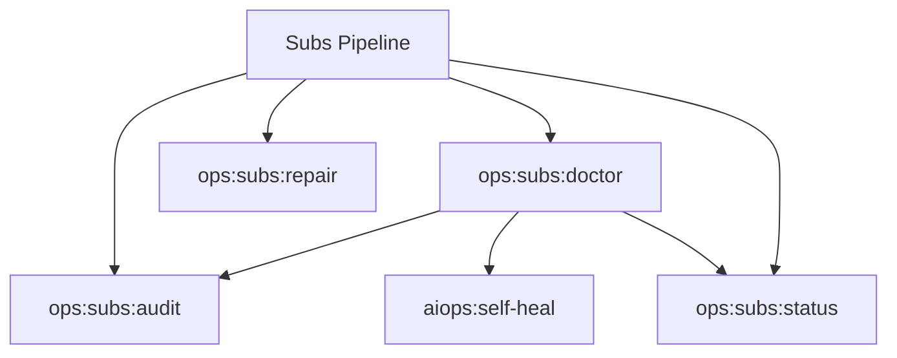

# Subs Spark Commands

## Overview

This README documents Spark commands under `app/Commands/Ops/Subs` and their operational dependencies.

## Operational Purpose

Provide operators and developers with command intent, dependencies, workflows, and recovery guidance.

## Command Inventory

- `ops:subs:audit` (Diagnostic)
- `ops:subs:doctor` (Diagnostic)
- `ops:subs:repair` (Maintenance)
- `ops:subs:status` (Operational)

## Command Reference

### ops:subs:audit

**Purpose**  
Run subsystem audits

**Usage**  
`php spark ops:subs:audit`

**Options**  
`--json`, `JSON`, `--strict`, `Strict`

**Services Used**  
None detected.

**Models Used**  
None detected.

**Tables Used**  
None detected.

**External APIs**  
None detected.

**Related Commands**  
None detected.

**Expected Output**  
Command executes with status output and logs/errors based on runtime state.

**Example Execution**  
`php spark ops:subs:audit`

### ops:subs:doctor

**Purpose**  
Friendly subsystem triage

**Usage**  
`php spark ops:subs:doctor`

**Options**  
`--json`, `JSON`

**Services Used**  
None detected.

**Models Used**  
None detected.

**Tables Used**  
None detected.

**External APIs**  
None detected.

**Related Commands**  
`ops:subs:audit`, `aiops:self-heal`, `ops:subs:status`

**Expected Output**  
Command executes with status output and logs/errors based on runtime state.

**Example Execution**  
`php spark ops:subs:doctor`

### ops:subs:repair

**Purpose**  
Run subsystem repairs

**Usage**  
`php spark ops:subs:repair`

**Options**  
`--json`, `JSON`

**Services Used**  
None detected.

**Models Used**  
None detected.

**Tables Used**  
None detected.

**External APIs**  
None detected.

**Related Commands**  
None detected.

**Expected Output**  
Command executes with status output and logs/errors based on runtime state.

**Example Execution**  
`php spark ops:subs:repair`

### ops:subs:status

**Purpose**  
Combined subsystem status

**Usage**  
`php spark ops:subs:status`

**Options**  
`--json`, `JSON`

**Services Used**  
None detected.

**Models Used**  
None detected.

**Tables Used**  
None detected.

**External APIs**  
None detected.

**Related Commands**  
None detected.

**Expected Output**  
Command executes with status output and logs/errors based on runtime state.

**Example Execution**  
`php spark ops:subs:status`

## Dependencies

| Relationship | Target | Type |
|---|---|---|
| `ops:subs:doctor` | `ops:subs:audit` | Command → Command |
| `ops:subs:doctor` | `aiops:self-heal` | Command → Command |
| `ops:subs:doctor` | `ops:subs:status` | Command → Command |

## Command Dependency Graph

## Execution Workflows

- `php spark ops:subs:audit`
- `php spark ops:subs:doctor`
- `php spark ops:subs:repair`
- `php spark ops:subs:status`

## Operational Playbooks

**Investigate Application Failure**

- `php spark logs:doctor`
- `php spark ops:php:fpm:health`
- `php spark ops:server:nginx:status`
- `php spark spark:diagnose-503`

**Diagnose Database Issue**

- `php spark db:inventory`
- `php spark db:drift`
- `php spark aiops:sql:check`

## Troubleshooting

- Common failure: command not found in registry.
- Diagnostics: `php spark ops:commands:audit`, `php spark ops:commands:missing`.
- Recovery: repair namespace/PSR-4 and rerun command audit tools.

## Related Commands

- `aiops:self-heal`
- `ops:subs:audit`
- `ops:subs:status`

## Console Registry Verification

- Console registry is auto-discovered in CI4; explicit `$commands` entries in `app/Config/Console.php` should be added for any commands that fail `ops:commands:missing`.
