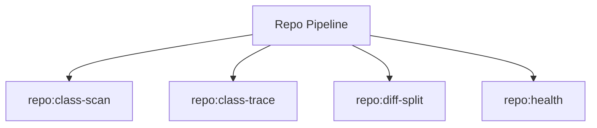

# Repo Spark Commands

## Overview

This README documents Spark commands under `app/Commands/Repo` and their operational dependencies.

## Operational Purpose

Provide operators and developers with command intent, dependencies, workflows, and recovery guidance.

## Command Inventory

- `repo:class-scan` (Operational)
- `repo:class-trace` (Operational)
- `repo:diff-split` (Operational)
- `repo:health` (Diagnostic)

## Command Reference

### repo:class-scan

**Purpose**  
Scan repository for duplicate classes and namespace conflicts.

**Usage**  
`php spark repo:class-scan`

**Options**  
None documented.

**Services Used**  
None detected.

**Models Used**  
None detected.

**Tables Used**  
None detected.

**External APIs**  
None detected.

**Related Commands**  
None detected.

**Expected Output**  
Command executes with status output and logs/errors based on runtime state.

**Example Execution**  
`php spark repo:class-scan`

### repo:class-trace

**Purpose**  
Trace where a class is declared and referenced in the repository.

**Usage**  
`php spark repo:class-trace`

**Options**  
None documented.

**Services Used**  
None detected.

**Models Used**  
None detected.

**Tables Used**  
None detected.

**External APIs**  
None detected.

**Related Commands**  
None detected.

**Expected Output**  
Command executes with status output and logs/errors based on runtime state.

**Example Execution**  
`php spark repo:class-trace`

### repo:diff-split

**Purpose**  
Split large git diffs into smaller review batches.

**Usage**  
`php spark repo:diff-split`

**Options**  
None documented.

**Services Used**  
None detected.

**Models Used**  
None detected.

**Tables Used**  
`smaller`

**External APIs**  
None detected.

**Related Commands**  
None detected.

**Expected Output**  
Command executes with status output and logs/errors based on runtime state.

**Example Execution**  
`php spark repo:diff-split`

### repo:health

**Purpose**  
Runs lightweight repository health checks for GTM readiness.

**Usage**  
`php spark repo:health`

**Options**  
None documented.

**Services Used**  
None detected.

**Models Used**  
None detected.

**Tables Used**  
None detected.

**External APIs**  
None detected.

**Related Commands**  
None detected.

**Expected Output**  
Command executes with status output and logs/errors based on runtime state.

**Example Execution**  
`php spark repo:health`

## Dependencies

| Relationship | Target | Type |
|---|---|---|
| `repo:diff-split` | `smaller` | Command → Table |

## Command Dependency Graph

## Execution Workflows

- `php spark repo:class-scan`
- `php spark repo:class-trace`
- `php spark repo:diff-split`
- `php spark repo:health`

## Operational Playbooks

**Investigate Application Failure**

- `php spark logs:doctor`
- `php spark ops:php:fpm:health`
- `php spark ops:server:nginx:status`
- `php spark spark:diagnose-503`

**Diagnose Database Issue**

- `php spark db:inventory`
- `php spark db:drift`
- `php spark aiops:sql:check`

## Troubleshooting

- Common failure: command not found in registry.
- Diagnostics: `php spark ops:commands:audit`, `php spark ops:commands:missing`.
- Recovery: repair namespace/PSR-4 and rerun command audit tools.

## Related Commands

## Console Registry Verification

- Console registry is auto-discovered in CI4; explicit `$commands` entries in `app/Config/Console.php` should be added for any commands that fail `ops:commands:missing`.
