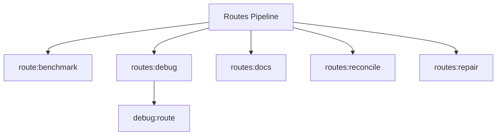

# Routes Spark Commands

## Overview

This README documents Spark commands under `app/Commands/Routes` and their operational dependencies.

## Operational Purpose

Provide operators and developers with command intent, dependencies, workflows, and recovery guidance.

## Command Inventory

- `route:benchmark` (Operational)
- `routes:debug` (Operational)
- `routes:docs` (Maintenance)
- `routes:reconcile` (Operational)
- `routes:repair` (Maintenance)

## Command Reference

### route:benchmark

**Purpose**  
Benchmark route loading performance.

**Usage**  
`php spark route:benchmark`

**Options**  
None documented.

**Services Used**  
None detected.

**Models Used**  
None detected.

**Tables Used**  
None detected.

**External APIs**  
None detected.

**Related Commands**  
None detected.

**Expected Output**  
Command executes with status output and logs/errors based on runtime state.

**Example Execution**  
`php spark route:benchmark`

### routes:debug

**Purpose**  
Resolve a route and verify controller, method, and HTTP method coverage.

**Usage**  
`php spark routes:debug`

**Options**  
None documented.

**Services Used**  
None detected.

**Models Used**  
None detected.

**Tables Used**  
None detected.

**External APIs**  
None detected.

**Related Commands**  
`debug:route`

**Expected Output**  
Command executes with status output and logs/errors based on runtime state.

**Example Execution**  
`php spark routes:debug`

### routes:docs

**Purpose**  
Export active routes to Markdown + JSON under docs/routes/.

**Usage**  
`php spark routes:docs`

**Options**  
None documented.

**Services Used**  
None detected.

**Models Used**  
None detected.

**Tables Used**  
None detected.

**External APIs**  
None detected.

**Related Commands**  
None detected.

**Expected Output**  
Command executes with status output and logs/errors based on runtime state.

**Example Execution**  
`php spark routes:docs`

### routes:reconcile

**Purpose**  
Reconcile route handlers against actual controllers and methods.

**Usage**  
`php spark routes:reconcile`

**Options**  
None documented.

**Services Used**  
`App\Services\Routes\RouteReconcileService`

**Models Used**  
None detected.

**Tables Used**  
None detected.

**External APIs**  
None detected.

**Related Commands**  
None detected.

**Expected Output**  
Command executes with status output and logs/errors based on runtime state.

**Example Execution**  
`php spark routes:reconcile`

### routes:repair

**Purpose**  
Repair invalid route handlers, resolve namespaces, and remove exact duplicate route definitions.

**Usage**  
`php spark routes:repair`

**Options**  
None documented.

**Services Used**  
`App\Services\Routes\RouteRepairService`

**Models Used**  
None detected.

**Tables Used**  
None detected.

**External APIs**  
None detected.

**Related Commands**  
None detected.

**Expected Output**  
Command executes with status output and logs/errors based on runtime state.

**Example Execution**  
`php spark routes:repair`

## Dependencies

| Relationship | Target | Type |
|---|---|---|
| `routes:debug` | `debug:route` | Command → Command |
| `routes:reconcile` | `App\Services\Routes\RouteReconcileService` | Command → Service |
| `routes:repair` | `App\Services\Routes\RouteRepairService` | Command → Service |

## Command Dependency Graph

## Execution Workflows

- `php spark route:benchmark`
- `php spark routes:debug`
- `php spark routes:docs`
- `php spark routes:reconcile`
- `php spark routes:repair`

## Operational Playbooks

**Investigate Application Failure**

- `php spark logs:doctor`
- `php spark ops:php:fpm:health`
- `php spark ops:server:nginx:status`
- `php spark spark:diagnose-503`

**Diagnose Database Issue**

- `php spark db:inventory`
- `php spark db:drift`
- `php spark aiops:sql:check`

## Troubleshooting

- Common failure: command not found in registry.
- Diagnostics: `php spark ops:commands:audit`, `php spark ops:commands:missing`.
- Recovery: repair namespace/PSR-4 and rerun command audit tools.

## Related Commands

- `debug:route`

## Console Registry Verification

- Console registry is auto-discovered in CI4; explicit `$commands` entries in `app/Config/Console.php` should be added for any commands that fail `ops:commands:missing`.
