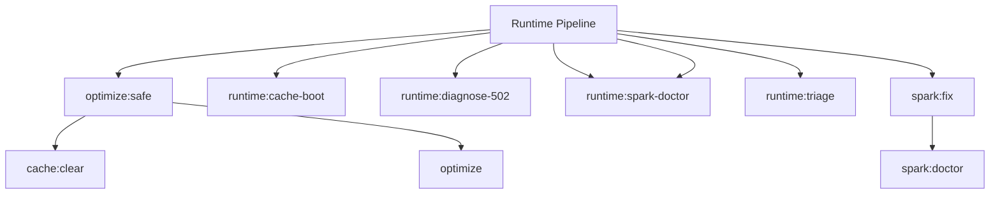

# Runtime Spark Commands

## Overview

This README documents Spark commands under `app/Commands/Runtime` and their operational dependencies.

## Operational Purpose

Provide operators and developers with command intent, dependencies, workflows, and recovery guidance.

## Command Inventory

- `optimize:safe` (Operational)
- `runtime:cache-boot` (Automation)
- `runtime:diagnose-502` (Diagnostic)
- `runtime:spark-doctor` (Diagnostic)
- `runtime:spark-doctor` (Diagnostic)
- `runtime:triage` (Automation)
- `spark:fix` (Maintenance)

## Command Reference

### optimize:safe

**Purpose**  
Run CI4 optimize safely (CI-only)

**Usage**  
`php spark optimize:safe`

**Options**  
None documented.

**Services Used**  
None detected.

**Models Used**  
None detected.

**Tables Used**  
None detected.

**External APIs**  
None detected.

**Related Commands**  
`cache:clear`, `optimize`

**Expected Output**  
Command executes with status output and logs/errors based on runtime state.

**Example Execution**  
`php spark optimize:safe`

### runtime:cache-boot

**Purpose**  
Validate cache boot health and warm critical cache keys.

**Usage**  
`php spark runtime:cache-boot`

**Options**  
`--emit`, `Output mode: docs (default: docs).`, `--out`, `Override artifact directory (must be inside docs/aiops/artifacts).`, `--dry-run`, `Preview actions without changing cache state.`, `--approve`, `Allow cache mutations (required).`

**Services Used**  
None detected.

**Models Used**  
None detected.

**Tables Used**  
None detected.

**External APIs**  
None detected.

**Related Commands**  
None detected.

**Expected Output**  
Command executes with status output and logs/errors based on runtime state.

**Example Execution**  
`php spark runtime:cache-boot`

### runtime:diagnose-502

**Purpose**  
Diagnose and optionally remediate 502/503 gateway errors

**Usage**  
`php spark runtime:diagnose-502`

**Options**  
`--approve`, `Apply safe fixes (clear cache, remove stale sockets) after diagnostics`

**Services Used**  
None detected.

**Models Used**  
None detected.

**Tables Used**  
None detected.

**External APIs**  
None detected.

**Related Commands**  
None detected.

**Expected Output**  
Command executes with status output and logs/errors based on runtime state.

**Example Execution**  
`php spark runtime:diagnose-502`

### runtime:spark-doctor

**Purpose**  
Validate Spark command discovery and CI4 compatibility

**Usage**  
`php spark runtime:spark-doctor`

**Options**  
None documented.

**Services Used**  
None detected.

**Models Used**  
None detected.

**Tables Used**  
None detected.

**External APIs**  
None detected.

**Related Commands**  
None detected.

**Expected Output**  
Command executes with status output and logs/errors based on runtime state.

**Example Execution**  
`php spark runtime:spark-doctor`

### runtime:spark-doctor

**Purpose**  
Validate Spark command discovery and CI4 compatibility (runtime scope).

**Usage**  
`php spark runtime:spark-doctor`

**Options**  
`--emit`, `Output mode: docs (default: docs).`, `--out`, `Override artifact directory (must be inside docs/aiops/artifacts).`, `--dry-run`, `Generate a report without mutating state.`, `--approve`, `Acknowledge execution (required for mutating commands).`

**Services Used**  
None detected.

**Models Used**  
None detected.

**Tables Used**  
None detected.

**External APIs**  
None detected.

**Related Commands**  
None detected.

**Expected Output**  
Command executes with status output and logs/errors based on runtime state.

**Example Execution**  
`php spark runtime:spark-doctor`

### runtime:triage

**Purpose**  
Consolidate runtime diagnostics into a single report.

**Usage**  
`php spark runtime:triage`

**Options**  
`--emit`, `Output mode: docs (default: docs).`, `--out`, `Override artifact directory (must be inside docs/aiops/artifacts).`, `--dry-run`, `Generate a report without mutating state.`, `--approve`, `Acknowledge execution (required for mutating commands).`

**Services Used**  
None detected.

**Models Used**  
None detected.

**Tables Used**  
`a`

**External APIs**  
None detected.

**Related Commands**  
None detected.

**Expected Output**  
Command executes with status output and logs/errors based on runtime state.

**Example Execution**  
`php spark runtime:triage`

### spark:fix

**Purpose**  
Auto-heal Spark command standards and generate a fix report

**Usage**  
`php spark spark:fix`

**Options**  
None documented.

**Services Used**  
None detected.

**Models Used**  
None detected.

**Tables Used**  
None detected.

**External APIs**  
None detected.

**Related Commands**  
`spark:doctor`

**Expected Output**  
Command executes with status output and logs/errors based on runtime state.

**Example Execution**  
`php spark spark:fix`

## Dependencies

| Relationship | Target | Type |
|---|---|---|
| `optimize:safe` | `cache:clear` | Command → Command |
| `optimize:safe` | `optimize` | Command → Command |
| `runtime:triage` | `a` | Command → Table |
| `spark:fix` | `spark:doctor` | Command → Command |

## Command Dependency Graph

## Execution Workflows

- `php spark optimize:safe`
- `php spark runtime:cache-boot`
- `php spark runtime:diagnose-502`
- `php spark runtime:spark-doctor`
- `php spark runtime:spark-doctor`
- `php spark runtime:triage`

## Operational Playbooks

**Investigate Application Failure**

- `php spark logs:doctor`
- `php spark ops:php:fpm:health`
- `php spark ops:server:nginx:status`
- `php spark spark:diagnose-503`

**Diagnose Database Issue**

- `php spark db:inventory`
- `php spark db:drift`
- `php spark aiops:sql:check`

## Troubleshooting

- Common failure: command not found in registry.
- Diagnostics: `php spark ops:commands:audit`, `php spark ops:commands:missing`.
- Recovery: repair namespace/PSR-4 and rerun command audit tools.

## Related Commands

- `cache:clear`
- `optimize`
- `spark:doctor`

## Console Registry Verification

- Console registry is auto-discovered in CI4; explicit `$commands` entries in `app/Config/Console.php` should be added for any commands that fail `ops:commands:missing`.
