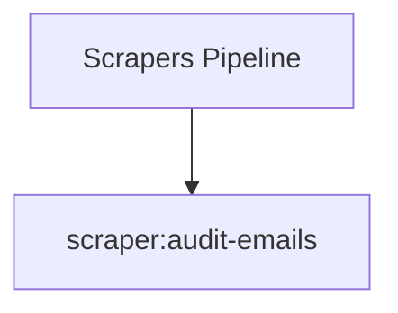

# Scrapers Spark Commands

## Overview

This README documents Spark commands under `app/Commands/Scrapers` and their operational dependencies.

## Operational Purpose

Provide operators and developers with command intent, dependencies, workflows, and recovery guidance.

## Command Inventory

- `scraper:audit-emails` (Diagnostic)

## Command Reference

### scraper:audit-emails

**Purpose**  
Audit recent trade and news emails against the expected scraper schema.

**Usage**  
`php spark scraper:audit-emails`

**Options**  
`--limit`, `Number of emails to scan (default: 25).`

**Services Used**  
`App\Services\ScraperOpsService`

**Models Used**  
None detected.

**Tables Used**  
`current`, `final`

**External APIs**  
None detected.

**Related Commands**  
None detected.

**Expected Output**  
Command executes with status output and logs/errors based on runtime state.

**Example Execution**  
`php spark scraper:audit-emails`

## Dependencies

| Relationship | Target | Type |
|---|---|---|
| `scraper:audit-emails` | `App\Services\ScraperOpsService` | Command → Service |
| `scraper:audit-emails` | `current` | Command → Table |
| `scraper:audit-emails` | `final` | Command → Table |

## Command Dependency Graph

## Execution Workflows

- `php spark scraper:audit-emails`

## Operational Playbooks

**Investigate Application Failure**

- `php spark logs:doctor`
- `php spark ops:php:fpm:health`
- `php spark ops:server:nginx:status`
- `php spark spark:diagnose-503`

**Diagnose Database Issue**

- `php spark db:inventory`
- `php spark db:drift`
- `php spark aiops:sql:check`

## Troubleshooting

- Common failure: command not found in registry.
- Diagnostics: `php spark ops:commands:audit`, `php spark ops:commands:missing`.
- Recovery: repair namespace/PSR-4 and rerun command audit tools.

## Related Commands

## Console Registry Verification

- Console registry is auto-discovered in CI4; explicit `$commands` entries in `app/Config/Console.php` should be added for any commands that fail `ops:commands:missing`.
