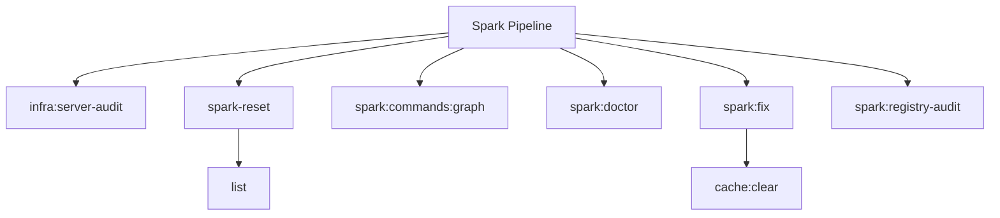

# Spark Spark Commands

## Overview

This README documents Spark commands under `app/Commands/Spark` and their operational dependencies.

## Operational Purpose

Provide operators and developers with command intent, dependencies, workflows, and recovery guidance.

## Command Inventory

- `infra:server-audit` (Diagnostic)
- `spark-reset` (Operational)
- `spark:commands:graph` (Operational)
- `spark:doctor` (Diagnostic)
- `spark:fix` (Maintenance)
- `spark:registry-audit` (Diagnostic)

## Command Reference

### infra:server-audit

**Purpose**  
Audit server and classify reusable infrastructure components

**Usage**  
`php spark infra:server-audit`

**Options**  
None documented.

**Services Used**  
None detected.

**Models Used**  
None detected.

**Tables Used**  
None detected.

**External APIs**  
None detected.

**Related Commands**  
None detected.

**Expected Output**  
Command executes with status output and logs/errors based on runtime state.

**Example Execution**  
`php spark infra:server-audit`

### spark-reset

**Purpose**  
Reset Spark caches, purge command metadata, and rebuild autoload (guarded).

**Usage**  
`php spark spark-reset`

**Options**  
`--emit`, `Output mode: docs (default: docs).`, `--out`, `Override artifact directory (must be inside docs/aiops/artifacts).`, `--dry-run`, `Preview actions without mutating state.`, `--approve`, `Allow destructive mutations (required).`

**Services Used**  
None detected.

**Models Used**  
None detected.

**Tables Used**  
None detected.

**External APIs**  
None detected.

**Related Commands**  
`list`

**Expected Output**  
Command executes with status output and logs/errors based on runtime state.

**Example Execution**  
`php spark spark-reset`

### spark:commands:graph

**Purpose**  
Generate Spark command graph

**Usage**  
`php spark spark:commands:graph`

**Options**  
None documented.

**Services Used**  
None detected.

**Models Used**  
None detected.

**Tables Used**  
None detected.

**External APIs**  
None detected.

**Related Commands**  
None detected.

**Expected Output**  
Command executes with status output and logs/errors based on runtime state.

**Example Execution**  
`php spark spark:commands:graph`

### spark:doctor

**Purpose**  
System health inspector for Spark commands.

**Usage**  
`php spark spark:doctor`

**Options**  
`--json`, `Emit JSON output to stdout`, `--notify`, `Send summary notification via Discord or email`, `--db`, `Store JSON snapshot in aiops_command_snapshots table`

**Services Used**  
`App\Services\AIOps\CommandHookService`, `App\Services\Spark\CommandInventoryService`

**Models Used**  
None detected.

**Tables Used**  
None detected.

**External APIs**  
`Discord`

**Related Commands**  
None detected.

**Expected Output**  
Command executes with status output and logs/errors based on runtime state.

**Example Execution**  
`php spark spark:doctor`

### spark:fix

**Purpose**  
Safely repair Spark command and cache issues.

**Usage**  
`php spark spark:fix`

**Options**  
`--dry-run`, `Preview actions without modifying files (default)`, `--approve`, `Apply fixes and write updates`, `--json`, `Emit JSON output to stdout`, `--notify`, `Send summary notification via Discord or email`, `--db`, `Store JSON snapshot in aiops_command_snapshots table`

**Services Used**  
`App\Services\AIOps\CommandHookService`, `App\Services\Spark\CommandInventoryService`

**Models Used**  
None detected.

**Tables Used**  
None detected.

**External APIs**  
`Discord`

**Related Commands**  
`cache:clear`

**Expected Output**  
Command executes with status output and logs/errors based on runtime state.

**Example Execution**  
`php spark spark:fix`

### spark:registry-audit

**Purpose**  
Audit Spark command registry against filesystem declarations and runtime list output.

**Usage**  
`php spark spark:registry-audit`

**Options**  
None documented.

**Services Used**  
None detected.

**Models Used**  
None detected.

**Tables Used**  
`Console`, `filesystem`, `runtime`

**External APIs**  
None detected.

**Related Commands**  
None detected.

**Expected Output**  
Command executes with status output and logs/errors based on runtime state.

**Example Execution**  
`php spark spark:registry-audit`

## Dependencies

| Relationship | Target | Type |
|---|---|---|
| `spark-reset` | `list` | Command → Command |
| `spark:doctor` | `App\Services\AIOps\CommandHookService` | Command → Service |
| `spark:doctor` | `App\Services\Spark\CommandInventoryService` | Command → Service |
| `spark:doctor` | `Discord` | Command → API |
| `spark:fix` | `App\Services\AIOps\CommandHookService` | Command → Service |
| `spark:fix` | `App\Services\Spark\CommandInventoryService` | Command → Service |
| `spark:fix` | `cache:clear` | Command → Command |
| `spark:fix` | `Discord` | Command → API |
| `spark:registry-audit` | `Console` | Command → Table |
| `spark:registry-audit` | `filesystem` | Command → Table |
| `spark:registry-audit` | `runtime` | Command → Table |

## Command Dependency Graph

## Execution Workflows

- `php spark infra:server-audit`
- `php spark spark-reset`
- `php spark spark:commands:graph`
- `php spark spark:doctor`
- `php spark spark:fix`
- `php spark spark:registry-audit`

## Operational Playbooks

**Investigate Application Failure**

- `php spark logs:doctor`
- `php spark ops:php:fpm:health`
- `php spark ops:server:nginx:status`
- `php spark spark:diagnose-503`

**Diagnose Database Issue**

- `php spark db:inventory`
- `php spark db:drift`
- `php spark aiops:sql:check`

## Troubleshooting

- Common failure: command not found in registry.
- Diagnostics: `php spark ops:commands:audit`, `php spark ops:commands:missing`.
- Recovery: repair namespace/PSR-4 and rerun command audit tools.

## Related Commands

- `cache:clear`
- `list`

## Console Registry Verification

- Console registry is auto-discovered in CI4; explicit `$commands` entries in `app/Config/Console.php` should be added for any commands that fail `ops:commands:missing`.
