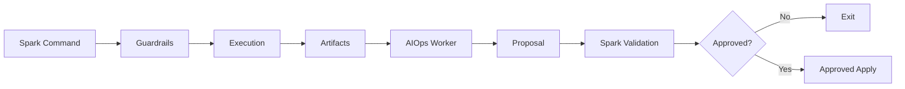

# AIOps Spark Control Plane (CodeIgniter 4.6.x)

This document defines the deterministic, Spark-driven AIOps control plane for MyMI Wallet on CodeIgniter 4.6.x and PHP 8.2. Spark is the only control surface, AIOps is a worker, and all enforcement is performed in code (guardrails), not policy prose.

**Spark decides. AIOps suggests.**

## Control Surfaces

- **Spark CLI (only control surface):** All actions are invoked by `php spark <command>`.
- **AIOps Worker (suggestion engine only):** Reads artifacts, produces proposals, and queues tasks. It never executes or approves commands.
- **CI Runner:** Executes read-only audits and inventory checks in a controlled environment.
- **CRON:** Schedules safe, read-only, or explicitly approved operations.

## Execution Environments

| Environment | Purpose | Allowed Command Classes | Notes |
| --- | --- | --- | --- |
| Local | Developer diagnostics and safe remediation | Read-only + approved fixes | No nested Spark execution. |
| CI | Deterministic validation and audits | Read-only only | Never allowed to mutate. |
| CRON | Scheduled health checks and audits | Read-only + explicitly approved | Guardrails still enforce `--dry-run` + `--approve` for mutations. |

## Control Plane Principles

1. **Spark is the only control surface.** All operations occur through explicit Spark commands registered in `app/Config/Console.php`.
2. **AIOps never decides.** AIOps writes suggestions and task proposals only.
3. **Guardrails are code-enforced.** Policy is evaluated by `SafeBaseCommand` against a single source of truth policy config.
4. **Artifacts are mandatory.** Every command emits artifacts for auditability and replay.
5. **No hidden execution.** Nested `php spark` calls are forbidden.

## Artifact Lifecycle

1. **Execution emits artifacts** (summary + machine output).
2. **Artifacts are stored** in deterministic paths and retained for audit.
3. **AIOps worker scans artifacts** and produces proposals.
4. **Human review happens via Spark** (approve / re-run with `--approve`).

Artifact paths (standard):

- **Primary:** `docs/aiops/artifacts/<command>/<timestamp>/`
- **Raw output:** `writable/aiops/artifacts/<command>/<timestamp>/`
- **Required files:** `summary.md`, `report.json`

## Exit Code Contracts

| Exit Code | Meaning |
| --- | --- |
| 0 | Success (no issues) |
| 10 | Audit completed with findings (non-fatal) |
| 20 | Validation failure (bad flags / missing artifact path) |
| 30 | Guardrail violation (policy denied) |
| 40 | Execution failed (runtime error) |
| 50 | Artifact write failure |

## Approval Model

- **Default mode is read-only.** Mutations require `--dry-run` and `--approve`.
- **All mutation commands are explicitly allowlisted per environment.**
- **CI can never mutate.** Any destructive or mutating command is blocked in CI.
- **AIOps cannot approve.** Only humans (or explicit CI policy) can pass `--approve`.

## Guardrails (Design Only)

### Central Policy Concept

A single policy config (conceptual) provides the enforceable source of truth:

`app/Config/AIOpsPolicy.php`

Per-command policy fields:

- `mutates: bool`
- `requiresApprove: bool`
- `allowedEnvs: []`
- `ciOnly: bool`
- `allowedScopes: []`
- `requiresArtifacts: bool`

### Runtime Enforcement (SafeBaseCommand)

`SafeBaseCommand` evaluates the requested Spark command against `AIOpsPolicy` before execution:

1. **Environment check** (`allowedEnvs`, `ciOnly`).
2. **Mutation gate** (`mutates` + `requiresApprove` + `--dry-run`/`--approve`).
3. **Artifact requirement** (`requiresArtifacts` + `--out` path validation).
4. **Nested Spark detection** (hard block).

If any check fails, the command exits with **30** and writes an artifact explaining the denial.

## Mandatory Guardrails

- **Read-only commands cannot write.** No state changes for audit or health commands.
- **Prod mutations require explicit allowlisting.** Production env must be explicitly listed per command.
- **All mutations require** `--dry-run` **and** `--approve`.
- **CI can never run destructive commands.**
- **All actions must emit artifacts.**

## AIOps Control Flow (Mermaid)

## Canonical Spark Command Taxonomy

| Prefix | Meaning |
| --- | --- |
| health:* | Diagnostics only (read-only) |
| audit:* | Verification (read-only, CI-enforced) |
| fix:* | Guarded remediation |
| runtime:* | Runtime / infrastructure |
| spark:* | Spark layer governance |
| ops:* | Orchestration & policy |
| ci:* | CI-only commands |
| security:* | Security audits |
| perf:* | Performance diagnostics |
| db:* | Database health & drift |
| cache:* | Cache health / purge |
| marketing:* | Marketing automation |
| alerts:* | Alerts pipeline |
| notify:* | External dispatch |
| aiops:* | AI task queue & quotas |

## Phased Expansion Roadmap

### Phase 1 – Visibility
- **Commands:** `health:*`, `audit:*`, `runtime:spark-doctor`, `spark:diagnose-503`, `db:*`, `security:*`
- **Risk level:** Low
- **Prod mutation allowed:** No

### Phase 2 – Guidance
- **Commands:** `ops:next-steps`, `aiops:*`, `ops:commands:inventory`, `marketing:automation-audit`
- **Risk level:** Low
- **Prod mutation allowed:** No

### Phase 3 – Assisted Fixes
- **Commands:** `fix:*`, `spark:purge-fastcgi`, `spark:restart-safe`, `cache:*`
- **Risk level:** Medium
- **Prod mutation allowed:** Yes (explicitly allowlisted + `--approve`)

### Phase 4 – Autonomous Ops
- **Commands:** `ops:*` + CRON scheduling under strict caps
- **Risk level:** High
- **Prod mutation allowed:** Yes (explicit allowlist + human approvals)

## Enforcement Summary

- **Spark is the enforcement engine.**
- **AIOps is advisory only.**
- **All actions are logged and artifacted.**
- **Guardrails are implemented in code, not policy prose.**
