# AIOps Spark Operations Manual

## Overview

Deep operational documentation for Spark commands in this category.

## Operational Purpose

Define when and how operators should run commands safely in production and CI.

## Command Inventory

- `aiops:api:schema` (Operational)
- `aiops:alerts-check` (Operational)
- `aiops:alerts-clean` (Operational)
- `aiops:alerts-health` (Diagnostic)
- `aiops:alerts-worker` (Automation)
- `aiops:audit` (Diagnostic)
- `aiops:auto:run` (Automation)
- `aiops:backlog` (Operational)
- `aiops:build-command` (Operational)
- `aiops:chat-gov-index` (Operational)
- `aiops:command-index` (Operational)
- `aiops:continue` (Operational)
- `aiops:copilot:validate` (Operational)
- `aiops:csp:audit` (Diagnostic)
- `aiops:db:slow_scan` (Operational)
- `aiops:dedupe:report` (Operational)
- `aiops:deps:add` (Operational)
- `aiops:diff:format` (Operational)
- `aiops:docs-sync` (Maintenance)
- `aiops:doctor` (Diagnostic)
- `aiops:email-scan` (Operational)
- `aiops:form:test` (Operational)
- `aiops:gate:cost` (Operational)
- `aiops:governance:analyze` (Operational)
- `aiops:health:full` (Diagnostic)
- `aiops:ingest` (Operational)
- `aiops:init` (Operational)
- `aiops:manual:index` (Operational)
- `aiops:manual:run` (Automation)
- `aiops:n8n:logs` (Operational)
- `aiops:n8n:restart` (Operational)
- `aiops:n8n:start` (Operational)
- `aiops:n8n:stop` (Operational)
- `aiops:observe:cost` (Operational)
- `aiops:observe:hash` (Operational)
- `aiops:observe:map` (Operational)
- `aiops:observe:patch` (Operational)
- `aiops:observe:regression` (Operational)
- `aiops:observe:scan` (Operational)
- `aiops:observe:snapshot` (Operational)
- `aiops:observe:suggest` (Operational)
- `aiops:observe` (Operational)
- `aiops:pr:auto` (Automation)
- `aiops:pr:create` (Operational)
- `aiops:patch:apply` (Operational)
- `aiops:patch:dry_run` (Automation)
- `aiops:patch:hallucination` (Operational)
- `aiops:patch:risk_score` (Operational)
- `aiops:patch:validate` (Operational)
- `aiops:priority:build` (Operational)
- `aiops:public-pages:audit` (Diagnostic)
- `aiops:public-pages:import` (Operational)
- `aiops:public-pages:report` (Operational)
- `aiops:public-pages:run` (Automation)
- `aiops:redis:stats` (Operational)
- `aiops:repair` (Maintenance)
- `aiops:repair:run` (Automation)
- `aiops:repair:run_safe` (Automation)
- `aiops:rollback` (Operational)
- `aiops:routes:compare` (Operational)

## Command Reference

### aiops:api:schema

**Purpose**  
Validate API endpoints return JSON (optionally check required keys)

**Usage**  
`php spark aiops:api:schema`

**Options**  
None documented.

**Services Used**  
None detected.

**Models Used**  
None detected.

**Tables Used**  
None detected.

**External APIs**  
None detected.

**Related Commands**  
`ops:doctor:full`, `logs:summarize`

**Expected Output**  
Command status and diagnostics are printed to console and logs.

**Example Execution**  
`php spark aiops:api:schema`

### aiops:alerts-check

**Purpose**  
Fetch emails and queue them for processing

**Usage**  
`php spark aiops:alerts-check`

**Options**  
None documented.

**Services Used**  
`App\Services\EmailScraperService`, `App\Services\EmailQueueService`

**Models Used**  
None detected.

**Tables Used**  
None detected.

**External APIs**  
None detected.

**Related Commands**  
`aiops:alerts-worker`

**Expected Output**  
Command status and diagnostics are printed to console and logs.

**Example Execution**  
`php spark aiops:alerts-check`

### aiops:alerts-clean

**Purpose**  
Delete completed aiops alert queue rows older than 30 days

**Usage**  
`php spark aiops:alerts-clean`

**Options**  
None documented.

**Services Used**  
None detected.

**Models Used**  
None detected.

**Tables Used**  
`aiops_email_queue`

**External APIs**  
None detected.

**Related Commands**  
`ops:doctor:full`, `logs:summarize`

**Expected Output**  
Command status and diagnostics are printed to console and logs.

**Example Execution**  
`php spark aiops:alerts-clean`

### aiops:alerts-health

**Purpose**  
Run health checks on aiops alert queue and notify if failures are high

**Usage**  
`php spark aiops:alerts-health`

**Options**  
None documented.

**Services Used**  
`App\Services\SlackWebhookService`

**Models Used**  
None detected.

**Tables Used**  
`aiops_email_queue`

**External APIs**  
None detected.

**Related Commands**  
`ops:doctor:full`, `logs:summarize`

**Expected Output**  
Command status and diagnostics are printed to console and logs.

**Example Execution**  
`php spark aiops:alerts-health`

### aiops:alerts-worker

**Purpose**  
Process queued alert emails

**Usage**  
`php spark aiops:alerts-worker`

**Options**  
None documented.

**Services Used**  
`App\Services\SlackWebhookService`

**Models Used**  
None detected.

**Tables Used**  
`aiops_email_queue`

**External APIs**  
None detected.

**Related Commands**  
`ops:doctor:full`, `logs:summarize`

**Expected Output**  
Command status and diagnostics are printed to console and logs.

**Example Execution**  
`php spark aiops:alerts-worker`

### aiops:audit

**Purpose**  
Audit aiops runtime, orchestration routes, and n8n/docs readiness

**Usage**  
`php spark aiops:audit`

**Options**  
`--json`, `Output JSON payload.`

**Services Used**  
None detected.

**Models Used**  
None detected.

**Tables Used**  
None detected.

**External APIs**  
None detected.

**Related Commands**  
`ops:doctor:full`, `logs:summarize`

**Expected Output**  
Command status and diagnostics are printed to console and logs.

**Example Execution**  
`php spark aiops:audit`

### aiops:auto:run

**Purpose**  
Run AIOPS using manual priorities first, falling back to log-driven auto priorities.

**Usage**  
`php spark aiops:auto:run`

**Options**  
`--dry-run`, `Evaluate only. No PR creation when enabled.`, `--limit-tasks`, `Max tasks per execution.`, `--limit-errors`, `Max signatures per task/PR batch.`, `--auto-threshold`, `Severity threshold for auto mode (CRITICAL|ERROR).`, `--write-auto-tasks`, `Persist generated auto priority files when in auto mode.`, `--create-pr`, `Create PR branches + GitHub PRs for matching signatures.`, `--notify`, `Send Discord notifications (if configured).`, `--job-file`, `Optional patch job file under docs/_aiops/patch_jobs/.`, `--force`, `Regenerate patch output even when docs/_aiops/patches/{job_id}.diff exists`

**Services Used**  
`App\Services\AIOps\AutoRunCoordinator`, `App\Services\AIOps\ManualRunNotifier`, `App\Services\AIOps\OllamaPatchRunner`

**Models Used**  
None detected.

**Tables Used**  
None detected.

**External APIs**  
`GitHub`, `Discord`

**Related Commands**  
`ops:doctor:full`, `logs:summarize`

**Expected Output**  
Command status and diagnostics are printed to console and logs.

**Example Execution**  
`php spark aiops:auto:run`

### aiops:backlog

**Purpose**  
Reconcile outstanding AIOPS patch workflow jobs.

**Usage**  
`php spark aiops:backlog`

**Options**  
`--run`, `Execute reconciliation actions for outstanding jobs.`, `--force`, `Force rerun for failed/partial jobs.`

**Services Used**  
`App\Services\AIOps\BacklogMetaService`, `App\Services\AIOps\OllamaPatchRunner`

**Models Used**  
None detected.

**Tables Used**  
None detected.

**External APIs**  
None detected.

**Related Commands**  
`ops:doctor:full`, `logs:summarize`

**Expected Output**  
Command status and diagnostics are printed to console and logs.

**Example Execution**  
`php spark aiops:backlog`

### aiops:build-command

**Purpose**  
Generate a Spark command from text logic using AIOps

**Usage**  
`php spark aiops:build-command`

**Options**  
None documented.

**Services Used**  
`App\Services\AIOpsService`, `App\Services\CommandBuilderService`

**Models Used**  
None detected.

**Tables Used**  
`text`

**External APIs**  
None detected.

**Related Commands**  
`ops:doctor:full`, `logs:summarize`

**Expected Output**  
Command status and diagnostics are printed to console and logs.

**Example Execution**  
`php spark aiops:build-command`

### aiops:chat-gov-index

**Purpose**  
Index ChatGPT governance steps from archived chats and sync CSV/DB outputs.

**Usage**  
`php spark aiops:chat-gov-index`

**Options**  
`--write-files`, `Write CSV/JSON outputs (default: config).`, `--db-sync`, `Sync results into MySQL tables (default: config).`, `--metrics`, `Write JSON metrics output (default: config).`, `--path`, `Override base path (default: docs/chatgpt/chats).`, `--limit`, `Limit number of files scanned.`

**Services Used**  
`App\Services\ChatGovernanceIndexer`

**Models Used**  
None detected.

**Tables Used**  
`archived`, `MySQL`

**External APIs**  
None detected.

**Related Commands**  
`ops:doctor:full`, `logs:summarize`

**Expected Output**  
Command status and diagnostics are printed to console and logs.

**Example Execution**  
`php spark aiops:chat-gov-index`

### aiops:command-index

**Purpose**  
Scan and classify Spark commands for AIOps governance.

**Usage**  
`php spark aiops:command-index`

**Options**  
`--json`, `Emit JSON output to stdout`, `--notify`, `Send summary notification via Discord or email`, `--db`, `Store index snapshot in aiops_command_index table`

**Services Used**  
`App\Services\AIOps\CommandHookService`, `App\Services\Spark\CommandInventoryService`

**Models Used**  
None detected.

**Tables Used**  
None detected.

**External APIs**  
`Discord`

**Related Commands**  
`ops:doctor:full`, `logs:summarize`

**Expected Output**  
Command status and diagnostics are printed to console and logs.

**Example Execution**  
`php spark aiops:command-index`

### aiops:continue

**Purpose**  
Operational audit (server + runtime focus)

**Usage**  
`php spark aiops:continue`

**Options**  
None documented.

**Services Used**  
None detected.

**Models Used**  
None detected.

**Tables Used**  
None detected.

**External APIs**  
None detected.

**Related Commands**  
`ops:doctor:full`, `logs:summarize`

**Expected Output**  
Command status and diagnostics are printed to console and logs.

**Example Execution**  
`php spark aiops:continue`

### aiops:copilot:validate

**Purpose**  
Validate copilot instructions and Spark command safety rules.

**Usage**  
`php spark aiops:copilot:validate`

**Options**  
`--json`, `Emit JSON output to stdout`, `--notify`, `Send summary notification via Discord or email`, `--db`, `Store JSON snapshot in aiops_command_snapshots table`, `--ci`, `Force CI-safe mode (no external network or DB persistence)`

**Services Used**  
`App\Services\AIOps\CommandHookService`, `App\Services\Spark\CommandInventoryService`

**Models Used**  
None detected.

**Tables Used**  
None detected.

**External APIs**  
`Discord`

**Related Commands**  
`ops:doctor:full`, `logs:summarize`

**Expected Output**  
Command status and diagnostics are printed to console and logs.

**Example Execution**  
`php spark aiops:copilot:validate`

### aiops:csp:audit

**Purpose**  
Scans the repository for CSP violations and writes a dated audit report.

**Usage**  
`php spark aiops:csp:audit`

**Options**  
`--dry-run`, `Scan and print summary without writing markdown report.`

**Services Used**  
None detected.

**Models Used**  
None detected.

**Tables Used**  
None detected.

**External APIs**  
None detected.

**Related Commands**  
`ops:doctor:full`, `logs:summarize`

**Expected Output**  
Command status and diagnostics are printed to console and logs.

**Example Execution**  
`php spark aiops:csp:audit`

### aiops:db:slow_scan

**Purpose**  
Scan logs for slow query markers (best-effort)

**Usage**  
`php spark aiops:db:slow_scan`

**Options**  
None documented.

**Services Used**  
None detected.

**Models Used**  
None detected.

**Tables Used**  
None detected.

**External APIs**  
None detected.

**Related Commands**  
`ops:doctor:full`, `logs:summarize`

**Expected Output**  
Command status and diagnostics are printed to console and logs.

**Example Execution**  
`php spark aiops:db:slow_scan`

### aiops:dedupe:report

**Purpose**  
Generate duplicate and near-duplicate instruction report.

**Usage**  
`php spark aiops:dedupe:report`

**Options**  
None documented.

**Services Used**  
`App\Services\AIOps\InstructionService`

**Models Used**  
`App\Models\AIOpsInstructionModel`

**Tables Used**  
None detected.

**External APIs**  
None detected.

**Related Commands**  
`ops:doctor:full`, `logs:summarize`

**Expected Output**  
Command status and diagnostics are printed to console and logs.

**Example Execution**  
`php spark aiops:dedupe:report`

### aiops:deps:add

**Purpose**  
Add dependency link: instruction depends on another instruction

**Usage**  
`php spark aiops:deps:add`

**Options**  
None documented.

**Services Used**  
None detected.

**Models Used**  
`App\Models\AIOpsDependencyModel`

**Tables Used**  
None detected.

**External APIs**  
None detected.

**Related Commands**  
`aiops:deps:add`

**Expected Output**  
Command status and diagnostics are printed to console and logs.

**Example Execution**  
`php spark aiops:deps:add`

### aiops:diff:format

**Purpose**  
Generate a real unified diff from current working tree

**Usage**  
`php spark aiops:diff:format`

**Options**  
None documented.

**Services Used**  
None detected.

**Models Used**  
None detected.

**Tables Used**  
`current`

**External APIs**  
None detected.

**Related Commands**  
`ops:doctor:full`, `logs:summarize`

**Expected Output**  
Command status and diagnostics are printed to console and logs.

**Example Execution**  
`php spark aiops:diff:format`

### aiops:docs-sync

**Purpose**  
Run documentation sync pipeline using DocsSyncEngine

**Usage**  
`php spark aiops:docs-sync`

**Options**  
None documented.

**Services Used**  
None detected.

**Models Used**  
None detected.

**Tables Used**  
None detected.

**External APIs**  
None detected.

**Related Commands**  
`aiops:docs-sync`

**Expected Output**  
Command status and diagnostics are printed to console and logs.

**Example Execution**  
`php spark aiops:docs-sync`

### aiops:doctor

**Purpose**  
Validate AIOps service wiring, namespace casing, and Spark helper migration state.

**Usage**  
`php spark aiops:doctor`

**Options**  
None documented.

**Services Used**  
None detected.

**Models Used**  
None detected.

**Tables Used**  
None detected.

**External APIs**  
None detected.

**Related Commands**  
`ops:doctor:full`, `logs:summarize`

**Expected Output**  
Command status and diagnostics are printed to console and logs.

**Example Execution**  
`php spark aiops:doctor`

### aiops:email-scan

**Purpose**  
Scan alerts mailbox for new emails and record AIOps counts.

**Usage**  
`php spark aiops:email-scan`

**Options**  
`--mailbox`, `IMAP mailbox folder (default: INBOX).`, `--from`, `Filter by sender email address (default: tradealerts@mymiwallet.com).`, `--since`, `IMAP SINCE date in YYYY-MM-DD format (overrides lookback-days).`, `--lookback-days`, `Number of days to look back when --since is not provided (default: 2).`, `--limit`, `Maximum number of emails to scan per run.`, `--dry-run`, `Preview counts without writing to the database.`

**Services Used**  
`App\Services\AIOps\EmailScannerService`

**Models Used**  
`App\Models\AiOpsRunModel`

**Tables Used**  
None detected.

**External APIs**  
None detected.

**Related Commands**  
`ops:doctor:full`, `logs:summarize`

**Expected Output**  
Command status and diagnostics are printed to console and logs.

**Example Execution**  
`php spark aiops:email-scan`

### aiops:form:test

**Purpose**  
Scan a form (url/file/text), map route->controller, generate payload, submit, capture logs, and queue a patch job if errors found.

**Usage**  
`php spark aiops:form:test`

**Options**  
`--url`, `A URL or path to scan (e.g. "/Budget/Account-Manager").`, `--file`, `An absolute file path on server to scan.`, `--text`, `Raw HTML snippet containing a <form> to scan.`, `--no-ingest`, `Do not call aiops:ingest after creating a patch job.`

**Services Used**  
`App\Services\AIOps\FormIntelligenceService`, `App\Services\AIOps\FormPatchPlanner`, `App\Services\AIOps\FormTestExecutor`

**Models Used**  
None detected.

**Tables Used**  
None detected.

**External APIs**  
None detected.

**Related Commands**  
`aiops:form:test`

**Expected Output**  
Command status and diagnostics are printed to console and logs.

**Example Execution**  
`php spark aiops:form:test`

### aiops:gate:cost

**Purpose**  
Enforce daily AI cost cap; auto-disable AiOps LLM when threshold exceeded

**Usage**  
`php spark aiops:gate:cost`

**Options**  
None documented.

**Services Used**  
None detected.

**Models Used**  
None detected.

**Tables Used**  
None detected.

**External APIs**  
None detected.

**Related Commands**  
`ops:doctor:full`, `logs:summarize`

**Expected Output**  
Command status and diagnostics are printed to console and logs.

**Example Execution**  
`php spark aiops:gate:cost`

### aiops:governance:analyze

**Purpose**  
Analyze token usage + model anomalies

**Usage**  
`php spark aiops:governance:analyze`

**Options**  
None documented.

**Services Used**  
None detected.

**Models Used**  
None detected.

**Tables Used**  
None detected.

**External APIs**  
None detected.

**Related Commands**  
`ops:doctor:full`, `logs:summarize`

**Expected Output**  
Command status and diagnostics are printed to console and logs.

**Example Execution**  
`php spark aiops:governance:analyze`

### aiops:health:full

**Purpose**  
Run full system health checks and generate a consolidated report

**Usage**  
`php spark aiops:health:full`

**Options**  
None documented.

**Services Used**  
None detected.

**Models Used**  
None detected.

**Tables Used**  
None detected.

**External APIs**  
None detected.

**Related Commands**  
`ops:doctor:full`, `logs:summarize`

**Expected Output**  
Command status and diagnostics are printed to console and logs.

**Example Execution**  
`php spark aiops:health:full`

## Dependencies

| Relationship | Target | Type |
|---|---|---|
| `aiops:alerts-check` | `App\Services\EmailScraperService` | Command → Service |
| `aiops:alerts-check` | `App\Services\EmailQueueService` | Command → Service |
| `aiops:alerts-check` | `aiops:alerts-worker` | Command → Command |
| `aiops:alerts-clean` | `aiops_email_queue` | Command → Table |
| `aiops:alerts-health` | `App\Services\SlackWebhookService` | Command → Service |
| `aiops:alerts-health` | `aiops_email_queue` | Command → Table |
| `aiops:alerts-worker` | `App\Services\SlackWebhookService` | Command → Service |
| `aiops:alerts-worker` | `aiops_email_queue` | Command → Table |
| `aiops:auto:run` | `App\Services\AIOps\AutoRunCoordinator` | Command → Service |
| `aiops:auto:run` | `App\Services\AIOps\ManualRunNotifier` | Command → Service |
| `aiops:auto:run` | `App\Services\AIOps\OllamaPatchRunner` | Command → Service |
| `aiops:backlog` | `App\Services\AIOps\BacklogMetaService` | Command → Service |
| `aiops:backlog` | `App\Services\AIOps\OllamaPatchRunner` | Command → Service |
| `aiops:build-command` | `App\Services\AIOpsService` | Command → Service |
| `aiops:build-command` | `App\Services\CommandBuilderService` | Command → Service |
| `aiops:build-command` | `text` | Command → Table |
| `aiops:chat-gov-index` | `App\Services\ChatGovernanceIndexer` | Command → Service |
| `aiops:chat-gov-index` | `archived` | Command → Table |
| `aiops:chat-gov-index` | `MySQL` | Command → Table |
| `aiops:command-index` | `App\Services\AIOps\CommandHookService` | Command → Service |
| `aiops:command-index` | `App\Services\Spark\CommandInventoryService` | Command → Service |
| `aiops:copilot:validate` | `App\Services\AIOps\CommandHookService` | Command → Service |
| `aiops:copilot:validate` | `App\Services\Spark\CommandInventoryService` | Command → Service |
| `aiops:dedupe:report` | `App\Services\AIOps\InstructionService` | Command → Service |
| `aiops:dedupe:report` | `App\Models\AIOpsInstructionModel` | Command → Model |
| `aiops:deps:add` | `App\Models\AIOpsDependencyModel` | Command → Model |
| `aiops:deps:add` | `aiops:deps:add` | Command → Command |
| `aiops:diff:format` | `current` | Command → Table |
| `aiops:docs-sync` | `aiops:docs-sync` | Command → Command |
| `aiops:email-scan` | `App\Services\AIOps\EmailScannerService` | Command → Service |
| `aiops:email-scan` | `App\Models\AiOpsRunModel` | Command → Model |
| `aiops:form:test` | `App\Services\AIOps\FormIntelligenceService` | Command → Service |
| `aiops:form:test` | `App\Services\AIOps\FormPatchPlanner` | Command → Service |
| `aiops:form:test` | `App\Services\AIOps\FormTestExecutor` | Command → Service |
| `aiops:form:test` | `aiops:form:test` | Command → Command |
| `aiops:ingest` | `App\Services\AIOps\InstructionService` | Command → Service |
| `aiops:ingest` | `bf_frontend_incidents` | Command → Table |
| `aiops:ingest` | `parse` | Command → Table |
| `aiops:ingest` | `aiops:ingest` | Command → Command |
| `aiops:ingest` | `aiops:worker` | Command → Command |
| `aiops:manual:run` | `App\Services\AIOps\ManualPriorityRunner` | Command → Service |
| `aiops:manual:run` | `App\Services\AIOps\ManualRunNotifier` | Command → Service |

## Command Dependency Graph

```mermaid
graph TD
Category["Category Pipeline"]
Category --> aiops_api_schema["aiops:api:schema"]
Category --> aiops_alerts_check["aiops:alerts-check"]
Category --> aiops_alerts_clean["aiops:alerts-clean"]
Category --> aiops_alerts_health["aiops:alerts-health"]
Category --> aiops_alerts_worker["aiops:alerts-worker"]
Category --> aiops_audit["aiops:audit"]
Category --> aiops_auto_run["aiops:auto:run"]
Category --> aiops_backlog["aiops:backlog"]
Category --> aiops_build_command["aiops:build-command"]
Category --> aiops_chat_gov_index["aiops:chat-gov-index"]
Category --> aiops_command_index["aiops:command-index"]
Category --> aiops_continue["aiops:continue"]
```

## Execution Workflows

- `php spark aiops:api:schema`
- `php spark aiops:alerts-check`
- `php spark aiops:alerts-clean`
- `php spark aiops:alerts-health`
- `php spark aiops:alerts-worker`
- `php spark aiops:audit`
- `php spark aiops:auto:run`
- `php spark aiops:backlog`
- `php spark ops:doctor:full`
- `php spark logs:summarize`

## Operational Playbooks

**Investigate Application Failure**

- `php spark logs:doctor`
- `php spark ops:php:fpm:health`
- `php spark ops:server:nginx:status`
- `php spark spark:diagnose-503`

**Diagnose Database Issue**

- `php spark db:inventory`
- `php spark db:drift`
- `php spark aiops:sql:check`

## Troubleshooting

- Common failures: registry misses, dependency outages, schema drift, permission issues.
- Diagnostics commands: `php spark ops:commands:audit`, `php spark ops:commands:missing`, `php spark logs:doctor`.
- Recovery steps: repair namespaces, clear cache, rerun worker and health checks.

## Related Commands

- `ops:doctor:full`
- `logs:summarize`

## Console Registry Verification

Review `app/Config/Console.php` and command auto-discovery output from `ops:commands:missing`; add explicit `$commands` entries for commands that must be hard-registered in your environment.
