# Automation Spark Operations Manual

## Overview

Deep operational documentation for Spark commands in this category.

## Operational Purpose

Define when and how operators should run commands safely in production and CI.

## Command Inventory

- `aiops:alerts-worker` (Automation)
- `aiops:auto:run` (Automation)
- `aiops:manual:run` (Automation)
- `aiops:patch:dry_run` (Automation)
- `aiops:public-pages:run` (Automation)
- `aiops:repair:run` (Automation)
- `aiops:repair:run_safe` (Automation)
- `aiops:run` (Automation)
- `aiops:graph:run` (Automation)
- `aiops:worker` (Automation)
- `aiops:worker:logs` (Automation)
- `migrate:dry-run` (Automation)
- `master:run-all` (Automation)
- `ollama:models:prune` (Automation)
- `research:pipeline:run` (Automation)
- `runtime:cache-boot` (Automation)
- `runtime:diagnose-502` (Diagnostic)
- `runtime:spark-doctor` (Diagnostic)
- `runtime:spark-doctor` (Diagnostic)
- `runtime:triage` (Automation)
- `runtime:check` (Automation)
- `scanning:run` (Automation)

## Command Reference

### aiops:alerts-worker

**Purpose**  
Process queued alert emails

**Usage**  
`php spark aiops:alerts-worker`

**Options**  
None documented.

**Services Used**  
`App\Services\SlackWebhookService`

**Models Used**  
None detected.

**Tables Used**  
`aiops_email_queue`

**External APIs**  
None detected.

**Related Commands**  
`aiops:autorun`, `aiops:worker`

**Expected Output**  
Command status and diagnostics are printed to console and logs.

**Example Execution**  
`php spark aiops:alerts-worker`

### aiops:auto:run

**Purpose**  
Run AIOPS using manual priorities first, falling back to log-driven auto priorities.

**Usage**  
`php spark aiops:auto:run`

**Options**  
`--dry-run`, `Evaluate only. No PR creation when enabled.`, `--limit-tasks`, `Max tasks per execution.`, `--limit-errors`, `Max signatures per task/PR batch.`, `--auto-threshold`, `Severity threshold for auto mode (CRITICAL|ERROR).`, `--write-auto-tasks`, `Persist generated auto priority files when in auto mode.`, `--create-pr`, `Create PR branches + GitHub PRs for matching signatures.`, `--notify`, `Send Discord notifications (if configured).`, `--job-file`, `Optional patch job file under docs/_aiops/patch_jobs/.`, `--force`, `Regenerate patch output even when docs/_aiops/patches/{job_id}.diff exists`

**Services Used**  
`App\Services\AIOps\AutoRunCoordinator`, `App\Services\AIOps\ManualRunNotifier`, `App\Services\AIOps\OllamaPatchRunner`

**Models Used**  
None detected.

**Tables Used**  
None detected.

**External APIs**  
`GitHub`, `Discord`

**Related Commands**  
`aiops:autorun`, `aiops:worker`

**Expected Output**  
Command status and diagnostics are printed to console and logs.

**Example Execution**  
`php spark aiops:auto:run`

### aiops:manual:run

**Purpose**  
Run manual-priority AIOPS correlation, state refresh, and PR creation.

**Usage**  
`php spark aiops:manual:run`

**Options**  
`--dry-run`, `Evaluate only. No PR creation or writes when enabled.`, `--limit-tasks`, `Max tasks per execution.`, `--limit-errors`, `Max signatures per PR batch.`, `--only`, `Single priority file name to evaluate.`, `--write-state`, `Persist state files.`, `--create-pr`, `Create PR branches + GitHub PRs for matching signatures.`, `--notify`, `Send Discord notifications (if configured).`

**Services Used**  
`App\Services\AIOps\ManualPriorityRunner`, `App\Services\AIOps\ManualRunNotifier`

**Models Used**  
None detected.

**Tables Used**  
None detected.

**External APIs**  
`GitHub`, `Discord`

**Related Commands**  
`aiops:autorun`, `aiops:worker`

**Expected Output**  
Command status and diagnostics are printed to console and logs.

**Example Execution**  
`php spark aiops:manual:run`

### aiops:patch:dry_run

**Purpose**  
Apply patch in temporary branch

**Usage**  
`php spark aiops:patch:dry_run`

**Options**  
None documented.

**Services Used**  
None detected.

**Models Used**  
None detected.

**Tables Used**  
None detected.

**External APIs**  
None detected.

**Related Commands**  
`aiops:patch:apply`

**Expected Output**  
Command status and diagnostics are printed to console and logs.

**Example Execution**  
`php spark aiops:patch:dry_run`

### aiops:public-pages:run

**Purpose**  
Run public pages source collection and draft generation.

**Usage**  
`php spark aiops:public-pages:run`

**Options**  
`--due`, `Process pages due in next 24h (default).`, `--page_id`, `Process a specific page_id.`

**Services Used**  
`App\Services\AIOps\PublicPagesPipelineService`

**Models Used**  
None detected.

**Tables Used**  
`bf_public_pages_runs`, `bf_public_pages_catalog`, `bf_public_pages_sources`, `bf_public_pages_drafts`, `bf_public_pages_published`

**External APIs**  
None detected.

**Related Commands**  
`aiops:autorun`, `aiops:worker`

**Expected Output**  
Command status and diagnostics are printed to console and logs.

**Example Execution**  
`php spark aiops:public-pages:run`

### aiops:repair:run

**Purpose**  
Full autonomous repair pipeline

**Usage**  
`php spark aiops:repair:run`

**Options**  
None documented.

**Services Used**  
None detected.

**Models Used**  
None detected.

**Tables Used**  
None detected.

**External APIs**  
None detected.

**Related Commands**  
`aiops:observe:scan`, `aiops:observe:hash`, `aiops:observe:cost`, `aiops:observe:suggest`, `aiops:diff:format`, `aiops:patch:apply`

**Expected Output**  
Command status and diagnostics are printed to console and logs.

**Example Execution**  
`php spark aiops:repair:run`

### aiops:repair:run_safe

**Purpose**  
Run repair pipeline with rollback safety + gating before PR

**Usage**  
`php spark aiops:repair:run_safe`

**Options**  
None documented.

**Services Used**  
None detected.

**Models Used**  
None detected.

**Tables Used**  
`branch`, `the`

**External APIs**  
None detected.

**Related Commands**  
`aiops:gate:cost`, `aiops:observe:scan`, `aiops:observe:hash`, `aiops:observe:cost`, `aiops:observe:regression`, `aiops:patch:risk_score`, `aiops:patch:validate`, `aiops:patch:dry_run`, `aiops:governance:analyze`, `aiops:observe:suggest`, `aiops:diff:format`, `aiops:patch:hallucination`, `aiops:patch:apply`, `app:test`, `codex:gate`, `codex:gate:severity`, `app:gate:coverage`

**Expected Output**  
Command status and diagnostics are printed to console and logs.

**Example Execution**  
`php spark aiops:repair:run_safe`

### aiops:run

**Purpose**  
Manually run the AI-Ops worker and generate docs/_aiops reports

**Usage**  
`php spark aiops:run`

**Options**  
`--mode`, `Run mode (manual|nightly). Default: manual`, `--dry-run`, `Validate paths and configuration without executing the worker`, `--job-file`, `Optional patch job file under docs/_aiops/patch_jobs/`, `--force`, `Regenerate patch output even when docs/_aiops/patches/{job_id}.diff exists`

**Services Used**  
`App\Services\AIOps\OllamaPatchRunner`

**Models Used**  
None detected.

**Tables Used**  
None detected.

**External APIs**  
None detected.

**Related Commands**  
`aiops:autorun`, `aiops:worker`

**Expected Output**  
Command status and diagnostics are printed to console and logs.

**Example Execution**  
`php spark aiops:run`

### aiops:graph:run

**Purpose**  
Execute queued instructions respecting dependency graph (runs worker iteratively).

**Usage**  
`php spark aiops:graph:run`

**Options**  
None documented.

**Services Used**  
`App\Services\AIOps\DependencyResolver`

**Models Used**  
None detected.

**Tables Used**  
None detected.

**External APIs**  
None detected.

**Related Commands**  
`aiops:worker`

**Expected Output**  
Command status and diagnostics are printed to console and logs.

**Example Execution**  
`php spark aiops:graph:run`

### aiops:worker

**Purpose**  
Process queued AIOps instructions (governance + targeting + diff + optional PR).

**Usage**  
`php spark aiops:worker`

**Options**  
None documented.

**Services Used**  
`App\Services\AIOps\BranchLockService`, `App\Services\AIOps\DependencyResolver`, `App\Services\AIOps\DiffBuilder`, `App\Services\AIOps\GitHubPRService`, `App\Services\AIOps\GovernanceScorer`, `App\Services\AIOps\InstructionService`, `App\Services\AIOps\TargetingIntelligence`

**Models Used**  
None detected.

**Tables Used**  
None detected.

**External APIs**  
`Ollama`, `GitHub`

**Related Commands**  
`aiops:worker`, `aiops:pr:send`, `logs:summarize`, `aiops:worker:logs`

**Expected Output**  
Command status and diagnostics are printed to console and logs.

**Example Execution**  
`php spark aiops:worker`

### aiops:worker:logs

**Purpose**  
Summarize logs, ingest actionable issues, and run aiops worker once.

**Usage**  
`php spark aiops:worker:logs`

**Options**  
None documented.

**Services Used**  
`App\Services\AIOps\InstructionService`, `App\Services\Spark\LogSummarizeService`

**Models Used**  
`App\Models\AIOpsInstructionModel`

**Tables Used**  
None detected.

**External APIs**  
None detected.

**Related Commands**  
`aiops:autorun`, `aiops:worker`

**Expected Output**  
Command status and diagnostics are printed to console and logs.

**Example Execution**  
`php spark aiops:worker:logs`

### migrate:dry-run

**Purpose**  
List pending migrations without executing them.

**Usage**  
`php spark migrate:dry-run`

**Options**  
None documented.

**Services Used**  
None detected.

**Models Used**  
None detected.

**Tables Used**  
None detected.

**External APIs**  
None detected.

**Related Commands**  
`aiops:autorun`, `aiops:worker`

**Expected Output**  
Command status and diagnostics are printed to console and logs.

**Example Execution**  
`php spark migrate:dry-run`

### master:run-all

**Purpose**  
Run the master docs, graph, and health pipeline.

**Usage**  
`php spark master:run-all`

**Options**  
None documented.

**Services Used**  
None detected.

**Models Used**  
None detected.

**Tables Used**  
None detected.

**External APIs**  
None detected.

**Related Commands**  
`aiops:autorun`, `aiops:worker`

**Expected Output**  
Command status and diagnostics are printed to console and logs.

**Example Execution**  
`php spark master:run-all`

### ollama:models:prune

**Purpose**  
Prunes models based on simple keep allowlist policy.

**Usage**  
`php spark ollama:models:prune`

**Options**  
`--keep`, `Comma list of models to keep`, `--dry-run`, `Dry run`, `--base-url`, `Override URL`, `--timeout`, `Timeout`, `--json`, `JSON output`

**Services Used**  
None detected.

**Models Used**  
None detected.

**Tables Used**  
None detected.

**External APIs**  
`Ollama`

**Related Commands**  
`aiops:autorun`, `aiops:worker`

**Expected Output**  
Command status and diagnostics are printed to console and logs.

**Example Execution**  
`php spark ollama:models:prune`

### research:pipeline:run

**Purpose**  
No description provided.

**Usage**  
`php spark research:pipeline:run`

**Options**  
None documented.

**Services Used**  
None detected.

**Models Used**  
None detected.

**Tables Used**  
None detected.

**External APIs**  
None detected.

**Related Commands**  
`aiops:autorun`, `aiops:worker`

**Expected Output**  
Command status and diagnostics are printed to console and logs.

**Example Execution**  
`php spark research:pipeline:run`

### runtime:cache-boot

**Purpose**  
Validate cache boot health and warm critical cache keys.

**Usage**  
`php spark runtime:cache-boot`

**Options**  
`--emit`, `Output mode: docs (default: docs).`, `--out`, `Override artifact directory (must be inside docs/aiops/artifacts).`, `--dry-run`, `Preview actions without changing cache state.`, `--approve`, `Allow cache mutations (required).`

**Services Used**  
None detected.

**Models Used**  
None detected.

**Tables Used**  
None detected.

**External APIs**  
None detected.

**Related Commands**  
`aiops:autorun`, `aiops:worker`

**Expected Output**  
Command status and diagnostics are printed to console and logs.

**Example Execution**  
`php spark runtime:cache-boot`

### runtime:diagnose-502

**Purpose**  
Diagnose and optionally remediate 502/503 gateway errors

**Usage**  
`php spark runtime:diagnose-502`

**Options**  
`--approve`, `Apply safe fixes (clear cache, remove stale sockets) after diagnostics`

**Services Used**  
None detected.

**Models Used**  
None detected.

**Tables Used**  
None detected.

**External APIs**  
None detected.

**Related Commands**  
`aiops:autorun`, `aiops:worker`

**Expected Output**  
Command status and diagnostics are printed to console and logs.

**Example Execution**  
`php spark runtime:diagnose-502`

### runtime:spark-doctor

**Purpose**  
Validate Spark command discovery and CI4 compatibility

**Usage**  
`php spark runtime:spark-doctor`

**Options**  
None documented.

**Services Used**  
None detected.

**Models Used**  
None detected.

**Tables Used**  
None detected.

**External APIs**  
None detected.

**Related Commands**  
`aiops:autorun`, `aiops:worker`

**Expected Output**  
Command status and diagnostics are printed to console and logs.

**Example Execution**  
`php spark runtime:spark-doctor`

### runtime:spark-doctor

**Purpose**  
Validate Spark command discovery and CI4 compatibility (runtime scope).

**Usage**  
`php spark runtime:spark-doctor`

**Options**  
`--emit`, `Output mode: docs (default: docs).`, `--out`, `Override artifact directory (must be inside docs/aiops/artifacts).`, `--dry-run`, `Generate a report without mutating state.`, `--approve`, `Acknowledge execution (required for mutating commands).`

**Services Used**  
None detected.

**Models Used**  
None detected.

**Tables Used**  
None detected.

**External APIs**  
None detected.

**Related Commands**  
`aiops:autorun`, `aiops:worker`

**Expected Output**  
Command status and diagnostics are printed to console and logs.

**Example Execution**  
`php spark runtime:spark-doctor`

### runtime:triage

**Purpose**  
Consolidate runtime diagnostics into a single report.

**Usage**  
`php spark runtime:triage`

**Options**  
`--emit`, `Output mode: docs (default: docs).`, `--out`, `Override artifact directory (must be inside docs/aiops/artifacts).`, `--dry-run`, `Generate a report without mutating state.`, `--approve`, `Acknowledge execution (required for mutating commands).`

**Services Used**  
None detected.

**Models Used**  
None detected.

**Tables Used**  
`a`

**External APIs**  
None detected.

**Related Commands**  
`aiops:autorun`, `aiops:worker`

**Expected Output**  
Command status and diagnostics are printed to console and logs.

**Example Execution**  
`php spark runtime:triage`

### runtime:check

**Purpose**  
Validate runtime invariants (nginx, php, permissions, etc.).

**Usage**  
`php spark runtime:check`

**Options**  
None documented.

**Services Used**  
None detected.

**Models Used**  
None detected.

**Tables Used**  
None detected.

**External APIs**  
None detected.

**Related Commands**  
`aiops:autorun`, `aiops:worker`

**Expected Output**  
Command status and diagnostics are printed to console and logs.

**Example Execution**  
`php spark runtime:check`

### scanning:run

**Purpose**  
Run MyMI liquidity + momentum scanner

**Usage**  
`php spark scanning:run`

**Options**  
`--timeframe`, `Timeframe (1min,5min,15min,1day).`, `--source`, `Symbol source (watchlist|universe|manual).`, `--limit`, `Max symbol count.`

**Services Used**  
None detected.

**Models Used**  
None detected.

**Tables Used**  
None detected.

**External APIs**  
None detected.

**Related Commands**  
`aiops:autorun`, `aiops:worker`

**Expected Output**  
Command status and diagnostics are printed to console and logs.

**Example Execution**  
`php spark scanning:run`

## Dependencies

| Relationship | Target | Type |
|---|---|---|
| `aiops:alerts-worker` | `App\Services\SlackWebhookService` | Command → Service |
| `aiops:alerts-worker` | `aiops_email_queue` | Command → Table |
| `aiops:auto:run` | `App\Services\AIOps\AutoRunCoordinator` | Command → Service |
| `aiops:auto:run` | `App\Services\AIOps\ManualRunNotifier` | Command → Service |
| `aiops:auto:run` | `App\Services\AIOps\OllamaPatchRunner` | Command → Service |
| `aiops:manual:run` | `App\Services\AIOps\ManualPriorityRunner` | Command → Service |
| `aiops:manual:run` | `App\Services\AIOps\ManualRunNotifier` | Command → Service |
| `aiops:patch:dry_run` | `aiops:patch:apply` | Command → Command |
| `aiops:public-pages:run` | `App\Services\AIOps\PublicPagesPipelineService` | Command → Service |
| `aiops:public-pages:run` | `bf_public_pages_runs` | Command → Table |
| `aiops:public-pages:run` | `bf_public_pages_catalog` | Command → Table |
| `aiops:repair:run` | `aiops:observe:scan` | Command → Command |
| `aiops:repair:run` | `aiops:observe:hash` | Command → Command |
| `aiops:repair:run_safe` | `branch` | Command → Table |
| `aiops:repair:run_safe` | `the` | Command → Table |
| `aiops:repair:run_safe` | `aiops:gate:cost` | Command → Command |
| `aiops:repair:run_safe` | `aiops:observe:scan` | Command → Command |
| `aiops:run` | `App\Services\AIOps\OllamaPatchRunner` | Command → Service |
| `aiops:graph:run` | `App\Services\AIOps\DependencyResolver` | Command → Service |
| `aiops:graph:run` | `aiops:worker` | Command → Command |
| `aiops:worker` | `App\Services\AIOps\BranchLockService` | Command → Service |
| `aiops:worker` | `App\Services\AIOps\DependencyResolver` | Command → Service |
| `aiops:worker` | `App\Services\AIOps\DiffBuilder` | Command → Service |
| `aiops:worker` | `aiops:worker` | Command → Command |
| `aiops:worker` | `aiops:pr:send` | Command → Command |
| `aiops:worker:logs` | `App\Services\AIOps\InstructionService` | Command → Service |
| `aiops:worker:logs` | `App\Services\Spark\LogSummarizeService` | Command → Service |
| `aiops:worker:logs` | `App\Models\AIOpsInstructionModel` | Command → Model |
| `runtime:triage` | `a` | Command → Table |

## Command Dependency Graph

```mermaid
graph TD
Category["Category Pipeline"]
Category --> aiops_alerts_worker["aiops:alerts-worker"]
Category --> aiops_auto_run["aiops:auto:run"]
Category --> aiops_manual_run["aiops:manual:run"]
Category --> aiops_patch_dry_run["aiops:patch:dry_run"]
Category --> aiops_public_pages_run["aiops:public-pages:run"]
Category --> aiops_repair_run["aiops:repair:run"]
Category --> aiops_repair_run_safe["aiops:repair:run_safe"]
Category --> aiops_run["aiops:run"]
Category --> aiops_graph_run["aiops:graph:run"]
Category --> aiops_worker["aiops:worker"]
Category --> aiops_worker_logs["aiops:worker:logs"]
Category --> migrate_dry_run["migrate:dry-run"]
```

## Execution Workflows

- `php spark aiops:alerts-worker`
- `php spark aiops:auto:run`
- `php spark aiops:manual:run`
- `php spark aiops:patch:dry_run`
- `php spark aiops:public-pages:run`
- `php spark aiops:repair:run`
- `php spark aiops:repair:run_safe`
- `php spark aiops:run`
- `php spark aiops:autorun`
- `php spark aiops:worker`

## Operational Playbooks

**Investigate Application Failure**

- `php spark logs:doctor`
- `php spark ops:php:fpm:health`
- `php spark ops:server:nginx:status`
- `php spark spark:diagnose-503`

**Diagnose Database Issue**

- `php spark db:inventory`
- `php spark db:drift`
- `php spark aiops:sql:check`

## Troubleshooting

- Common failures: registry misses, dependency outages, schema drift, permission issues.
- Diagnostics commands: `php spark ops:commands:audit`, `php spark ops:commands:missing`, `php spark logs:doctor`.
- Recovery steps: repair namespaces, clear cache, rerun worker and health checks.

## Related Commands

- `aiops:autorun`
- `aiops:worker`

## Console Registry Verification

Review `app/Config/Console.php` and command auto-discovery output from `ops:commands:missing`; add explicit `$commands` entries for commands that must be hard-registered in your environment.
