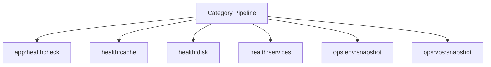

# Bootstrap Spark Operations Manual

## Overview

Deep operational documentation for Spark commands in this category.

## Operational Purpose

Define when and how operators should run commands safely in production and CI.

## Command Inventory

- `app:healthcheck` (Diagnostic)
- `health:cache` (Diagnostic)
- `health:disk` (Diagnostic)
- `health:services` (Diagnostic)
- `ops:env:snapshot` (Operational)
- `ops:vps:snapshot` (Operational)

## Command Reference

### app:healthcheck

**Purpose**  
Compatibility healthcheck command aligned to AI-Ops spark checks.

**Usage**  
`php spark app:healthcheck`

**Options**  
`--dry-run`, `Preview actions without writing data`

**Services Used**  
`App\Services\Spark\LogHealthcheckService`

**Models Used**  
None detected.

**Tables Used**  
None detected.

**External APIs**  
None detected.

**Related Commands**  
`app:healthcheck`

**Expected Output**  
Command status and diagnostics are printed to console and logs.

**Example Execution**  
`php spark app:healthcheck`

### health:cache

**Purpose**  
Check CI4 writable cache directories for access.

**Usage**  
`php spark health:cache`

**Options**  
None documented.

**Services Used**  
None detected.

**Models Used**  
None detected.

**Tables Used**  
None detected.

**External APIs**  
None detected.

**Related Commands**  
`master:run-all`

**Expected Output**  
Command status and diagnostics are printed to console and logs.

**Example Execution**  
`php spark health:cache`

### health:disk

**Purpose**  
Check disk and inode usage for the host.

**Usage**  
`php spark health:disk`

**Options**  
None documented.

**Services Used**  
`App\Services\Triage\CommandRunner`

**Models Used**  
None detected.

**Tables Used**  
None detected.

**External APIs**  
None detected.

**Related Commands**  
`master:run-all`

**Expected Output**  
Command status and diagnostics are printed to console and logs.

**Example Execution**  
`php spark health:disk`

### health:services

**Purpose**  
Detect web server + PHP handler status without systemctl.

**Usage**  
`php spark health:services`

**Options**  
None documented.

**Services Used**  
`App\Services\Triage\CommandRunner`, `App\Services\Triage\HostingModeDetector`

**Models Used**  
None detected.

**Tables Used**  
None detected.

**External APIs**  
None detected.

**Related Commands**  
`master:run-all`

**Expected Output**  
Command status and diagnostics are printed to console and logs.

**Example Execution**  
`php spark health:services`

### ops:env:snapshot

**Purpose**  
Print key env vars with secret redaction (safe for logs/screenshots).

**Usage**  
`php spark ops:env:snapshot`

**Options**  
None documented.

**Services Used**  
None detected.

**Models Used**  
None detected.

**Tables Used**  
None detected.

**External APIs**  
None detected.

**Related Commands**  
`master:run-all`

**Expected Output**  
Command status and diagnostics are printed to console and logs.

**Example Execution**  
`php spark ops:env:snapshot`

### ops:vps:snapshot

**Purpose**  
Collect system/runtime snapshot (no-sudo, best-effort) and write docs/_aiops snapshot.

**Usage**  
`php spark ops:vps:snapshot`

**Options**  
None documented.

**Services Used**  
None detected.

**Models Used**  
None detected.

**Tables Used**  
None detected.

**External APIs**  
None detected.

**Related Commands**  
`master:run-all`

**Expected Output**  
Command status and diagnostics are printed to console and logs.

**Example Execution**  
`php spark ops:vps:snapshot`

## Dependencies

| Relationship | Target | Type |
|---|---|---|
| `app:healthcheck` | `App\Services\Spark\LogHealthcheckService` | Command → Service |
| `app:healthcheck` | `app:healthcheck` | Command → Command |
| `health:disk` | `App\Services\Triage\CommandRunner` | Command → Service |
| `health:services` | `App\Services\Triage\CommandRunner` | Command → Service |
| `health:services` | `App\Services\Triage\HostingModeDetector` | Command → Service |

## Command Dependency Graph

## Execution Workflows

- `php spark app:healthcheck`
- `php spark health:cache`
- `php spark health:disk`
- `php spark health:services`
- `php spark ops:env:snapshot`
- `php spark ops:vps:snapshot`
- `php spark master:run-all`

## Operational Playbooks

**Investigate Application Failure**

- `php spark logs:doctor`
- `php spark ops:php:fpm:health`
- `php spark ops:server:nginx:status`
- `php spark spark:diagnose-503`

**Diagnose Database Issue**

- `php spark db:inventory`
- `php spark db:drift`
- `php spark aiops:sql:check`

## Troubleshooting

- Common failures: registry misses, dependency outages, schema drift, permission issues.
- Diagnostics commands: `php spark ops:commands:audit`, `php spark ops:commands:missing`, `php spark logs:doctor`.
- Recovery steps: repair namespaces, clear cache, rerun worker and health checks.

## Related Commands

- `master:run-all`

## Console Registry Verification

Review `app/Config/Console.php` and command auto-discovery output from `ops:commands:missing`; add explicit `$commands` entries for commands that must be hard-registered in your environment.
