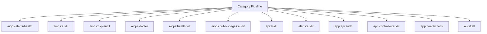

# Diagnostics Spark Operations Manual

## Overview

Deep operational documentation for Spark commands in this category.

## Operational Purpose

Define when and how operators should run commands safely in production and CI.

## Command Inventory

- `aiops:alerts-health` (Diagnostic)
- `aiops:audit` (Diagnostic)
- `aiops:csp:audit` (Diagnostic)
- `aiops:doctor` (Diagnostic)
- `aiops:health:full` (Diagnostic)
- `aiops:public-pages:audit` (Diagnostic)
- `api:audit` (Diagnostic)
- `alerts:audit` (Diagnostic)
- `app:api:audit` (Diagnostic)
- `app:controller:audit` (Diagnostic)
- `app:healthcheck` (Diagnostic)
- `audit:all` (Diagnostic)
- `audit:node` (Diagnostic)
- `audit:psr4` (Diagnostic)
- `auth:audit` (Diagnostic)
- `cache:audit` (Diagnostic)
- `chat:audit` (Diagnostic)
- `codex:audit` (Diagnostic)
- `codex:instruct:audit` (Diagnostic)
- `app:compat-audit` (Diagnostic)
- `docs:audit` (Diagnostic)
- `docs:full-audit` (Diagnostic)
- `env:doctor` (Diagnostic)
- `spark:diagnose-502` (Diagnostic)
- `spark:diagnose-503` (Diagnostic)
- `gtm:health:snapshot` (Diagnostic)
- `gtm:launch:audit` (Diagnostic)
- `health:cache` (Diagnostic)
- `health:disk` (Diagnostic)
- `health:git-safety` (Diagnostic)
- `health:services` (Diagnostic)
- `logger:audit` (Diagnostic)
- `logs:doctor` (Diagnostic)
- `logs:healthcheck` (Diagnostic)
- `marketing:automation-audit` (Diagnostic)
- `master:health:commands` (Diagnostic)
- `master:health:controllers` (Diagnostic)
- `master:health:dependencies` (Diagnostic)
- `master:health:docs` (Diagnostic)
- `master:health:logs` (Diagnostic)
- `master:health:models` (Diagnostic)
- `master:health:routes` (Diagnostic)
- `master:health:services` (Diagnostic)
- `master:health:views` (Diagnostic)
- `news:audit` (Diagnostic)
- `ollama:diagnose` (Diagnostic)
- `ollama:doctor` (Diagnostic)
- `ollama:health` (Diagnostic)
- `ops:commands:audit` (Diagnostic)
- `ops:doctor:full` (Diagnostic)
- `dreamhost:email-audit` (Diagnostic)
- `email:healthcheck` (Diagnostic)
- `ops:healthcheck` (Diagnostic)
- `ops:model-limit:audit` (Diagnostic)
- `ops:php-fpm-health` (Diagnostic)
- `ops:subs:audit` (Diagnostic)
- `ops:subs:doctor` (Diagnostic)
- `repo:health` (Diagnostic)
- `routes:auth-audit` (Diagnostic)
- `runtime:diagnose-502` (Diagnostic)

## Command Reference

### aiops:alerts-health

**Purpose**  
Run health checks on aiops alert queue and notify if failures are high

**Usage**  
`php spark aiops:alerts-health`

**Options**  
None documented.

**Services Used**  
`App\Services\SlackWebhookService`

**Models Used**  
None detected.

**Tables Used**  
`aiops_email_queue`

**External APIs**  
None detected.

**Related Commands**  
`ops:commands:audit`, `ops:commands:missing`

**Expected Output**  
Command status and diagnostics are printed to console and logs.

**Example Execution**  
`php spark aiops:alerts-health`

### aiops:audit

**Purpose**  
Audit aiops runtime, orchestration routes, and n8n/docs readiness

**Usage**  
`php spark aiops:audit`

**Options**  
`--json`, `Output JSON payload.`

**Services Used**  
None detected.

**Models Used**  
None detected.

**Tables Used**  
None detected.

**External APIs**  
None detected.

**Related Commands**  
`ops:commands:audit`, `ops:commands:missing`

**Expected Output**  
Command status and diagnostics are printed to console and logs.

**Example Execution**  
`php spark aiops:audit`

### aiops:csp:audit

**Purpose**  
Scans the repository for CSP violations and writes a dated audit report.

**Usage**  
`php spark aiops:csp:audit`

**Options**  
`--dry-run`, `Scan and print summary without writing markdown report.`

**Services Used**  
None detected.

**Models Used**  
None detected.

**Tables Used**  
None detected.

**External APIs**  
None detected.

**Related Commands**  
`ops:commands:audit`, `ops:commands:missing`

**Expected Output**  
Command status and diagnostics are printed to console and logs.

**Example Execution**  
`php spark aiops:csp:audit`

### aiops:doctor

**Purpose**  
Validate AIOps service wiring, namespace casing, and Spark helper migration state.

**Usage**  
`php spark aiops:doctor`

**Options**  
None documented.

**Services Used**  
None detected.

**Models Used**  
None detected.

**Tables Used**  
None detected.

**External APIs**  
None detected.

**Related Commands**  
`ops:commands:audit`, `ops:commands:missing`

**Expected Output**  
Command status and diagnostics are printed to console and logs.

**Example Execution**  
`php spark aiops:doctor`

### aiops:health:full

**Purpose**  
Run full system health checks and generate a consolidated report

**Usage**  
`php spark aiops:health:full`

**Options**  
None documented.

**Services Used**  
None detected.

**Models Used**  
None detected.

**Tables Used**  
None detected.

**External APIs**  
None detected.

**Related Commands**  
`ops:commands:audit`, `ops:commands:missing`

**Expected Output**  
Command status and diagnostics are printed to console and logs.

**Example Execution**  
`php spark aiops:health:full`

### aiops:public-pages:audit

**Purpose**  
Audit public pages schema coverage, freshness, and governance conditions.

**Usage**  
`php spark aiops:public-pages:audit`

**Options**  
None documented.

**Services Used**  
None detected.

**Models Used**  
None detected.

**Tables Used**  
`bf_public_pages_published`, `bf_public_pages_catalog`, `bf_public_pages_drafts`

**External APIs**  
None detected.

**Related Commands**  
`ops:commands:audit`, `ops:commands:missing`

**Expected Output**  
Command status and diagnostics are printed to console and logs.

**Example Execution**  
`php spark aiops:public-pages:audit`

### api:audit

**Purpose**  
Institutional API governance audit: routes, permissions, filters, rate limits, and versioning.

**Usage**  
`php spark api:audit`

**Options**  
None documented.

**Services Used**  
`App\Services\ApiGovernanceService`

**Models Used**  
None detected.

**Tables Used**  
`bf_api_audit_runs`, `bf_api_audit_findings`, `bf_api_endpoints`, `bf_api_endpoint_rules`

**External APIs**  
None detected.

**Related Commands**  
`ops:commands:audit`, `ops:commands:missing`

**Expected Output**  
Command status and diagnostics are printed to console and logs.

**Example Execution**  
`php spark api:audit`

### alerts:audit

**Purpose**  
Audit recent scraped alert emails against generated trade alerts.

**Usage**  
`php spark alerts:audit`

**Options**  
`--dry-run`, `Preview actions without writing audit artifacts`

**Services Used**  
None detected.

**Models Used**  
`App\Models\AlertsModel`

**Tables Used**  
`bf_investment_scraper`, `bf_investment_trade_alerts`, `bf_error_logs`

**External APIs**  
None detected.

**Related Commands**  
`ops:commands:audit`, `ops:commands:missing`

**Expected Output**  
Command status and diagnostics are printed to console and logs.

**Example Execution**  
`php spark alerts:audit`

### app:api:audit

**Purpose**  
Advanced API audit: groups, filters, duplicates, OpenAPI, Postman, probe mode.

**Usage**  
`php spark app:api:audit`

**Options**  
None documented.

**Services Used**  
None detected.

**Models Used**  
None detected.

**Tables Used**  
None detected.

**External APIs**  
`https://schema.getpostman.com/json/collection/v2.1.0/collection.json`

**Related Commands**  
`ops:commands:audit`, `ops:commands:missing`

**Expected Output**  
Command status and diagnostics are printed to console and logs.

**Example Execution**  
`php spark app:api:audit`

### app:controller:audit

**Purpose**  
Audit controllers for unsafe initController patterns, score severity, suggest patches, optional safe auto-fix, and regression diff.

**Usage**  
`php spark app:controller:audit`

**Options**  
None documented.

**Services Used**  
None detected.

**Models Used**  
None detected.

**Tables Used**  
`method`

**External APIs**  
None detected.

**Related Commands**  
`ops:commands:audit`, `ops:commands:missing`

**Expected Output**  
Command status and diagnostics are printed to console and logs.

**Example Execution**  
`php spark app:controller:audit`

### app:healthcheck

**Purpose**  
Compatibility healthcheck command aligned to AI-Ops spark checks.

**Usage**  
`php spark app:healthcheck`

**Options**  
`--dry-run`, `Preview actions without writing data`

**Services Used**  
`App\Services\Spark\LogHealthcheckService`

**Models Used**  
None detected.

**Tables Used**  
None detected.

**External APIs**  
None detected.

**Related Commands**  
`app:healthcheck`

**Expected Output**  
Command status and diagnostics are printed to console and logs.

**Example Execution**  
`php spark app:healthcheck`

### audit:all

**Purpose**  
Full system visibility audit

**Usage**  
`php spark audit:all`

**Options**  
None documented.

**Services Used**  
None detected.

**Models Used**  
None detected.

**Tables Used**  
None detected.

**External APIs**  
None detected.

**Related Commands**  
`ops:commands:audit`, `ops:commands:missing`

**Expected Output**  
Command status and diagnostics are printed to console and logs.

**Example Execution**  
`php spark audit:all`

### audit:node

**Purpose**  
Detect tracked node_modules and native build artifacts (read-only).

**Usage**  
`php spark audit:node`

**Options**  
None documented.

**Services Used**  
None detected.

**Models Used**  
None detected.

**Tables Used**  
None detected.

**External APIs**  
None detected.

**Related Commands**  
`ops:commands:audit`, `ops:commands:missing`

**Expected Output**  
Command status and diagnostics are printed to console and logs.

**Example Execution**  
`php spark audit:node`

### audit:psr4

**Purpose**  
Audit PSR-4 compliance for the app namespace.

**Usage**  
`php spark audit:psr4`

**Options**  
`--ci`, `Exit non-zero if violations are detected.`, `--json`, `Output JSON instead of CLI formatting.`, `--dry-run`, `Preview actions without writing data`

**Services Used**  
None detected.

**Models Used**  
None detected.

**Tables Used**  
None detected.

**External APIs**  
None detected.

**Related Commands**  
`ops:commands:audit`, `ops:commands:missing`

**Expected Output**  
Command status and diagnostics are printed to console and logs.

**Example Execution**  
`php spark audit:psr4`

### auth:audit

**Purpose**  
Audit Myth:Auth authentication and account lifecycle flows end-to-end, including registration, login, and reset flows.

**Usage**  
`php spark auth:audit`

**Options**  
`--dry-run`, `Preview actions without writing data`

**Services Used**  
`App\Services\Spark\AuthAuditRunner`

**Models Used**  
None detected.

**Tables Used**  
None detected.

**External APIs**  
None detected.

**Related Commands**  
`ops:commands:audit`, `ops:commands:missing`

**Expected Output**  
Command status and diagnostics are printed to console and logs.

**Example Execution**  
`php spark auth:audit`

### cache:audit

**Purpose**  
Scan the repo for unsafe cache key usage.

**Usage**  
`php spark cache:audit`

**Options**  
`--dry-run`, `Preview actions without writing data`

**Services Used**  
None detected.

**Models Used**  
None detected.

**Tables Used**  
None detected.

**External APIs**  
None detected.

**Related Commands**  
`ops:commands:audit`, `ops:commands:missing`

**Expected Output**  
Command status and diagnostics are printed to console and logs.

**Example Execution**  
`php spark cache:audit`

### chat:audit

**Purpose**  
Chat audit

**Usage**  
`php spark chat:audit`

**Options**  
`--json`, `JSON`

**Services Used**  
None detected.

**Models Used**  
None detected.

**Tables Used**  
None detected.

**External APIs**  
None detected.

**Related Commands**  
`ops:commands:audit`, `ops:commands:missing`

**Expected Output**  
Command status and diagnostics are printed to console and logs.

**Example Execution**  
`php spark chat:audit`

### codex:audit

**Purpose**  
Full repository audit via OpenAI

**Usage**  
`php spark codex:audit`

**Options**  
None documented.

**Services Used**  
None detected.

**Models Used**  
None detected.

**Tables Used**  
None detected.

**External APIs**  
`https://api.openai.com/v1/chat/completions`

**Related Commands**  
`codex:index`

**Expected Output**  
Command status and diagnostics are printed to console and logs.

**Example Execution**  
`php spark codex:audit`

### codex:instruct:audit

**Purpose**  
Batch review repository files via OpenAI API

**Usage**  
`php spark codex:instruct:audit`

**Options**  
None documented.

**Services Used**  
None detected.

**Models Used**  
None detected.

**Tables Used**  
None detected.

**External APIs**  
`https://api.openai.com/v1/chat/completions`

**Related Commands**  
`ops:commands:audit`, `ops:commands:missing`

**Expected Output**  
Command status and diagnostics are printed to console and logs.

**Example Execution**  
`php spark codex:instruct:audit`

### app:compat-audit

**Purpose**  
Audit MyMI Wallet for CI4 + PHP compatibility issues.

**Usage**  
`php spark app:compat-audit`

**Options**  
`--fix`, `Attempt safe auto-fixes for deterministic replacements.`, `--php`, `Target PHP version for forward-compat assessment (default: current).`, `--json`, `Write JSON report to path (default: writable/compat-audit-<timestamp>.json).`, `--csv`, `Write CSV report to path (default: writable/compat-audit-<timestamp>.csv).`

**Services Used**  
None detected.

**Models Used**  
None detected.

**Tables Used**  
`table`, `CI3`

**External APIs**  
None detected.

**Related Commands**  
`ops:commands:audit`, `ops:commands:missing`

**Expected Output**  
Command status and diagnostics are printed to console and logs.

**Example Execution**  
`php spark app:compat-audit`

### docs:audit

**Purpose**  
Audit CI4 codebase vs /docs documentation

**Usage**  
`php spark docs:audit`

**Options**  
None documented.

**Services Used**  
None detected.

**Models Used**  
None detected.

**Tables Used**  
None detected.

**External APIs**  
None detected.

**Related Commands**  
`ops:commands:audit`, `ops:commands:missing`

**Expected Output**  
Command status and diagnostics are printed to console and logs.

**Example Execution**  
`php spark docs:audit`

### docs:full-audit

**Purpose**  
No description provided.

**Usage**  
`php spark docs:full-audit`

**Options**  
None documented.

**Services Used**  
None detected.

**Models Used**  
None detected.

**Tables Used**  
None detected.

**External APIs**  
None detected.

**Related Commands**  
`ops:commands:audit`, `ops:commands:missing`

**Expected Output**  
Command status and diagnostics are printed to console and logs.

**Example Execution**  
`php spark docs:full-audit`

### env:doctor

**Purpose**  
Environment diagnostics and snapshot.

**Usage**  
`php spark env:doctor`

**Options**  
`--notify=discord`, `Send summary to Discord.`, `--pack`, `Bundle JSON/Markdown into a tar.gz for sharing.`

**Services Used**  
`App\Services\Ops\EnvDoctorService`

**Models Used**  
None detected.

**Tables Used**  
`a`

**External APIs**  
`Discord`

**Related Commands**  
`ops:commands:audit`, `ops:commands:missing`

**Expected Output**  
Command status and diagnostics are printed to console and logs.

**Example Execution**  
`php spark env:doctor`

### spark:diagnose-502

**Purpose**  
Diagnose common 502 causes (php-fpm, nginx, socket).

**Usage**  
`php spark spark:diagnose-502`

**Options**  
None documented.

**Services Used**  
None detected.

**Models Used**  
None detected.

**Tables Used**  
None detected.

**External APIs**  
None detected.

**Related Commands**  
`ops:commands:audit`, `ops:commands:missing`

**Expected Output**  
Command status and diagnostics are printed to console and logs.

**Example Execution**  
`php spark spark:diagnose-502`

### spark:diagnose-503

**Purpose**  
Diagnose common 503 causes (cache, maintenance, upstream).

**Usage**  
`php spark spark:diagnose-503`

**Options**  
None documented.

**Services Used**  
None detected.

**Models Used**  
None detected.

**Tables Used**  
None detected.

**External APIs**  
None detected.

**Related Commands**  
`ops:commands:audit`, `ops:commands:missing`

**Expected Output**  
Command status and diagnostics are printed to console and logs.

**Example Execution**  
`php spark spark:diagnose-503`

## Dependencies

| Relationship | Target | Type |
|---|---|---|
| `aiops:alerts-health` | `App\Services\SlackWebhookService` | Command → Service |
| `aiops:alerts-health` | `aiops_email_queue` | Command → Table |
| `aiops:public-pages:audit` | `bf_public_pages_published` | Command → Table |
| `aiops:public-pages:audit` | `bf_public_pages_catalog` | Command → Table |
| `api:audit` | `App\Services\ApiGovernanceService` | Command → Service |
| `api:audit` | `bf_api_audit_runs` | Command → Table |
| `api:audit` | `bf_api_audit_findings` | Command → Table |
| `alerts:audit` | `App\Models\AlertsModel` | Command → Model |
| `alerts:audit` | `bf_investment_scraper` | Command → Table |
| `alerts:audit` | `bf_investment_trade_alerts` | Command → Table |
| `app:controller:audit` | `method` | Command → Table |
| `app:healthcheck` | `App\Services\Spark\LogHealthcheckService` | Command → Service |
| `app:healthcheck` | `app:healthcheck` | Command → Command |
| `auth:audit` | `App\Services\Spark\AuthAuditRunner` | Command → Service |
| `codex:audit` | `codex:index` | Command → Command |
| `app:compat-audit` | `table` | Command → Table |
| `app:compat-audit` | `CI3` | Command → Table |
| `env:doctor` | `App\Services\Ops\EnvDoctorService` | Command → Service |
| `env:doctor` | `a` | Command → Table |
| `gtm:health:snapshot` | `gtm:health:snapshot` | Command → Command |
| `gtm:launch:audit` | `gtm:launch:audit` | Command → Command |
| `health:disk` | `App\Services\Triage\CommandRunner` | Command → Service |
| `health:git-safety` | `App\Services\Triage\CommandRunner` | Command → Service |

## Command Dependency Graph

## Execution Workflows

- `php spark aiops:alerts-health`
- `php spark aiops:audit`
- `php spark aiops:csp:audit`
- `php spark aiops:doctor`
- `php spark aiops:health:full`
- `php spark aiops:public-pages:audit`
- `php spark api:audit`
- `php spark alerts:audit`
- `php spark ops:commands:audit`
- `php spark ops:commands:missing`

## Operational Playbooks

**Investigate Application Failure**

- `php spark logs:doctor`
- `php spark ops:php:fpm:health`
- `php spark ops:server:nginx:status`
- `php spark spark:diagnose-503`

**Diagnose Database Issue**

- `php spark db:inventory`
- `php spark db:drift`
- `php spark aiops:sql:check`

## Troubleshooting

- Common failures: registry misses, dependency outages, schema drift, permission issues.
- Diagnostics commands: `php spark ops:commands:audit`, `php spark ops:commands:missing`, `php spark logs:doctor`.
- Recovery steps: repair namespaces, clear cache, rerun worker and health checks.

## Related Commands

- `ops:commands:audit`
- `ops:commands:missing`

## Console Registry Verification

Review `app/Config/Console.php` and command auto-discovery output from `ops:commands:missing`; add explicit `$commands` entries for commands that must be hard-registered in your environment.
