# Documentation Spark Operations Manual

## Overview

Deep operational documentation for Spark commands in this category.

## Operational Purpose

Define when and how operators should run commands safely in production and CI.

## Command Inventory

- `aiops:docs-sync` (Maintenance)
- `docs:architecture:graph` (Maintenance)
- `docs:architecture-map` (Maintenance)
- `docs:audit` (Diagnostic)
- `docs:database:map` (Maintenance)
- `docs:dependencies:map` (Maintenance)
- `docs:views:export` (Maintenance)
- `docs:full-audit` (Diagnostic)
- `docs:readme:build` (Maintenance)
- `docs:generate-missing` (Maintenance)
- `docs:inventory` (Maintenance)
- `docs:modules:map` (Maintenance)
- `docs:routes:inventory` (Maintenance)
- `docs:controllers:list` (Maintenance)
- `docs:services:list` (Maintenance)
- `docs:views:dirs` (Maintenance)
- `docs:views:list` (Maintenance)
- `docs:spark:inventory` (Maintenance)
- `docs:sync-all` (Maintenance)
- `docs:sync-code` (Maintenance)
- `docs:sync-system` (Maintenance)
- `ollama:docs:inventory` (Maintenance)
- `ollama:docs:sync` (Maintenance)

## Command Reference

### aiops:docs-sync

**Purpose**  
Run documentation sync pipeline using DocsSyncEngine

**Usage**  
`php spark aiops:docs-sync`

**Options**  
None documented.

**Services Used**  
None detected.

**Models Used**  
None detected.

**Tables Used**  
None detected.

**External APIs**  
None detected.

**Related Commands**  
`aiops:docs-sync`

**Expected Output**  
Command status and diagnostics are printed to console and logs.

**Example Execution**  
`php spark aiops:docs-sync`

### docs:architecture:graph

**Purpose**  
Generate CI4 architecture graph

**Usage**  
`php spark docs:architecture:graph`

**Options**  
None documented.

**Services Used**  
None detected.

**Models Used**  
None detected.

**Tables Used**  
None detected.

**External APIs**  
None detected.

**Related Commands**  
`docs:sync-all-docs`

**Expected Output**  
Command status and diagnostics are printed to console and logs.

**Example Execution**  
`php spark docs:architecture:graph`

### docs:architecture-map

**Purpose**  
Generate architecture map of CI4 application

**Usage**  
`php spark docs:architecture-map`

**Options**  
None documented.

**Services Used**  
None detected.

**Models Used**  
None detected.

**Tables Used**  
None detected.

**External APIs**  
None detected.

**Related Commands**  
`docs:sync-all-docs`

**Expected Output**  
Command status and diagnostics are printed to console and logs.

**Example Execution**  
`php spark docs:architecture-map`

### docs:audit

**Purpose**  
Audit CI4 codebase vs /docs documentation

**Usage**  
`php spark docs:audit`

**Options**  
None documented.

**Services Used**  
None detected.

**Models Used**  
None detected.

**Tables Used**  
None detected.

**External APIs**  
None detected.

**Related Commands**  
`docs:sync-all-docs`

**Expected Output**  
Command status and diagnostics are printed to console and logs.

**Example Execution**  
`php spark docs:audit`

### docs:database:map

**Purpose**  
No description provided.

**Usage**  
`php spark docs:database:map`

**Options**  
None documented.

**Services Used**  
None detected.

**Models Used**  
None detected.

**Tables Used**  
None detected.

**External APIs**  
None detected.

**Related Commands**  
`docs:sync-all-docs`

**Expected Output**  
Command status and diagnostics are printed to console and logs.

**Example Execution**  
`php spark docs:database:map`

### docs:dependencies:map

**Purpose**  
No description provided.

**Usage**  
`php spark docs:dependencies:map`

**Options**  
None documented.

**Services Used**  
None detected.

**Models Used**  
None detected.

**Tables Used**  
None detected.

**External APIs**  
None detected.

**Related Commands**  
`docs:sync-all-docs`

**Expected Output**  
Command status and diagnostics are printed to console and logs.

**Example Execution**  
`php spark docs:dependencies:map`

### docs:views:export

**Purpose**  
No description provided.

**Usage**  
`php spark docs:views:export`

**Options**  
None documented.

**Services Used**  
None detected.

**Models Used**  
None detected.

**Tables Used**  
None detected.

**External APIs**  
None detected.

**Related Commands**  
`docs:sync-all-docs`

**Expected Output**  
Command status and diagnostics are printed to console and logs.

**Example Execution**  
`php spark docs:views:export`

### docs:full-audit

**Purpose**  
No description provided.

**Usage**  
`php spark docs:full-audit`

**Options**  
None documented.

**Services Used**  
None detected.

**Models Used**  
None detected.

**Tables Used**  
None detected.

**External APIs**  
None detected.

**Related Commands**  
`docs:sync-all-docs`

**Expected Output**  
Command status and diagnostics are printed to console and logs.

**Example Execution**  
`php spark docs:full-audit`

### docs:readme:build

**Purpose**  
No description provided.

**Usage**  
`php spark docs:readme:build`

**Options**  
None documented.

**Services Used**  
None detected.

**Models Used**  
None detected.

**Tables Used**  
None detected.

**External APIs**  
None detected.

**Related Commands**  
`docs:sync-all-docs`

**Expected Output**  
Command status and diagnostics are printed to console and logs.

**Example Execution**  
`php spark docs:readme:build`

### docs:generate-missing

**Purpose**  
Generate documentation for undocumented controllers

**Usage**  
`php spark docs:generate-missing`

**Options**  
None documented.

**Services Used**  
None detected.

**Models Used**  
None detected.

**Tables Used**  
None detected.

**External APIs**  
None detected.

**Related Commands**  
`docs:sync-all-docs`

**Expected Output**  
Command status and diagnostics are printed to console and logs.

**Example Execution**  
`php spark docs:generate-missing`

### docs:inventory

**Purpose**  
Scan /docs directory and generate docs/_inventory.md

**Usage**  
`php spark docs:inventory`

**Options**  
None documented.

**Services Used**  
None detected.

**Models Used**  
None detected.

**Tables Used**  
None detected.

**External APIs**  
None detected.

**Related Commands**  
`docs:inventory`

**Expected Output**  
Command status and diagnostics are printed to console and logs.

**Example Execution**  
`php spark docs:inventory`

### docs:modules:map

**Purpose**  
No description provided.

**Usage**  
`php spark docs:modules:map`

**Options**  
None documented.

**Services Used**  
None detected.

**Models Used**  
None detected.

**Tables Used**  
None detected.

**External APIs**  
None detected.

**Related Commands**  
`docs:sync-all-docs`

**Expected Output**  
Command status and diagnostics are printed to console and logs.

**Example Execution**  
`php spark docs:modules:map`

### docs:routes:inventory

**Purpose**  
No description provided.

**Usage**  
`php spark docs:routes:inventory`

**Options**  
None documented.

**Services Used**  
None detected.

**Models Used**  
None detected.

**Tables Used**  
None detected.

**External APIs**  
None detected.

**Related Commands**  
`docs:sync-all-docs`

**Expected Output**  
Command status and diagnostics are printed to console and logs.

**Example Execution**  
`php spark docs:routes:inventory`

### docs:controllers:list

**Purpose**  
List all module controllers

**Usage**  
`php spark docs:controllers:list`

**Options**  
None documented.

**Services Used**  
None detected.

**Models Used**  
None detected.

**Tables Used**  
None detected.

**External APIs**  
None detected.

**Related Commands**  
`docs:sync-all-docs`

**Expected Output**  
Command status and diagnostics are printed to console and logs.

**Example Execution**  
`php spark docs:controllers:list`

### docs:services:list

**Purpose**  
List all Services classes

**Usage**  
`php spark docs:services:list`

**Options**  
None documented.

**Services Used**  
None detected.

**Models Used**  
None detected.

**Tables Used**  
None detected.

**External APIs**  
None detected.

**Related Commands**  
`docs:sync-all-docs`

**Expected Output**  
Command status and diagnostics are printed to console and logs.

**Example Execution**  
`php spark docs:services:list`

### docs:views:dirs

**Purpose**  
No description provided.

**Usage**  
`php spark docs:views:dirs`

**Options**  
None documented.

**Services Used**  
None detected.

**Models Used**  
None detected.

**Tables Used**  
None detected.

**External APIs**  
None detected.

**Related Commands**  
`docs:sync-all-docs`

**Expected Output**  
Command status and diagnostics are printed to console and logs.

**Example Execution**  
`php spark docs:views:dirs`

### docs:views:list

**Purpose**  
No description provided.

**Usage**  
`php spark docs:views:list`

**Options**  
None documented.

**Services Used**  
None detected.

**Models Used**  
None detected.

**Tables Used**  
None detected.

**External APIs**  
None detected.

**Related Commands**  
`docs:sync-all-docs`

**Expected Output**  
Command status and diagnostics are printed to console and logs.

**Example Execution**  
`php spark docs:views:list`

### docs:spark:inventory

**Purpose**  
No description provided.

**Usage**  
`php spark docs:spark:inventory`

**Options**  
None documented.

**Services Used**  
None detected.

**Models Used**  
None detected.

**Tables Used**  
None detected.

**External APIs**  
None detected.

**Related Commands**  
`docs:sync-all-docs`

**Expected Output**  
Command status and diagnostics are printed to console and logs.

**Example Execution**  
`php spark docs:spark:inventory`

### docs:sync-all

**Purpose**  
Run full documentation pipeline

**Usage**  
`php spark docs:sync-all`

**Options**  
None documented.

**Services Used**  
None detected.

**Models Used**  
None detected.

**Tables Used**  
None detected.

**External APIs**  
None detected.

**Related Commands**  
`docs:sync-all-docs`

**Expected Output**  
Command status and diagnostics are printed to console and logs.

**Example Execution**  
`php spark docs:sync-all`

### docs:sync-code

**Purpose**  
Analyze /docs and generate repository patches to align code with documentation.

**Usage**  
`php spark docs:sync-code`

**Options**  
None documented.

**Services Used**  
`App\Services\Docs\DocsSyncEngine`

**Models Used**  
None detected.

**Tables Used**  
None detected.

**External APIs**  
None detected.

**Related Commands**  
`docs:sync-code`

**Expected Output**  
Command status and diagnostics are printed to console and logs.

**Example Execution**  
`php spark docs:sync-code`

### docs:sync-system

**Purpose**  
No description provided.

**Usage**  
`php spark docs:sync-system`

**Options**  
None documented.

**Services Used**  
`App\Services\Docs\DocsSyncEngine`

**Models Used**  
None detected.

**Tables Used**  
None detected.

**External APIs**  
None detected.

**Related Commands**  
`docs:sync-all-docs`

**Expected Output**  
Command status and diagnostics are printed to console and logs.

**Example Execution**  
`php spark docs:sync-system`

### ollama:docs:inventory

**Purpose**  
Builds docs embedding/metadata manifest.

**Usage**  
`php spark ollama:docs:inventory`

**Options**  
`--json`, `JSON output`, `--base-url`, `Override URL`, `--timeout`, `Timeout`, `--dry-run`, `Dry run where supported`

**Services Used**  
None detected.

**Models Used**  
None detected.

**Tables Used**  
None detected.

**External APIs**  
`Ollama`

**Related Commands**  
`docs:sync-all-docs`

**Expected Output**  
Command status and diagnostics are printed to console and logs.

**Example Execution**  
`php spark ollama:docs:inventory`

### ollama:docs:sync

**Purpose**  
Regenerates Ollama inventory and policy docs.

**Usage**  
`php spark ollama:docs:sync`

**Options**  
`--profile`, `Profile name`, `--base-url`, `URL`, `--timeout`, `Timeout`, `--json`, `JSON output`

**Services Used**  
None detected.

**Models Used**  
None detected.

**Tables Used**  
None detected.

**External APIs**  
`Ollama`

**Related Commands**  
`docs:sync-all-docs`

**Expected Output**  
Command status and diagnostics are printed to console and logs.

**Example Execution**  
`php spark ollama:docs:sync`

## Dependencies

| Relationship | Target | Type |
|---|---|---|
| `aiops:docs-sync` | `aiops:docs-sync` | Command → Command |
| `docs:inventory` | `docs:inventory` | Command → Command |
| `docs:sync-code` | `App\Services\Docs\DocsSyncEngine` | Command → Service |
| `docs:sync-code` | `docs:sync-code` | Command → Command |
| `docs:sync-system` | `App\Services\Docs\DocsSyncEngine` | Command → Service |

## Command Dependency Graph

```mermaid
graph TD
Category["Category Pipeline"]
Category --> aiops_docs_sync["aiops:docs-sync"]
Category --> docs_architecture_graph["docs:architecture:graph"]
Category --> docs_architecture_map["docs:architecture-map"]
Category --> docs_audit["docs:audit"]
Category --> docs_database_map["docs:database:map"]
Category --> docs_dependencies_map["docs:dependencies:map"]
Category --> docs_views_export["docs:views:export"]
Category --> docs_full_audit["docs:full-audit"]
Category --> docs_readme_build["docs:readme:build"]
Category --> docs_generate_missing["docs:generate-missing"]
Category --> docs_inventory["docs:inventory"]
Category --> docs_modules_map["docs:modules:map"]
```

## Execution Workflows

- `php spark aiops:docs-sync`
- `php spark docs:architecture:graph`
- `php spark docs:architecture-map`
- `php spark docs:audit`
- `php spark docs:database:map`
- `php spark docs:dependencies:map`
- `php spark docs:views:export`
- `php spark docs:full-audit`
- `php spark docs:sync-all-docs`

## Operational Playbooks

**Investigate Application Failure**

- `php spark logs:doctor`
- `php spark ops:php:fpm:health`
- `php spark ops:server:nginx:status`
- `php spark spark:diagnose-503`

**Diagnose Database Issue**

- `php spark db:inventory`
- `php spark db:drift`
- `php spark aiops:sql:check`

## Troubleshooting

- Common failures: registry misses, dependency outages, schema drift, permission issues.
- Diagnostics commands: `php spark ops:commands:audit`, `php spark ops:commands:missing`, `php spark logs:doctor`.
- Recovery steps: repair namespaces, clear cache, rerun worker and health checks.

## Related Commands

- `docs:sync-all-docs`

## Console Registry Verification

Review `app/Config/Console.php` and command auto-discovery output from `ops:commands:missing`; add explicit `$commands` entries for commands that must be hard-registered in your environment.
