# Infrastructure Spark Operations Manual

## Overview

Deep operational documentation for Spark commands in this category.

## Operational Purpose

Define when and how operators should run commands safely in production and CI.

## Command Inventory

- `ops:analyze-commands` (Operational)
- `ops:app:update` (Operational)
- `ops:console:build` (Operational)
- `ops:ci:prepare` (Operational)
- `ops:commands:audit` (Diagnostic)
- `ops:commands:autofix` (Automation)
- `ops:commands:inventory` (Operational)
- `ops:commands:lint` (Operational)
- `ops:commands:missing` (Operational)
- `ops:config:lint` (Operational)
- `ops:filesystem-scan` (Operational)
- `ops:diff` (Operational)
- `ops:diff:wallet` (Operational)
- `ops:doctor:full` (Diagnostic)
- `dreamhost:dns-verify` (Operational)
- `dreamhost:email-audit` (Diagnostic)
- `dreamhost:email-list` (Operational)
- `dreamhost:limits` (Operational)
- `ops:drift:scan` (Operational)
- `email:healthcheck` (Diagnostic)
- `email:queue-scan` (Operational)
- `email:test` (Operational)
- `ops:env:snapshot` (Operational)
- `ops:fetch-commands` (Operational)
- `ops:filesystem:fix` (Maintenance)
- `ops:filesystem:lint` (Operational)
- `ops:healthcheck` (Diagnostic)
- `ops:logger:test` (Operational)
- `logs:scan` (Operational)
- `logs:watch` (Operational)
- `ops:model-limit:audit` (Diagnostic)
- `ops:network:matrix` (Operational)
- `ops:next-steps` (Operational)
- `ops:next-steps:sync` (Maintenance)
- `ops:next-steps:sync-manual` (Maintenance)
- `ops:php-fpm-health` (Diagnostic)
- `ops:php:extensions` (Operational)
- `ops:propose-pr` (Operational)
- `ops:report` (Operational)
- `ops:self-heal` (Operational)
- `ops:nginx-status` (Operational)
- `ops:subs:audit` (Diagnostic)
- `ops:subs:doctor` (Diagnostic)
- `ops:subs:repair` (Maintenance)
- `ops:subs:status` (Operational)
- `ops:sync` (Maintenance)
- `ops:vps:snapshot` (Operational)
- `ops:integrity:wallet` (Operational)
- `ops:work` (Operational)

## Command Reference

### ops:analyze-commands

**Purpose**  
Analyze parsed ops inbox items and generate AI plans

**Usage**  
`php spark ops:analyze-commands`

**Options**  
`--dry-run`, `Preview actions without updating inbox items`, `--approve`, `Acknowledge and update inbox items`

**Services Used**  
`App\Services\OpsCommandService`

**Models Used**  
None detected.

**Tables Used**  
`inbox`

**External APIs**  
`https://api.openai.com/v1/chat/completions`

**Related Commands**  
`repo:health`, `logs:doctor`

**Expected Output**  
Command status and diagnostics are printed to console and logs.

**Example Execution**  
`php spark ops:analyze-commands`

### ops:app:update

**Purpose**  
Safely update and validate the CI4 application.

**Usage**  
`php spark ops:app:update`

**Options**  
`--dry-run`, `Report only (no changes)`, `--strict`, `External failures become fatal`, `--migrate`, `Run pending migrations`, `--migrate-only`, `Run database checks and stop`, `--no-api`, `Skip API checks`, `--no-aiops`, `Skip AIOps snapshot`, `--json`, `Emit JSON output`, `--allow-ci`, `Allow running in CI environment`

**Services Used**  
`App\Services\Ops\ApiHealthService`, `App\Services\Ops\AppSelfTestService`, `App\Services\Ops\ConfigAuditService`, `App\Services\Ops\DatabaseHealthService`, `App\Services\Ops\FilesystemHealthService`, `App\Services\Ops\SnapshotWriter`, `App\Services\Ops\SparkGovernanceService`

**Models Used**  
None detected.

**Tables Used**  
`and`, `environment`, `summary`

**External APIs**  
`https://api.marketaux.com`, `https://www.alphavantage.co`, `https://api.coingecko.com`

**Related Commands**  
`repo:health`, `logs:doctor`

**Expected Output**  
Command status and diagnostics are printed to console and logs.

**Example Execution**  
`php spark ops:app:update`

### ops:console:build

**Purpose**  
Rebuild Console.php command registry

**Usage**  
`php spark ops:console:build`

**Options**  
None documented.

**Services Used**  
None detected.

**Models Used**  
None detected.

**Tables Used**  
None detected.

**External APIs**  
None detected.

**Related Commands**  
`repo:health`, `logs:doctor`

**Expected Output**  
Command status and diagnostics are printed to console and logs.

**Example Execution**  
`php spark ops:console:build`

### ops:ci:prepare

**Purpose**  
Prepare deterministic writable/artifact directories for CI runs.

**Usage**  
`php spark ops:ci:prepare`

**Options**  
None documented.

**Services Used**  
None detected.

**Models Used**  
None detected.

**Tables Used**  
None detected.

**External APIs**  
None detected.

**Related Commands**  
`repo:health`, `logs:doctor`

**Expected Output**  
Command status and diagnostics are printed to console and logs.

**Example Execution**  
`php spark ops:ci:prepare`

### ops:commands:audit

**Purpose**  
Audit Spark commands for illegal constructors.

**Usage**  
`php spark ops:commands:audit`

**Options**  
`--json`, `Emit JSON output and write docs/_ops/commands-audit/ops-commands-audit.json`

**Services Used**  
None detected.

**Models Used**  
None detected.

**Tables Used**  
None detected.

**External APIs**  
None detected.

**Related Commands**  
`repo:health`, `logs:doctor`

**Expected Output**  
Command status and diagnostics are printed to console and logs.

**Example Execution**  
`php spark ops:commands:audit`

### ops:commands:autofix

**Purpose**  
Auto-fix Spark commands that define illegal constructors.

**Usage**  
`php spark ops:commands:autofix`

**Options**  
`--dry-run`, `Preview changes without modifying files (default)`, `--approve`, `Apply fixes and write updated files`

**Services Used**  
None detected.

**Models Used**  
None detected.

**Tables Used**  
None detected.

**External APIs**  
None detected.

**Related Commands**  
`repo:health`, `logs:doctor`

**Expected Output**  
Command status and diagnostics are printed to console and logs.

**Example Execution**  
`php spark ops:commands:autofix`

### ops:commands:inventory

**Purpose**  
Generate Spark command inventory from Console.php and command files.

**Usage**  
`php spark ops:commands:inventory`

**Options**  
`--emit`, `Output mode: docs (default: docs).`, `--out`, `Override artifact directory (must be inside docs/aiops/artifacts).`, `--dry-run`, `Generate a report without mutating state.`, `--approve`, `Acknowledge execution (required for mutating commands).`

**Services Used**  
None detected.

**Models Used**  
None detected.

**Tables Used**  
`Console`

**External APIs**  
None detected.

**Related Commands**  
`repo:health`, `logs:doctor`

**Expected Output**  
Command status and diagnostics are printed to console and logs.

**Example Execution**  
`php spark ops:commands:inventory`

### ops:commands:lint

**Purpose**  
Lint Spark commands for runtime safety contracts and documentation coverage.

**Usage**  
`php spark ops:commands:lint`

**Options**  
`--json`, `Emit JSON results to stdout`

**Services Used**  
None detected.

**Models Used**  
None detected.

**Tables Used**  
None detected.

**External APIs**  
None detected.

**Related Commands**  
`repo:health`, `logs:doctor`

**Expected Output**  
Command status and diagnostics are printed to console and logs.

**Example Execution**  
`php spark ops:commands:lint`

### ops:commands:missing

**Purpose**  
Check commands missing from Console registry

**Usage**  
`php spark ops:commands:missing`

**Options**  
None documented.

**Services Used**  
None detected.

**Models Used**  
None detected.

**Tables Used**  
`Console`

**External APIs**  
None detected.

**Related Commands**  
`repo:health`, `logs:doctor`

**Expected Output**  
Command status and diagnostics are printed to console and logs.

**Example Execution**  
`php spark ops:commands:missing`

### ops:config:lint

**Purpose**  
Lint Config files for illegal patterns (env(), dynamic expressions, protocols).

**Usage**  
`php spark ops:config:lint`

**Options**  
None documented.

**Services Used**  
None detected.

**Models Used**  
None detected.

**Tables Used**  
None detected.

**External APIs**  
None detected.

**Related Commands**  
`repo:health`, `logs:doctor`

**Expected Output**  
Command status and diagnostics are printed to console and logs.

**Example Execution**  
`php spark ops:config:lint`

### ops:filesystem-scan

**Purpose**  
Ops helper command: ops:filesystem-scan

**Usage**  
`php spark ops:filesystem-scan`

**Options**  
None documented.

**Services Used**  
`App\Services\Ops\VpsHealthService`

**Models Used**  
None detected.

**Tables Used**  
None detected.

**External APIs**  
None detected.

**Related Commands**  
`repo:health`, `logs:doctor`

**Expected Output**  
Command status and diagnostics are printed to console and logs.

**Example Execution**  
`php spark ops:filesystem-scan`

### ops:diff

**Purpose**  
Compare two files and persist AIOps diff artifact.

**Usage**  
`php spark ops:diff`

**Options**  
`--label`, `Optional label for diff folder`

**Services Used**  
None detected.

**Models Used**  
None detected.

**Tables Used**  
None detected.

**External APIs**  
None detected.

**Related Commands**  
`repo:health`, `logs:doctor`

**Expected Output**  
Command status and diagnostics are printed to console and logs.

**Example Execution**  
`php spark ops:diff`

### ops:diff:wallet

**Purpose**  
Run wallet-specific diff governance check.

**Usage**  
`php spark ops:diff:wallet`

**Options**  
None documented.

**Services Used**  
None detected.

**Models Used**  
None detected.

**Tables Used**  
None detected.

**External APIs**  
None detected.

**Related Commands**  
`ops:diff`

**Expected Output**  
Command status and diagnostics are printed to console and logs.

**Example Execution**  
`php spark ops:diff:wallet`

### ops:doctor:full

**Purpose**  
Run high-signal diagnostics: env, php extensions, network matrix, IMAP capabilities (best-effort).

**Usage**  
`php spark ops:doctor:full`

**Options**  
None documented.

**Services Used**  
None detected.

**Models Used**  
None detected.

**Tables Used**  
None detected.

**External APIs**  
None detected.

**Related Commands**  
`ops:php:extensions`, `ops:network:matrix`, `runtime:spark-doctor`, `dreamhost:imap-capabilities`

**Expected Output**  
Command status and diagnostics are printed to console and logs.

**Example Execution**  
`php spark ops:doctor:full`

### dreamhost:dns-verify

**Purpose**  
Ops helper command: dreamhost:dns-verify

**Usage**  
`php spark dreamhost:dns-verify`

**Options**  
None documented.

**Services Used**  
`App\Services\Ops\DreamHostService`

**Models Used**  
None detected.

**Tables Used**  
None detected.

**External APIs**  
None detected.

**Related Commands**  
`repo:health`, `logs:doctor`

**Expected Output**  
Command status and diagnostics are printed to console and logs.

**Example Execution**  
`php spark dreamhost:dns-verify`

### dreamhost:email-audit

**Purpose**  
Ops helper command: dreamhost:email-audit

**Usage**  
`php spark dreamhost:email-audit`

**Options**  
None documented.

**Services Used**  
`App\Services\Ops\DreamHostService`

**Models Used**  
None detected.

**Tables Used**  
None detected.

**External APIs**  
None detected.

**Related Commands**  
`repo:health`, `logs:doctor`

**Expected Output**  
Command status and diagnostics are printed to console and logs.

**Example Execution**  
`php spark dreamhost:email-audit`

### dreamhost:email-list

**Purpose**  
Ops helper command: dreamhost:email-list

**Usage**  
`php spark dreamhost:email-list`

**Options**  
None documented.

**Services Used**  
`App\Services\Ops\DreamHostService`

**Models Used**  
None detected.

**Tables Used**  
None detected.

**External APIs**  
None detected.

**Related Commands**  
`repo:health`, `logs:doctor`

**Expected Output**  
Command status and diagnostics are printed to console and logs.

**Example Execution**  
`php spark dreamhost:email-list`

### dreamhost:limits

**Purpose**  
Ops helper command: dreamhost:limits

**Usage**  
`php spark dreamhost:limits`

**Options**  
None documented.

**Services Used**  
`App\Services\Ops\DreamHostService`

**Models Used**  
None detected.

**Tables Used**  
None detected.

**External APIs**  
None detected.

**Related Commands**  
`repo:health`, `logs:doctor`

**Expected Output**  
Command status and diagnostics are printed to console and logs.

**Example Execution**  
`php spark dreamhost:limits`

### ops:drift:scan

**Purpose**  
Scan critical services for production drift.

**Usage**  
`php spark ops:drift:scan`

**Options**  
None documented.

**Services Used**  
None detected.

**Models Used**  
None detected.

**Tables Used**  
None detected.

**External APIs**  
None detected.

**Related Commands**  
`repo:health`, `logs:doctor`

**Expected Output**  
Command status and diagnostics are printed to console and logs.

**Example Execution**  
`php spark ops:drift:scan`

### email:healthcheck

**Purpose**  
Ops helper command: email:healthcheck

**Usage**  
`php spark email:healthcheck`

**Options**  
None documented.

**Services Used**  
`App\Services\Ops\EmailOpsService`

**Models Used**  
None detected.

**Tables Used**  
None detected.

**External APIs**  
None detected.

**Related Commands**  
`repo:health`, `logs:doctor`

**Expected Output**  
Command status and diagnostics are printed to console and logs.

**Example Execution**  
`php spark email:healthcheck`

### email:queue-scan

**Purpose**  
Ops helper command: email:queue-scan

**Usage**  
`php spark email:queue-scan`

**Options**  
None documented.

**Services Used**  
`App\Services\Ops\EmailOpsService`

**Models Used**  
None detected.

**Tables Used**  
None detected.

**External APIs**  
None detected.

**Related Commands**  
`repo:health`, `logs:doctor`

**Expected Output**  
Command status and diagnostics are printed to console and logs.

**Example Execution**  
`php spark email:queue-scan`

### email:test

**Purpose**  
Ops helper command: email:test

**Usage**  
`php spark email:test`

**Options**  
None documented.

**Services Used**  
`App\Services\Ops\EmailOpsService`

**Models Used**  
None detected.

**Tables Used**  
None detected.

**External APIs**  
None detected.

**Related Commands**  
`repo:health`, `logs:doctor`

**Expected Output**  
Command status and diagnostics are printed to console and logs.

**Example Execution**  
`php spark email:test`

### ops:env:snapshot

**Purpose**  
Print key env vars with secret redaction (safe for logs/screenshots).

**Usage**  
`php spark ops:env:snapshot`

**Options**  
None documented.

**Services Used**  
None detected.

**Models Used**  
None detected.

**Tables Used**  
None detected.

**External APIs**  
None detected.

**Related Commands**  
`repo:health`, `logs:doctor`

**Expected Output**  
Command status and diagnostics are printed to console and logs.

**Example Execution**  
`php spark ops:env:snapshot`

### ops:fetch-commands

**Purpose**  
Fetch unread ops commands from IMAP and store them in bf_ops_command_inbox

**Usage**  
`php spark ops:fetch-commands`

**Options**  
`--dry-run`, `Preview actions without storing inbox items`, `--approve`, `Acknowledge and store inbox items`

**Services Used**  
None detected.

**Models Used**  
`App\Models\OpsCommandInboxModel`

**Tables Used**  
`IMAP`

**External APIs**  
None detected.

**Related Commands**  
`repo:health`, `logs:doctor`

**Expected Output**  
Command status and diagnostics are printed to console and logs.

**Example Execution**  
`php spark ops:fetch-commands`

### ops:filesystem:fix

**Purpose**  
Auto-fix filesystem governance violations

**Usage**  
`php spark ops:filesystem:fix`

**Options**  
None documented.

**Services Used**  
None detected.

**Models Used**  
None detected.

**Tables Used**  
None detected.

**External APIs**  
None detected.

**Related Commands**  
`repo:health`, `logs:doctor`

**Expected Output**  
Command status and diagnostics are printed to console and logs.

**Example Execution**  
`php spark ops:filesystem:fix`

## Dependencies

| Relationship | Target | Type |
|---|---|---|
| `ops:analyze-commands` | `App\Services\OpsCommandService` | Command → Service |
| `ops:analyze-commands` | `inbox` | Command → Table |
| `ops:app:update` | `App\Services\Ops\ApiHealthService` | Command → Service |
| `ops:app:update` | `App\Services\Ops\AppSelfTestService` | Command → Service |
| `ops:app:update` | `App\Services\Ops\ConfigAuditService` | Command → Service |
| `ops:app:update` | `and` | Command → Table |
| `ops:app:update` | `environment` | Command → Table |
| `ops:commands:inventory` | `Console` | Command → Table |
| `ops:commands:missing` | `Console` | Command → Table |
| `ops:filesystem-scan` | `App\Services\Ops\VpsHealthService` | Command → Service |
| `ops:diff:wallet` | `ops:diff` | Command → Command |
| `ops:doctor:full` | `ops:php:extensions` | Command → Command |
| `ops:doctor:full` | `ops:network:matrix` | Command → Command |
| `dreamhost:dns-verify` | `App\Services\Ops\DreamHostService` | Command → Service |
| `dreamhost:email-audit` | `App\Services\Ops\DreamHostService` | Command → Service |
| `dreamhost:email-list` | `App\Services\Ops\DreamHostService` | Command → Service |
| `dreamhost:limits` | `App\Services\Ops\DreamHostService` | Command → Service |
| `email:healthcheck` | `App\Services\Ops\EmailOpsService` | Command → Service |
| `email:queue-scan` | `App\Services\Ops\EmailOpsService` | Command → Service |
| `email:test` | `App\Services\Ops\EmailOpsService` | Command → Service |
| `ops:fetch-commands` | `App\Models\OpsCommandInboxModel` | Command → Model |
| `ops:fetch-commands` | `IMAP` | Command → Table |
| `ops:healthcheck` | `App\Services\Ops\VpsHealthService` | Command → Service |
| `logs:scan` | `App\Services\Ops\LogOpsService` | Command → Service |
| `logs:watch` | `App\Services\Ops\LogOpsService` | Command → Service |

## Command Dependency Graph

```mermaid
graph TD
Category["Category Pipeline"]
Category --> ops_analyze_commands["ops:analyze-commands"]
Category --> ops_app_update["ops:app:update"]
Category --> ops_console_build["ops:console:build"]
Category --> ops_ci_prepare["ops:ci:prepare"]
Category --> ops_commands_audit["ops:commands:audit"]
Category --> ops_commands_autofix["ops:commands:autofix"]
Category --> ops_commands_inventory["ops:commands:inventory"]
Category --> ops_commands_lint["ops:commands:lint"]
Category --> ops_commands_missing["ops:commands:missing"]
Category --> ops_config_lint["ops:config:lint"]
Category --> ops_filesystem_scan["ops:filesystem-scan"]
Category --> ops_diff["ops:diff"]
```

## Execution Workflows

- `php spark ops:analyze-commands`
- `php spark ops:app:update`
- `php spark ops:console:build`
- `php spark ops:ci:prepare`
- `php spark ops:commands:audit`
- `php spark ops:commands:autofix`
- `php spark ops:commands:inventory`
- `php spark ops:commands:lint`
- `php spark repo:health`
- `php spark logs:doctor`

## Operational Playbooks

**Investigate Application Failure**

- `php spark logs:doctor`
- `php spark ops:php:fpm:health`
- `php spark ops:server:nginx:status`
- `php spark spark:diagnose-503`

**Diagnose Database Issue**

- `php spark db:inventory`
- `php spark db:drift`
- `php spark aiops:sql:check`

## Troubleshooting

- Common failures: registry misses, dependency outages, schema drift, permission issues.
- Diagnostics commands: `php spark ops:commands:audit`, `php spark ops:commands:missing`, `php spark logs:doctor`.
- Recovery steps: repair namespaces, clear cache, rerun worker and health checks.

## Related Commands

- `repo:health`
- `logs:doctor`

## Console Registry Verification

Review `app/Config/Console.php` and command auto-discovery output from `ops:commands:missing`; add explicit `$commands` entries for commands that must be hard-registered in your environment.
