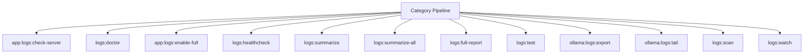

# Logging Spark Operations Manual

## Overview

Deep operational documentation for Spark commands in this category.

## Operational Purpose

Define when and how operators should run commands safely in production and CI.

## Command Inventory

- `app:logs:check-server` (Operational)
- `logs:doctor` (Diagnostic)
- `app:logs:enable-full` (Operational)
- `logs:healthcheck` (Diagnostic)
- `logs:summarize` (Operational)
- `logs:summarize-all` (Operational)
- `logs:full-report` (Operational)
- `logs:test` (Operational)
- `ollama:logs:export` (Operational)
- `ollama:logs:tail` (Operational)
- `logs:scan` (Operational)
- `logs:watch` (Operational)

## Command Reference

### app:logs:check-server

**Purpose**  
Check external Apache/Nginx error.log

**Usage**  
`php spark app:logs:check-server`

**Options**  
None documented.

**Services Used**  
None detected.

**Models Used**  
None detected.

**Tables Used**  
None detected.

**External APIs**  
None detected.

**Related Commands**  
`ops:doctor:full`

**Expected Output**  
Command status and diagnostics are printed to console and logs.

**Example Execution**  
`php spark app:logs:check-server`

### logs:doctor

**Purpose**  
Validate CI4 logging and debug visibility plumbing.

**Usage**  
`php spark logs:doctor`

**Options**  
None documented.

**Services Used**  
None detected.

**Models Used**  
None detected.

**Tables Used**  
`bf_error_logs`

**External APIs**  
None detected.

**Related Commands**  
`ops:doctor:full`

**Expected Output**  
Command status and diagnostics are printed to console and logs.

**Example Execution**  
`php spark logs:doctor`

### app:logs:enable-full

**Purpose**  
Force CI4 to log all levels with DB + PHP fallback enabled.

**Usage**  
`php spark app:logs:enable-full`

**Options**  
None documented.

**Services Used**  
None detected.

**Models Used**  
None detected.

**Tables Used**  
None detected.

**External APIs**  
None detected.

**Related Commands**  
`cache:clear`

**Expected Output**  
Command status and diagnostics are printed to console and logs.

**Example Execution**  
`php spark app:logs:enable-full`

### logs:healthcheck

**Purpose**  
Emit test logs and verify file + DB log sinks are functioning.

**Usage**  
`php spark logs:healthcheck`

**Options**  
`--dry-run`, `Preview actions without writing data`

**Services Used**  
`App\Services\Spark\LogHealthcheckService`

**Models Used**  
None detected.

**Tables Used**  
None detected.

**External APIs**  
None detected.

**Related Commands**  
`ops:doctor:full`

**Expected Output**  
Command status and diagnostics are printed to console and logs.

**Example Execution**  
`php spark logs:healthcheck`

### logs:summarize

**Purpose**  
Summarize CI4 logs for a given date, including new entries since the last run.

**Usage**  
`php spark logs:summarize`

**Options**  
`--dry-run`, `Preview actions without writing data`, `--json`, `Output compact JSON payload for automation`, `--auto-aiops`, `After summarize, enqueue and run aiops:worker:logs pipeline`

**Services Used**  
`App\Services\Spark\LogSummarizeService`

**Models Used**  
None detected.

**Tables Used**  
`state`

**External APIs**  
None detected.

**Related Commands**  
`ops:doctor:full`

**Expected Output**  
Command status and diagnostics are printed to console and logs.

**Example Execution**  
`php spark logs:summarize`

### logs:summarize-all

**Purpose**  
Summarize logs for all known subsystems from writable/logs/** and emit docs/_aiops/logs markdown reports.

**Usage**  
`php spark logs:summarize-all`

**Options**  
`--json`, `Print JSON output in addition to files.`

**Services Used**  
None detected.

**Models Used**  
None detected.

**Tables Used**  
`writable`

**External APIs**  
None detected.

**Related Commands**  
`ops:doctor:full`

**Expected Output**  
Command status and diagnostics are printed to console and logs.

**Example Execution**  
`php spark logs:summarize-all`

### logs:full-report

**Purpose**  
Summarize CI4 + Apache + PHP logs for a given date.

**Usage**  
`php spark logs:full-report`

**Options**  
`--save`, `Write the report to docs/aiops/logs`, `--fix-hints`, `Include fix hints in the report`, `--discord`, `Send a condensed summary to Discord`

**Services Used**  
None detected.

**Models Used**  
None detected.

**Tables Used**  
`memory`

**External APIs**  
`Discord`

**Related Commands**  
`spark:purge-fastcgi`

**Expected Output**  
Command status and diagnostics are printed to console and logs.

**Example Execution**  
`php spark logs:full-report`

### logs:test

**Purpose**  
Canonical logging test command (writes debug/info/error and validates file + DB sinks).

**Usage**  
`php spark logs:test`

**Options**  
`--dry-run`, `Preview checks without writing records`

**Services Used**  
`App\Services\Spark\LogHealthcheckService`

**Models Used**  
None detected.

**Tables Used**  
None detected.

**External APIs**  
None detected.

**Related Commands**  
`ops:doctor:full`

**Expected Output**  
Command status and diagnostics are printed to console and logs.

**Example Execution**  
`php spark logs:test`

### ollama:logs:export

**Purpose**  
Export Ollama run/error evidence to docs/_aiops/ollama/logs/*.md.

**Usage**  
`php spark ollama:logs:export`

**Options**  
`--limit`, `Rows to export`, `--path`, `Output directory`, `--json`, `JSON output`

**Services Used**  
None detected.

**Models Used**  
`App\Models\OllamaRunModel`

**Tables Used**  
None detected.

**External APIs**  
`Ollama`

**Related Commands**  
`ops:doctor:full`

**Expected Output**  
Command status and diagnostics are printed to console and logs.

**Example Execution**  
`php spark ollama:logs:export`

### ollama:logs:tail

**Purpose**  
Tail app-captured Ollama logs from file.

**Usage**  
`php spark ollama:logs:tail`

**Options**  
`--tail`, `Number of lines`, `--file`, `Override log file`, `--json`, `JSON output`

**Services Used**  
None detected.

**Models Used**  
None detected.

**Tables Used**  
`file`

**External APIs**  
`Ollama`

**Related Commands**  
`ops:doctor:full`

**Expected Output**  
Command status and diagnostics are printed to console and logs.

**Example Execution**  
`php spark ollama:logs:tail`

### logs:scan

**Purpose**  
Ops helper command: logs:scan

**Usage**  
`php spark logs:scan`

**Options**  
None documented.

**Services Used**  
`App\Services\Ops\LogOpsService`

**Models Used**  
None detected.

**Tables Used**  
None detected.

**External APIs**  
None detected.

**Related Commands**  
`ops:doctor:full`

**Expected Output**  
Command status and diagnostics are printed to console and logs.

**Example Execution**  
`php spark logs:scan`

### logs:watch

**Purpose**  
Ops helper command: logs:watch

**Usage**  
`php spark logs:watch`

**Options**  
None documented.

**Services Used**  
`App\Services\Ops\LogOpsService`

**Models Used**  
None detected.

**Tables Used**  
None detected.

**External APIs**  
None detected.

**Related Commands**  
`ops:doctor:full`

**Expected Output**  
Command status and diagnostics are printed to console and logs.

**Example Execution**  
`php spark logs:watch`

## Dependencies

| Relationship | Target | Type |
|---|---|---|
| `logs:doctor` | `bf_error_logs` | Command → Table |
| `app:logs:enable-full` | `cache:clear` | Command → Command |
| `logs:healthcheck` | `App\Services\Spark\LogHealthcheckService` | Command → Service |
| `logs:summarize` | `App\Services\Spark\LogSummarizeService` | Command → Service |
| `logs:summarize` | `state` | Command → Table |
| `logs:summarize-all` | `writable` | Command → Table |
| `logs:full-report` | `memory` | Command → Table |
| `logs:full-report` | `spark:purge-fastcgi` | Command → Command |
| `logs:test` | `App\Services\Spark\LogHealthcheckService` | Command → Service |
| `ollama:logs:export` | `App\Models\OllamaRunModel` | Command → Model |
| `ollama:logs:tail` | `file` | Command → Table |
| `logs:scan` | `App\Services\Ops\LogOpsService` | Command → Service |
| `logs:watch` | `App\Services\Ops\LogOpsService` | Command → Service |

## Command Dependency Graph

## Execution Workflows

- `php spark app:logs:check-server`
- `php spark logs:doctor`
- `php spark app:logs:enable-full`
- `php spark logs:healthcheck`
- `php spark logs:summarize`
- `php spark logs:summarize-all`
- `php spark logs:full-report`
- `php spark logs:test`
- `php spark ops:doctor:full`

## Operational Playbooks

**Investigate Application Failure**

- `php spark logs:doctor`
- `php spark ops:php:fpm:health`
- `php spark ops:server:nginx:status`
- `php spark spark:diagnose-503`

**Diagnose Database Issue**

- `php spark db:inventory`
- `php spark db:drift`
- `php spark aiops:sql:check`

## Troubleshooting

- Common failures: registry misses, dependency outages, schema drift, permission issues.
- Diagnostics commands: `php spark ops:commands:audit`, `php spark ops:commands:missing`, `php spark logs:doctor`.
- Recovery steps: repair namespaces, clear cache, rerun worker and health checks.

## Related Commands

- `ops:doctor:full`

## Console Registry Verification

Review `app/Config/Console.php` and command auto-discovery output from `ops:commands:missing`; add explicit `$commands` entries for commands that must be hard-registered in your environment.
