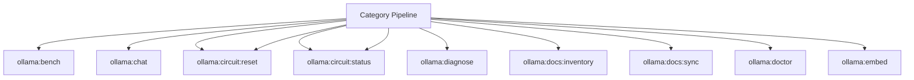

# Ollama Spark Operations Manual

## Overview

Deep operational documentation for Spark commands in this category.

## Operational Purpose

Define when and how operators should run commands safely in production and CI.

## Command Inventory

- `ollama:bench` (Operational)
- `ollama:chat` (Operational)
- `ollama:circuit:reset` (Operational)
- `ollama:circuit:status` (Operational)
- `ollama:circuit:reset` (Operational)
- `ollama:circuit:status` (Operational)
- `ollama:diagnose` (Diagnostic)
- `ollama:docs:inventory` (Maintenance)
- `ollama:docs:sync` (Maintenance)
- `ollama:doctor` (Diagnostic)
- `ollama:embed` (Operational)
- `ollama:embed:file` (Operational)
- `ollama:generate` (Maintenance)
- `ollama:health` (Diagnostic)
- `ollama:logs:export` (Operational)
- `ollama:logs:tail` (Operational)
- `ollama:logs` (Operational)
- `ollama:modelfile:validate` (Operational)
- `ollama:models:create` (Operational)
- `ollama:models:diff` (Operational)
- `ollama:models:ensure` (Operational)
- `ollama:models:export` (Operational)
- `ollama:models:list` (Operational)
- `ollama:models:prune` (Automation)
- `ollama:models:pull` (Operational)
- `ollama:models:push` (Operational)
- `ollama:models:rm` (Operational)
- `ollama:models:show` (Operational)
- `ollama:ping` (Operational)
- `ollama:policy:check` (Operational)
- `ollama:policy:export` (Operational)
- `ollama:queue:push` (Operational)
- `ollama:queue:retry` (Operational)
- `ollama:queue:stats` (Operational)
- `ollama:queue:work` (Operational)
- `ollama:rag:query` (Operational)
- `ollama:sessions:list` (Operational)
- `ollama:sessions:rm` (Operational)
- `ollama:sessions:show` (Operational)
- `ollama:stream` (Operational)
- `ollama:version` (Operational)

## Command Reference

### N/A

**Purpose**  
No description provided.

**Usage**  
`N/A`

**Options**  
None documented.

**Services Used**  
`App\Services\LLM\OllamaClient`

**Models Used**  
`App\Models\OllamaRunModel`

**Tables Used**  
None detected.

**External APIs**  
`Ollama`

**Related Commands**  
`aiops:status`, `logs:doctor`

**Expected Output**  
Command status and diagnostics are printed to console and logs.

**Example Execution**  
`N/A`

### ollama:bench

**Purpose**  
Benchmarks latency and throughput for prompt set.

**Usage**  
`php spark ollama:bench`

**Options**  
`--json`, `JSON output`, `--base-url`, `Override URL`, `--timeout`, `Timeout`, `--dry-run`, `Dry run where supported`

**Services Used**  
None detected.

**Models Used**  
None detected.

**Tables Used**  
None detected.

**External APIs**  
`Ollama`

**Related Commands**  
`aiops:status`, `logs:doctor`

**Expected Output**  
Command status and diagnostics are printed to console and logs.

**Example Execution**  
`php spark ollama:bench`

### ollama:chat

**Purpose**  
Chat completion with optional session persistence.

**Usage**  
`php spark ollama:chat`

**Options**  
`--model`, `Model`, `--session`, `Session ID`, `--system`, `System prompt`, `--user`, `User message`, `--save-session`, `Persist session`, `--load-session`, `Load existing session`, `--reset`, `Reset session`, `--base-url`, `URL`, `--timeout`, `Timeout`, `--json`, `JSON output`

**Services Used**  
None detected.

**Models Used**  
`App\Models\OllamaSessionModel`

**Tables Used**  
None detected.

**External APIs**  
`Ollama`

**Related Commands**  
`aiops:status`, `logs:doctor`

**Expected Output**  
Command status and diagnostics are printed to console and logs.

**Example Execution**  
`php spark ollama:chat`

### ollama:circuit:reset

**Purpose**  
Resets circuit breaker state.

**Usage**  
`php spark ollama:circuit:reset`

**Options**  
`--json`, `JSON output`, `--base-url`, `Override URL`, `--timeout`, `Timeout`, `--dry-run`, `Dry run where supported`

**Services Used**  
None detected.

**Models Used**  
None detected.

**Tables Used**  
None detected.

**External APIs**  
`Ollama`

**Related Commands**  
`aiops:status`, `logs:doctor`

**Expected Output**  
Command status and diagnostics are printed to console and logs.

**Example Execution**  
`php spark ollama:circuit:reset`

### ollama:circuit:status

**Purpose**  
Shows circuit breaker state.

**Usage**  
`php spark ollama:circuit:status`

**Options**  
`--json`, `JSON output`, `--base-url`, `Override URL`, `--timeout`, `Timeout`, `--dry-run`, `Dry run where supported`

**Services Used**  
None detected.

**Models Used**  
None detected.

**Tables Used**  
None detected.

**External APIs**  
`Ollama`

**Related Commands**  
`aiops:status`, `logs:doctor`

**Expected Output**  
Command status and diagnostics are printed to console and logs.

**Example Execution**  
`php spark ollama:circuit:status`

### ollama:circuit:reset

**Purpose**  
Resets Ollama circuit breaker.

**Usage**  
`php spark ollama:circuit:reset`

**Options**  
None documented.

**Services Used**  
`App\Services\LLM\OllamaCircuitBreaker`

**Models Used**  
None detected.

**Tables Used**  
None detected.

**External APIs**  
`Ollama`

**Related Commands**  
`aiops:status`, `logs:doctor`

**Expected Output**  
Command status and diagnostics are printed to console and logs.

**Example Execution**  
`php spark ollama:circuit:reset`

### ollama:circuit:status

**Purpose**  
Shows Ollama circuit breaker state.

**Usage**  
`php spark ollama:circuit:status`

**Options**  
None documented.

**Services Used**  
`App\Services\LLM\OllamaCircuitBreaker`

**Models Used**  
None detected.

**Tables Used**  
None detected.

**External APIs**  
`Ollama`

**Related Commands**  
`aiops:status`, `logs:doctor`

**Expected Output**  
Command status and diagnostics are printed to console and logs.

**Example Execution**  
`php spark ollama:circuit:status`

### ollama:diagnose

**Purpose**  
Operator diagnostic report for Ollama connectivity and env.

**Usage**  
`php spark ollama:diagnose`

**Options**  
`--base-url`, `Override URL`, `--timeout`, `Timeout`, `--include-env`, `Include env snapshot`, `--json`, `JSON output`

**Services Used**  
None detected.

**Models Used**  
None detected.

**Tables Used**  
None detected.

**External APIs**  
`Ollama`

**Related Commands**  
`aiops:status`, `logs:doctor`

**Expected Output**  
Command status and diagnostics are printed to console and logs.

**Example Execution**  
`php spark ollama:diagnose`

### ollama:docs:inventory

**Purpose**  
Builds docs embedding/metadata manifest.

**Usage**  
`php spark ollama:docs:inventory`

**Options**  
`--json`, `JSON output`, `--base-url`, `Override URL`, `--timeout`, `Timeout`, `--dry-run`, `Dry run where supported`

**Services Used**  
None detected.

**Models Used**  
None detected.

**Tables Used**  
None detected.

**External APIs**  
`Ollama`

**Related Commands**  
`aiops:status`, `logs:doctor`

**Expected Output**  
Command status and diagnostics are printed to console and logs.

**Example Execution**  
`php spark ollama:docs:inventory`

### ollama:docs:sync

**Purpose**  
Regenerates Ollama inventory and policy docs.

**Usage**  
`php spark ollama:docs:sync`

**Options**  
`--profile`, `Profile name`, `--base-url`, `URL`, `--timeout`, `Timeout`, `--json`, `JSON output`

**Services Used**  
None detected.

**Models Used**  
None detected.

**Tables Used**  
None detected.

**External APIs**  
`Ollama`

**Related Commands**  
`aiops:status`, `logs:doctor`

**Expected Output**  
Command status and diagnostics are printed to console and logs.

**Example Execution**  
`php spark ollama:docs:sync`

### ollama:doctor

**Purpose**  
Deep diagnostics for Ollama connectivity and runtime hints.

**Usage**  
`php spark ollama:doctor`

**Options**  
`--base-url`, `Override URL`, `--timeout`, `Timeout seconds`, `--json`, `JSON output`, `--include-env`, `Include relevant env values`

**Services Used**  
None detected.

**Models Used**  
None detected.

**Tables Used**  
None detected.

**External APIs**  
`Ollama`

**Related Commands**  
`aiops:status`, `logs:doctor`

**Expected Output**  
Command status and diagnostics are printed to console and logs.

**Example Execution**  
`php spark ollama:doctor`

### ollama:embed

**Purpose**  
Generates embedding vector for input text.

**Usage**  
`php spark ollama:embed`

**Options**  
`--model`, `Model`, `--input`, `Text input`, `--base-url`, `URL`, `--timeout`, `Timeout`, `--json`, `JSON output`

**Services Used**  
None detected.

**Models Used**  
None detected.

**Tables Used**  
None detected.

**External APIs**  
`Ollama`

**Related Commands**  
`aiops:status`, `logs:doctor`

**Expected Output**  
Command status and diagnostics are printed to console and logs.

**Example Execution**  
`php spark ollama:embed`

### ollama:embed:file

**Purpose**  
Embeds file chunks into vector storage.

**Usage**  
`php spark ollama:embed:file`

**Options**  
`--json`, `JSON output`, `--base-url`, `Override URL`, `--timeout`, `Timeout`, `--dry-run`, `Dry run where supported`

**Services Used**  
None detected.

**Models Used**  
None detected.

**Tables Used**  
`vector`

**External APIs**  
`Ollama`

**Related Commands**  
`aiops:status`, `logs:doctor`

**Expected Output**  
Command status and diagnostics are printed to console and logs.

**Example Execution**  
`php spark ollama:embed:file`

### ollama:generate

**Purpose**  
Runs single prompt generate against Ollama.

**Usage**  
`php spark ollama:generate`

**Options**  
`--model`, `Model name`, `--prompt`, `Prompt text`, `--stream`, `Stream mode`, `--temperature`, `Temperature`, `--top-p`, `Top-p`, `--max-tokens`, `Max tokens`, `--base-url`, `Override URL`, `--timeout`, `Timeout`, `--json`, `JSON output`

**Services Used**  
`App\Services\LLM\OllamaCircuitBreaker`

**Models Used**  
None detected.

**Tables Used**  
None detected.

**External APIs**  
`Ollama`

**Related Commands**  
`aiops:status`, `logs:doctor`

**Expected Output**  
Command status and diagnostics are printed to console and logs.

**Example Execution**  
`php spark ollama:generate`

### ollama:health

**Purpose**  
Checks endpoint reachability and readiness.

**Usage**  
`php spark ollama:health`

**Options**  
`--base-url`, `Override base URL`, `--timeout`, `Timeout seconds`, `--json`, `JSON output`

**Services Used**  
None detected.

**Models Used**  
None detected.

**Tables Used**  
None detected.

**External APIs**  
`Ollama`

**Related Commands**  
`aiops:status`, `logs:doctor`

**Expected Output**  
Command status and diagnostics are printed to console and logs.

**Example Execution**  
`php spark ollama:health`

### ollama:logs:export

**Purpose**  
Export Ollama run/error evidence to docs/_aiops/ollama/logs/*.md.

**Usage**  
`php spark ollama:logs:export`

**Options**  
`--limit`, `Rows to export`, `--path`, `Output directory`, `--json`, `JSON output`

**Services Used**  
None detected.

**Models Used**  
`App\Models\OllamaRunModel`

**Tables Used**  
None detected.

**External APIs**  
`Ollama`

**Related Commands**  
`aiops:status`, `logs:doctor`

**Expected Output**  
Command status and diagnostics are printed to console and logs.

**Example Execution**  
`php spark ollama:logs:export`

### ollama:logs:tail

**Purpose**  
Tail app-captured Ollama logs from file.

**Usage**  
`php spark ollama:logs:tail`

**Options**  
`--tail`, `Number of lines`, `--file`, `Override log file`, `--json`, `JSON output`

**Services Used**  
None detected.

**Models Used**  
None detected.

**Tables Used**  
`file`

**External APIs**  
`Ollama`

**Related Commands**  
`aiops:status`, `logs:doctor`

**Expected Output**  
Command status and diagnostics are printed to console and logs.

**Example Execution**  
`php spark ollama:logs:tail`

### ollama:logs

**Purpose**  
Backward-compatible alias of ollama:logs:tail.

**Usage**  
`php spark ollama:logs`

**Options**  
`--tail`, `Lines`, `--file`, `File`, `--json`, `JSON output`

**Services Used**  
None detected.

**Models Used**  
None detected.

**Tables Used**  
None detected.

**External APIs**  
`Ollama`

**Related Commands**  
`aiops:status`, `logs:doctor`

**Expected Output**  
Command status and diagnostics are printed to console and logs.

**Example Execution**  
`php spark ollama:logs`

### ollama:modelfile:validate

**Purpose**  
Validates Ollama Modelfile.

**Usage**  
`php spark ollama:modelfile:validate`

**Options**  
`--json`, `JSON output`, `--base-url`, `Override URL`, `--timeout`, `Timeout`, `--dry-run`, `Dry run where supported`

**Services Used**  
None detected.

**Models Used**  
None detected.

**Tables Used**  
None detected.

**External APIs**  
`Ollama`

**Related Commands**  
`aiops:status`, `logs:doctor`

**Expected Output**  
Command status and diagnostics are printed to console and logs.

**Example Execution**  
`php spark ollama:modelfile:validate`

### ollama:models:create

**Purpose**  
Creates a model from Modelfile.

**Usage**  
`php spark ollama:models:create`

**Options**  
`--json`, `JSON output`, `--base-url`, `Override URL`, `--timeout`, `Timeout`, `--dry-run`, `Dry run where supported`

**Services Used**  
None detected.

**Models Used**  
None detected.

**Tables Used**  
`Modelfile`

**External APIs**  
`Ollama`

**Related Commands**  
`aiops:status`, `logs:doctor`

**Expected Output**  
Command status and diagnostics are printed to console and logs.

**Example Execution**  
`php spark ollama:models:create`

### ollama:models:diff

**Purpose**  
Compare installed model inventory versus required profile and emit remediation.

**Usage**  
`php spark ollama:models:diff`

**Options**  
`--profile`, `default|aiops|marketing|alerts`, `--base-url`, `Override URL`, `--timeout`, `Timeout seconds`, `--json`, `JSON output`

**Services Used**  
None detected.

**Models Used**  
None detected.

**Tables Used**  
None detected.

**External APIs**  
`Ollama`

**Related Commands**  
`ollama:models:pull`, `ollama:models:rm`

**Expected Output**  
Command status and diagnostics are printed to console and logs.

**Example Execution**  
`php spark ollama:models:diff`

### ollama:models:ensure

**Purpose**  
Ensures required models exist for a profile.

**Usage**  
`php spark ollama:models:ensure`

**Options**  
`--profile`, `default|aiops|marketing|alerts`, `--base-url`, `Override URL`, `--timeout`, `Timeout`, `--json`, `JSON output`

**Services Used**  
None detected.

**Models Used**  
None detected.

**Tables Used**  
None detected.

**External APIs**  
`Ollama`

**Related Commands**  
`aiops:status`, `logs:doctor`

**Expected Output**  
Command status and diagnostics are printed to console and logs.

**Example Execution**  
`php spark ollama:models:ensure`

### ollama:models:export

**Purpose**  
Exports model inventory for docs or DB.

**Usage**  
`php spark ollama:models:export`

**Options**  
`--json`, `JSON output`, `--base-url`, `Override URL`, `--timeout`, `Timeout`, `--dry-run`, `Dry run where supported`

**Services Used**  
None detected.

**Models Used**  
None detected.

**Tables Used**  
None detected.

**External APIs**  
`Ollama`

**Related Commands**  
`aiops:status`, `logs:doctor`

**Expected Output**  
Command status and diagnostics are printed to console and logs.

**Example Execution**  
`php spark ollama:models:export`

### ollama:models:list

**Purpose**  
Lists installed Ollama models.

**Usage**  
`php spark ollama:models:list`

**Options**  
`--base-url`, `Override URL`, `--timeout`, `Timeout`, `--json`, `JSON output`

**Services Used**  
None detected.

**Models Used**  
None detected.

**Tables Used**  
None detected.

**External APIs**  
`Ollama`

**Related Commands**  
`aiops:status`, `logs:doctor`

**Expected Output**  
Command status and diagnostics are printed to console and logs.

**Example Execution**  
`php spark ollama:models:list`

### ollama:models:prune

**Purpose**  
Prunes models based on simple keep allowlist policy.

**Usage**  
`php spark ollama:models:prune`

**Options**  
`--keep`, `Comma list of models to keep`, `--dry-run`, `Dry run`, `--base-url`, `Override URL`, `--timeout`, `Timeout`, `--json`, `JSON output`

**Services Used**  
None detected.

**Models Used**  
None detected.

**Tables Used**  
None detected.

**External APIs**  
`Ollama`

**Related Commands**  
`aiops:status`, `logs:doctor`

**Expected Output**  
Command status and diagnostics are printed to console and logs.

**Example Execution**  
`php spark ollama:models:prune`

## Dependencies

| Relationship | Target | Type |
|---|---|---|
| `ollama:chat` | `App\Models\OllamaSessionModel` | Command → Model |
| `ollama:circuit:reset` | `App\Services\LLM\OllamaCircuitBreaker` | Command → Service |
| `ollama:circuit:status` | `App\Services\LLM\OllamaCircuitBreaker` | Command → Service |
| `ollama:embed:file` | `vector` | Command → Table |
| `ollama:generate` | `App\Services\LLM\OllamaCircuitBreaker` | Command → Service |
| `ollama:logs:export` | `App\Models\OllamaRunModel` | Command → Model |
| `ollama:logs:tail` | `file` | Command → Table |
| `ollama:models:create` | `Modelfile` | Command → Table |
| `ollama:models:diff` | `ollama:models:pull` | Command → Command |
| `ollama:models:diff` | `ollama:models:rm` | Command → Command |

## Command Dependency Graph

## Execution Workflows

- `php spark ollama:bench`
- `php spark ollama:chat`
- `php spark ollama:circuit:reset`
- `php spark ollama:circuit:status`
- `php spark ollama:circuit:reset`
- `php spark ollama:circuit:status`
- `php spark ollama:diagnose`
- `php spark aiops:status`
- `php spark logs:doctor`

## Operational Playbooks

**Investigate Application Failure**

- `php spark logs:doctor`
- `php spark ops:php:fpm:health`
- `php spark ops:server:nginx:status`
- `php spark spark:diagnose-503`

**Diagnose Database Issue**

- `php spark db:inventory`
- `php spark db:drift`
- `php spark aiops:sql:check`

## Troubleshooting

- Common failures: registry misses, dependency outages, schema drift, permission issues.
- Diagnostics commands: `php spark ops:commands:audit`, `php spark ops:commands:missing`, `php spark logs:doctor`.
- Recovery steps: repair namespaces, clear cache, rerun worker and health checks.

## Related Commands

- `aiops:status`
- `logs:doctor`

## Console Registry Verification

Review `app/Config/Console.php` and command auto-discovery output from `ops:commands:missing`; add explicit `$commands` entries for commands that must be hard-registered in your environment.
