# Recovery Spark Operations Manual

## Overview

Deep operational documentation for Spark commands in this category.

## Operational Purpose

Define when and how operators should run commands safely in production and CI.

## Command Inventory

- `spark:diagnose-502` (Diagnostic)
- `spark:diagnose-503` (Diagnostic)
- `health:cache` (Diagnostic)
- `health:disk` (Diagnostic)
- `health:git-safety` (Diagnostic)
- `health:services` (Diagnostic)
- `master:health:commands` (Diagnostic)
- `master:health:controllers` (Diagnostic)
- `master:health:dependencies` (Diagnostic)
- `master:health:docs` (Diagnostic)
- `master:health:logs` (Diagnostic)
- `master:health:models` (Diagnostic)
- `master:health:routes` (Diagnostic)
- `master:health:services` (Diagnostic)
- `master:health:views` (Diagnostic)
- `ops:healthcheck` (Diagnostic)
- `runtime:cache-boot` (Automation)
- `runtime:diagnose-502` (Diagnostic)
- `runtime:spark-doctor` (Diagnostic)
- `runtime:spark-doctor` (Diagnostic)
- `spark:fix` (Maintenance)
- `optimize:safe` (Operational)
- `runtime:triage` (Automation)

## Command Reference

### spark:diagnose-502

**Purpose**  
Diagnose common 502 causes (php-fpm, nginx, socket).

**Usage**  
`php spark spark:diagnose-502`

**Options**  
None documented.

**Services Used**  
None detected.

**Models Used**  
None detected.

**Tables Used**  
None detected.

**External APIs**  
None detected.

**Related Commands**  
`spark:diagnose-503`, `spark:diagnose-502`

**Expected Output**  
Command status and diagnostics are printed to console and logs.

**Example Execution**  
`php spark spark:diagnose-502`

### spark:diagnose-503

**Purpose**  
Diagnose common 503 causes (cache, maintenance, upstream).

**Usage**  
`php spark spark:diagnose-503`

**Options**  
None documented.

**Services Used**  
None detected.

**Models Used**  
None detected.

**Tables Used**  
None detected.

**External APIs**  
None detected.

**Related Commands**  
`spark:diagnose-503`, `spark:diagnose-502`

**Expected Output**  
Command status and diagnostics are printed to console and logs.

**Example Execution**  
`php spark spark:diagnose-503`

### health:cache

**Purpose**  
Check CI4 writable cache directories for access.

**Usage**  
`php spark health:cache`

**Options**  
None documented.

**Services Used**  
None detected.

**Models Used**  
None detected.

**Tables Used**  
None detected.

**External APIs**  
None detected.

**Related Commands**  
`spark:diagnose-503`, `spark:diagnose-502`

**Expected Output**  
Command status and diagnostics are printed to console and logs.

**Example Execution**  
`php spark health:cache`

### health:disk

**Purpose**  
Check disk and inode usage for the host.

**Usage**  
`php spark health:disk`

**Options**  
None documented.

**Services Used**  
`App\Services\Triage\CommandRunner`

**Models Used**  
None detected.

**Tables Used**  
None detected.

**External APIs**  
None detected.

**Related Commands**  
`spark:diagnose-503`, `spark:diagnose-502`

**Expected Output**  
Command status and diagnostics are printed to console and logs.

**Example Execution**  
`php spark health:disk`

### health:git-safety

**Purpose**  
Check git ignore rules for env/writable and tracked secrets.

**Usage**  
`php spark health:git-safety`

**Options**  
None documented.

**Services Used**  
`App\Services\Triage\CommandRunner`

**Models Used**  
None detected.

**Tables Used**  
None detected.

**External APIs**  
None detected.

**Related Commands**  
`spark:diagnose-503`, `spark:diagnose-502`

**Expected Output**  
Command status and diagnostics are printed to console and logs.

**Example Execution**  
`php spark health:git-safety`

### health:services

**Purpose**  
Detect web server + PHP handler status without systemctl.

**Usage**  
`php spark health:services`

**Options**  
None documented.

**Services Used**  
`App\Services\Triage\CommandRunner`, `App\Services\Triage\HostingModeDetector`

**Models Used**  
None detected.

**Tables Used**  
None detected.

**External APIs**  
None detected.

**Related Commands**  
`spark:diagnose-503`, `spark:diagnose-502`

**Expected Output**  
Command status and diagnostics are printed to console and logs.

**Example Execution**  
`php spark health:services`

### master:health:commands

**Purpose**  
Inspect Spark command inventory and metadata.

**Usage**  
`php spark master:health:commands`

**Options**  
None documented.

**Services Used**  
None detected.

**Models Used**  
None detected.

**Tables Used**  
None detected.

**External APIs**  
None detected.

**Related Commands**  
`spark:diagnose-503`, `spark:diagnose-502`

**Expected Output**  
Command status and diagnostics are printed to console and logs.

**Example Execution**  
`php spark master:health:commands`

### master:health:controllers

**Purpose**  
Inspect controllers for basic CI4 health issues.

**Usage**  
`php spark master:health:controllers`

**Options**  
None documented.

**Services Used**  
None detected.

**Models Used**  
None detected.

**Tables Used**  
None detected.

**External APIs**  
None detected.

**Related Commands**  
`spark:diagnose-503`, `spark:diagnose-502`

**Expected Output**  
Command status and diagnostics are printed to console and logs.

**Example Execution**  
`php spark master:health:controllers`

### master:health:dependencies

**Purpose**  
Inspect service(), model, and view dependency references across controllers.

**Usage**  
`php spark master:health:dependencies`

**Options**  
None documented.

**Services Used**  
None detected.

**Models Used**  
None detected.

**Tables Used**  
None detected.

**External APIs**  
None detected.

**Related Commands**  
`spark:diagnose-503`, `spark:diagnose-502`

**Expected Output**  
Command status and diagnostics are printed to console and logs.

**Example Execution**  
`php spark master:health:dependencies`

### master:health:docs

**Purpose**  
Inspect docs directory health and summary coverage.

**Usage**  
`php spark master:health:docs`

**Options**  
None documented.

**Services Used**  
None detected.

**Models Used**  
None detected.

**Tables Used**  
None detected.

**External APIs**  
None detected.

**Related Commands**  
`spark:diagnose-503`, `spark:diagnose-502`

**Expected Output**  
Command status and diagnostics are printed to console and logs.

**Example Execution**  
`php spark master:health:docs`

### master:health:logs

**Purpose**  
Inspect writable/logs for current log file health.

**Usage**  
`php spark master:health:logs`

**Options**  
None documented.

**Services Used**  
None detected.

**Models Used**  
None detected.

**Tables Used**  
None detected.

**External APIs**  
None detected.

**Related Commands**  
`spark:diagnose-503`, `spark:diagnose-502`

**Expected Output**  
Command status and diagnostics are printed to console and logs.

**Example Execution**  
`php spark master:health:logs`

### master:health:models

**Purpose**  
Inspect models for table mapping and basic CI4 model metadata.

**Usage**  
`php spark master:health:models`

**Options**  
None documented.

**Services Used**  
None detected.

**Models Used**  
None detected.

**Tables Used**  
None detected.

**External APIs**  
None detected.

**Related Commands**  
`spark:diagnose-503`, `spark:diagnose-502`

**Expected Output**  
Command status and diagnostics are printed to console and logs.

**Example Execution**  
`php spark master:health:models`

### master:health:routes

**Purpose**  
Inspect route configuration files and emit a health report.

**Usage**  
`php spark master:health:routes`

**Options**  
None documented.

**Services Used**  
None detected.

**Models Used**  
None detected.

**Tables Used**  
None detected.

**External APIs**  
None detected.

**Related Commands**  
`spark:diagnose-503`, `spark:diagnose-502`

**Expected Output**  
Command status and diagnostics are printed to console and logs.

**Example Execution**  
`php spark master:health:routes`

### master:health:services

**Purpose**  
Inspect service classes and app/Config/Services.php references.

**Usage**  
`php spark master:health:services`

**Options**  
None documented.

**Services Used**  
None detected.

**Models Used**  
None detected.

**Tables Used**  
None detected.

**External APIs**  
None detected.

**Related Commands**  
`spark:diagnose-503`, `spark:diagnose-502`

**Expected Output**  
Command status and diagnostics are printed to console and logs.

**Example Execution**  
`php spark master:health:services`

### master:health:views

**Purpose**  
Inspect views inventory and view directory health.

**Usage**  
`php spark master:health:views`

**Options**  
None documented.

**Services Used**  
None detected.

**Models Used**  
None detected.

**Tables Used**  
None detected.

**External APIs**  
None detected.

**Related Commands**  
`spark:diagnose-503`, `spark:diagnose-502`

**Expected Output**  
Command status and diagnostics are printed to console and logs.

**Example Execution**  
`php spark master:health:views`

### ops:healthcheck

**Purpose**  
Ops helper command: ops:healthcheck

**Usage**  
`php spark ops:healthcheck`

**Options**  
None documented.

**Services Used**  
`App\Services\Ops\VpsHealthService`

**Models Used**  
None detected.

**Tables Used**  
None detected.

**External APIs**  
None detected.

**Related Commands**  
`spark:diagnose-503`, `spark:diagnose-502`

**Expected Output**  
Command status and diagnostics are printed to console and logs.

**Example Execution**  
`php spark ops:healthcheck`

### runtime:cache-boot

**Purpose**  
Validate cache boot health and warm critical cache keys.

**Usage**  
`php spark runtime:cache-boot`

**Options**  
`--emit`, `Output mode: docs (default: docs).`, `--out`, `Override artifact directory (must be inside docs/aiops/artifacts).`, `--dry-run`, `Preview actions without changing cache state.`, `--approve`, `Allow cache mutations (required).`

**Services Used**  
None detected.

**Models Used**  
None detected.

**Tables Used**  
None detected.

**External APIs**  
None detected.

**Related Commands**  
`spark:diagnose-503`, `spark:diagnose-502`

**Expected Output**  
Command status and diagnostics are printed to console and logs.

**Example Execution**  
`php spark runtime:cache-boot`

### runtime:diagnose-502

**Purpose**  
Diagnose and optionally remediate 502/503 gateway errors

**Usage**  
`php spark runtime:diagnose-502`

**Options**  
`--approve`, `Apply safe fixes (clear cache, remove stale sockets) after diagnostics`

**Services Used**  
None detected.

**Models Used**  
None detected.

**Tables Used**  
None detected.

**External APIs**  
None detected.

**Related Commands**  
`spark:diagnose-503`, `spark:diagnose-502`

**Expected Output**  
Command status and diagnostics are printed to console and logs.

**Example Execution**  
`php spark runtime:diagnose-502`

### runtime:spark-doctor

**Purpose**  
Validate Spark command discovery and CI4 compatibility

**Usage**  
`php spark runtime:spark-doctor`

**Options**  
None documented.

**Services Used**  
None detected.

**Models Used**  
None detected.

**Tables Used**  
None detected.

**External APIs**  
None detected.

**Related Commands**  
`spark:diagnose-503`, `spark:diagnose-502`

**Expected Output**  
Command status and diagnostics are printed to console and logs.

**Example Execution**  
`php spark runtime:spark-doctor`

### runtime:spark-doctor

**Purpose**  
Validate Spark command discovery and CI4 compatibility (runtime scope).

**Usage**  
`php spark runtime:spark-doctor`

**Options**  
`--emit`, `Output mode: docs (default: docs).`, `--out`, `Override artifact directory (must be inside docs/aiops/artifacts).`, `--dry-run`, `Generate a report without mutating state.`, `--approve`, `Acknowledge execution (required for mutating commands).`

**Services Used**  
None detected.

**Models Used**  
None detected.

**Tables Used**  
None detected.

**External APIs**  
None detected.

**Related Commands**  
`spark:diagnose-503`, `spark:diagnose-502`

**Expected Output**  
Command status and diagnostics are printed to console and logs.

**Example Execution**  
`php spark runtime:spark-doctor`

### spark:fix

**Purpose**  
Auto-heal Spark command standards and generate a fix report

**Usage**  
`php spark spark:fix`

**Options**  
None documented.

**Services Used**  
None detected.

**Models Used**  
None detected.

**Tables Used**  
None detected.

**External APIs**  
None detected.

**Related Commands**  
`spark:doctor`

**Expected Output**  
Command status and diagnostics are printed to console and logs.

**Example Execution**  
`php spark spark:fix`

### optimize:safe

**Purpose**  
Run CI4 optimize safely (CI-only)

**Usage**  
`php spark optimize:safe`

**Options**  
None documented.

**Services Used**  
None detected.

**Models Used**  
None detected.

**Tables Used**  
None detected.

**External APIs**  
None detected.

**Related Commands**  
`cache:clear`, `optimize`

**Expected Output**  
Command status and diagnostics are printed to console and logs.

**Example Execution**  
`php spark optimize:safe`

### runtime:triage

**Purpose**  
Consolidate runtime diagnostics into a single report.

**Usage**  
`php spark runtime:triage`

**Options**  
`--emit`, `Output mode: docs (default: docs).`, `--out`, `Override artifact directory (must be inside docs/aiops/artifacts).`, `--dry-run`, `Generate a report without mutating state.`, `--approve`, `Acknowledge execution (required for mutating commands).`

**Services Used**  
None detected.

**Models Used**  
None detected.

**Tables Used**  
`a`

**External APIs**  
None detected.

**Related Commands**  
`spark:diagnose-503`, `spark:diagnose-502`

**Expected Output**  
Command status and diagnostics are printed to console and logs.

**Example Execution**  
`php spark runtime:triage`

## Dependencies

| Relationship | Target | Type |
|---|---|---|
| `health:disk` | `App\Services\Triage\CommandRunner` | Command → Service |
| `health:git-safety` | `App\Services\Triage\CommandRunner` | Command → Service |
| `health:services` | `App\Services\Triage\CommandRunner` | Command → Service |
| `health:services` | `App\Services\Triage\HostingModeDetector` | Command → Service |
| `ops:healthcheck` | `App\Services\Ops\VpsHealthService` | Command → Service |
| `spark:fix` | `spark:doctor` | Command → Command |
| `optimize:safe` | `cache:clear` | Command → Command |
| `optimize:safe` | `optimize` | Command → Command |
| `runtime:triage` | `a` | Command → Table |

## Command Dependency Graph

```mermaid
graph TD
Category["Category Pipeline"]
Category --> spark_diagnose_502["spark:diagnose-502"]
Category --> spark_diagnose_503["spark:diagnose-503"]
Category --> health_cache["health:cache"]
Category --> health_disk["health:disk"]
Category --> health_git_safety["health:git-safety"]
Category --> health_services["health:services"]
Category --> master_health_commands["master:health:commands"]
Category --> master_health_controllers["master:health:controllers"]
Category --> master_health_dependencies["master:health:dependencies"]
Category --> master_health_docs["master:health:docs"]
Category --> master_health_logs["master:health:logs"]
Category --> master_health_models["master:health:models"]
```

## Execution Workflows

- `php spark spark:diagnose-502`
- `php spark spark:diagnose-503`
- `php spark health:cache`
- `php spark health:disk`
- `php spark health:git-safety`
- `php spark health:services`
- `php spark master:health:commands`
- `php spark master:health:controllers`
- `php spark spark:diagnose-503`
- `php spark spark:diagnose-502`

## Operational Playbooks

**Investigate Application Failure**

- `php spark logs:doctor`
- `php spark ops:php:fpm:health`
- `php spark ops:server:nginx:status`
- `php spark spark:diagnose-503`

**Diagnose Database Issue**

- `php spark db:inventory`
- `php spark db:drift`
- `php spark aiops:sql:check`

## Troubleshooting

- Common failures: registry misses, dependency outages, schema drift, permission issues.
- Diagnostics commands: `php spark ops:commands:audit`, `php spark ops:commands:missing`, `php spark logs:doctor`.
- Recovery steps: repair namespaces, clear cache, rerun worker and health checks.

## Related Commands

- `spark:diagnose-503`
- `spark:diagnose-502`

## Console Registry Verification

Review `app/Config/Console.php` and command auto-discovery output from `ops:commands:missing`; add explicit `$commands` entries for commands that must be hard-registered in your environment.
