# Research Spark Operations Manual

## Overview

Deep operational documentation for Spark commands in this category.

## Operational Purpose

Define when and how operators should run commands safely in production and CI.

## Command Inventory

- `research:reports:daily` (Operational)
- `research:earnings:calendar` (Operational)
- `research:intelligence:signals` (Operational)
- `research:knowledge:build` (Operational)
- `research:news:collect` (Operational)
- `research:google:scan` (Operational)
- `research:google:scan` (Operational)
- `research:data:compile` (Operational)
- `research:pipeline:run` (Automation)
- `research:short-interest:scan` (Operational)
- `research:alerts:watchlist-import` (Operational)
- `research:alerts:cleanup` (Operational)
- `research:reports:weekly` (Operational)

## Command Reference

### research:reports:daily

**Purpose**  
Generate daily market research report

**Usage**  
`php spark research:reports:daily`

**Options**  
None documented.

**Services Used**  
None detected.

**Models Used**  
None detected.

**Tables Used**  
`bf_financial_news`, `bf_investment_trade_alerts`, `bf_market_snapshots`

**External APIs**  
None detected.

**Related Commands**  
`logs:summarize`, `aiops:sql:check`

**Expected Output**  
Command status and diagnostics are printed to console and logs.

**Example Execution**  
`php spark research:reports:daily`

### research:earnings:calendar

**Purpose**  
Collect earnings calendar research items

**Usage**  
`php spark research:earnings:calendar`

**Options**  
None documented.

**Services Used**  
None detected.

**Models Used**  
None detected.

**Tables Used**  
None detected.

**External APIs**  
None detected.

**Related Commands**  
`logs:summarize`, `aiops:sql:check`

**Expected Output**  
Command status and diagnostics are printed to console and logs.

**Example Execution**  
`php spark research:earnings:calendar`

### research:intelligence:signals

**Purpose**  
Generate trade-signal intelligence from research rankings and the financial knowledge graph

**Usage**  
`php spark research:intelligence:signals`

**Options**  
None documented.

**Services Used**  
None detected.

**Models Used**  
None detected.

**Tables Used**  
`bf_research_items`, `research`

**External APIs**  
None detected.

**Related Commands**  
`logs:summarize`, `aiops:sql:check`

**Expected Output**  
Command status and diagnostics are printed to console and logs.

**Example Execution**  
`php spark research:intelligence:signals`

### research:knowledge:build

**Purpose**  
Build financial knowledge graph

**Usage**  
`php spark research:knowledge:build`

**Options**  
None documented.

**Services Used**  
None detected.

**Models Used**  
None detected.

**Tables Used**  
`bf_investment_trade_alerts`, `bf_financial_news`, `bf_market_snapshots`

**External APIs**  
None detected.

**Related Commands**  
`logs:summarize`, `aiops:sql:check`

**Expected Output**  
Command status and diagnostics are printed to console and logs.

**Example Execution**  
`php spark research:knowledge:build`

### research:news:collect

**Purpose**  
No description provided.

**Usage**  
`php spark research:news:collect`

**Options**  
None documented.

**Services Used**  
`App\Services\Research\FinancialResearchService`

**Models Used**  
None detected.

**Tables Used**  
None detected.

**External APIs**  
`https://feeds.finance.yahoo.com/rss/2.0/headline?s=^GSPC`, `https://www.marketwatch.com/rss/topstories`, `https://www.reutersagency.com/feed/?best-topics=business-finance`

**Related Commands**  
`logs:summarize`, `aiops:sql:check`

**Expected Output**  
Command status and diagnostics are printed to console and logs.

**Example Execution**  
`php spark research:news:collect`

### research:google:scan

**Purpose**  
Scan Google for financial research links

**Usage**  
`php spark research:google:scan`

**Options**  
None documented.

**Services Used**  
None detected.

**Models Used**  
None detected.

**Tables Used**  
None detected.

**External APIs**  
`https://www.google.com/search?q=`

**Related Commands**  
`logs:summarize`, `aiops:sql:check`

**Expected Output**  
Command status and diagnostics are printed to console and logs.

**Example Execution**  
`php spark research:google:scan`

### research:google:scan

**Purpose**  
No description provided.

**Usage**  
`php spark research:google:scan`

**Options**  
None documented.

**Services Used**  
None detected.

**Models Used**  
None detected.

**Tables Used**  
None detected.

**External APIs**  
`https://www.google.com/search?q=`

**Related Commands**  
`logs:summarize`, `aiops:sql:check`

**Expected Output**  
Command status and diagnostics are printed to console and logs.

**Example Execution**  
`php spark research:google:scan`

### research:data:compile

**Purpose**  
No description provided.

**Usage**  
`php spark research:data:compile`

**Options**  
None documented.

**Services Used**  
None detected.

**Models Used**  
None detected.

**Tables Used**  
`bf_market_snapshots`

**External APIs**  
`https://query1.finance.yahoo.com/v7/finance/quote?symbols=$symbol`

**Related Commands**  
`logs:summarize`, `aiops:sql:check`

**Expected Output**  
Command status and diagnostics are printed to console and logs.

**Example Execution**  
`php spark research:data:compile`

### research:pipeline:run

**Purpose**  
No description provided.

**Usage**  
`php spark research:pipeline:run`

**Options**  
None documented.

**Services Used**  
None detected.

**Models Used**  
None detected.

**Tables Used**  
None detected.

**External APIs**  
None detected.

**Related Commands**  
`logs:summarize`, `aiops:sql:check`

**Expected Output**  
Command status and diagnostics are printed to console and logs.

**Example Execution**  
`php spark research:pipeline:run`

### research:short-interest:scan

**Purpose**  
Scan short-interest candidates

**Usage**  
`php spark research:short-interest:scan`

**Options**  
None documented.

**Services Used**  
None detected.

**Models Used**  
None detected.

**Tables Used**  
None detected.

**External APIs**  
None detected.

**Related Commands**  
`logs:summarize`, `aiops:sql:check`

**Expected Output**  
Command status and diagnostics are printed to console and logs.

**Example Execution**  
`php spark research:short-interest:scan`

### research:alerts:watchlist-import

**Purpose**  
No description provided.

**Usage**  
`php spark research:alerts:watchlist-import`

**Options**  
None documented.

**Services Used**  
None detected.

**Models Used**  
None detected.

**Tables Used**  
`bf_watchlist_imports`, `bf_investment_trade_alerts`

**External APIs**  
None detected.

**Related Commands**  
`logs:summarize`, `aiops:sql:check`

**Expected Output**  
Command status and diagnostics are printed to console and logs.

**Example Execution**  
`php spark research:alerts:watchlist-import`

### research:alerts:cleanup

**Purpose**  
No description provided.

**Usage**  
`php spark research:alerts:cleanup`

**Options**  
None documented.

**Services Used**  
None detected.

**Models Used**  
None detected.

**Tables Used**  
None detected.

**External APIs**  
None detected.

**Related Commands**  
`logs:summarize`, `aiops:sql:check`

**Expected Output**  
Command status and diagnostics are printed to console and logs.

**Example Execution**  
`php spark research:alerts:cleanup`

### research:reports:weekly

**Purpose**  
Generate weekly market research report

**Usage**  
`php spark research:reports:weekly`

**Options**  
None documented.

**Services Used**  
None detected.

**Models Used**  
None detected.

**Tables Used**  
`bf_financial_news`, `bf_investment_trade_alerts`

**External APIs**  
None detected.

**Related Commands**  
`logs:summarize`, `aiops:sql:check`

**Expected Output**  
Command status and diagnostics are printed to console and logs.

**Example Execution**  
`php spark research:reports:weekly`

## Dependencies

| Relationship | Target | Type |
|---|---|---|
| `research:reports:daily` | `bf_financial_news` | Command → Table |
| `research:reports:daily` | `bf_investment_trade_alerts` | Command → Table |
| `research:intelligence:signals` | `bf_research_items` | Command → Table |
| `research:intelligence:signals` | `research` | Command → Table |
| `research:knowledge:build` | `bf_investment_trade_alerts` | Command → Table |
| `research:knowledge:build` | `bf_financial_news` | Command → Table |
| `research:news:collect` | `App\Services\Research\FinancialResearchService` | Command → Service |
| `research:data:compile` | `bf_market_snapshots` | Command → Table |
| `research:alerts:watchlist-import` | `bf_watchlist_imports` | Command → Table |
| `research:alerts:watchlist-import` | `bf_investment_trade_alerts` | Command → Table |
| `research:reports:weekly` | `bf_financial_news` | Command → Table |
| `research:reports:weekly` | `bf_investment_trade_alerts` | Command → Table |

## Command Dependency Graph

```mermaid
graph TD
Category["Category Pipeline"]
Category --> research_reports_daily["research:reports:daily"]
Category --> research_earnings_calendar["research:earnings:calendar"]
Category --> research_intelligence_signals["research:intelligence:signals"]
Category --> research_knowledge_build["research:knowledge:build"]
Category --> research_news_collect["research:news:collect"]
Category --> research_google_scan["research:google:scan"]
Category --> research_google_scan["research:google:scan"]
Category --> research_data_compile["research:data:compile"]
Category --> research_pipeline_run["research:pipeline:run"]
Category --> research_short_interest_scan["research:short-interest:scan"]
Category --> research_alerts_watchlist_import["research:alerts:watchlist-import"]
Category --> research_alerts_cleanup["research:alerts:cleanup"]
```

## Execution Workflows

- `php spark research:reports:daily`
- `php spark research:earnings:calendar`
- `php spark research:intelligence:signals`
- `php spark research:knowledge:build`
- `php spark research:news:collect`
- `php spark research:google:scan`
- `php spark research:google:scan`
- `php spark research:data:compile`
- `php spark logs:summarize`
- `php spark aiops:sql:check`

## Operational Playbooks

**Investigate Application Failure**

- `php spark logs:doctor`
- `php spark ops:php:fpm:health`
- `php spark ops:server:nginx:status`
- `php spark spark:diagnose-503`

**Diagnose Database Issue**

- `php spark db:inventory`
- `php spark db:drift`
- `php spark aiops:sql:check`

## Troubleshooting

- Common failures: registry misses, dependency outages, schema drift, permission issues.
- Diagnostics commands: `php spark ops:commands:audit`, `php spark ops:commands:missing`, `php spark logs:doctor`.
- Recovery steps: repair namespaces, clear cache, rerun worker and health checks.

## Related Commands

- `logs:summarize`
- `aiops:sql:check`

## Console Registry Verification

Review `app/Config/Console.php` and command auto-discovery output from `ops:commands:missing`; add explicit `$commands` entries for commands that must be hard-registered in your environment.
