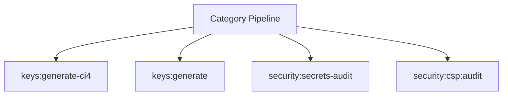

# Security Spark Operations Manual

## Overview

Deep operational documentation for Spark commands in this category.

## Operational Purpose

Define when and how operators should run commands safely in production and CI.

## Command Inventory

- `keys:generate-ci4` (Maintenance)
- `keys:generate` (Maintenance)
- `security:secrets-audit` (Diagnostic)
- `security:csp:audit` (Diagnostic)

## Command Reference

### keys:generate-ci4

**Purpose**  
Generate and rotate CodeIgniter 4 encryption.key

**Usage**  
`php spark keys:generate-ci4`

**Options**  
None documented.

**Services Used**  
None detected.

**Models Used**  
None detected.

**Tables Used**  
None detected.

**External APIs**  
None detected.

**Related Commands**  
`ops:commands:audit`, `repo:class-scan`

**Expected Output**  
Command status and diagnostics are printed to console and logs.

**Example Execution**  
`php spark keys:generate-ci4`

### keys:generate

**Purpose**  
Generate a cryptographically secure encryption key.

**Usage**  
`php spark keys:generate`

**Options**  
None documented.

**Services Used**  
None detected.

**Models Used**  
None detected.

**Tables Used**  
None detected.

**External APIs**  
None detected.

**Related Commands**  
`ops:commands:audit`, `repo:class-scan`

**Expected Output**  
Command status and diagnostics are printed to console and logs.

**Example Execution**  
`php spark keys:generate`

### security:secrets-audit

**Purpose**  
Detect sensitive secrets in configs, logs, or docs.

**Usage**  
`php spark security:secrets-audit`

**Options**  
`--emit`, `Output mode: docs (default: docs).`, `--out`, `Override artifact directory (must be inside docs/aiops/artifacts).`, `--dry-run`, `Generate a report without mutating state.`, `--approve`, `Acknowledge execution (required for mutating commands).`

**Services Used**  
None detected.

**Models Used**  
None detected.

**Tables Used**  
None detected.

**External APIs**  
None detected.

**Related Commands**  
`ops:commands:audit`, `repo:class-scan`

**Expected Output**  
Command status and diagnostics are printed to console and logs.

**Example Execution**  
`php spark security:secrets-audit`

### security:csp:audit

**Purpose**  
Scan view templates for CSP-unsafe inline scripts, styles, and handlers.

**Usage**  
`php spark security:csp:audit`

**Options**  
`--dry-run`, `Preview actions without writing data`

**Services Used**  
None detected.

**Models Used**  
None detected.

**Tables Used**  
None detected.

**External APIs**  
None detected.

**Related Commands**  
`ops:commands:audit`, `repo:class-scan`

**Expected Output**  
Command status and diagnostics are printed to console and logs.

**Example Execution**  
`php spark security:csp:audit`

## Dependencies

| Relationship | Target | Type |
|---|---|---|

## Command Dependency Graph

## Execution Workflows

- `php spark keys:generate-ci4`
- `php spark keys:generate`
- `php spark security:secrets-audit`
- `php spark security:csp:audit`
- `php spark ops:commands:audit`
- `php spark repo:class-scan`

## Operational Playbooks

**Investigate Application Failure**

- `php spark logs:doctor`
- `php spark ops:php:fpm:health`
- `php spark ops:server:nginx:status`
- `php spark spark:diagnose-503`

**Diagnose Database Issue**

- `php spark db:inventory`
- `php spark db:drift`
- `php spark aiops:sql:check`

## Troubleshooting

- Common failures: registry misses, dependency outages, schema drift, permission issues.
- Diagnostics commands: `php spark ops:commands:audit`, `php spark ops:commands:missing`, `php spark logs:doctor`.
- Recovery steps: repair namespaces, clear cache, rerun worker and health checks.

## Related Commands

- `ops:commands:audit`
- `repo:class-scan`

## Console Registry Verification

Review `app/Config/Console.php` and command auto-discovery output from `ops:commands:missing`; add explicit `$commands` entries for commands that must be hard-registered in your environment.
