## Overview

Supplemental operational documentation entry for this Spark scope.

## Operational Purpose

Provide standardized runbook sections for operators and developers.

## Command Inventory

- See local command tables and linked inventories.

## Command Reference

- Reference command blocks in this file or parent category docs.

## Dependencies

- Use `docs/spark/_spark_command_dependencies.json` for relationship data.

## Execution Workflows

- Run category bootstrap, diagnostics, and validation sequences as applicable.

## Operational Playbooks

- Incident triage: logs, services, routes, and database diagnostics.

## Troubleshooting

- Use `php spark ops:commands:audit`, `php spark ops:commands:missing`, and runtime diagnostics.

## Related Commands

- `ops:commands:audit`
- `ops:commands:missing`
- `spark:commands:graph`

---

# Spark Command Graph Documentation

## Overview

Unified relationship graph across Spark commands, services, models, tables, APIs, and nested command calls.

## Relationship Summary

- `command_to_api`: **87**
- `command_to_command`: **97**
- `command_to_model`: **20**
- `command_to_service`: **111**
- `command_to_table`: **111**

## Command Dependency Graph

```mermaid
graph TD
aiops_api_schema["aiops:api:schema"]
aiops_alerts_check["aiops:alerts-check"]
aiops_alerts_check --> EmailScraperService["EmailScraperService"]
aiops_alerts_check --> EmailQueueService["EmailQueueService"]
aiops_alerts_check --> aiops_alerts_worker["aiops:alerts-worker"]
aiops_alerts_clean["aiops:alerts-clean"]
aiops_alerts_clean --> tbl_aiops_email_queue["aiops_email_queue"]
aiops_alerts_health["aiops:alerts-health"]
aiops_alerts_health --> SlackWebhookService["SlackWebhookService"]
aiops_alerts_health --> tbl_aiops_email_queue["aiops_email_queue"]
aiops_alerts_worker["aiops:alerts-worker"]
aiops_alerts_worker --> SlackWebhookService["SlackWebhookService"]
aiops_alerts_worker --> tbl_aiops_email_queue["aiops_email_queue"]
aiops_audit["aiops:audit"]
aiops_auto_run["aiops:auto:run"]
aiops_auto_run --> AutoRunCoordinator["AutoRunCoordinator"]
aiops_auto_run --> ManualRunNotifier["ManualRunNotifier"]
aiops_backlog["aiops:backlog"]
aiops_backlog --> BacklogMetaService["BacklogMetaService"]
aiops_backlog --> OllamaPatchRunner["OllamaPatchRunner"]
aiops_build_command["aiops:build-command"]
aiops_build_command --> AIOpsService["AIOpsService"]
aiops_build_command --> CommandBuilderService["CommandBuilderService"]
aiops_build_command --> tbl_text["text"]
aiops_chat_gov_index["aiops:chat-gov-index"]
aiops_chat_gov_index --> ChatGovernanceIndexer["ChatGovernanceIndexer"]
aiops_chat_gov_index --> tbl_archived["archived"]
aiops_command_index["aiops:command-index"]
aiops_command_index --> CommandHookService["CommandHookService"]
aiops_command_index --> CommandInventoryService["CommandInventoryService"]
aiops_continue["aiops:continue"]
aiops_copilot_validate["aiops:copilot:validate"]
aiops_copilot_validate --> CommandHookService["CommandHookService"]
aiops_copilot_validate --> CommandInventoryService["CommandInventoryService"]
aiops_csp_audit["aiops:csp:audit"]
aiops_db_slow_scan["aiops:db:slow_scan"]
aiops_dedupe_report["aiops:dedupe:report"]
aiops_dedupe_report --> InstructionService["InstructionService"]
aiops_dedupe_report --> AIOpsInstructionModel["AIOpsInstructionModel"]
aiops_deps_add["aiops:deps:add"]
aiops_deps_add --> AIOpsDependencyModel["AIOpsDependencyModel"]
aiops_deps_add --> aiops_deps_add["aiops:deps:add"]
aiops_diff_format["aiops:diff:format"]
aiops_diff_format --> tbl_current["current"]
aiops_docs_sync["aiops:docs-sync"]
aiops_docs_sync --> aiops_docs_sync["aiops:docs-sync"]
aiops_doctor["aiops:doctor"]
```

## Command → Service → Model → Table

| Command | Services | Models | Tables |
|---|---|---|---|
| `aiops:api:schema` | — | — | — |
| `aiops:alerts-check` | `EmailScraperService`, `EmailQueueService` | — | — |
| `aiops:alerts-clean` | — | — | `aiops_email_queue` |
| `aiops:alerts-health` | `SlackWebhookService` | — | `aiops_email_queue` |
| `aiops:alerts-worker` | `SlackWebhookService` | — | `aiops_email_queue` |
| `aiops:audit` | — | — | — |
| `aiops:auto:run` | `AutoRunCoordinator`, `ManualRunNotifier`, `OllamaPatchRunner` | — | — |
| `aiops:backlog` | `BacklogMetaService`, `OllamaPatchRunner` | — | — |
| `aiops:build-command` | `AIOpsService`, `CommandBuilderService` | — | `text` |
| `aiops:chat-gov-index` | `ChatGovernanceIndexer` | — | `archived`, `MySQL` |
| `aiops:command-index` | `CommandHookService`, `CommandInventoryService` | — | — |
| `aiops:continue` | — | — | — |
| `aiops:copilot:validate` | `CommandHookService`, `CommandInventoryService` | — | — |
| `aiops:csp:audit` | — | — | — |
| `aiops:db:slow_scan` | — | — | — |
| `aiops:dedupe:report` | `InstructionService` | `AIOpsInstructionModel` | — |
| `aiops:deps:add` | — | `AIOpsDependencyModel` | — |
| `aiops:diff:format` | — | — | `current` |
| `aiops:docs-sync` | — | — | — |
| `aiops:doctor` | — | — | — |
| `aiops:email-scan` | `EmailScannerService` | `AiOpsRunModel` | — |
| `aiops:form:test` | `FormIntelligenceService`, `FormPatchPlanner`, `FormTestExecutor` | — | — |
| `aiops:gate:cost` | — | — | — |
| `aiops:governance:analyze` | — | — | — |
| `aiops:health:full` | — | — | — |
| `aiops:ingest` | `InstructionService` | — | `bf_frontend_incidents`, `parse` |
| `aiops:init` | — | — | — |
| `aiops:manual:index` | — | — | — |
| `aiops:manual:run` | `ManualPriorityRunner`, `ManualRunNotifier` | — | — |
| `aiops:n8n:logs` | — | — | — |
| `aiops:n8n:restart` | — | — | — |
| `aiops:n8n:start` | — | — | — |
| `aiops:n8n:stop` | — | — | — |
| `aiops:observe:cost` | — | — | — |
| `aiops:observe:hash` | — | — | `stable` |
| `aiops:observe:map` | — | — | — |
| `aiops:observe:patch` | — | — | `suggestions` |
| `aiops:observe:regression` | — | — | — |
| `aiops:observe:scan` | — | — | — |
| `aiops:observe:snapshot` | — | — | — |
| `aiops:observe:suggest` | — | — | — |
| `aiops:observe` | — | — | — |
| `aiops:pr:auto` | — | — | — |
| `aiops:pr:create` | — | — | — |
| `aiops:patch:apply` | — | — | — |
| `aiops:patch:dry_run` | — | — | — |
| `aiops:patch:hallucination` | — | — | — |
| `aiops:patch:risk_score` | — | — | — |
| `aiops:patch:validate` | — | — | — |
| `aiops:priority:build` | `DocsScannerService`, `RepoVerifierService`, `OllamaCodeGenService`, `PriorityWriterService` | — | `a`, `docs` |
| `aiops:public-pages:audit` | — | — | `bf_public_pages_published`, `bf_public_pages_catalog`, `bf_public_pages_drafts` |
| `aiops:public-pages:import` | — | — | `bf_public_pages_catalog` |
| `aiops:public-pages:report` | — | — | `bf_public_pages_runs`, `bf_public_pages_drafts`, `bf_public_pages_catalog`, `bf_public_pages_sources` |
| `aiops:public-pages:run` | `PublicPagesPipelineService` | — | `bf_public_pages_runs`, `bf_public_pages_catalog`, `bf_public_pages_sources`, `bf_public_pages_drafts`, `bf_public_pages_published` |
| `aiops:redis:stats` | — | — | — |
| `aiops:repair` | — | — | — |
| `aiops:repair:run` | — | — | — |
| `aiops:repair:run_safe` | — | — | `branch`, `the` |
| `aiops:rollback` | — | — | — |
| `aiops:routes:compare` | — | — | — |
| `aiops:routes:gate` | — | — | — |
| `aiops:routes:regress` | — | — | — |
| `aiops:routes:scan` | — | — | — |
| `aiops:routes:scan_auth` | — | — | — |
| `aiops:run` | `OllamaPatchRunner` | — | — |
| `aiops:graph:run` | `DependencyResolver` | — | — |
| `aiops:scan:cells` | `CellDiscoveryScanner` | `AiOpsScanStateModel` | — |
| `aiops:seed` | — | — | `bf_ai_ops_caps` |
| `aiops:self-heal` | — | — | — |
| `aiops:sql:check` | `SchemaInspectorService` | — | `bf_aiops_query_audit`, `bf_users` |
| `aiops:status` | `AiOpsServiceManager` | — | — |
| `aiops:sync-perf` | — | — | — |
| `aiops:unlock` | `BacklogMetaService` | — | — |
| `aiops:watch` | — | — | — |
| `aiops:worker` | `BranchLockService`, `DependencyResolver`, `DiffBuilder`, `GitHubPRService`, `GovernanceScorer`, `InstructionService`, `TargetingIntelligence` | — | — |
| `aiops:worker:logs` | `InstructionService`, `LogSummarizeService` | `AIOpsInstructionModel` | — |
| `api:audit` | `ApiGovernanceService` | — | `bf_api_audit_runs`, `bf_api_audit_findings`, `bf_api_endpoints`, `bf_api_endpoint_rules` |
| `api:filters-check` | `ApiGovernanceService` | — | — |
| `api:list` | `ApiGovernanceService` | — | — |
| `api:permissions` | `ApiGovernanceService` | — | — |
| `api:rate-limit-check` | `ApiGovernanceService` | — | — |
| `api:versioning-check` | `ApiGovernanceService` | — | — |
| `alerts:audit` | — | `AlertsModel` | `bf_investment_scraper`, `bf_investment_trade_alerts`, `bf_error_logs` |
| `alerts:forecast` | — | — | — |
| `alerts:ingest` | — | `AiOpsIngestRunModel`, `AlertsModel` | — |
| `alerts:parse-test` | — | — | — |
| `app:api:audit` | — | — | — |
| `app:api:list` | — | — | `latest` |
| `app:controller:audit` | — | — | `method` |
| `app:gate:coverage` | — | — | — |
| `app:healthcheck` | `LogHealthcheckService` | — | — |
| `app:test` | — | — | — |
| `app:update` | — | — | `instead`, `is` |
| `audit:all` | — | — | — |
| `audit:node` | — | — | — |
| `audit:psr4` | — | — | — |
| `auth:audit` | `AuthAuditRunner` | — | — |
| `auth:flow-smoke` | — | — | — |
| `auth:funnel-check` | `AuthFunnelCheckService` | — | — |
| `auth:smoke` | `AuthSmokeService` | — | — |
| `auth:smoke-test` | `AuthSmokeService` | — | — |
| `cache:audit` | — | — | — |
| `chat:audit` | — | — | — |
| `chat:logs` | — | — | `writable` |
| `chat:repair` | — | — | — |
| `chat:restart` | — | — | — |
| `chat:start` | — | — | — |
| `chat:status` | — | — | — |
| `chat:stop` | — | — | — |
| `chat:unlock` | — | — | — |
| `codex:audit` | — | — | — |
| `codex:continue` | — | — | `counters` |
| `codex:gate` | — | — | — |
| `codex:gate:severity` | — | — | — |
| `codex:index` | — | — | — |
| `codex:instruct:audit` | — | — | — |
| `codex:instruct:devops_review` | — | — | — |
| `codex:instruct:summarize` | — | — | — |
| `codex:review` | — | — | — |
| `codex:review:commit` | — | — | — |
| `codex:review:list` | — | — | — |
| `codex:review:pr-outbox` | — | — | — |
| `codex:review:publish` | — | — | — |
| `codex:status` | — | — | — |
| `app:compat-audit` | — | — | `table`, `CI3` |
| `config:drift` | — | — | — |
| `config:clear` | — | — | — |
| `config:lint` | `ConfigLintService` | — | — |
| `contentengine:smoke` | — | `ContentPostModel` | — |
| `content:ingest-sample` | — | — | — |
| `controller:profile` | — | — | — |
| `db:apply-docs` | `DbApplyDocsService` | — | `docs` |
| `db:drift` | — | — | — |
| `db:inventory` | `DbInventoryService` | — | — |
| `migrate:dry-run` | — | — | — |
| `discord:list` | — | — | `bf_discord_channels`, `config`, `DB` |
| `discord:process-queue` | — | — | — |
| `discord:test` | — | — | — |
| `discord:test-liquidity` | — | — | `CLI` |
| `discord:wire-check` | — | — | `bf_discord_queue` |
| `docs:architecture:graph` | — | — | — |
| `docs:architecture-map` | — | — | — |
| `docs:audit` | — | — | — |
| `docs:database:map` | — | — | — |
| `docs:dependencies:map` | — | — | — |
| `docs:views:export` | — | — | — |
| `docs:full-audit` | — | — | — |
| `docs:readme:build` | — | — | — |
| `docs:generate-missing` | — | — | — |
| `docs:inventory` | — | — | — |
| `docs:modules:map` | — | — | — |
| `docs:routes:inventory` | — | — | — |
| `docs:controllers:list` | — | — | — |
| `docs:services:list` | — | — | — |
| `docs:views:dirs` | — | — | — |
| `docs:views:list` | — | — | — |
| `docs:spark:inventory` | — | — | — |
| `docs:sync-all` | — | — | — |
| `docs:sync-code` | `DocsSyncEngine` | — | — |
| `docs:sync-system` | `DocsSyncEngine` | — | — |
| `dreamhost:dns-test` | — | — | — |
| `dreamhost:env` | — | — | — |
| `dreamhost:imap-capabilities` | — | — | — |
| `dreamhost:imap-flag-sweep` | — | — | — |
| `dreamhost:imap-test` | — | — | — |
| `dreamhost:port-test` | — | — | — |
| `dreamhost:ssl-test` | — | — | — |
| `dreamhost:smtp-probe` | — | — | — |
| `env:doctor` | `EnvDoctorService` | — | `a` |
| `app:logs:consolidate` | — | — | `bf_error_processing_checkpoint`, `bf_error_logs`, `bf_error_consolidated_logs`, `categorized`, `ID`, `checkpoint` |
| `spark:diagnose-502` | — | — | — |
| `spark:diagnose-503` | — | — | — |
| `app:errors:dispatch` | `ErrorAlertService` | — | — |
| `app:errors:learn` | `ErrorPatternLearnerService` | — | `bf_error_patterns` |
| `fix:503` | `CommandRunner`, `HostingModeDetector`, `EnvDoctorService` | — | — |
| `forecasts:evaluate` | — | — | — |
| `gap:sync` | — | — | — |
| `git:pull:safe` | — | — | — |
| `github:search` | — | — | — |
| `git:workspace:guard` | — | — | — |
| `git:workspace:repair` | — | — | — |
| `growth:retention-watch` | — | — | `engagement` |
| `gtm:cron:validate-security` | — | — | — |
| `gtm:health:snapshot` | — | — | — |
| `gtm:launch:audit` | — | — | — |
| `gtm:launch:smoke` | — | — | — |
| `health:cache` | — | — | — |
| `health:disk` | `CommandRunner` | — | — |
| `health:git-safety` | `CommandRunner` | — | — |
| `health:services` | `CommandRunner`, `HostingModeDetector` | — | — |
| `investments:economy:updateall` | — | — | `FRED`, `local`, `complete` |
| `logger:audit` | — | — | — |
| `app:logs:check-server` | — | — | — |
| `logs:doctor` | — | — | `bf_error_logs` |
| `app:logs:enable-full` | — | — | — |
| `logs:healthcheck` | `LogHealthcheckService` | — | — |
| `logs:summarize` | `LogSummarizeService` | — | `state` |
| `logs:summarize-all` | — | — | `writable` |
| `logs:full-report` | — | — | `memory` |
| `logs:test` | `LogHealthcheckService` | — | — |
| `mail:send` | `MailService` | — | — |
| `mail:send-test` | — | — | — |
| `mail:test` | — | — | — |
| `mail:verify` | — | — | — |
| `marketing:automation-audit` | — | — | — |
| `master:health:commands` | — | — | — |
| `master:health:controllers` | — | — | — |
| `master:health:dependencies` | — | — | — |
| `master:health:docs` | — | — | — |
| `master:health:logs` | — | — | — |
| `master:health:models` | — | — | — |
| `master:health:routes` | — | — | — |
| `master:health:services` | — | — | — |
| `master:health:views` | — | — | — |
| `master:knowledge-graph:build` | — | — | `controllers` |
| `master:run-all` | — | — | — |
| `mdit:nav:compute_daily` | `MditNavService` | — | — |
| `news:audit` | — | — | `bf_marketing_temp_scraper`, `bf_marketing_scraper`, `bf_error_logs` |
| `ollama:bench` | — | — | — |
| `ollama:chat` | — | `OllamaSessionModel` | — |
| `ollama:circuit:reset` | — | — | — |
| `ollama:circuit:status` | — | — | — |
| `ollama:circuit:reset` | `OllamaCircuitBreaker` | — | — |
| `ollama:circuit:status` | `OllamaCircuitBreaker` | — | — |
| `ollama:diagnose` | — | — | — |
| `ollama:docs:inventory` | — | — | — |
| `ollama:docs:sync` | — | — | — |
| `ollama:doctor` | — | — | — |
| `ollama:embed` | — | — | — |
| `ollama:embed:file` | — | — | `vector` |
| `ollama:generate` | `OllamaCircuitBreaker` | — | — |
| `ollama:health` | — | — | — |
| `ollama:logs:export` | — | `OllamaRunModel` | — |
| `ollama:logs:tail` | — | — | `file` |
| `ollama:logs` | — | — | — |
| `ollama:modelfile:validate` | — | — | — |
| `ollama:models:create` | — | — | `Modelfile` |
| `ollama:models:diff` | — | — | — |
| `ollama:models:ensure` | — | — | — |
| `ollama:models:export` | — | — | — |
| `ollama:models:list` | — | — | — |
| `ollama:models:prune` | — | — | — |
| `ollama:models:pull` | — | — | — |
| `ollama:models:push` | — | — | — |
| `ollama:models:rm` | — | — | — |
| `ollama:models:show` | — | — | — |
| `ollama:ping` | — | — | — |
| `ollama:policy:check` | — | — | — |
| `ollama:policy:export` | — | — | — |
| `ollama:queue:push` | — | `OllamaQueueModel` | — |
| `ollama:queue:retry` | — | — | `queue` |
| `ollama:queue:stats` | — | `OllamaQueueModel` | — |
| `ollama:queue:work` | — | `OllamaQueueModel` | — |
| `ollama:rag:query` | — | — | — |
| `ollama:sessions:list` | — | — | — |
| `ollama:sessions:rm` | — | — | — |
| `ollama:sessions:show` | — | — | — |
| `ollama:stream` | — | — | — |
| `ollama:version` | — | — | `health` |
| `ops:analyze-commands` | `OpsCommandService` | — | `inbox` |
| `ops:app:update` | `ApiHealthService`, `AppSelfTestService`, `ConfigAuditService`, `DatabaseHealthService`, `FilesystemHealthService`, `SnapshotWriter`, `SparkGovernanceService` | — | `and`, `environment`, `summary` |
| `ops:console:build` | — | — | — |
| `ops:ci:prepare` | — | — | — |
| `ops:commands:audit` | — | — | — |
| `ops:commands:autofix` | — | — | — |
| `ops:commands:inventory` | — | — | `Console` |
| `ops:commands:lint` | — | — | — |
| `ops:commands:missing` | — | — | `Console` |
| `ops:config:lint` | — | — | — |
| `ops:filesystem-scan` | `VpsHealthService` | — | — |
| `ops:diff` | — | — | — |
| `ops:diff:wallet` | — | — | — |
| `ops:doctor:full` | — | — | — |
| `dreamhost:dns-verify` | `DreamHostService` | — | — |
| `dreamhost:email-audit` | `DreamHostService` | — | — |
| `dreamhost:email-list` | `DreamHostService` | — | — |
| `dreamhost:limits` | `DreamHostService` | — | — |
| `ops:drift:scan` | — | — | — |
| `email:healthcheck` | `EmailOpsService` | — | — |
| `email:queue-scan` | `EmailOpsService` | — | — |
| `email:test` | `EmailOpsService` | — | — |
| `ops:env:snapshot` | — | — | — |
| `ops:fetch-commands` | — | `OpsCommandInboxModel` | `IMAP` |
| `ops:filesystem:fix` | — | — | — |
| `ops:filesystem:lint` | — | — | — |
| `ops:healthcheck` | `VpsHealthService` | — | — |
| `ops:logger:test` | — | — | — |
| `logs:scan` | `LogOpsService` | — | — |
| `logs:watch` | `LogOpsService` | — | — |
| `ops:model-limit:audit` | — | — | — |
| `ops:network:matrix` | — | — | — |
| `ops:next-steps` | — | `AiOpsTaskModel` | `audit` |
| `ops:next-steps:sync` | — | — | — |
| `ops:next-steps:sync-manual` | — | `AiOpsManualTodoModel` | `docs`, `the` |
| `ops:php-fpm-health` | `VpsHealthService` | — | — |
| `ops:php:extensions` | — | — | — |
| `ops:propose-pr` | — | — | — |
| `ops:report` | `VpsHealthService` | — | — |
| `ops:self-heal` | `VpsHealthService` | — | — |
| `ops:nginx-status` | `VpsHealthService` | — | — |
| `ops:subs:audit` | — | — | — |
| `ops:subs:doctor` | — | — | — |
| `ops:subs:repair` | — | — | — |
| `ops:subs:status` | — | — | — |
| `ops:sync` | — | — | — |
| `ops:vps:snapshot` | — | — | — |
| `ops:integrity:wallet` | — | — | `bf_users_wallet`, `bf_users_wallet_transactions` |
| `ops:work` | — | `AiOpsSettingsModel`, `AiOpsTaskModel` | — |
| `perf:k6` | — | — | — |
| `spark:purge-fastcgi` | — | — | — |
| `repo:class-scan` | — | — | — |
| `repo:class-trace` | — | — | — |
| `repo:diff-split` | — | — | `smaller` |
| `repo:health` | — | — | — |
| `research:reports:daily` | — | — | `bf_financial_news`, `bf_investment_trade_alerts`, `bf_market_snapshots` |
| `research:earnings:calendar` | — | — | — |
| `research:intelligence:signals` | — | — | `bf_research_items`, `research` |
| `research:knowledge:build` | — | — | `bf_investment_trade_alerts`, `bf_financial_news`, `bf_market_snapshots` |
| `research:news:collect` | `FinancialResearchService` | — | — |
| `research:google:scan` | — | — | — |
| `research:google:scan` | — | — | — |
| `research:data:compile` | — | — | `bf_market_snapshots` |
| `research:pipeline:run` | — | — | — |
| `research:short-interest:scan` | — | — | — |
| `research:alerts:watchlist-import` | — | — | `bf_watchlist_imports`, `bf_investment_trade_alerts` |
| `research:alerts:cleanup` | — | — | — |
| `research:reports:weekly` | — | — | `bf_financial_news`, `bf_investment_trade_alerts` |
| `spark:restart-safe` | — | — | — |
| `revenue:cost-forecast` | — | — | — |
| `revenue:scan` | — | — | `Discord` |
| `route:benchmark` | — | — | — |
| `routes:debug` | — | — | — |
| `routes:docs` | — | — | — |
| `routes:reconcile` | `RouteReconcileService` | — | — |
| `routes:repair` | `RouteRepairService` | — | — |
| `routes:auth-audit` | — | — | — |
| `runtime:cache-boot` | — | — | — |
| `runtime:diagnose-502` | — | — | — |
| `runtime:spark-doctor` | — | — | — |
| `runtime:spark-doctor` | — | — | — |
| `spark:fix` | — | — | — |
| `optimize:safe` | — | — | — |
| `runtime:triage` | — | — | `a` |
| `runtime:check` | — | — | — |
| `scanning:run` | — | — | — |
| `scraper:audit-emails` | `ScraperOpsService` | — | `current`, `final` |
| `keys:generate-ci4` | — | — | — |
| `keys:generate` | — | — | — |
| `security:secrets-audit` | — | — | — |
| `security:csp:audit` | — | — | — |
| `spark:commands:graph` | — | — | — |
| `spark:doctor` | `CommandHookService`, `CommandInventoryService` | — | — |
| `spark:fix` | `CommandHookService`, `CommandInventoryService` | — | — |
| `infra:server-audit` | — | — | — |
| `spark:registry-audit` | — | — | `Console`, `filesystem`, `runtime` |
| `spark-reset` | — | — | — |
| `test:redis` | `RedisService` | — | — |
| `email:test` | — | — | `MyMI` |
| `spark:traffic-spike-guard` | — | — | — |
| `ux:journey-audit` | — | — | — |
| `wallets:warm-summary-cache` | `WalletSummaryService` | `UserModel` | — |
