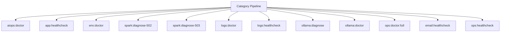

# Troubleshooting Spark Operations Manual

## Overview

Deep operational documentation for Spark commands in this category.

## Operational Purpose

Define when and how operators should run commands safely in production and CI.

## Command Inventory

- `aiops:doctor` (Diagnostic)
- `app:healthcheck` (Diagnostic)
- `env:doctor` (Diagnostic)
- `spark:diagnose-502` (Diagnostic)
- `spark:diagnose-503` (Diagnostic)
- `logs:doctor` (Diagnostic)
- `logs:healthcheck` (Diagnostic)
- `ollama:diagnose` (Diagnostic)
- `ollama:doctor` (Diagnostic)
- `ops:doctor:full` (Diagnostic)
- `email:healthcheck` (Diagnostic)
- `ops:healthcheck` (Diagnostic)
- `ops:subs:doctor` (Diagnostic)
- `runtime:diagnose-502` (Diagnostic)
- `runtime:spark-doctor` (Diagnostic)
- `runtime:spark-doctor` (Diagnostic)
- `spark:doctor` (Diagnostic)

## Command Reference

### aiops:doctor

**Purpose**  
Validate AIOps service wiring, namespace casing, and Spark helper migration state.

**Usage**  
`php spark aiops:doctor`

**Options**  
None documented.

**Services Used**  
None detected.

**Models Used**  
None detected.

**Tables Used**  
None detected.

**External APIs**  
None detected.

**Related Commands**  
`spark:diagnose-503`, `spark:diagnose-502`

**Expected Output**  
Command status and diagnostics are printed to console and logs.

**Example Execution**  
`php spark aiops:doctor`

### app:healthcheck

**Purpose**  
Compatibility healthcheck command aligned to AI-Ops spark checks.

**Usage**  
`php spark app:healthcheck`

**Options**  
`--dry-run`, `Preview actions without writing data`

**Services Used**  
`App\Services\Spark\LogHealthcheckService`

**Models Used**  
None detected.

**Tables Used**  
None detected.

**External APIs**  
None detected.

**Related Commands**  
`app:healthcheck`

**Expected Output**  
Command status and diagnostics are printed to console and logs.

**Example Execution**  
`php spark app:healthcheck`

### env:doctor

**Purpose**  
Environment diagnostics and snapshot.

**Usage**  
`php spark env:doctor`

**Options**  
`--notify=discord`, `Send summary to Discord.`, `--pack`, `Bundle JSON/Markdown into a tar.gz for sharing.`

**Services Used**  
`App\Services\Ops\EnvDoctorService`

**Models Used**  
None detected.

**Tables Used**  
`a`

**External APIs**  
`Discord`

**Related Commands**  
`spark:diagnose-503`, `spark:diagnose-502`

**Expected Output**  
Command status and diagnostics are printed to console and logs.

**Example Execution**  
`php spark env:doctor`

### spark:diagnose-502

**Purpose**  
Diagnose common 502 causes (php-fpm, nginx, socket).

**Usage**  
`php spark spark:diagnose-502`

**Options**  
None documented.

**Services Used**  
None detected.

**Models Used**  
None detected.

**Tables Used**  
None detected.

**External APIs**  
None detected.

**Related Commands**  
`spark:diagnose-503`, `spark:diagnose-502`

**Expected Output**  
Command status and diagnostics are printed to console and logs.

**Example Execution**  
`php spark spark:diagnose-502`

### spark:diagnose-503

**Purpose**  
Diagnose common 503 causes (cache, maintenance, upstream).

**Usage**  
`php spark spark:diagnose-503`

**Options**  
None documented.

**Services Used**  
None detected.

**Models Used**  
None detected.

**Tables Used**  
None detected.

**External APIs**  
None detected.

**Related Commands**  
`spark:diagnose-503`, `spark:diagnose-502`

**Expected Output**  
Command status and diagnostics are printed to console and logs.

**Example Execution**  
`php spark spark:diagnose-503`

### logs:doctor

**Purpose**  
Validate CI4 logging and debug visibility plumbing.

**Usage**  
`php spark logs:doctor`

**Options**  
None documented.

**Services Used**  
None detected.

**Models Used**  
None detected.

**Tables Used**  
`bf_error_logs`

**External APIs**  
None detected.

**Related Commands**  
`spark:diagnose-503`, `spark:diagnose-502`

**Expected Output**  
Command status and diagnostics are printed to console and logs.

**Example Execution**  
`php spark logs:doctor`

### logs:healthcheck

**Purpose**  
Emit test logs and verify file + DB log sinks are functioning.

**Usage**  
`php spark logs:healthcheck`

**Options**  
`--dry-run`, `Preview actions without writing data`

**Services Used**  
`App\Services\Spark\LogHealthcheckService`

**Models Used**  
None detected.

**Tables Used**  
None detected.

**External APIs**  
None detected.

**Related Commands**  
`spark:diagnose-503`, `spark:diagnose-502`

**Expected Output**  
Command status and diagnostics are printed to console and logs.

**Example Execution**  
`php spark logs:healthcheck`

### ollama:diagnose

**Purpose**  
Operator diagnostic report for Ollama connectivity and env.

**Usage**  
`php spark ollama:diagnose`

**Options**  
`--base-url`, `Override URL`, `--timeout`, `Timeout`, `--include-env`, `Include env snapshot`, `--json`, `JSON output`

**Services Used**  
None detected.

**Models Used**  
None detected.

**Tables Used**  
None detected.

**External APIs**  
`Ollama`

**Related Commands**  
`spark:diagnose-503`, `spark:diagnose-502`

**Expected Output**  
Command status and diagnostics are printed to console and logs.

**Example Execution**  
`php spark ollama:diagnose`

### ollama:doctor

**Purpose**  
Deep diagnostics for Ollama connectivity and runtime hints.

**Usage**  
`php spark ollama:doctor`

**Options**  
`--base-url`, `Override URL`, `--timeout`, `Timeout seconds`, `--json`, `JSON output`, `--include-env`, `Include relevant env values`

**Services Used**  
None detected.

**Models Used**  
None detected.

**Tables Used**  
None detected.

**External APIs**  
`Ollama`

**Related Commands**  
`spark:diagnose-503`, `spark:diagnose-502`

**Expected Output**  
Command status and diagnostics are printed to console and logs.

**Example Execution**  
`php spark ollama:doctor`

### ops:doctor:full

**Purpose**  
Run high-signal diagnostics: env, php extensions, network matrix, IMAP capabilities (best-effort).

**Usage**  
`php spark ops:doctor:full`

**Options**  
None documented.

**Services Used**  
None detected.

**Models Used**  
None detected.

**Tables Used**  
None detected.

**External APIs**  
None detected.

**Related Commands**  
`ops:php:extensions`, `ops:network:matrix`, `runtime:spark-doctor`, `dreamhost:imap-capabilities`

**Expected Output**  
Command status and diagnostics are printed to console and logs.

**Example Execution**  
`php spark ops:doctor:full`

### email:healthcheck

**Purpose**  
Ops helper command: email:healthcheck

**Usage**  
`php spark email:healthcheck`

**Options**  
None documented.

**Services Used**  
`App\Services\Ops\EmailOpsService`

**Models Used**  
None detected.

**Tables Used**  
None detected.

**External APIs**  
None detected.

**Related Commands**  
`spark:diagnose-503`, `spark:diagnose-502`

**Expected Output**  
Command status and diagnostics are printed to console and logs.

**Example Execution**  
`php spark email:healthcheck`

### ops:healthcheck

**Purpose**  
Ops helper command: ops:healthcheck

**Usage**  
`php spark ops:healthcheck`

**Options**  
None documented.

**Services Used**  
`App\Services\Ops\VpsHealthService`

**Models Used**  
None detected.

**Tables Used**  
None detected.

**External APIs**  
None detected.

**Related Commands**  
`spark:diagnose-503`, `spark:diagnose-502`

**Expected Output**  
Command status and diagnostics are printed to console and logs.

**Example Execution**  
`php spark ops:healthcheck`

### ops:subs:doctor

**Purpose**  
Friendly subsystem triage

**Usage**  
`php spark ops:subs:doctor`

**Options**  
`--json`, `JSON`

**Services Used**  
None detected.

**Models Used**  
None detected.

**Tables Used**  
None detected.

**External APIs**  
None detected.

**Related Commands**  
`ops:subs:audit`, `aiops:self-heal`, `ops:subs:status`

**Expected Output**  
Command status and diagnostics are printed to console and logs.

**Example Execution**  
`php spark ops:subs:doctor`

### runtime:diagnose-502

**Purpose**  
Diagnose and optionally remediate 502/503 gateway errors

**Usage**  
`php spark runtime:diagnose-502`

**Options**  
`--approve`, `Apply safe fixes (clear cache, remove stale sockets) after diagnostics`

**Services Used**  
None detected.

**Models Used**  
None detected.

**Tables Used**  
None detected.

**External APIs**  
None detected.

**Related Commands**  
`spark:diagnose-503`, `spark:diagnose-502`

**Expected Output**  
Command status and diagnostics are printed to console and logs.

**Example Execution**  
`php spark runtime:diagnose-502`

### runtime:spark-doctor

**Purpose**  
Validate Spark command discovery and CI4 compatibility

**Usage**  
`php spark runtime:spark-doctor`

**Options**  
None documented.

**Services Used**  
None detected.

**Models Used**  
None detected.

**Tables Used**  
None detected.

**External APIs**  
None detected.

**Related Commands**  
`spark:diagnose-503`, `spark:diagnose-502`

**Expected Output**  
Command status and diagnostics are printed to console and logs.

**Example Execution**  
`php spark runtime:spark-doctor`

### runtime:spark-doctor

**Purpose**  
Validate Spark command discovery and CI4 compatibility (runtime scope).

**Usage**  
`php spark runtime:spark-doctor`

**Options**  
`--emit`, `Output mode: docs (default: docs).`, `--out`, `Override artifact directory (must be inside docs/aiops/artifacts).`, `--dry-run`, `Generate a report without mutating state.`, `--approve`, `Acknowledge execution (required for mutating commands).`

**Services Used**  
None detected.

**Models Used**  
None detected.

**Tables Used**  
None detected.

**External APIs**  
None detected.

**Related Commands**  
`spark:diagnose-503`, `spark:diagnose-502`

**Expected Output**  
Command status and diagnostics are printed to console and logs.

**Example Execution**  
`php spark runtime:spark-doctor`

### spark:doctor

**Purpose**  
System health inspector for Spark commands.

**Usage**  
`php spark spark:doctor`

**Options**  
`--json`, `Emit JSON output to stdout`, `--notify`, `Send summary notification via Discord or email`, `--db`, `Store JSON snapshot in aiops_command_snapshots table`

**Services Used**  
`App\Services\AIOps\CommandHookService`, `App\Services\Spark\CommandInventoryService`

**Models Used**  
None detected.

**Tables Used**  
None detected.

**External APIs**  
`Discord`

**Related Commands**  
`spark:diagnose-503`, `spark:diagnose-502`

**Expected Output**  
Command status and diagnostics are printed to console and logs.

**Example Execution**  
`php spark spark:doctor`

## Dependencies

| Relationship | Target | Type |
|---|---|---|
| `app:healthcheck` | `App\Services\Spark\LogHealthcheckService` | Command → Service |
| `app:healthcheck` | `app:healthcheck` | Command → Command |
| `env:doctor` | `App\Services\Ops\EnvDoctorService` | Command → Service |
| `env:doctor` | `a` | Command → Table |
| `logs:doctor` | `bf_error_logs` | Command → Table |
| `logs:healthcheck` | `App\Services\Spark\LogHealthcheckService` | Command → Service |
| `ops:doctor:full` | `ops:php:extensions` | Command → Command |
| `ops:doctor:full` | `ops:network:matrix` | Command → Command |
| `email:healthcheck` | `App\Services\Ops\EmailOpsService` | Command → Service |
| `ops:healthcheck` | `App\Services\Ops\VpsHealthService` | Command → Service |
| `ops:subs:doctor` | `ops:subs:audit` | Command → Command |
| `ops:subs:doctor` | `aiops:self-heal` | Command → Command |
| `spark:doctor` | `App\Services\AIOps\CommandHookService` | Command → Service |
| `spark:doctor` | `App\Services\Spark\CommandInventoryService` | Command → Service |

## Command Dependency Graph

## Execution Workflows

- `php spark aiops:doctor`
- `php spark app:healthcheck`
- `php spark env:doctor`
- `php spark spark:diagnose-502`
- `php spark spark:diagnose-503`
- `php spark logs:doctor`
- `php spark logs:healthcheck`
- `php spark ollama:diagnose`
- `php spark spark:diagnose-503`
- `php spark spark:diagnose-502`

## Operational Playbooks

**Investigate Application Failure**

- `php spark logs:doctor`
- `php spark ops:php:fpm:health`
- `php spark ops:server:nginx:status`
- `php spark spark:diagnose-503`

**Diagnose Database Issue**

- `php spark db:inventory`
- `php spark db:drift`
- `php spark aiops:sql:check`

## Troubleshooting

- Common failures: registry misses, dependency outages, schema drift, permission issues.
- Diagnostics commands: `php spark ops:commands:audit`, `php spark ops:commands:missing`, `php spark logs:doctor`.
- Recovery steps: repair namespaces, clear cache, rerun worker and health checks.

## Related Commands

- `spark:diagnose-503`
- `spark:diagnose-502`

## Console Registry Verification

Review `app/Config/Console.php` and command auto-discovery output from `ops:commands:missing`; add explicit `$commands` entries for commands that must be hard-registered in your environment.
